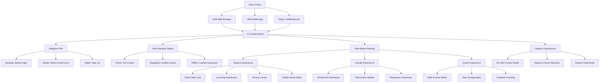
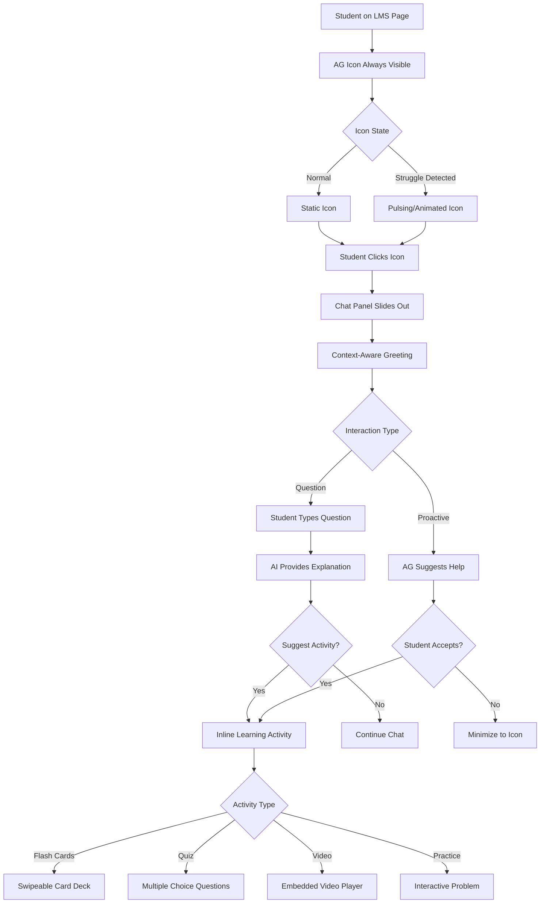
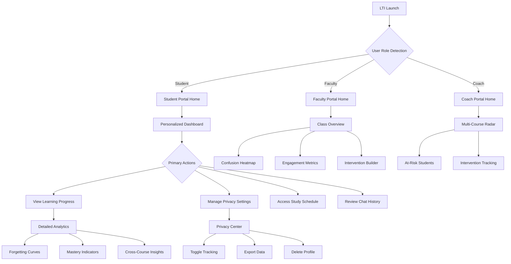
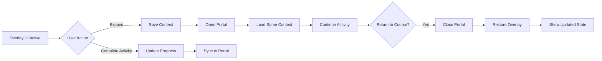
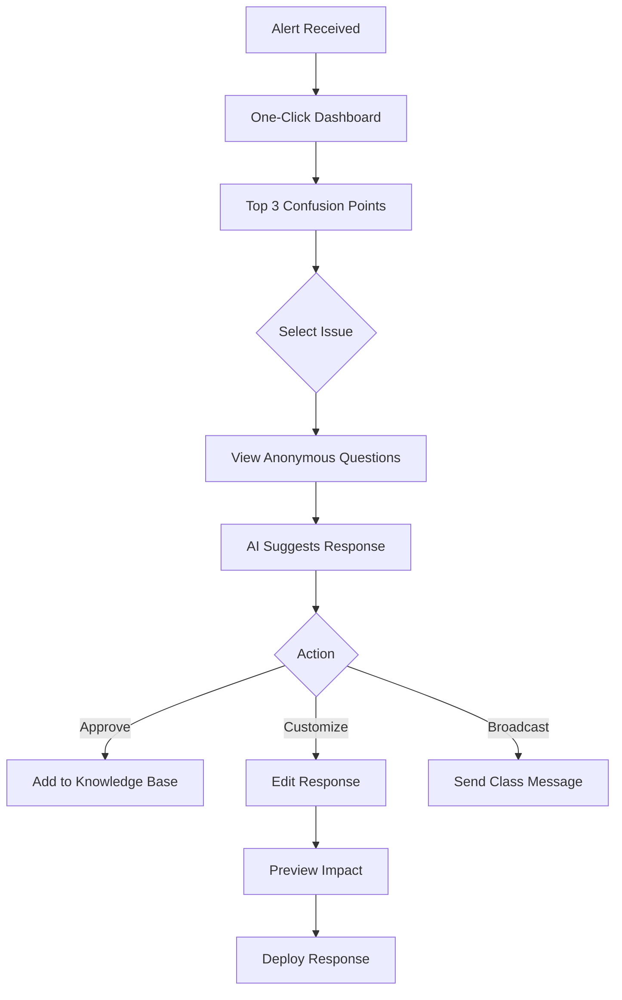

# Atomic Guide/Focus UI/UX Specification

## Introduction

This document defines the user experience goals, information architecture, user flows, and visual design specifications for Atomic Guide/Focus's user interface. It serves as the foundation for visual design and frontend development, ensuring a cohesive and user-centered experience.

### Overall UX Goals & Principles

#### Target User Personas

1. **Struggling STEM Student (Alex)**
   - **Demographics:** 18-22 years old, first-generation college student, 60% work part-time
   - **Tech Proficiency:** High comfort with mobile/social apps, moderate with academic tools
   - **Pain Points:** Fear of appearing "dumb," overwhelmed by course pace, unclear where to get help
   - **Success Metrics:** Time to first successful interaction <10 seconds, 80% return rate after first use
   - **Interface Needs:** Mobile-optimized, non-judgmental tone, progress celebration

2. **Time-Pressed Faculty Member (Dr. Chen)**
   - **Demographics:** Teaching 3-4 courses, 100-150 total students, limited office hours
   - **Tech Proficiency:** Varies widely, prefers minimal new tools
   - **Pain Points:** Can't identify struggling students until too late, repetitive questions consume time
   - **Success Metrics:** <30 seconds to actionable insights, 50% reduction in repetitive questions
   - **Interface Needs:** Dashboard that loads within LMS, one-click exports, no additional logins

3. **Academic Success Coach (Maria)**
   - **Demographics:** Monitors 200-300 at-risk students across departments
   - **Tech Proficiency:** Comfortable with data tools and dashboards
   - **Pain Points:** Reactive vs. proactive interventions, siloed data across systems
   - **Success Metrics:** 2-week early warning before failure points, 25% improvement in intervention success
   - **Interface Needs:** Unified view across courses, automated alerts, intervention tracking

#### Usability Goals

- **Instant Value:** Students can get contextual help within 10 seconds of clicking the AI Guide button
- **Zero Training Required:** Interface is intuitive enough that 95% of users succeed without documentation
- **Non-Disruptive Flow:** All interventions respect cognitive state and can be dismissed/minimized instantly
- **Trust Through Transparency:** Every data collection point has clear privacy indicators and user controls
- **Accessibility First:** WCAG AA compliance with cognitive accessibility features for diverse learners

#### Design Principles

1. **Invisible Until Needed**
   - FAB opacity at 60% when inactive, 100% during detected struggle
   - Z-index management to never obstruct LMS critical functions
   - Appear/disappear animations under 200ms for perceived responsiveness

2. **Conversation Over Configuration**
   - Maximum 2 taps/clicks to any core function
   - Natural language processing for settings ("make the help less frequent")
   - Context-aware suggestions reduce typing by 70%

3. **Privacy as a Feature**
   - Privacy indicator badge always visible when tracking active
   - Celebratory animations when students adjust privacy settings
   - Monthly privacy report emails with positive framing

4. **Adaptive, Not Prescriptive**
   - System suggestions adapt to individual patterns rather than forcing one-size-fits-all approaches
   - Learning style detection adjusts explanation format (visual, textual, example-based)

5. **Celebrate Growth**
   - Focus on progress and improvement rather than highlighting deficits
   - Milestone achievements and streak counters for positive reinforcement

### Change Log

| Date       | Version | Description                          | Author            |
| ---------- | ------- | ------------------------------------ | ----------------- |
| 2025-08-21 | 1.0     | Initial UI/UX specification creation | Sally (UX Expert) |

## Information Architecture (IA)

### Site Map / Screen Inventory



### Navigation Structure

**Primary Navigation:**

- **Adaptive FAB positioning** based on device and LMS UI (bottom-right desktop, above thumb zone mobile, side rail tablet)
- **Progressive enhancement** from basic chat to full contextual assistance based on available LMS integration
- **Platform-agnostic** fallbacks when LMS integration limited (manual course selection, generic help mode)
- Embedded within LMS via floating action button and LTI deep links - no separate navigation required

**Secondary Navigation:**

- **Persistent mini-chat** window option for continuous assistance while navigating LMS
- **Cross-device handoff** indicators showing active sessions on other devices
- **Smart routing** based on user role and current task context
- Within chat interface: conversation history, saved explanations, quick actions menu
- Within dashboards: tab-based navigation for different insight views

**Breadcrumb Strategy:**

- **Dual breadcrumbs**: LMS context (Course > Module > Page) + Atomic Guide location
- **Smart truncation** on mobile with expandable full path
- **Context preservation** across navigation actions
- Maintain LMS breadcrumbs as primary wayfinding with supplemental Atomic Guide context

### Mobile-First IA Considerations

1. **Touch Targets:** Minimum 44x44px for all interactive elements
2. **Gesture Support:** Swipe to minimize chat, pull-to-refresh dashboards, long-press for options
3. **Progressive Disclosure:** Core functions first, advanced features via "More" menus
4. **Offline Capability:** Local storage of recent conversations and key insights for subway study sessions

## User Flows

### Two-UI Architecture Overview

Atomic Guide operates through two distinct but connected user interfaces:

1. **Persistent Overlay UI** - Always-visible indicator icon on LMS pages that expands to reveal:
   - Contextual chat interface
   - Inline learning activities (flash cards, quizzes, videos)
   - Quick actions and help
   - Minimal footprint with maximum accessibility

2. **LTI Portal UI** - Full-featured application accessed via LTI launch providing:
   - Comprehensive dashboards and analytics
   - Privacy controls and data management
   - Study scheduling and progress tracking
   - Role-specific interfaces (Student/Faculty/Coach)

### Flow 1: Student Getting Help via Persistent Overlay

**User Goal:** Get immediate help and engage with learning activities without leaving LMS page

**Entry Points:**

- Clicking persistent Atomic Guide indicator icon
- Automatic prompt when struggle detected (30+ seconds on problem)
- Keyboard shortcut (Ctrl+Shift+H)

**Success Criteria:** Student completes learning activity and returns to coursework with improved understanding within 3 minutes

#### Flow Diagram



**Edge Cases & Error Handling:**

- LMS context unavailable: Fallback to manual topic selection
- Activity won't load: Provide text-based alternative
- Rate limit reached: Show cached responses and activities
- Screen too small: Responsive layout with collapsible sections

**Notes:** Overlay UI maintains state across page navigations within same session

### Flow 2: Accessing Full Features via LTI Portal

**User Goal:** Access comprehensive Atomic Guide features including analytics, privacy settings, and study planning

**Entry Points:**

- LTI launch from course navigation menu
- "View Full Dashboard" link from overlay UI
- Direct link from email notifications or mobile app

**Success Criteria:** User completes desired task (view progress, adjust settings, schedule study) within 2 minutes

#### Flow Diagram



**Edge Cases & Error Handling:**

- LTI launch fails: Provide direct login option
- Role ambiguity: Default to most restrictive view
- Data loading delays: Progressive loading with skeleton screens
- Session timeout: Auto-save and recovery

**Notes:** Portal maintains deep linking to specific sections for email/notification navigation

### Flow 3: Seamless Transition Between UIs

**User Goal:** Move between overlay and portal UIs without losing context

**Entry Points:**

- "Expand to Full View" from overlay chat
- "Return to Course" from portal
- Deep links that open specific portal sections

**Success Criteria:** Context preserved across UI transitions

#### Flow Diagram



### Flow 4: Faculty Quick Intervention

**User Goal:** Quickly identify and address class-wide confusion points

**Entry Points:**

- Daily email alert about confusion spikes
- LTI quick launch to intervention builder
- Real-time notification during class

**Success Criteria:** Faculty creates targeted intervention within 60 seconds

#### Flow Diagram



**Edge Cases & Error Handling:**

- Insufficient data: Require minimum 5 students for anonymity
- Conflicting responses: Show version history
- Real-time sync issues: Queue updates with retry logic

**Notes:** All interventions tracked for efficacy analysis

## Wireframes & Mockups

### Design Files

**Primary Design Files:** Figma workspace at [atomicguide.figma.com/project] (to be created)
**Component Library:** Atomic Jolt Design System integrated with Atomic Guide components
**Prototype Links:** Interactive prototypes for key user flows

### Key Screen Layouts

#### Persistent Overlay UI Components

##### Atomic Guide Indicator Icon

**Purpose:** Always-visible indicator that Atomic Guide is active and accessible

**Key Elements:**

- Circular icon (48x48px desktop, 40x40px mobile) with Atomic Jolt Yellow (#FFDD00) accent
- State indicators:
  - Static: 60% opacity, subtle shadow
  - Active: 100% opacity, Atomic Yellow glow
  - Pulsing: Gentle scale animation (1.0 to 1.1) when help available
  - Badge: Red (#B42318) notification dot for urgent items
- Icon design: Atomic Jolt "A" logo variant optimized for small size
- Accessibility:
  - ARIA label: "Atomic Guide Assistant - Click for help"
  - Role: "button"
  - ARIA-live region for state changes

**Interaction Notes:**

- Single tap/click: Expand chat panel
- Long-press/right-click: Quick actions menu
- Keyboard: Tab to focus, Enter/Space to activate

**Design File Reference:** Figma/Components/Overlay/Indicator

##### Expanded Chat Panel

**Purpose:** Primary interface for AI interactions and learning activities

**Key Elements:**

- **Header (56px height):**
  - Context badge: Rubik Medium 14px, gray (#666666) background
  - Title: "Atomic Guide" in Rubik Medium 16px
  - Actions: Minimize, expand to portal, close (24x24px icons)
- **Chat Area (flexible height, max 480px):**
  - Message bubbles:
    - User: Right-aligned, light gray (#F5F5F5) background
    - AI: Left-aligned, white with Atomic Yellow left border
    - Typography: Rubik Regular 14px, line-height 1.5
  - Timestamps: Rubik Light 12px, gray (#999999)
- **Activity Container (transforms in place):**
  - Maintains chat panel dimensions
  - Smooth transition animation (300ms ease-in-out)
- **Input Area (72px height):**
  - Text field: Rubik Regular 14px, 40px height
  - Send button: Atomic Yellow (#FFDD00) when active
  - Voice input: Microphone icon (24x24px)

**Interaction Notes:**

- Draggable on desktop via header
- Fixed bottom-right on mobile (16px margin)
- ESC key minimizes panel
- Maintains scroll position during activity transitions

**Design File Reference:** Figma/Components/Overlay/ChatPanel

##### Inline Learning Activity Container

**Purpose:** Display interactive learning content without leaving LMS

**Key Elements by Activity Type:**

**Flash Cards:**

- Card stack visualization (shows 3 cards depth)
- Current card: White with subtle shadow, Rubik Regular 16px question, 14px answer
- Progress bar: Atomic Yellow fill showing completion
- Controls: Flip button (center), Next/Previous arrows
- Swipe indicators on mobile

**Quiz Questions:**

- Question text: Rubik Medium 16px
- Answer options: Radio/checkbox with Rubik Regular 14px labels
- Selected state: Atomic Yellow (#FFDD00) highlight
- Feedback: Green (#027A48) for correct, Red (#B42318) for incorrect
- Submit button: Atomic Yellow background when ready

**Video Player:**

- Standard HTML5 controls with custom styling
- Progress bar: Atomic Yellow
- Captions: Rubik Regular on semi-transparent black
- Speed controls: 0.5x to 2x
- Picture-in-picture support

**Interaction Notes:**

- Touch gestures: Swipe for cards, tap for quiz answers
- Keyboard navigation: Arrow keys for cards, Tab for quiz options
- Screen reader: Announces activity type and progress

**Design File Reference:** Figma/Components/Overlay/Activities

#### LTI Portal UI - Student Views

##### Student Dashboard Home

**Purpose:** Central hub for all learning insights and controls

**Visual Hierarchy:**

1. **Hero Section (120px):**
   - Welcome message: Rubik Light 24px
   - Streak counter: Atomic Yellow badge with flame icon
   - Last activity timestamp: Rubik Regular 14px, gray (#666666)

2. **Metrics Cards (3-column grid on desktop, stack on mobile):**
   - Card design: White with 4px Atomic Yellow top border
   - Metric value: Rubik Bold 32px
   - Metric label: Rubik Regular 14px, gray (#666666)
   - Trend indicator: Green up/Red down arrow

3. **Quick Actions Grid (2x2 on desktop, vertical list on mobile):**
   - Button design: 120px squares with centered icons (48px)
   - Labels: Rubik Medium 14px
   - Hover state: Atomic Yellow background, white text

4. **Navigation Tabs:**
   - Active tab: Atomic Yellow underline, Rubik Medium
   - Inactive: Rubik Regular, gray (#666666)

**Design File Reference:** Figma/Screens/Portal/StudentDashboard

##### Privacy Control Center

**Purpose:** Complete transparency and control over data collection

**Key Elements:**

- **Master Toggle:**
  - Large switch (64x32px) with clear ON/OFF labels
  - Status text: Rubik Medium 18px
  - Atomic Yellow when active, gray when inactive

- **Data Categories (list layout):**
  - Category headers: Rubik Medium 16px with expand/collapse chevron
  - Individual controls: Standard toggles with descriptions
  - Help icons: 16x16px "?" with tooltips on hover

- **Action Buttons:**
  - Export Data: Secondary button style (Atomic Yellow border)
  - Delete All Data: Danger button (Red background)
  - Multi-step confirmation modal for destructive actions

**Design File Reference:** Figma/Screens/Portal/PrivacyCenter

#### LTI Portal UI - Faculty Views

##### Faculty Analytics Dashboard

**Purpose:** Quick insights into class comprehension patterns

**30-Second Overview Layout:**

- **Confusion Heatmap (main focus):**
  - Topic grid with color intensity (red = high confusion)
  - Hover: Shows question count and sample questions
  - Click: Drills into topic details

- **At-Risk Student Alert (sidebar):**
  - Count badge: Red background with white number
  - List view: Student initials (privacy), risk level, last active
  - One-click intervention options

- **Quick Stats Bar:**
  - Average engagement: Progress bar visualization
  - Common struggles: Top 3 topics
  - Response rate: Percentage with trend

**Design File Reference:** Figma/Screens/Portal/FacultyDashboard

##### Intervention Builder

**Purpose:** Create targeted responses for common confusion points

**Key Elements:**

- **Template Selection:**
  - Card grid of intervention types
  - Icons for each type (explanation, example, practice)

- **Content Editor:**
  - Rich text with Rubik font
  - LaTeX math support preview
  - Media embedding tools

- **Targeting Rules:**
  - Condition builder with dropdowns
  - Preview affected students count
  - Schedule or immediate deployment

**Design File Reference:** Figma/Screens/Portal/InterventionBuilder

## Component Library / Design System

### Design System Approach

**Design System Approach:** Extend Atomic Jolt's existing design system with Atomic Guide-specific components while maintaining brand consistency. Use atomic design principles (atoms → molecules → organisms) to ensure scalability and maintainability.

### Core Components

#### Button Component

**Purpose:** Primary interactive element for all user actions

**Variants:**

- Primary (Atomic Yellow #FFDD00 background)
- Secondary (Atomic Yellow border, transparent background)
- Danger (Red #B42318 background)
- Ghost (transparent with text only)

**States:** Default, Hover, Active, Disabled, Loading

**Technical Specifications:**

```typescript
interface ButtonProps {
  variant: 'primary' | 'secondary' | 'danger' | 'ghost';
  size: 'small' | 'medium' | 'large';
  disabled?: boolean;
  loading?: boolean;
  fullWidth?: boolean;
  icon?: IconType;
  onClick?: (event: MouseEvent) => void;
  ariaLabel?: string;
  dataTestId?: string;
}
```

**CSS Design Tokens:**

- `--button-primary-bg: #FFDD00`
- `--button-primary-hover: #F5D000`
- `--button-border-radius: 6px`
- `--button-font-family: 'Rubik', sans-serif`
- `--button-transition: all 200ms ease-in-out`
- Minimum touch target: 44x44px
- Focus outline: 2px solid #FFDD00 with 2px offset

**Usage Guidelines:** Primary for main CTAs, Secondary for supporting actions, Danger for destructive actions, Ghost for tertiary options

#### Chat Message Bubble

**Purpose:** Display conversation messages in overlay and portal chat interfaces

**Variants:**

- User message (right-aligned, gray #F5F5F5 background)
- AI message (left-aligned, white with Atomic Yellow left border)
- System message (centered, light yellow background)
- Activity result (includes score/progress visualization)

**States:** Sending, Delivered, Failed, Typing indicator

**Implementation Details:**

```typescript
interface ChatMessageProps {
  id: string;
  type: 'user' | 'ai' | 'system' | 'activity-result';
  content: string | ReactNode;
  timestamp: Date;
  status?: 'sending' | 'delivered' | 'failed';
  metadata?: {
    activityScore?: number;
    confidenceLevel?: number;
  };
}
```

**Animation:** Slide in from left (AI) or right (user) with 300ms ease-out

**Usage Guidelines:** Maintain 16px spacing between messages, group consecutive messages from same sender, show timestamps for gaps >5 minutes

#### Learning Activity Card

**Purpose:** Container for flash cards, quiz questions, and practice problems

**Variants:**

- Flash card (flippable with question/answer)
- Multiple choice (radio buttons)
- Multiple select (checkboxes)
- Fill-in-blank (text input fields)

**States:** Unanswered, Answered, Correct, Incorrect, Review mode

**State Management:**

```typescript
interface ActivityCardState {
  id: string;
  type: 'flashcard' | 'quiz' | 'practice';
  currentIndex: number;
  totalCards: number;
  answers: Map<string, Answer>;
  score?: number;
  hintsUsed: number;
}
```

**Performance Optimizations:**

- Lazy load activity content (images, videos)
- Virtualize lists >20 items
- Debounce answer submissions (300ms)
- Cache states in localStorage
- Preload next card during interaction

**Usage Guidelines:** Always show progress indicator, provide immediate feedback, support keyboard navigation (arrow keys for cards, Tab for options)

#### Progress Indicator

**Purpose:** Show completion status for activities and learning paths

**Variants:**

- Linear bar (sequential progress)
- Circular (percentage complete)
- Step indicator (multi-step flows)
- Streak counter (engagement tracking)

**States:** Empty, In-progress, Complete, Milestone reached

**Animation Specifications:**

- Fill animation: 600ms ease-in-out
- Milestone celebration: 400ms spring effect with scale(1.2)
- Color transition: #E5E5E5 → #FFDD00

**Usage Guidelines:** Use Atomic Yellow for active progress, green #027A48 for completed, animate transitions for positive reinforcement

#### Privacy Toggle

**Purpose:** Give users control over data collection and features

**Variants:**

- Master switch (large 64x32px, prominent)
- Category toggle (standard 48x24px)
- Inline preference (compact 32x16px)

**States:** On (Atomic Yellow), Off (gray #999999), Transitioning

**Data Flow Pattern:**

```typescript
interface PrivacyToggleProps {
  category: 'master' | 'behavior-tracking' | 'ai-analysis';
  currentValue: boolean;
  onChange: (newValue: boolean) => Promise<void>;
  requiresConfirmation?: boolean;
}
```

**Optimistic Updates:** Update UI immediately, rollback on API failure

**Usage Guidelines:** Always show current state clearly, require confirmation for privacy-reducing changes, celebrate privacy-enhancing choices with subtle animation

#### Alert Component

**Purpose:** Communicate important information or status changes

**Variants:**

- Info (blue #2563EB border)
- Success (green #027A48 border)
- Warning (yellow #FFDD00 border)
- Error (red #B42318 border)

**States:** Visible, Dismissing, Dismissed

**Usage Guidelines:** Auto-dismiss success alerts after 5 seconds, require manual dismissal for errors, support screen reader announcements via aria-live

#### Data Visualization Components

**Purpose:** Display learning analytics and progress metrics

**Components:**

- Forgetting Curve Chart (line graph with exponential decay)
- Mastery Grid (heatmap with color intensity)
- Engagement Timeline (area chart)
- Knowledge Gap Radar (spider chart)

**Technical Requirements:**

- Use D3.js or Recharts for rendering
- Support responsive sizing
- Provide accessible data tables as alternatives
- Enable export as PNG/CSV

**Usage Guidelines:** Always provide text alternatives, use colorblind-friendly palettes, support keyboard navigation for data points

## Branding & Style Guide

### Visual Identity

**Brand Guidelines:** Atomic Guide follows the Atomic Jolt brand identity guidelines while maintaining its unique product personality focused on learning enhancement and student success.

### Color Palette

| Color Type              | Hex Code | RGB           | Usage                                            |
| ----------------------- | -------- | ------------- | ------------------------------------------------ |
| Primary (Atomic Yellow) | #FFDD00  | 255, 221, 0   | Primary CTAs, active states, progress indicators |
| Primary Hover           | #F5D000  | 245, 208, 0   | Hover states for primary elements                |
| Success Green           | #027A48  | 2, 122, 72    | Correct answers, achievements, positive feedback |
| Error Red               | #B42318  | 180, 35, 24   | Errors, urgent alerts, incorrect answers         |
| Warning Amber           | #FDB022  | 253, 176, 34  | Warnings, attention needed, medium priority      |
| Info Blue               | #2563EB  | 37, 99, 235   | Informational messages, links, secondary actions |
| Text Primary            | #333333  | 51, 51, 51    | Main body text, headers                          |
| Text Secondary          | #666666  | 102, 102, 102 | Secondary text, labels, hints                    |
| Text Tertiary           | #999999  | 153, 153, 153 | Timestamps, disabled text                        |
| Background White        | #FFFFFF  | 255, 255, 255 | Main content backgrounds                         |
| Background Off-White    | #FFFDF0  | 255, 253, 240 | Subtle background for reduced eye strain         |
| Background Gray         | #F5F5F5  | 245, 245, 245 | User message bubbles, disabled states            |

### Typography

#### Font Families

- **Primary:** Rubik - Used for all UI text
- **Secondary:** System fonts (San Francisco, Segoe UI, Roboto) - Fallback fonts
- **Monospace:** 'Rubik Mono', 'Courier New' - Code snippets, technical content

#### Type Scale

| Element    | Size | Weight        | Line Height | Letter Spacing |
| ---------- | ---- | ------------- | ----------- | -------------- |
| H1         | 32px | 500 (Medium)  | 1.2         | -0.02em        |
| H2         | 24px | 500 (Medium)  | 1.3         | -0.01em        |
| H3         | 20px | 500 (Medium)  | 1.4         | 0              |
| H4         | 18px | 400 (Regular) | 1.4         | 0              |
| Body Large | 16px | 400 (Regular) | 1.5         | 0              |
| Body       | 14px | 400 (Regular) | 1.5         | 0              |
| Small      | 12px | 400 (Regular) | 1.4         | 0.01em         |
| Caption    | 11px | 300 (Light)   | 1.3         | 0.02em         |
| Button     | 14px | 500 (Medium)  | 1           | 0.02em         |

### Iconography

**Icon Library:** Custom Atomic Guide icon set based on Feather Icons with modifications for education-specific needs

**Icon Specifications:**

- Base size: 24x24px (with 16px and 32px variants)
- Stroke width: 2px
- Corner radius: 2px for rounded elements
- Color: Inherit from parent text color

**Core Icons:**

- Chat bubble - AI Guide conversations
- Brain - Learning/cognitive features
- Target - Goals and objectives
- Trending up - Progress and improvement
- Shield - Privacy and security
- Book - Study materials
- Calendar - Scheduling
- Alert circle - Warnings and help

**Usage Guidelines:**

- Always include aria-labels for standalone icons
- Use consistent 8px padding around icons
- Maintain 4px spacing between icon and text

### Spacing & Layout

**Grid System:** 8-point grid system for consistent spacing

**Spacing Scale:**

- xs: 4px
- sm: 8px
- md: 16px
- lg: 24px
- xl: 32px
- 2xl: 48px
- 3xl: 64px

**Layout Principles:**

- Maximum content width: 1200px for portal UI
- Chat panel width: 380px (desktop), 100% - 32px (mobile)
- Card padding: 16px (mobile), 24px (desktop)
- Minimum tap target: 44x44px
- Safe area margins: 16px (mobile), 24px (tablet), 32px (desktop)

### Visual Effects

**Shadows:**

- Elevation 1 (cards): 0 1px 3px rgba(0,0,0,0.12)
- Elevation 2 (dropdowns): 0 4px 6px rgba(0,0,0,0.15)
- Elevation 3 (modals): 0 10px 20px rgba(0,0,0,0.20)
- Focus glow: 0 0 0 3px rgba(255,221,0,0.25)

**Border Radius:**

- Small (buttons, inputs): 6px
- Medium (cards, panels): 8px
- Large (modals): 12px
- Circle (avatars, badges): 50%

**Transitions:**

- Micro (hover states): 150ms ease-in-out
- Standard (most animations): 300ms ease-in-out
- Slow (complex transitions): 500ms ease-in-out

### Brand Voice & Tone

**Voice Attributes:**

- Encouraging and supportive
- Clear and concise
- Academic but approachable
- Confident without being condescending

**Tone Guidelines by Context:**

- **Success moments:** Celebratory and reinforcing
- **Struggles detected:** Gentle and non-judgmental
- **Privacy controls:** Transparent and empowering
- **Error states:** Helpful and solution-oriented
- **Onboarding:** Welcoming and informative

## Accessibility Requirements

### Compliance Target

**Standard:** WCAG 2.1 AA compliance with select AAA criteria for cognitive accessibility

### Key Requirements

**Visual:**

- Color contrast ratios:
  - Normal text: 4.5:1 minimum
  - Large text (18px+): 3:1 minimum
  - Interactive elements: 3:1 minimum against adjacent colors
- Focus indicators:
  - 2px solid outline with 2px offset
  - Color: #FFDD00 with 3:1 contrast against all backgrounds
  - Never remove focus indicators, only enhance
- Text sizing:
  - Support 200% zoom without horizontal scrolling
  - Minimum 14px for body text
  - User-adjustable font size preferences

**Interaction:**

- Keyboard navigation:
  - All interactive elements reachable via Tab
  - Logical tab order following visual flow
  - Skip links for repetitive content
  - Escape key closes modals/overlays
- Screen reader support:
  - Semantic HTML5 elements
  - ARIA labels for all controls
  - Live regions for dynamic content updates
  - Descriptive link text (never "click here")
- Touch targets:
  - Minimum 44x44px for all interactive elements
  - 8px minimum spacing between targets
  - Gesture alternatives for all swipe actions

**Content:**

- Alternative text:
  - Descriptive alt text for informational images
  - Empty alt="" for decorative images
  - Complex diagrams have text descriptions
- Heading structure:
  - Single H1 per page
  - Logical hierarchy (no skipping levels)
  - Descriptive headings for navigation
- Form labels:
  - All inputs have associated labels
  - Required fields clearly marked
  - Error messages associated with fields
  - Instructions before form fields

**Cognitive Accessibility (AAA considerations):**

- Consistent navigation across pages
- Clear, simple language (8th grade reading level target)
- No automatic timeouts without warning
- Ability to review and correct answers before submission
- Progress indicators for multi-step processes
- Help available on every screen

### Testing Strategy

**Automated Testing:**

- axe-core integration in CI/CD pipeline
- Pa11y for batch page testing
- Lighthouse accessibility audits
- WAVE browser extension for development

**Manual Testing:**

- Keyboard-only navigation testing
- Screen reader testing (NVDA, JAWS, VoiceOver)
- Color contrast verification with multiple tools
- Cognitive load assessment with user testing

**User Testing:**

- Include users with disabilities in testing phases
- Test with actual assistive technology users
- Validate with neurodivergent learners
- Regular accessibility audits by certified professionals

## Responsiveness Strategy

### Breakpoints

| Breakpoint | Min Width | Max Width | Target Devices         | Key Adaptations                                   |
| ---------- | --------- | --------- | ---------------------- | ------------------------------------------------- |
| Mobile     | 320px     | 767px     | Phones                 | Single column, bottom navigation, thumb-optimized |
| Tablet     | 768px     | 1023px    | Tablets, small laptops | Two column, side navigation, touch-optimized      |
| Desktop    | 1024px    | 1439px    | Laptops, desktops      | Full layout, hover states, keyboard-optimized     |
| Wide       | 1440px    | -         | Large monitors         | Maximum content width, multi-column               |

### Adaptation Patterns

**Layout Changes:**

- Mobile: Stack all elements vertically, full-width cards
- Tablet: 2-column grid for cards, collapsible sidebar
- Desktop: 3-column grid, persistent sidebar, floating panels
- Wide: Centered content with maximum 1200px width

**Navigation Changes:**

- Mobile: Bottom tab bar for primary nav, hamburger for secondary
- Tablet: Collapsible sidebar, tab bar for sections
- Desktop: Persistent sidebar, breadcrumb navigation
- Wide: Fixed position navigation with quick access panels

**Content Priority:**

- Mobile: Critical actions only, progressive disclosure for details
- Tablet: Primary + secondary actions visible
- Desktop: All actions visible, additional context shown
- Wide: Enhanced visualizations and side-by-side comparisons

**Interaction Changes:**

- Mobile: Touch gestures, larger tap targets, swipe actions
- Tablet: Mixed touch/mouse, hover previews on long-press
- Desktop: Hover states, right-click menus, keyboard shortcuts
- Wide: Advanced features like drag-and-drop, multi-select

### Mobile-Specific Optimizations

- Persistent chat minimizes to floating bubble
- Virtual keyboard doesn't cover input fields
- Pull-to-refresh for data updates
- Offline mode with cached content
- Reduced animation for battery conservation
- Dark mode support for OLED screens

## Animation & Micro-interactions

### Motion Principles

1. **Purpose-Driven:** Every animation serves a functional purpose
2. **Performance-First:** Animations use CSS transforms and opacity only
3. **Respectful:** Honor prefers-reduced-motion settings
4. **Consistent:** Same easing curves and durations for similar actions
5. **Delightful:** Subtle personality without being distracting

### Key Animations

- **Page Transitions:** 300ms slide with ease-in-out
- **Chat Message Appearance:** 300ms slide-in with ease-out
- **Card Flip:** 400ms 3D rotation with ease-in-out
- **Progress Bar Fill:** 600ms width animation with ease-in-out
- **Success Celebration:** 400ms scale pulse with spring easing
- **Loading Spinner:** 1s rotation loop with linear easing
- **Hover States:** 150ms all properties with ease-in-out
- **Focus Appearance:** Instant (no animation) for accessibility

### Micro-interaction Patterns

**Button Press:**

- Scale(0.98) on mouse down
- Return to scale(1) on release
- Subtle shadow change

**Toggle Switch:**

- 200ms slide animation
- Color transition from gray to yellow
- Subtle bounce at end of travel

**Progress Milestone:**

- Scale(1.2) pulse when reached
- Particle effect for major achievements
- Sound effect option (off by default)

**Struggle Detection Pulse:**

- 2s breathing animation on icon
- Opacity 0.6 to 1.0 cycle
- Stops after user interaction

### Reduced Motion Support

When `prefers-reduced-motion: reduce`:

- Replace animations with instant transitions
- Remove parallax effects
- Disable auto-playing videos
- Keep essential motion only (e.g., loading indicators)

## Performance Considerations

### Performance Goals

- **Initial Load:** <3s on 3G connection
- **Time to Interactive:** <5s on average hardware
- **Interaction Response:** <100ms for user inputs
- **Animation FPS:** Consistent 60fps for all animations
- **Bundle Size:** <200kb initial JavaScript bundle

### Design Strategies

**Asset Optimization:**

- SVG icons instead of icon fonts
- WebP images with fallbacks
- Lazy loading for below-fold content
- Responsive images with srcset
- CSS sprites for recurring UI elements

**Rendering Optimization:**

- CSS containment for complex components
- Virtual scrolling for long lists
- Debounced search inputs
- Throttled scroll handlers
- RequestAnimationFrame for animations

**Progressive Enhancement:**

- Core functionality works without JavaScript
- Enhanced features layer on progressively
- Graceful degradation for older browsers
- Offline-first with service workers

**Perceived Performance:**

- Skeleton screens while loading
- Optimistic UI updates
- Progressive image loading
- Staggered animations for list items
- Instant feedback for user actions

## Next Steps

### Immediate Actions

1. Create Figma workspace and component library
2. Develop interactive prototypes for key user flows
3. Conduct accessibility audit of current LTI implementation
4. Set up design tokens in code repository
5. Create POC for persistent overlay UI integration

### Design Handoff Checklist

- [x] All user flows documented
- [x] Component inventory complete
- [x] Accessibility requirements defined
- [x] Responsive strategy clear
- [x] Brand guidelines incorporated
- [x] Performance goals established
- [ ] Figma designs created
- [ ] Interactive prototypes built
- [ ] Design tokens implemented
- [ ] Developer documentation written

### Open Questions for Stakeholder Review

1. Confirm browser support requirements (IE11?)
2. Validate color choices with accessibility team
3. Review animation preferences with users
4. Confirm offline functionality scope
5. Approve privacy control workflows

### Success Metrics

- Time to first meaningful interaction: <10 seconds
- Task completion rate: >90% for core flows
- Accessibility score: 100% WCAG AA compliance
- User satisfaction: >4.5/5 rating
- Performance score: >90 Lighthouse score

## Checklist Results

_Note: Run UI/UX checklist against this specification once design implementation begins._

---

**Document Version:** 1.0
**Last Updated:** 2025-08-21
**Status:** Ready for Review
**Next Review:** After prototype completion
