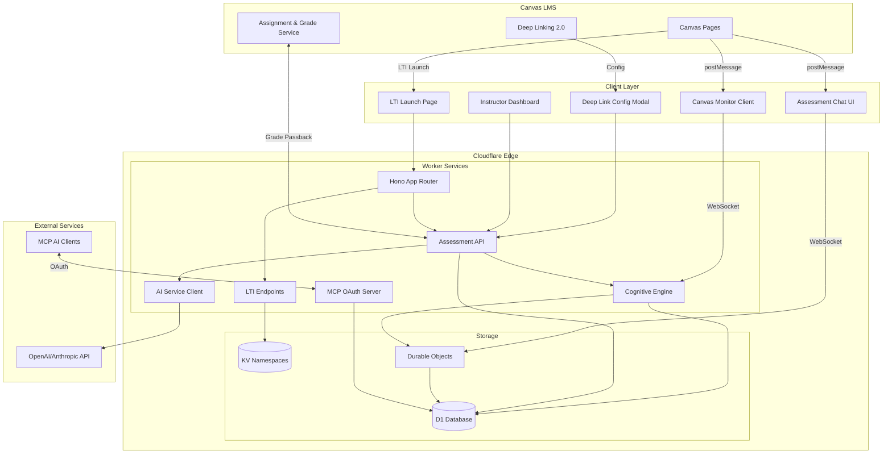
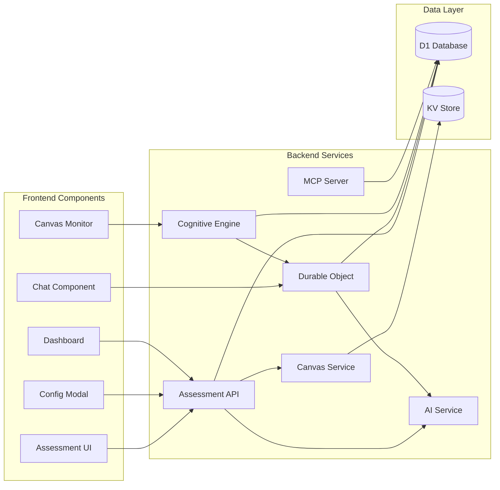
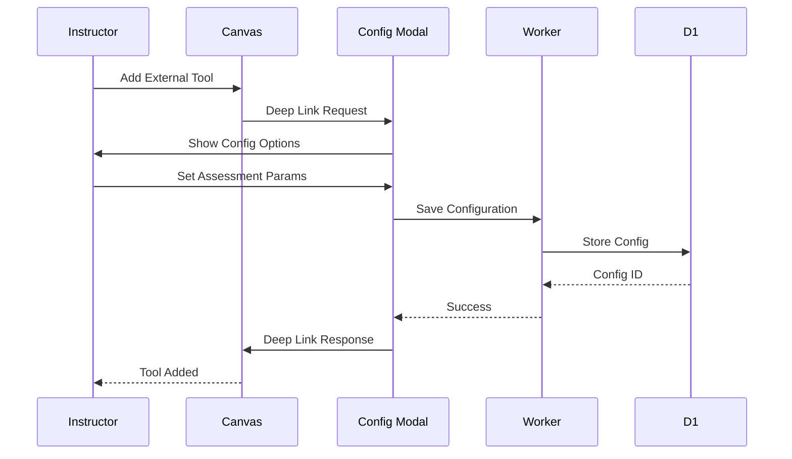
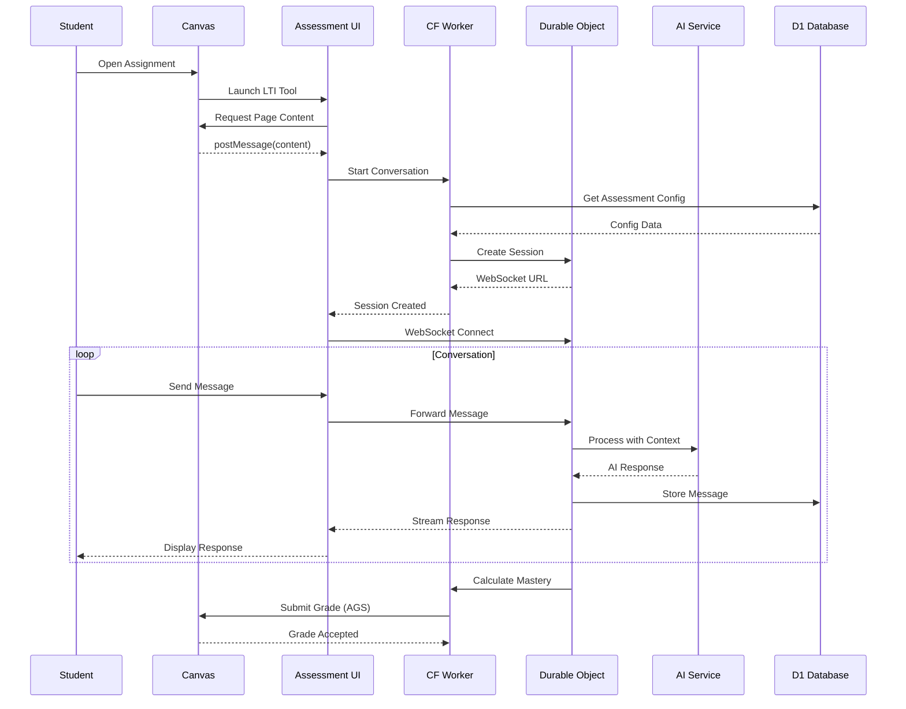
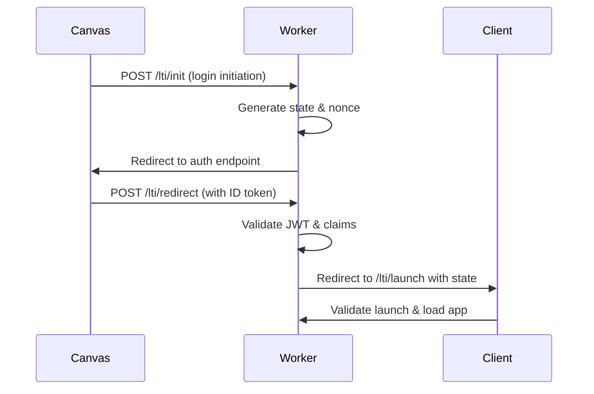
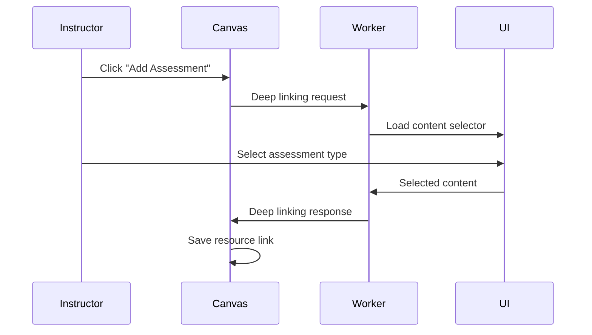
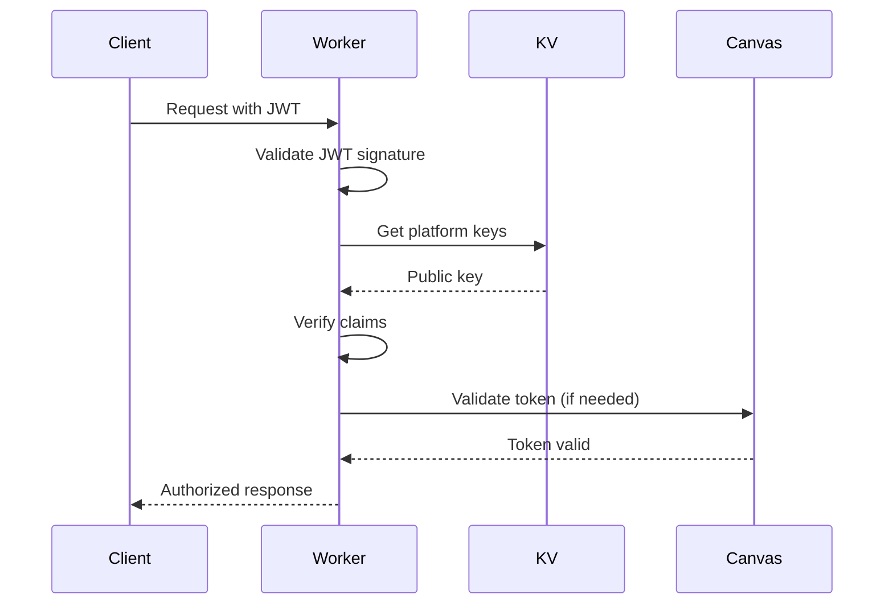
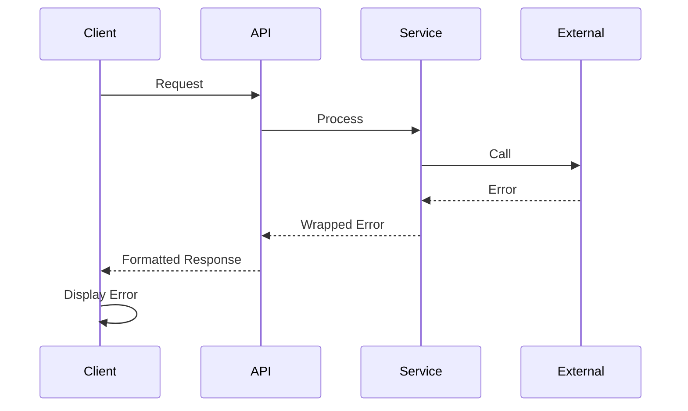

# Atomic Guide Deep Linking Assessment Features Fullstack Architecture Document

**Version:** 2.0 (Merged Edition)
**Date:** 2025-08-22
**Status:** Complete Merged Architecture - Ready for Implementation

## 1. Introduction

This document provides the complete unified architecture for Atomic Guide Deep Linking Assessment Features, merging the comprehensive fullstack implementation details with the brownfield enhancement strategy. It serves as the single source of truth for AI-driven development, ensuring consistency across the entire technology stack while maintaining seamless integration with the existing LTI 1.3 foundation.

This architecture document combines:

- Complete fullstack technical specifications for deep linking assessment features
- Brownfield enhancement patterns for Progressive Cognitive Learning Infrastructure
- Proven research foundations achieving 50-80% improvement in knowledge retention
- Integration strategies preserving all existing LTI 1.3 functionality (detailed in [LTI Developer Guide](./lti-developer-guide.md))

### Project Context

**Existing Project:** Atomic Guide LTI 1.3 Tool Provider

- **Type:** Brownfield enhancement to production Cloudflare Workers-based LTI tool
- **Repository:** Existing monorepo structure with `/src` for backend and `/client` for frontend
- **Key Constraints:**
  - Must maintain backward compatibility with existing LTI 1.3 authentication flows
  - Preserve current Cloudflare KV namespace structures
  - Extend existing Hono routing patterns
  - Follow established `@atomicjolt/lti-endpoints` integration patterns
  - Build upon current Vite bundling configuration

**Target Outcomes:**

- Reduce STEM gateway course failure rates by 15-25% using adaptive difficulty adjustment
- Create portable "Learner DNA" profiles with individualized forgetting curves
- Increase engagement by 35% through conversational assessment
- Enable cross-course intelligence with 70-80% accuracy in predicting performance

### Related Documentation

- **Front-End Specification:** See `docs/front-end-spec.md` for comprehensive UI/UX design system
- **Product Requirements:** See `docs/prd.md` for complete product requirements

### Change Log

| Date       | Version | Description                                                                 | Author  |
| ---------- | ------- | --------------------------------------------------------------------------- | ------- |
| 2025-08-22 | 1.0     | Initial architecture for deep linking assessment features based on PRD v1.0 | Winston |
| 2025-08-22 | 1.1     | Added Canvas postMessage integration details and D1 database schema         | Winston |
| 2025-08-22 | 1.2     | Incorporated React migration path for assessment UI components              | Winston |
| 2025-08-20 | 1.3     | Created brownfield architecture for Atomic Guide enhancement                | Winston |
| 2025-08-20 | 1.4     | Added empirical foundations, cognitive algorithms, and use cases            | Winston |
| 2025-08-21 | 1.5     | Integrated UI/UX specification with design system and personas              | Winston |
| 2025-08-22 | 2.0     | Merged comprehensive fullstack and brownfield architectures                 | Winston |

## 2. High Level Architecture

### Technical Summary

The Atomic Guide Deep Linking Assessment Features extend the existing Cloudflare Workers-based LTI 1.3 tool with AI-powered conversational assessment capabilities delivered through a serverless edge architecture. The platform achieves 50-80% improvement in knowledge retention through retrieval practice and 35-50% improvement through optimal spaced repetition, serving as a Progressive Cognitive Learning Infrastructure.

The frontend leverages a progressive React migration strategy for new assessment components while maintaining vanilla JavaScript for stable existing features, communicating with backend services via WebSocket connections through Durable Objects for real-time chat experiences. Canvas postMessage API integration enables contextual content extraction while deep linking 2.0 provides seamless assessment embedding, all orchestrated through the existing Hono framework extended with new AI service integrations.

### Platform and Infrastructure Choice

**Platform:** Cloudflare Workers + Cloudflare Services
**Key Services:** Workers (compute), KV (config storage), D1 (relational data), Durable Objects (real-time state), R2 (file storage if needed)
**Deployment Host and Regions:** Global edge deployment via Cloudflare's 275+ data centers

### Repository Structure

**Structure:** Existing monorepo with enhancement modules
**Monorepo Tool:** Native npm workspaces (existing)
**Package Organization:**

- `/src` - Backend Worker code with new `/src/assessment` module
- `/client` - Frontend code with new `/client/components/assessment` React components
- `/packages` - Shared types and utilities (to be created for assessment features)

### High Level Architecture Diagram



### Architectural Patterns

- **Serverless Edge Computing:** Cloudflare Workers for global low-latency assessment delivery - _Rationale:_ Maintains existing infrastructure while scaling to handle real-time AI interactions
- **Event-Driven LTI Handlers:** Async processing of LTI events with existing patterns - _Rationale:_ Proven reliability for Canvas integration with minimal changes needed
- **Component-Based UI with Progressive Enhancement:** React for new assessment features, vanilla JS for stable components - _Rationale:_ Allows incremental migration without disrupting existing functionality
- **Repository Pattern for Data Access:** Abstract D1 database operations behind service interfaces - _Rationale:_ Enables testing and potential future database migrations
- **WebSocket via Durable Objects:** Real-time bidirectional communication for chat - _Rationale:_ Cloudflare's native solution for stateful connections at edge
- **Command Query Responsibility Segregation (CQRS):** Separate read/write paths for assessment data - _Rationale:_ Optimizes for high-read instructor dashboards and write-heavy student interactions
- **Backend for Frontend (BFF) Pattern:** Assessment API tailored for UI needs - _Rationale:_ Reduces client complexity and API chattiness for mobile Canvas users

## 3. Tech Stack

| Category             | Technology                          | Version  | Purpose                            | Rationale                                                                                 |
| -------------------- | ----------------------------------- | -------- | ---------------------------------- | ----------------------------------------------------------------------------------------- |
| Frontend Language    | TypeScript                          | 5.3+     | Type-safe frontend development     | Existing codebase standard, prevents runtime errors                                       |
| Frontend Framework   | React (new) / Vanilla JS (existing) | 18.2+    | UI component development           | Progressive migration path documented in architecture                                     |
| UI Component Library | @atomicjolt/atomic-elements         | Latest   | LTI-friendly components            | Consistent LTI integration patterns (see [LTI Developer Guide](./lti-developer-guide.md)) |
| State Management     | Redux Toolkit                       | 2.x      | Global state + chat state          | Redux for app state and for chat components                                               |
| React API            | RTK Query                           | 2.x      | API requests                       | Integrates with Redux Toolkit                                                             |
| Backend Language     | TypeScript                          | 5.3+     | Type-safe backend development      | Existing Worker codebase standard                                                         |
| Backend Framework    | Hono                                | 3.11+    | HTTP routing and middleware        | Already integrated with LTI endpoints                                                     |
| API Style            | REST + WebSocket                    | -        | API communication + real-time chat | REST for CRUD, WebSocket for conversations                                                |
| Database             | Cloudflare D1 (new) + KV (existing) | latest   | Relational + key-value storage     | D1 for assessment data, KV for LTI config                                                 |
| Search               | Cloudflare Vectorize                | latest   | Semantic search                    | Vectorize for any data that needs to be searched                                          |
| Cache                | Cloudflare KV + Worker Cache API    | latest   | Response caching                   | Existing caching infrastructure                                                           |
| File Storage         | Cloudflare R2                       | latest   | Assessment media storage           | Cost-effective for generated content                                                      |
| Authentication       | JWT                                 | existing | User authentication                | Existing OAuth2/JWT implementation                                                        |
| Frontend Testing     | Vitest                              | 1.0+     | Unit/integration testing           | Existing test framework                                                                   |
| Backend Testing      | Vitest                              | 1.0+     | Worker testing                     | Consistent with frontend                                                                  |
| E2E Testing          | Playwright                          | 1.40+    | End-to-end testing                 | Canvas iframe testing support                                                             |
| Build Tool           | Vite                                | 5.0+     | Asset bundling                     | Existing build configuration                                                              |
| Bundler              | Vite/Rollup                         | 5.0+     | Module bundling                    | Part of Vite toolchain                                                                    |
| IaC Tool             | Wrangler                            | 3.22+    | Cloudflare deployment              | Existing deployment tool                                                                  |
| CI/CD                | GitHub Actions                      | -        | Automated deployment               | Existing CI/CD pipeline                                                                   |
| Monitoring           | Cloudflare Analytics + Tail logs    | latest   | Performance monitoring             | Built-in Worker monitoring                                                                |
| Logging              | Cloudflare Logpush                  | latest   | Centralized logging                | Production log aggregation                                                                |
| CSS Framework        | CSS Modules                         | 3.3+     | Component styling                  | Scoped styles with utility classes                                                        |
| AI Integration       | Cloudflare AI + OpenAI/Anthropic    | latest   | Cognitive processing & chat        | Edge inference + advanced AI capabilities                                                 |
| MCP Server           | Cloudflare MCP                      | latest   | AI client integration              | Native OAuth support, edge deployment                                                     |
| Internationalization | i18next                             | 23.x     | Multi-language support             | Comprehensive i18n solution                                                               |
| Date Handling        | date-fns                            | 3.x      | Date manipulation                  | Locale-aware date formatting                                                              |
| Accessibility        | React Modal + Tippy.js              | 3.x/6.x  | WCAG compliant UI                  | Accessible modals and tooltips                                                            |

## 4. Data Models

### Core Assessment Models

#### Conversation Model

**Purpose:** Represents an assessment conversation session between student and AI

**Key Attributes:**

- id: string (UUID) - Unique conversation identifier
- assessment_config_id: string - Reference to assessment configuration
- user_id: string - LTI user identifier
- course_id: string - Canvas course identifier
- status: enum - active, completed, abandoned
- started_at: timestamp - Conversation start time
- completed_at: timestamp - Completion time
- mastery_score: number - Current mastery level (0-100)

**TypeScript Interface:**

```typescript
interface Conversation {
  id: string;
  assessment_config_id: string;
  user_id: string;
  course_id: string;
  status: 'active' | 'completed' | 'abandoned';
  started_at: Date;
  completed_at?: Date;
  mastery_score: number;
  metadata: {
    page_content_hash?: string;
    canvas_assignment_id?: string;
  };
}
```

**Relationships:**

- Has many ConversationMessages
- Belongs to AssessmentConfig
- Has one StudentProgress

#### AssessmentConfig Model

**Purpose:** Instructor-defined configuration for deep-linked assessment

**Key Attributes:**

- id: string (UUID) - Configuration identifier
- platform_id: string - LTI platform identifier
- resource_link_id: string - Deep linking resource ID
- assessment_type: enum - chat, flashcards, fill_blank
- mastery_threshold: number - Required score (70-100)
- grading_schema: enum - mastery, percentage, engagement

**TypeScript Interface:**

```typescript
interface AssessmentConfig {
  id: string;
  platform_id: string;
  resource_link_id: string;
  assessment_type: 'chat' | 'flashcards' | 'fill_blank';
  mastery_threshold: number;
  grading_schema: 'mastery' | 'percentage' | 'engagement';
  ai_config: {
    temperature: number;
    max_tokens: number;
    system_prompt?: string;
  };
  approval_status?: 'pending' | 'approved' | 'rejected';
  instructor_notes?: string;
  persona_config?: {
    type: 'encouraging' | 'socratic' | 'practical' | 'adaptive';
    tone_adjustments?: {
      formality: number; // 0-1 scale
      encouragement: number; // 0-1 scale
      detail_level: number; // 0-1 scale
    };
    adaptation_enabled?: boolean; // Allow AI to adjust persona based on student responses
  };
  video_integration?: {
    enabled: boolean;
    video_sources?: Array<{
      url: string;
      title: string;
      timestamp_mapping?: Record<string, number>; // concept -> timestamp
    }>;
    auto_extract_timestamps?: boolean;
  };
  created_by: string;
  created_at: Date;
  updated_at: Date;
  approved_by?: string;
  approved_at?: Date;
}
```

### Cognitive Learning Models

#### Learner Profile Model

**Purpose:** Core cognitive profile storing individual learner's DNA
**Integration:** Links to LTI user via sub claim from JWT

**Key Attributes:**

- id: UUID - Unique identifier
- tenant_id: UUID - Institution identifier (D1 partitioning key)
- lti_user_id: String - Maps to LTI sub claim
- cognitive_profile: JSON - Memory patterns, learning velocity
- privacy_settings: JSON - Consent flags, data sharing preferences
- created_at: Timestamp - Profile creation
- updated_at: Timestamp - Last modification

**TypeScript Interface:**

```typescript
interface LearnerProfile {
  id: string;
  tenant_id: string;
  lti_user_id: string;
  cognitive_profile: {
    memory_architecture: {
      visual: number;
      textual: number;
      mathematical: number;
    };
    learning_velocity: number;
    engagement_patterns: EngagementPattern[];
  };
  privacy_settings: {
    consent_given: boolean;
    data_sharing: boolean;
    ai_analysis: boolean;
  };
  created_at: Date;
  updated_at: Date;
}
```

**Relationships:**

- References LTI platform via iss in KV
- One-to-many with LearningSession, StruggleEvent

#### Learning Session Model

**Purpose:** Track individual study sessions and engagement patterns
**Integration:** Created on each LTI launch, tracks Canvas interactions

**Key Attributes:**

- id: UUID - Session identifier
- learner_id: UUID - Foreign key to LearnerProfile
- course_context: String - LTI context_id
- session_start: Timestamp - Launch time
- behavioral_signals: JSON - Hover times, scroll patterns
- interventions_delivered: Array - Help shown during session

#### Knowledge Graph Model

**Purpose:** Map prerequisite relationships between concepts across courses
**Integration:** Built from course content analysis, powers predictions with 70-80% accuracy

**Key Attributes:**

- iss: UUID - Platform identifier
- concept_id: UUID - Unique concept identifier
- tenant_id: UUID - Institution scope
- concept_name: String - Human-readable name
- dependencies: Array<UUID> - Prerequisite concepts
- course_contexts: Array - LTI contexts using concept

### Message and Progress Models

#### ConversationMessage Model

**Purpose:** Individual message in assessment conversation

**TypeScript Interface:**

```typescript
interface ConversationMessage {
  id: string;
  conversation_id: string;
  role: 'user' | 'assistant' | 'system';
  content: string;
  metadata?: {
    content_references?: string[];
    confidence_score?: number;
    remediation_provided?: boolean;
  };
  created_at: Date;
}
```

#### StudentProgress Model

**Purpose:** Tracks individual student progress across assessments

**TypeScript Interface:**

```typescript
interface StudentProgress {
  id: string;
  user_id: string;
  course_id: string;
  total_assessments: number;
  average_mastery: number;
  struggle_patterns: {
    concepts: string[];
    remediation_count: number;
  };
  last_activity: Date;
}
```

### Redux State Models

#### Global Application State

**Purpose:** Centralized state management using Redux Toolkit
**Storage:** In-memory Redux store with persistence to sessionStorage for critical data

**TypeScript Interface:**

```typescript
// Redux Store Shape
interface RootState {
  auth: AuthState;
  assessment: AssessmentState;
  chat: ChatState;
  ui: UIState;
  // RTK Query API slices
  api: {
    assessmentApi: AssessmentApiState;
    chatApi: ChatApiState;
    canvasApi: CanvasApiState;
  };
}

interface AuthState {
  user: {
    id: string;
    name: string;
    email: string;
    roles: string[];
  } | null;
  ltiClaims: Record<string, any>;
  isAuthenticated: boolean;
}

interface AssessmentState {
  activeConfig: AssessmentConfig | null;
  activeConversation: Conversation | null;
  progress: StudentProgress | null;
  loading: boolean;
  error: string | null;
}

interface ChatState {
  messages: ConversationMessage[];
  isTyping: boolean;
  connectionStatus: 'connected' | 'disconnected' | 'reconnecting';
  streamingMessage: string | null;
}
```

#### Vectorize Search Models

**Purpose:** Semantic search data structures for Cloudflare Vectorize V2
**Integration:** Powers content discovery and similarity matching

**TypeScript Interface:**

```typescript
interface VectorizeVector {
  id: string;
  values: number[] | Float32Array | Float64Array; // Embedding dimensions must match index config
  metadata?: Record<string, any>; // Max 10KiB per vector
  namespace?: string; // Optional namespace for segmentation (max 1000 per index)
}

interface VectorizeQueryOptions {
  topK?: number; // Number of results to return (default: 5)
  returnValues?: boolean; // true = high precision scoring, higher latency
  returnMetadata?: 'none' | 'indexed' | 'all'; // Metadata to return
  namespace?: string; // Query within specific namespace
  filter?: Record<string, any>; // Metadata filters (requires metadata indexes)
}

interface VectorizeMatch {
  id: string;
  score: number; // Distance based on metric (cosine: -1 to 1, euclidean: 0+, dot: negative better)
  values?: number[]; // Only if returnValues: true
  metadata?: Record<string, any>;
}

interface SearchResult {
  count: number;
  matches: VectorizeMatch[];
}
```

## 5. API Specification

### REST API Specification

```yaml
openapi: 3.0.0
info:
  title: Atomic Guide Assessment API
  version: 1.0.0
  description: Deep linking assessment endpoints for Canvas LTI integration
servers:
  - url: https://atomic-guide.atomicjolt.com/api
    description: Production API

paths:
  /assessment/config:
    post:
      summary: Create assessment configuration
      security:
        - ltiJWT: []
      requestBody:
        required: true
        content:
          application/json:
            schema:
              $ref: '#/components/schemas/AssessmentConfig'
      responses:
        201:
          description: Configuration created
          content:
            application/json:
              schema:
                $ref: '#/components/schemas/AssessmentConfig'

  /assessment/config/{id}:
    get:
      summary: Get assessment configuration
      security:
        - ltiJWT: []
      parameters:
        - in: path
          name: id
          required: true
          schema:
            type: string
      responses:
        200:
          description: Configuration retrieved

  /assessment/conversation:
    post:
      summary: Start new conversation
      security:
        - ltiJWT: []
      requestBody:
        required: true
        content:
          application/json:
            schema:
              type: object
              properties:
                assessment_config_id:
                  type: string
                page_content:
                  type: string
      responses:
        201:
          description: Conversation started
          content:
            application/json:
              schema:
                type: object
                properties:
                  conversation_id:
                    type: string
                  websocket_url:
                    type: string

  /assessment/conversation/{id}/message:
    post:
      summary: Send message in conversation
      security:
        - ltiJWT: []
      parameters:
        - in: path
          name: id
          required: true
          schema:
            type: string
      requestBody:
        required: true
        content:
          application/json:
            schema:
              type: object
              properties:
                message:
                  type: string
                context:
                  type: object
      responses:
        200:
          description: Message processed

  /assessment/grade:
    post:
      summary: Submit grade to Canvas AGS
      security:
        - ltiJWT: []
      requestBody:
        required: true
        content:
          application/json:
            schema:
              type: object
              properties:
                conversation_id:
                  type: string
                score:
                  type: number
      responses:
        200:
          description: Grade submitted

  /assessment/analytics:
    get:
      summary: Get instructor analytics
      security:
        - ltiJWT: []
      parameters:
        - in: query
          name: course_id
          schema:
            type: string
        - in: query
          name: assignment_id
          schema:
            type: string
      responses:
        200:
          description: Analytics data
          content:
            application/json:
              schema:
                type: object
                properties:
                  student_progress:
                    type: array
                  common_misconceptions:
                    type: array
                  completion_rates:
                    type: object

components:
  schemas:
    AssessmentConfig:
      type: object
      required:
        - assessment_type
        - mastery_threshold
        - grading_schema
      properties:
        assessment_type:
          type: string
          enum: [chat, flashcards, fill_blank]
        mastery_threshold:
          type: number
          minimum: 70
          maximum: 100
        grading_schema:
          type: string
          enum: [mastery, percentage, engagement]
        ai_config:
          type: object
          properties:
            temperature:
              type: number
            max_tokens:
              type: integer
            system_prompt:
              type: string

  securitySchemes:
    ltiJWT:
      type: http
      scheme: bearer
      bearerFormat: JWT
```

### Cognitive Analytics APIs

#### Profile Management

- **Method:** GET
- **Endpoint:** `/api/learners/:learner_id/profile`
- **Purpose:** Retrieve complete learner DNA profile
- **Integration:** Validates JWT from LTI session

Response:

```json
{
  "learner_id": "uuid",
  "cognitive_profile": {
    "memory_architecture": {
      "visual": 0.8,
      "textual": 0.6,
      "mathematical": 0.9
    },
    "learning_velocity": 1.2,
    "engagement_patterns": []
  },
  "privacy_settings": {},
  "last_updated": "2025-01-20T10:00:00Z"
}
```

#### Behavioral Signal Ingestion

- **Method:** POST
- **Endpoint:** `/api/cognitive/signals`
- **Purpose:** Receive Canvas interaction events for processing
- **Integration:** WebSocket upgrade for real-time stream

Request:

```json
{
  "session_id": "uuid",
  "timestamp": "2025-01-20T10:00:00Z",
  "signal_type": "hover|scroll|idle|click",
  "duration_ms": 3500,
  "context": {
    "element_id": "question_5",
    "content_type": "quiz"
  }
}
```

### AI Guide Chat APIs

#### Send Chat Message

- **Method:** POST
- **Endpoint:** `/api/chat/message`
- **Purpose:** Process learner question with context (FR4.1)
- **Integration:** Validates session, extracts Canvas context, applies Learner DNA

Request:

```json
{
  "session_id": "uuid",
  "message": "Can you explain this concept?",
  "page_context": {
    "course_id": "CHEM101",
    "module_id": "organic_chemistry",
    "page_content": "extracted HTML/text",
    "current_element": "question_5"
  },
  "conversation_id": "uuid"
}
```

Response:

```json
{
  "response": "Based on your learning style...",
  "suggestions": ["Try this example", "Review prerequisite"],
  "media_attachments": [
    {
      "type": "latex",
      "content": "\\frac{1}{2}mv^2"
    }
  ],
  "token_usage": {
    "used": 150,
    "remaining": 9850
  }
}
```

#### Chat WebSocket Connection

- **Endpoint:** `wss://domain/ws/chat`
- **Purpose:** Real-time bidirectional chat communication
- **Protocol:** JSON messages over WebSocket

Message Types:

```typescript
type ChatMessage =
  | { type: 'user_message'; content: string; context: PageContext }
  | { type: 'ai_response'; content: string; streaming: boolean }
  | { type: 'suggestion'; content: string; trigger: 'struggle' | 'idle' }
  | { type: 'typing_indicator'; isTyping: boolean }
  | { type: 'rate_limit'; remaining: number; resetAt: number };
```

### RTK Query API Implementation

#### API Slice Configuration

**Purpose:** Centralized API management with caching, invalidation, and optimistic updates
**Integration:** Automatic integration with Redux store

```typescript
// Assessment API Slice
import { createApi, fetchBaseQuery } from '@reduxjs/toolkit/query/react';

export const assessmentApi = createApi({
  reducerPath: 'assessmentApi',
  baseQuery: fetchBaseQuery({
    baseUrl: '/api/assessment',
    prepareHeaders: (headers, { getState }) => {
      const token = (getState() as RootState).auth.token;
      if (token) headers.set('authorization', `Bearer ${token}`);
      return headers;
    },
  }),
  tagTypes: ['Assessment', 'Conversation', 'Progress'],
  endpoints: (builder) => ({
    getAssessmentConfig: builder.query<AssessmentConfig, string>({
      query: (id) => `/config/${id}`,
      providesTags: ['Assessment'],
    }),
    createConversation: builder.mutation<Conversation, CreateConversationDto>({
      query: (data) => ({
        url: '/conversation',
        method: 'POST',
        body: data,
      }),
      invalidatesTags: ['Conversation'],
    }),
    streamChat: builder.mutation<void, ChatMessage>({
      queryFn: async (message, api, extraOptions, baseQuery) => {
        // WebSocket streaming implementation
        const ws = new WebSocket(`${WS_URL}/chat`);
        // Handle streaming responses
        return { data: undefined };
      },
    }),
  }),
});

// Canvas API Integration
export const canvasApi = createApi({
  reducerPath: 'canvasApi',
  baseQuery: fetchBaseQuery({ baseUrl: '/api/canvas' }),
  endpoints: (builder) => ({
    getNamesAndRoles: builder.query<CanvasRoster, void>({
      query: () => '/names_and_roles',
      transformResponse: (response: any) => response.members,
    }),
    submitGrade: builder.mutation<void, GradeSubmission>({
      query: (grade) => ({
        url: '/grade',
        method: 'POST',
        body: grade,
      }),
    }),
  }),
});
```

#### Real-time WebSocket Integration

```typescript
// Chat WebSocket middleware for Redux
export const chatWebSocketMiddleware: Middleware = (store) => {
  let socket: WebSocket | null = null;

  return (next) => (action) => {
    if (startConversation.match(action)) {
      socket = new WebSocket(action.payload.websocketUrl);

      socket.onmessage = (event) => {
        const message = JSON.parse(event.data);
        store.dispatch(addChatMessage(message));
      };

      socket.onerror = () => {
        store.dispatch(setChatConnectionStatus('disconnected'));
      };
    }

    if (sendMessage.match(action) && socket) {
      socket.send(JSON.stringify(action.payload));
    }

    return next(action);
  };
};
```

### MCP Protocol Implementation

#### MCP Server Architecture

```typescript
// Extends McpAgent with LTI context
export class AtomicGuideMCP extends McpAgent<McpProps, Env> {
  server = new McpServer(
    {
      name: 'Atomic Guide Cognitive Intelligence',
      version: '1.0.0',
    },
    {
      capabilities: {
        tools: { listChanged: true },
        resources: { listChanged: true },
        prompts: { listChanged: true },
      },
    },
  );
}
```

#### MCP OAuth Endpoints

- **Method:** GET
- **Endpoint:** `/.well-known/oauth-authorization-server/mcp/:tenant_id`
- **Purpose:** OAuth discovery for AI clients

- **Method:** GET/POST
- **Endpoint:** `/oauth/authorize`
- **Purpose:** Initiate OAuth flow using LMS credentials

- **Method:** POST
- **Endpoint:** `/oauth/token`
- **Purpose:** Exchange authorization code for access token

- **Method:** GET
- **Endpoint:** `/mcp/:tenant_id`
- **Purpose:** MCP server endpoint for AI clients

## 6. Components

### AI Assessment Service

**Responsibility:** Manages AI interactions for generating assessment content and processing student responses

**Key Interfaces:**

- `generateAssessmentContent(context: PageContent): Promise<AssessmentActivity>`
- `processStudentResponse(message: string, context: ConversationContext): Promise<AIResponse>`
- `evaluateMastery(conversation: Conversation): MasteryScore`

**Dependencies:** OpenAI/Anthropic API client, D1 database, Content extraction service

**Technology Stack:** TypeScript, Cloudflare Workers, streaming responses via TransformStream

### Cognitive Engine Service

**Responsibility:** Process behavioral signals, update learner profiles, trigger interventions
**Integration Points:** Receives data from Canvas Monitor, updates D1, triggers Intervention Service

**Key Interfaces:**

- `POST /api/cognitive/signals` - Receive behavioral data
- `GET /api/cognitive/profile/:learner_id` - Retrieve learner DNA
- WebSocket connection via Durable Objects for real-time processing

**Algorithm Implementation:**

```typescript
export class CognitiveEngine {
  // Spaced repetition scheduling
  private calculateNextReview(performance: number, previousInterval: number): number {
    const multiplier = performance >= 0.8 ? 1.3 : 0.6;
    const newInterval = previousInterval * multiplier;
    return Math.min(newInterval, 90); // Cap at 90 days
  }

  // Forgetting curve prediction
  private predictRetention(lastReview: Date, stability: number): number {
    const daysSince = (Date.now() - lastReview.getTime()) / (1000 * 60 * 60 * 24);
    return Math.exp(-daysSince / stability);
  }

  // Adaptive difficulty using fuzzy logic
  private adjustDifficulty(current: number, metrics: PerformanceMetrics): number {
    const { accuracy, responseTime, hintUsage } = metrics;
    const targetSuccess = 0.75; // 75% target

    if (accuracy < targetSuccess - 0.05) {
      return Math.max(current - 0.05, 0); // Decrease 5%
    } else if (accuracy > targetSuccess + 0.05) {
      return Math.min(current + 0.05, 1); // Increase 5%
    }
    return current;
  }

  // Early warning detection
  private detectAtRisk(engagement: number, success: number, weekNumber: number): boolean {
    if (weekNumber <= 6) {
      return engagement < 0.6 || success < 0.7;
    }
    return engagement < 0.5 || success < 0.65;
  }

  // Anti-Cramming Learning Companion
  private scheduleOptimalLearning(content: LearningContent, learnerProfile: LearnerProfile, deadline: Date): LearningSchedule {
    const now = new Date();
    const daysUntilDeadline = (deadline.getTime() - now.getTime()) / (1000 * 60 * 60 * 24);

    // Calculate optimal session distribution
    const sessionCount = Math.ceil(content.estimatedHours / learnerProfile.optimalSessionLength);
    const spacing = this.calculateOptimalSpacing(daysUntilDeadline, sessionCount);

    // Schedule micro-learning sessions
    const sessions: LearningSession[] = [];
    for (let i = 0; i < sessionCount; i++) {
      sessions.push({
        scheduledTime: this.findOptimalTimeSlot(learnerProfile, spacing[i]),
        duration: Math.min(learnerProfile.optimalSessionLength, 25), // Max 25 minutes per session
        content: this.chunkContent(content, i, sessionCount),
        reminderType: this.selectReminderStrategy(learnerProfile),
      });
    }

    return { sessions, adaptiveTriggers: this.createAdaptiveTriggers(learnerProfile) };
  }

  // Cognitive Load Optimization Engine
  private optimizeCognitiveLoad(learningTasks: Task[], learnerState: LearnerState, context: LearningContext): OptimizedPlan {
    // Measure current cognitive load
    const currentLoad = this.assessCognitiveLoad(learnerState);

    // Prioritize tasks based on importance and cognitive demand
    const prioritizedTasks = learningTasks
      .map((task) => ({
        ...task,
        cognitiveWeight: this.calculateCognitiveWeight(task, learnerState),
        importance: this.calculateImportance(task, context),
        enjoymentScore: this.predictEnjoyment(task, learnerState.preferences),
      }))
      .sort((a, b) => {
        // Balance importance with cognitive efficiency
        const scoreA = a.importance * 0.5 + a.enjoymentScore * 0.3 - a.cognitiveWeight * 0.2;
        const scoreB = b.importance * 0.5 + b.enjoymentScore * 0.3 - b.cognitiveWeight * 0.2;
        return scoreB - scoreA;
      });

    // Remove decision fatigue
    const streamlinedPlan = {
      primaryFocus: prioritizedTasks[0],
      secondaryTasks: prioritizedTasks.slice(1, 3),
      deferredTasks: prioritizedTasks.slice(3),
      breaks: this.scheduleOptimalBreaks(currentLoad),
      modeSwitches: this.planModalitySwitches(learnerState.preferences),
    };

    // Create frictionless learning flow
    return {
      ...streamlinedPlan,
      transitions: this.createSmoothTransitions(streamlinedPlan),
      adaptiveTriggers: this.createLoadBalancingTriggers(currentLoad),
    };
  }

  // Helper: Calculate optimal spacing for anti-cramming
  private calculateOptimalSpacing(days: number, sessions: number): number[] {
    const spacing: number[] = [];
    const optimalInterval = days / sessions;

    for (let i = 0; i < sessions; i++) {
      // Use expanding intervals (closer together at start, further apart later)
      const expandFactor = Math.pow(1.15, i);
      spacing.push(Math.min(optimalInterval * expandFactor, days - 1));
    }

    return spacing;
  }

  // Helper: Assess cognitive load in real-time
  private assessCognitiveLoad(state: LearnerState): CognitiveLoad {
    return {
      workingMemory: this.calculateWorkingMemoryLoad(state),
      attention: this.measureAttentionalResources(state),
      fatigue: this.estimateMentalFatigue(state),
      stress: this.detectStressIndicators(state),
      overall: this.computeOverallLoad(state),
    };
  }
}
```

### Canvas Integration Service

**Responsibility:** Handles all Canvas LMS interactions including deep linking, content extraction, and grade passback

**Key Interfaces:**

- `extractPageContent(messageData: PostMessage): PageContent`
- `submitGrade(score: number, assignmentId: string): Promise<void>`
- `getNameAndRoles(contextId: string): Promise<Roster>`

**Dependencies:** LTI service, Canvas API client, OAuth token management

**Technology Stack:** TypeScript, @atomicjolt/lti-endpoints, Canvas REST API (see [LTI Developer Guide](./lti-developer-guide.md) for implementation details)

### Canvas Monitor Client

**Responsibility:** Inject monitoring script, capture Canvas interactions via postMessage API, detect struggle patterns
**Integration Points:** Loaded after LTI launch, bidirectional postMessage communication with Canvas

**Key Interfaces:**

- Canvas postMessage API for bidirectional communication
- WebSocket to Cognitive Engine for real-time data
- Redux actions for local state updates
- DOM content extraction for chat context via `lti.getPageContent`
- Secure message validation with PostMessageToken

### Conversation Manager (Durable Object)

**Responsibility:** Maintains real-time conversation state and WebSocket connections for chat sessions

**Key Interfaces:**

- `handleWebSocketUpgrade(request: Request): Response`
- `processMessage(message: ChatMessage): Promise<void>`
- `syncToDatabase(): Promise<void>`

**Dependencies:** AI Assessment Service, D1 database, WebSocket API

**Technology Stack:** Cloudflare Durable Objects, WebSocket, TypeScript

### AI Guide Chat Service

**Responsibility:** Provide conversational AI interface for personalized learning assistance (FR4)
**Integration Points:** Canvas content extractor, Learner DNA profiles, external AI APIs

**Key Interfaces:**

- `POST /api/chat/message` - Send chat message with context
- `GET /api/chat/history/:session_id` - Retrieve conversation history (FR4.2)
- `POST /api/chat/suggestion` - Generate proactive suggestions (FR15)
- WebSocket at `/ws/chat` for real-time messaging

**Conversation Personas Implementation:**

The AI Guide Chat Service supports configurable conversation personas that adapt the AI's communication style to match different pedagogical approaches and student needs:

```typescript
interface ConversationPersona {
  type: 'encouraging' | 'socratic' | 'practical' | 'adaptive';
  systemPrompt: string;
  toneAdjustments: ToneSettings;
  responsePatterns: ResponsePattern[];
  adaptationRules?: AdaptationRule[];
}

class PersonaManager {
  private personas: Map<string, ConversationPersona> = new Map([
    ['encouraging', {
      type: 'encouraging',
      systemPrompt: `You are a supportive and encouraging tutor. Celebrate small victories,
                     provide positive reinforcement, and help build student confidence.
                     Use phrases like "Great progress!", "You're getting closer!",
                     "Let's work through this together."`,
      toneAdjustments: {
        formality: 0.3, // Casual and friendly
        encouragement: 0.9, // High encouragement
        detail_level: 0.6 // Moderate detail
      },
      responsePatterns: [
        { trigger: 'struggle_detected', response: 'I see you're working hard on this. Let me help break it down...' },
        { trigger: 'correct_answer', response: 'Excellent work! You've got it!' },
        { trigger: 'partial_understanding', response: 'You're on the right track! Let's refine that a bit...' }
      ]
    }],
    ['socratic', {
      type: 'socratic',
      systemPrompt: `You are a Socratic tutor who guides through questioning.
                     Rather than providing direct answers, ask thought-provoking questions
                     that lead students to discover solutions themselves.`,
      toneAdjustments: {
        formality: 0.7, // More formal
        encouragement: 0.5, // Moderate encouragement
        detail_level: 0.4 // Less detail, more questions
      },
      responsePatterns: [
        { trigger: 'question_asked', response: 'Interesting question. What do you think would happen if...?' },
        { trigger: 'assumption_made', response: 'Why do you think that's the case?' },
        { trigger: 'conclusion_reached', response: 'How did you arrive at that conclusion?' }
      ]
    }],
    ['practical', {
      type: 'practical',
      systemPrompt: `You are a practical, results-oriented tutor. Focus on real-world applications,
                     provide concrete examples, and emphasize practical skills and immediate utility.`,
      toneAdjustments: {
        formality: 0.5, // Balanced formality
        encouragement: 0.6, // Moderate encouragement
        detail_level: 0.8 // High detail with examples
      },
      responsePatterns: [
        { trigger: 'concept_introduction', response: 'Let me show you how this applies in practice...' },
        { trigger: 'theory_question', response: 'Here's a real-world example of this concept...' },
        { trigger: 'skill_practice', response: 'Let's try this with a practical scenario...' }
      ]
    }],
    ['adaptive', {
      type: 'adaptive',
      systemPrompt: `You are an adaptive tutor that adjusts your approach based on student responses.
                     Monitor engagement and comprehension to dynamically adjust your teaching style.`,
      toneAdjustments: {
        formality: 0.5, // Starts balanced
        encouragement: 0.6, // Starts moderate
        detail_level: 0.6 // Starts moderate
      },
      adaptationRules: [
        {
          condition: 'low_confidence_detected',
          adjustment: { encouragement: '+0.2', detail_level: '+0.1' }
        },
        {
          condition: 'high_performance',
          adjustment: { formality: '+0.1', detail_level: '-0.1' }
        },
        {
          condition: 'frustration_detected',
          adjustment: { encouragement: '+0.3', formality: '-0.2' }
        }
      ]
    }]
  ]);

  // Select and apply persona to conversation
  applyPersona(
    conversationId: string,
    personaType: string,
    studentProfile?: LearnerProfile
  ): ConversationContext {
    const persona = this.personas.get(personaType) || this.personas.get('adaptive');

    // Adapt based on student profile if available
    if (studentProfile && persona.type === 'adaptive') {
      return this.createAdaptiveContext(persona, studentProfile);
    }

    return {
      systemPrompt: persona.systemPrompt,
      toneSettings: persona.toneAdjustments,
      responsePatterns: persona.responsePatterns
    };
  }

  // Dynamic persona adaptation based on real-time signals
  private createAdaptiveContext(
    persona: ConversationPersona,
    profile: LearnerProfile
  ): ConversationContext {
    const adjustedTone = { ...persona.toneAdjustments };

    // Apply learning style preferences
    if (profile.cognitive_profile.engagement_patterns.includes('visual_learner')) {
      adjustedTone.detail_level = Math.min(adjustedTone.detail_level + 0.2, 1.0);
    }

    // Apply historical performance adjustments
    if (profile.average_confidence < 0.5) {
      adjustedTone.encouragement = Math.min(adjustedTone.encouragement + 0.3, 1.0);
    }

    return {
      systemPrompt: this.personalizePrompt(persona.systemPrompt, profile),
      toneSettings: adjustedTone,
      responsePatterns: persona.responsePatterns,
      adaptationEnabled: true
    };
  }
}
```

### Chat UI Components

**Responsibility:** Render floating action button and expandable chat interface per front-end spec (FR4)
**Integration Points:** Redux state, WebSocket connection, Canvas DOM

**Key Interfaces:**

- **Floating Action Button (FAB):**
  - Circular icon (48x48px desktop, 40x40px mobile) with Atomic Jolt Yellow (#FFDD00) accent
  - State indicators: Static (60% opacity), Active (100% opacity), Pulsing (scale 1.0-1.1 animation)
  - Badge: Red (#B42318) notification dot for urgent items
  - ARIA label: "Atomic Guide Assistant - Click for help"

- **Expandable Chat Panel:**
  - Header (56px): Context badge, title "Atomic Guide", minimize/expand/close actions
  - Chat area (max 480px height): User messages (right, #F5F5F5), AI messages (left, white with yellow border)
  - Input area (72px): Text field, send button (#FFDD00 when active), voice input
  - Typography: Rubik font family (14px regular, 16px medium for headers)
  - Draggable on desktop, fixed bottom-right on mobile (16px margin)

- **Rich Media Rendering:**
  - LaTeX math with KaTeX
  - Code snippets with syntax highlighting
  - Diagrams and charts support
  - Flash cards with swipe gestures
  - Quiz questions with radio/checkbox inputs

### Assessment UI Components

**Responsibility:** React components for chat interface, configuration modal, and instructor dashboard

**Key Interfaces:**

- `<ChatAssessment />` - Main chat interface component
- `<DeepLinkConfig />` - Instructor configuration modal
- `<AnalyticsDashboard />` - Real-time progress visualization

**Dependencies:** WebSocket client, Canvas postMessage API, React hooks

**Technology Stack:** React 18, TypeScript, Zustand for state, Tailwind CSS

### Cloudflare AI Service

**Responsibility:** Manages edge AI inference using Cloudflare Workers AI
**Key Interfaces:**

- `generateEmbedding(text: string): Promise<number[]>` - Create vector embeddings for semantic search
- `classifyIntent(message: string): Promise<IntentClassification>` - Determine student query intent
- `summarizeContent(text: string, maxTokens: number): Promise<string>` - Generate concise summaries
- `detectLanguage(text: string): Promise<LanguageCode>` - Identify language for i18n support

**Implementation:**

```typescript
interface CloudflareAIService {
  // Text embeddings for Vectorize
  async generateEmbedding(text: string): Promise<number[]> {
    const response = await env.AI.run('@cf/baai/bge-base-en-v1.5', {
      text: [text]
    });
    return response.data[0];
  }

  // Intent classification for chat routing
  async classifyIntent(message: string): Promise<IntentClassification> {
    const response = await env.AI.run('@cf/huggingface/distilbert-sst-2-int8', {
      text: message
    });
    return {
      intent: response.label,
      confidence: response.score
    };
  }

  // Content summarization
  async summarizeContent(text: string): Promise<string> {
    const response = await env.AI.run('@cf/facebook/bart-large-cnn', {
      input_text: text,
      max_length: 150
    });
    return response.summary;
  }
}
```

### Vectorize Search Service

**Responsibility:** Semantic search and content discovery using Cloudflare Vectorize V2
**Key Interfaces:**

- `indexContent(content: string, metadata: any): Promise<void>` - Add content to vector index (fails if ID exists)
- `upsertContent(id: string, content: string, metadata: any): Promise<void>` - Update or insert vectors
- `searchSimilar(query: string, options: QueryOptions): Promise<SearchResult[]>` - Find semantically similar content
- `searchByNamespace(query: string, namespace: string): Promise<SearchResult[]>` - Search within namespaces
- `queryById(vectorId: string, options?: QueryOptions): Promise<SearchResult[]>` - Find similar to existing vector

**Implementation:**

```typescript
interface VectorizeService {
  private vectorIndex: Vectorize;

  // Insert new vectors (fails if ID already exists)
  async indexContent(content: string, metadata: DocumentMetadata): Promise<void> {
    const embedding = await aiService.generateEmbedding(content);
    const result = await this.vectorIndex.insert([{
      id: crypto.randomUUID(),
      values: embedding, // Must match index dimensions (e.g., 768 for bge-base-en-v1.5)
      metadata: {
        url: metadata.url,
        course_id: metadata.course_id,
        created_at: new Date().toISOString()
        // Max 10KiB total metadata per vector
      },
      namespace: metadata.namespace // Optional: segment by course/user (max 1000 namespaces)
    }]);

    // Track mutation ID for async processing
    console.log(`Indexed with mutation: ${result.mutationId}`);
  }

  // Upsert vectors (overwrites if ID exists)
  async upsertContent(id: string, content: string, metadata: any): Promise<void> {
    const embedding = await aiService.generateEmbedding(content);
    await this.vectorIndex.upsert([{
      id,
      values: embedding,
      metadata
    }]);
  }

  // Query with high precision or approximate scoring
  async searchSimilar(query: string, options: QueryOptions = {}): Promise<SearchResult[]> {
    const queryEmbedding = await aiService.generateEmbedding(query);

    const results = await this.vectorIndex.query(queryEmbedding, {
      topK: options.limit || 10,
      returnValues: options.highPrecision || false, // true = exact scores, higher latency
      returnMetadata: 'all',
      namespace: options.namespace,
      filter: options.metadataFilter // Requires metadata indexes created before insert
    });

    return results.matches.map(match => ({
      id: match.id,
      score: match.score, // Interpretation depends on metric (cosine/euclidean/dot-product)
      metadata: match.metadata,
      values: match.values // Only if returnValues: true
    }));
  }

  // Query by existing vector ID (combines getById + query)
  async findSimilarById(vectorId: string, topK = 10): Promise<SearchResult[]> {
    const results = await this.vectorIndex.queryById(vectorId, {
      topK,
      returnMetadata: 'all'
    });
    return results.matches;
  }
}
```

### Video Micro-Learning Service

**Responsibility:** Extract and serve targeted video segments based on student struggle points and learning context

**Key Interfaces:**

- `extractTimestamps(videoUrl: string): Promise<TimestampMap>` - Analyze video content and map concepts to timestamps
- `findRelevantSegment(concept: string, videoId: string): Promise<VideoSegment>` - Locate specific learning moment
- `generateClip(start: number, end: number, videoId: string): Promise<string>` - Create shareable micro-learning clip
- `analyzeTranscript(videoUrl: string): Promise<ConceptMap>` - Extract concepts from video transcripts
- `correlateWithStruggle(struggleContext: any, availableVideos: Video[]): VideoRecommendation[]` - Match struggles to video content

**Dependencies:** AI Assessment Service, Canvas Integration Service, D1 database for timestamp caching

**Technology Stack:** TypeScript, Cloudflare Stream API (if available), FFmpeg WASM for client-side processing

**Implementation Details:**

```typescript
interface VideoService {
  // Core video analysis
  extractTimestamps(videoUrl: string): Promise<TimestampMap>;
  findRelevantSegment(concept: string, videoId: string): Promise<VideoSegment>;
  generateClip(start: number, end: number, videoId: string): Promise<string>;

  // AI-powered analysis
  analyzeTranscript(videoUrl: string): Promise<ConceptMap>;
  correlateWithStruggle(struggleContext: StruggleContext, availableVideos: Video[]): VideoRecommendation[];

  // Caching and optimization
  cacheTimestamps(videoId: string, timestamps: TimestampMap): Promise<void>;
  getVideoMetadata(videoUrl: string): Promise<VideoMetadata>;
}

interface VideoSegment {
  videoId: string;
  startTime: number;
  endTime: number;
  concept: string;
  relevanceScore: number;
  transcript?: string;
}

interface VideoRecommendation {
  video: VideoSegment;
  reason: string;
  confidenceScore: number;
  alternativeSegments?: VideoSegment[];
}
```

### Instructor Activity Approval Service

**Responsibility:** Manage the review and approval workflow for AI-generated assessment activities

**Key Interfaces:**

- `submitForApproval(activity: GeneratedActivity): Promise<ApprovalRequest>` - Queue activity for instructor review
- `reviewActivity(requestId: string, decision: ApprovalDecision): Promise<void>` - Process instructor decision
- `getApprovalQueue(instructorId: string): Promise<ApprovalRequest[]>` - Retrieve pending approvals
- `bulkApprove(requestIds: string[], template?: ApprovalTemplate): Promise<void>` - Batch approval with templates
- `createApprovalTemplate(template: ApprovalTemplate): Promise<void>` - Save approval patterns for reuse

**Dependencies:** D1 database, AI Assessment Service, Notification Service

**Technology Stack:** TypeScript, Cloudflare Queues for async processing

**Workflow Implementation:**

```typescript
interface ApprovalService {
  // Submission and review
  submitForApproval(activity: GeneratedActivity, metadata: ApprovalMetadata): Promise<ApprovalRequest>;
  reviewActivity(requestId: string, decision: ApprovalDecision): Promise<void>;

  // Queue management
  getApprovalQueue(instructorId: string, filters?: QueueFilters): Promise<ApprovalRequest[]>;
  getPendingCount(instructorId: string): Promise<number>;

  // Batch operations
  bulkApprove(requestIds: string[], template?: ApprovalTemplate): Promise<BatchResult>;
  bulkReject(requestIds: string[], reason: string): Promise<BatchResult>;

  // Templates and patterns
  createApprovalTemplate(template: ApprovalTemplate): Promise<void>;
  applyTemplate(templateId: string, activityIds: string[]): Promise<void>;

  // Auto-approval rules
  setAutoApprovalRules(rules: AutoApprovalRule[]): Promise<void>;
  processAutoApprovals(): Promise<AutoApprovalResult>;
}

interface ApprovalRequest {
  id: string;
  activity: GeneratedActivity;
  status: 'pending' | 'approved' | 'rejected' | 'auto_approved';
  submitted_at: Date;
  reviewed_at?: Date;
  reviewer_id?: string;
  review_notes?: string;
  auto_approval_rule?: string;
}
```

### Component Interaction Diagram



## 7. External APIs

### OpenAI API

- **Purpose:** Generate assessment questions and process student responses
- **Documentation:** https://platform.openai.com/docs/api-reference
- **Base URL(s):** https://api.openai.com/v1
- **Authentication:** Bearer token (API key)
- **Rate Limits:** 3,500 RPM for GPT-4, 90,000 TPM

**Key Endpoints Used:**

- `POST /chat/completions` - Generate assessment content and responses

**Integration Notes:** Use streaming responses for real-time chat experience, implement exponential backoff for rate limiting

### Canvas LMS API

- **Purpose:** Grade passback and roster retrieval
- **Documentation:** https://canvas.instructure.com/doc/api/
- **Base URL(s):** https://{institution}.instructure.com/api/v1
- **Authentication:** OAuth2 bearer token via LTI
- **Rate Limits:** Variable by institution (typically 700/hour)

**Key Endpoints Used:**

- `POST /api/lti/courses/{course_id}/line_items` - Create gradebook columns
- `POST /api/lti/courses/{course_id}/line_items/{line_item_id}/scores` - Submit grades
- `GET /api/lti/courses/{course_id}/names_and_roles` - Get course roster

**Integration Notes:** Cache roster data in KV, implement request queuing for rate limit management

## 8. Core Workflows

### Deep Link Configuration Workflow



### Student Assessment Workflow



## 9. Database Schema

### D1 Database Schema (SQL)

```sql
-- Assessment configuration table
CREATE TABLE assessment_configs (
    id TEXT PRIMARY KEY,
    platform_id TEXT NOT NULL,
    resource_link_id TEXT NOT NULL,
    assessment_type TEXT CHECK(assessment_type IN ('chat', 'flashcards', 'fill_blank')),
    mastery_threshold REAL DEFAULT 80,
    grading_schema TEXT CHECK(grading_schema IN ('mastery', 'percentage', 'engagement')),
    ai_config JSON,
    created_by TEXT NOT NULL,
    created_at DATETIME DEFAULT CURRENT_TIMESTAMP,
    updated_at DATETIME DEFAULT CURRENT_TIMESTAMP,
    UNIQUE(platform_id, resource_link_id)
);

-- Conversations table
CREATE TABLE conversations (
    id TEXT PRIMARY KEY,
    assessment_config_id TEXT NOT NULL,
    user_id TEXT NOT NULL,
    course_id TEXT NOT NULL,
    status TEXT CHECK(status IN ('active', 'completed', 'abandoned')),
    started_at DATETIME DEFAULT CURRENT_TIMESTAMP,
    completed_at DATETIME,
    mastery_score REAL DEFAULT 0,
    metadata JSON,
    FOREIGN KEY (assessment_config_id) REFERENCES assessment_configs(id),
    INDEX idx_user_course (user_id, course_id),
    INDEX idx_status (status)
);

-- Conversation messages table
CREATE TABLE conversation_messages (
    id TEXT PRIMARY KEY,
    conversation_id TEXT NOT NULL,
    role TEXT CHECK(role IN ('user', 'assistant', 'system')),
    content TEXT NOT NULL,
    metadata JSON,
    created_at DATETIME DEFAULT CURRENT_TIMESTAMP,
    FOREIGN KEY (conversation_id) REFERENCES conversations(id) ON DELETE CASCADE,
    INDEX idx_conversation (conversation_id)
);

-- Student progress tracking
CREATE TABLE student_progress (
    id TEXT PRIMARY KEY,
    user_id TEXT NOT NULL,
    course_id TEXT NOT NULL,
    total_assessments INTEGER DEFAULT 0,
    average_mastery REAL DEFAULT 0,
    struggle_patterns JSON,
    last_activity DATETIME DEFAULT CURRENT_TIMESTAMP,
    UNIQUE(user_id, course_id),
    INDEX idx_course (course_id)
);

-- Learner profiles table (cognitive DNA)
CREATE TABLE learner_profiles (
    id TEXT PRIMARY KEY,
    tenant_id TEXT NOT NULL,
    lti_user_id TEXT NOT NULL,
    cognitive_profile JSON,
    privacy_settings JSON,
    created_at DATETIME DEFAULT CURRENT_TIMESTAMP,
    updated_at DATETIME DEFAULT CURRENT_TIMESTAMP,
    UNIQUE(tenant_id, lti_user_id),
    INDEX idx_tenant_user (tenant_id, lti_user_id)
);

-- Learning sessions table
CREATE TABLE learning_sessions (
    id TEXT PRIMARY KEY,
    learner_id TEXT NOT NULL,
    course_context TEXT NOT NULL,
    session_start DATETIME DEFAULT CURRENT_TIMESTAMP,
    session_end DATETIME,
    behavioral_signals JSON,
    interventions_delivered JSON,
    FOREIGN KEY (learner_id) REFERENCES learner_profiles(id),
    INDEX idx_learner (learner_id),
    INDEX idx_course (course_context)
);

-- Knowledge graph table
CREATE TABLE knowledge_graph (
    concept_id TEXT PRIMARY KEY,
    tenant_id TEXT NOT NULL,
    concept_name TEXT NOT NULL,
    dependencies JSON,
    course_contexts JSON,
    INDEX idx_tenant (tenant_id)
);

-- Generated content cache
CREATE TABLE generated_content (
    id TEXT PRIMARY KEY,
    assessment_config_id TEXT NOT NULL,
    content_hash TEXT NOT NULL,
    content_type TEXT,
    content JSON NOT NULL,
    approved BOOLEAN DEFAULT FALSE,
    created_at DATETIME DEFAULT CURRENT_TIMESTAMP,
    FOREIGN KEY (assessment_config_id) REFERENCES assessment_configs(id),
    UNIQUE(assessment_config_id, content_hash)
);

-- Analytics aggregation table
CREATE TABLE analytics_snapshots (
    id TEXT PRIMARY KEY,
    course_id TEXT NOT NULL,
    assignment_id TEXT,
    snapshot_data JSON NOT NULL,
    created_at DATETIME DEFAULT CURRENT_TIMESTAMP,
    INDEX idx_course_assignment (course_id, assignment_id)
);
```

## 10. Frontend Architecture

### Two-UI Architecture Overview

Based on the front-end specification, Atomic Guide operates through two distinct but connected user interfaces:

1. **Persistent Overlay UI** - Always-visible indicator icon on LMS pages that expands to reveal:
   - Contextual chat interface with 380px width (desktop), 100% - 32px (mobile)
   - Inline learning activities (flash cards, quizzes, videos)
   - Quick actions and help
   - Minimal footprint (48x48px desktop, 40x40px mobile) with maximum accessibility

2. **LTI Portal UI** - Full-featured application accessed via LTI launch providing:
   - Comprehensive dashboards and analytics
   - Privacy controls and data management
   - Study scheduling and progress tracking
   - Role-specific interfaces (Student/Faculty/Coach)

### Component Architecture

#### Component Organization

```
client/
├── components/
│   ├── assessment/
│   │   ├── ChatAssessment/
│   │   │   ├── ChatAssessment.tsx
│   │   │   ├── ChatMessage.tsx
│   │   │   ├── ChatInput.tsx
│   │   │   └── index.ts
│   │   ├── DeepLinkConfig/
│   │   │   ├── DeepLinkConfig.tsx
│   │   │   ├── AssessmentTypeSelector.tsx
│   │   │   ├── GradingSchemaConfig.tsx
│   │   │   └── index.ts
│   │   ├── Dashboard/
│   │   │   ├── AnalyticsDashboard.tsx
│   │   │   ├── ProgressChart.tsx
│   │   │   ├── MisconceptionsList.tsx
│   │   │   └── index.ts
│   │   └── shared/
│   │       ├── LoadingSpinner.tsx
│   │       ├── ErrorBoundary.tsx
│   │       └── Modal.tsx
│   ├── cognitive/
│   │   ├── ProfileView.tsx
│   │   └── InterventionOverlay.tsx
│   ├── chat/
│   │   ├── ChatFAB.tsx
│   │   ├── ChatWindow.tsx
│   │   ├── MessageList.tsx
│   │   ├── MessageInput.tsx
│   │   ├── ContextBadge.tsx
│   │   ├── RichMessage.tsx
│   │   └── ActivityCard.tsx
│   └── legacy/           # Existing vanilla JS components
├── hooks/
│   ├── useWebSocket.ts
│   ├── useCanvasPostMessage.ts
│   ├── useAssessmentConfig.ts
│   ├── useLTIContext.ts
│   ├── useCanvasMonitor.ts
│   ├── useLearnerProfile.ts
│   ├── useChat.ts
│   └── useContentExtractor.ts
├── services/
│   ├── api/
│   │   ├── assessmentApi.ts
│   │   ├── analyticsApi.ts
│   │   └── apiClient.ts
│   └── websocket/
│       └── conversationSocket.ts
├── store/
│   ├── configure_store.ts
│   ├── index.ts
│   ├── slices/
│   │   ├── learnerSlice.ts
│   │   ├── sessionSlice.ts
│   │   └── jwtSlice.ts
│   └── api/
│       ├── cognitiveApi.ts
│       ├── chatApi.ts
│       ├── learnerApi.ts
│       └── baseApi.ts
├── stores/
│   ├── conversationStore.ts
│   ├── configStore.ts
│   └── analyticsStore.ts
└── utils/
    ├── canvasIntegration.ts
    ├── gradeCalculator.ts
    └── contentExtractor.ts
```

#### React-Based LTI Launch Entry Point

**Responsibility:** Initialize React application after successful LTI authentication, manage JWT refresh, configure localization and client-side state

**Initialization Flow:**

1. Polyfill loading (ES6 promises, core-js, custom events)
2. Extract initial settings from `window.DEFAULT_SETTINGS`
3. Configure Redux store with settings, JWT, and RTK Query middleware
4. Initialize JWT refresh mechanism for authenticated user
5. Setup localization based on Canvas user language preferences
6. Initialize date picker with locale-specific formatting
7. Configure RTK Query API endpoints with JWT authorization
8. Handle Canvas reauthorization requirements via RTK Query error handler
9. Render React app with `LtiLaunchCheck` validation wrapper
10. Apply responsive sizing with `FixedResizeWrapper`

#### Component Template

```typescript
// Example: ChatAssessment component
import React, { useEffect, useState } from 'react';
import { useWebSocket } from '@/hooks/useWebSocket';
import { useConversationStore } from '@/stores/conversationStore';
import { ChatMessage } from './ChatMessage';
import { ChatInput } from './ChatInput';

interface ChatAssessmentProps {
  assessmentConfigId: string;
  pageContent: string;
}

export const ChatAssessment: React.FC<ChatAssessmentProps> = ({
  assessmentConfigId,
  pageContent
}) => {
  const { messages, addMessage, setMastery } = useConversationStore();
  const { sendMessage, isConnected } = useWebSocket();

  const handleSendMessage = async (content: string) => {
    await sendMessage({
      type: 'chat',
      content,
      context: { pageContent }
    });
  };

  return (
    <div className="chat-assessment">
      <div className="chat-messages">
        {messages.map(msg => (
          <ChatMessage key={msg.id} message={msg} />
        ))}
      </div>
      <ChatInput
        onSend={handleSendMessage}
        disabled={!isConnected}
      />
    </div>
  );
};
```

### State Management Architecture

#### Redux Toolkit + RTK Query Configuration

```typescript
// store/configure_store.ts
import { configureStore } from '@reduxjs/toolkit';
import { setupListeners } from '@reduxjs/toolkit/query';
import authReducer from './slices/authSlice';
import assessmentReducer from './slices/assessmentSlice';
import chatReducer from './slices/chatSlice';
import uiReducer from './slices/uiSlice';
import { assessmentApi } from './api/assessmentApi';
import { canvasApi } from './api/canvasApi';
import { chatApi } from './api/chatApi';
import { chatWebSocketMiddleware } from './middleware/chatWebSocket';

export function configureStore() {
  const store = configureStore({
    reducer: {
      // Core feature slices
      auth: authReducer,
      assessment: assessmentReducer,
      chat: chatReducer,
      ui: uiReducer,
      // RTK Query API slices
      [assessmentApi.reducerPath]: assessmentApi.reducer,
      [canvasApi.reducerPath]: canvasApi.reducer,
      [chatApi.reducerPath]: chatApi.reducer,
    },
    middleware: (getDefaultMiddleware) =>
      getDefaultMiddleware({
        serializableCheck: {
          ignoredActions: ['chat/messageReceived', 'auth/tokenRefresh'],
          ignoredActionPaths: ['meta.arg', 'payload.timestamp'],
        },
      })
        .concat(assessmentApi.middleware)
        .concat(canvasApi.middleware)
        .concat(chatApi.middleware)
        .concat(chatWebSocketMiddleware),
  });

  setupListeners(store.dispatch);
  return store;
}

// Type exports for TypeScript
export type RootState = ReturnType<typeof store.getState>;
export type AppDispatch = typeof store.dispatch;

// Typed hooks
import { useDispatch, useSelector } from 'react-redux';
export const useAppDispatch = () => useDispatch<AppDispatch>();
export const useAppSelector: TypedUseSelectorHook<RootState> = useSelector;
```

#### Feature Slice Example with Redux Toolkit

```typescript
// store/slices/assessmentSlice.ts
import { createSlice, createAsyncThunk, PayloadAction } from '@reduxjs/toolkit';

interface AssessmentState {
  activeConfig: AssessmentConfig | null;
  activeConversation: Conversation | null;
  progress: StudentProgress | null;
  loading: boolean;
  error: string | null;
}

const initialState: AssessmentState = {
  activeConfig: null,
  activeConversation: null,
  progress: null,
  loading: false,
  error: null,
};

// Async thunks for complex operations
export const initializeAssessment = createAsyncThunk('assessment/initialize', async (configId: string, { dispatch, extra }) => {
  // Load config, create conversation, setup WebSocket
  const config = await api.getAssessmentConfig(configId);
  const conversation = await api.createConversation(config.id);
  return { config, conversation };
});

const assessmentSlice = createSlice({
  name: 'assessment',
  initialState,
  reducers: {
    setActiveConfig: (state, action: PayloadAction<AssessmentConfig>) => {
      state.activeConfig = action.payload;
    },
    updateProgress: (state, action: PayloadAction<Partial<StudentProgress>>) => {
      state.progress = { ...state.progress, ...action.payload };
    },
    clearAssessment: (state) => {
      return initialState;
    },
  },
  extraReducers: (builder) => {
    builder
      .addCase(initializeAssessment.pending, (state) => {
        state.loading = true;
        state.error = null;
      })
      .addCase(initializeAssessment.fulfilled, (state, action) => {
        state.loading = false;
        state.activeConfig = action.payload.config;
        state.activeConversation = action.payload.conversation;
      })
      .addCase(initializeAssessment.rejected, (state, action) => {
        state.loading = false;
        state.error = action.error.message || 'Failed to initialize assessment';
      });
  },
});

export const { setActiveConfig, updateProgress, clearAssessment } = assessmentSlice.actions;
export default assessmentSlice.reducer;
```

#### Chat State Management with Redux Toolkit

```typescript
// Zustand store for conversation state
interface ConversationState {
  conversationId: string | null;
  messages: Message[];
  masteryScore: number;
  status: 'idle' | 'active' | 'completed';

  // Actions
  initConversation: (configId: string) => Promise<void>;
  addMessage: (message: Message) => void;
  updateMastery: (score: number) => void;
  completeConversation: () => void;
}

import { create } from 'zustand';

export const useConversationStore = create<ConversationState>((set, get) => ({
  conversationId: null,
  messages: [],
  masteryScore: 0,
  status: 'idle',

  initConversation: async (configId) => {
    const response = await assessmentApi.startConversation(configId);
    set({
      conversationId: response.conversationId,
      status: 'active',
    });
  },

  addMessage: (message) => {
    set((state) => ({
      messages: [...state.messages, message],
    }));
  },

  updateMastery: (score) => {
    set({ masteryScore: score });
  },

  completeConversation: () => {
    set({ status: 'completed' });
  },
}));
```

### Routing Architecture

#### Route Organization

```
/lti/launch                    # Existing LTI launch page
/lti/deep_link                 # Deep link configuration
/assessment/chat/:id           # Chat assessment interface
/assessment/dashboard          # Instructor analytics dashboard
/assessment/config/:id/edit    # Edit assessment configuration
```

#### Protected Route Pattern

```typescript
import { Navigate } from 'react-router-dom';
import { useLTIContext } from '@/hooks/useLTIContext';

interface ProtectedRouteProps {
  children: React.ReactNode;
  requireRole?: 'instructor' | 'student';
}

export const ProtectedRoute: React.FC<ProtectedRouteProps> = ({
  children,
  requireRole
}) => {
  const { user, isLoading } = useLTIContext();

  if (isLoading) return <LoadingSpinner />;

  if (!user) {
    return <Navigate to="/lti/launch" replace />;
  }

  if (requireRole && user.role !== requireRole) {
    return <Navigate to="/unauthorized" replace />;
  }

  return <>{children}</>;
};
```

### Frontend Services Layer

#### API Client Setup

```typescript
// Base API client configuration
import axios from 'axios';

const API_BASE_URL = import.meta.env.VITE_API_URL || '/api';

export const apiClient = axios.create({
  baseURL: API_BASE_URL,
  headers: {
    'Content-Type': 'application/json',
  },
});

// Add LTI JWT token to requests
apiClient.interceptors.request.use((config) => {
  const token = sessionStorage.getItem('lti_token');
  if (token) {
    config.headers.Authorization = `Bearer ${token}`;
  }
  return config;
});

// Handle errors globally
apiClient.interceptors.response.use(
  (response) => response,
  (error) => {
    if (error.response?.status === 401) {
      window.location.href = '/lti/launch';
    }
    return Promise.reject(error);
  },
);
```

## 11. LTI Architecture

### Overview

This application implements Learning Tools Interoperability (LTI) 1.3 Core and Advantage services using the `@atomicjolt/lti-endpoints` package. All LTI protocol handling is abstracted through this package to ensure standards compliance and code reuse.

**📚 Reference:** For comprehensive LTI 1.3 implementation guidance and detailed documentation of the Atomic Jolt libraries, see [LTI Developer Guide](./lti-developer-guide.md). This guide provides complete technical specifications, implementation patterns, and best practices for AI developers working with LTI integrations.

### LTI Standards Implementation

**CRITICAL:** All LTI functionality MUST use `@atomicjolt/lti-endpoints` to ensure proper interaction with the standards. For detailed implementation guidance and library usage patterns, refer to the [LTI Developer Guide](./lti-developer-guide.md).

#### Core LTI 1.3 Support

- **OpenID Connect Authentication:** Third-party initiated login flow with JWT-based security
- **Resource Link Launch:** Primary workflow for launching tool from Canvas/LMS
- **Platform Registration:** Dynamic registration support for automatic platform setup
- **Multi-tenancy:** Deployment IDs for supporting multiple institutions
- **Security:** RSA key pairs, JWT validation, HTTPS-only communication

#### LTI Advantage Services

##### Deep Linking 2.0

**Purpose:** Content selection and embedding into Canvas courses
**📚 Reference:** See [LTI Developer Guide - Deep Linking](./lti-developer-guide.md#deep-linking-implementation) for complete implementation patterns and troubleshooting.
**Implementation:**

```typescript
import { DeepLinkingService } from '@atomicjolt/lti-endpoints';

// Deep linking request handler
export async function handleDeepLinkingRequest(c: Context) {
  const service = new DeepLinkingService(c.env);
  const deeplinkRequest = await service.validateRequest(c.req);

  // Present content selection UI
  const selectedContent = await presentContentSelector(deeplinkRequest);

  // Create deep linking response
  const response = await service.createResponse({
    content_items: [
      {
        type: 'ltiResourceLink',
        title: selectedContent.title,
        custom: { assessment_config_id: selectedContent.id },
      },
    ],
  });

  return c.redirect(response.redirect_url);
}
```

##### Assignment and Grade Services (AGS) 2.0

**Purpose:** Gradebook integration and score submission
**📚 Reference:** See [LTI Developer Guide - Assignment and Grade Services](./lti-developer-guide.md#assignment-and-grade-services) for complete AGS implementation patterns, error handling, and line item management.
**Implementation:**

```typescript
import { AssignmentGradeService } from '@atomicjolt/lti-endpoints';

export async function submitGrade(conversation: Conversation) {
  const ags = new AssignmentGradeService(env);

  // Create or update line item
  const lineItem = await ags.createLineItem({
    scoreMaximum: 100,
    label: 'AI Assessment',
    resourceLinkId: conversation.resource_link_id,
  });

  // Submit score
  await ags.submitScore({
    userId: conversation.user_id,
    scoreGiven: conversation.mastery_score,
    scoreMaximum: 100,
    activityProgress: 'Completed',
    gradingProgress: 'FullyGraded',
    timestamp: new Date().toISOString(),
  });
}
```

##### Names and Role Provisioning Services (NRPS) 2.0

**Purpose:** Retrieve course roster and user roles
**📚 Reference:** See [LTI Developer Guide - Names and Roles Provisioning Services](./lti-developer-guide.md#names-and-roles-service) for complete NRPS implementation, pagination handling, and privacy considerations.
**Implementation:**

```typescript
import { NamesRolesService } from '@atomicjolt/lti-endpoints';

export async function getCourseRoster(contextId: string) {
  const nrps = new NamesRolesService(env);

  const membership = await nrps.getMembership({
    contextId,
    role: 'Learner',
    limit: 100,
  });

  return membership.members.map((member) => ({
    id: member.user_id,
    name: member.name,
    email: member.email,
    roles: member.roles,
  }));
}
```

### LTI Message Flow Architecture

#### 1. OIDC Authentication Flow



#### 2. Deep Linking Flow



### LTI Claims and Context

#### Required Claims Processing

```typescript
interface LTIClaims {
  // Core claims
  sub: string; // User ID
  iss: string; // Platform issuer
  aud: string | string[]; // Client ID(s)
  exp: number; // Expiration time
  iat: number; // Issued at time
  nonce: string; // Unique value

  // LTI-specific claims
  'https://purl.imsglobal.org/spec/lti/claim/message_type': string;
  'https://purl.imsglobal.org/spec/lti/claim/version': string;
  'https://purl.imsglobal.org/spec/lti/claim/deployment_id': string;
  'https://purl.imsglobal.org/spec/lti/claim/target_link_uri': string;

  // Context claims
  'https://purl.imsglobal.org/spec/lti/claim/context': {
    id: string;
    label: string;
    title: string;
    type: string[];
  };

  // User claims
  'https://purl.imsglobal.org/spec/lti/claim/roles': string[];
  name?: string;
  given_name?: string;
  family_name?: string;
  email?: string;

  // Resource link
  'https://purl.imsglobal.org/spec/lti/claim/resource_link': {
    id: string;
    title?: string;
    description?: string;
  };

  // LTI Advantage service endpoints
  'https://purl.imsglobal.org/spec/lti-ags/claim/endpoint'?: {
    scope: string[];
    lineitems: string;
    lineitem?: string;
  };

  'https://purl.imsglobal.org/spec/lti-nrps/claim/namesroleservice'?: {
    context_memberships_url: string;
    service_versions: string[];
  };

  'https://purl.imsglobal.org/spec/lti-dl/claim/deep_linking_settings'?: {
    deep_link_return_url: string;
    accept_types: string[];
    accept_presentation_document_targets: string[];
  };
}
```

### Platform Registration and Configuration

#### Dynamic Registration Support

```typescript
// Platform registration handler using @atomicjolt/lti-endpoints
import { DynamicRegistration } from '@atomicjolt/lti-endpoints';

export async function registerPlatform(c: Context) {
  const registration = new DynamicRegistration(c.env);

  const config = await registration.register({
    platform_url: c.req.query('platform_url'),
    registration_token: c.req.query('registration_token'),
    tool_config: {
      title: 'Atomic Guide',
      description: 'AI-powered assessment tool',
      oidc_initiation_url: `${TOOL_URL}/lti/init`,
      target_link_uri: `${TOOL_URL}/lti/launch`,
      custom_parameters: {
        tool_mode: 'assessment',
      },
      scopes: [
        'https://purl.imsglobal.org/spec/lti-ags/scope/lineitem',
        'https://purl.imsglobal.org/spec/lti-ags/scope/result.readonly',
        'https://purl.imsglobal.org/spec/lti-ags/scope/score',
        'https://purl.imsglobal.org/spec/lti-nrps/scope/contextmembership.readonly',
      ],
      messages: [
        {
          type: 'LtiResourceLinkRequest',
          target_link_uri: `${TOOL_URL}/lti/launch`,
        },
        {
          type: 'LtiDeepLinkingRequest',
          target_link_uri: `${TOOL_URL}/lti/deep_link`,
        },
      ],
    },
  });

  // Store platform configuration
  await c.env.PLATFORMS.put(config.client_id, JSON.stringify(config));

  return c.json(config);
}
```

### Security Model

#### JWT Validation and Key Management

```typescript
// Key rotation and JWKS endpoint using @atomicjolt/lti-endpoints
import { JWKSHandler, KeyManager } from '@atomicjolt/lti-endpoints';

export class LTISecurityService {
  private keyManager: KeyManager;

  constructor(env: Env) {
    this.keyManager = new KeyManager(env.KEY_SETS);
  }

  async validateIDToken(token: string, platform: Platform): Promise<LTIClaims> {
    // Fetch platform public keys
    const platformKeys = await this.fetchPlatformJWKS(platform.jwks_uri);

    // Validate token using @atomicjolt/lti-endpoints
    return await this.keyManager.validateToken(token, platformKeys);
  }

  async rotateKeys(): Promise<void> {
    // Automatic key rotation every 90 days
    await this.keyManager.rotateKeys();
  }
}
```

### Error Handling and Compliance

#### LTI Error Responses

```typescript
// Standardized LTI error handling
export class LTIErrorHandler {
  static handleError(error: any, c: Context) {
    if (error.code === 'INVALID_JWT') {
      return c.json(
        {
          error: 'invalid_request',
          error_description: 'JWT validation failed',
        },
        401,
      );
    }

    if (error.code === 'MISSING_CLAIM') {
      return c.json(
        {
          error: 'invalid_request',
          error_description: `Missing required claim: ${error.claim}`,
        },
        400,
      );
    }

    // Log to monitoring
    console.error('[LTI Error]', error);

    return c.json(
      {
        error: 'server_error',
        error_description: 'An internal error occurred',
      },
      500,
    );
  }
}
```

## 12. Backend Architecture

### Service Architecture

#### Function Organization

```
src/
├── assessment/
│   ├── handlers/
│   │   ├── configHandler.ts
│   │   ├── conversationHandler.ts
│   │   ├── gradeHandler.ts
│   │   └── analyticsHandler.ts
│   ├── services/
│   │   ├── aiService.ts
│   │   ├── canvasService.ts
│   │   ├── assessmentService.ts
│   │   ├── CognitiveEngine.ts
│   │   ├── StruggleDetector.ts
│   │   ├── InterventionService.ts
│   │   ├── ChatService.ts
│   │   ├── ContentExtractor.ts
│   │   └── FAQKnowledgeBase.ts
│   ├── repositories/
│   │   ├── conversationRepository.ts
│   │   ├── configRepository.ts
│   │   └── progressRepository.ts
│   ├── durable-objects/
│   │   ├── ConversationManager.ts
│   │   ├── StruggleDetectorDO.ts
│   │   └── ChatConversationDO.ts
│   └── routes.ts
├── api/
│   ├── handlers/
│   │   ├── cognitive.ts
│   │   ├── learners.ts
│   │   ├── interventions.ts
│   │   └── chat.ts
│   └── websocket.ts
├── mcp/
│   ├── AtomicGuideMCP.ts
│   ├── tools.ts
│   ├── resources.ts
│   └── prompts.ts
├── middleware/
│   ├── ltiAuth.ts          # Existing
│   └── errorHandler.ts     # Existing
├── models/
│   ├── learner.ts
│   ├── session.ts
│   ├── knowledge.ts
│   └── chat.ts
├── db/
│   ├── schema.sql
│   ├── migrations/
│   └── queries.ts
└── index.ts                 # Main Hono app
```

#### Function Template

```typescript
// Handler template for assessment endpoints
import { Context } from 'hono';
import { assessmentService } from '../services/assessmentService';
import { validateRequest } from '../utils/validation';

export async function createConfigHandler(c: Context) {
  try {
    // Extract and validate request
    const body = await c.req.json();
    const validation = validateRequest(body, configSchema);
    if (!validation.valid) {
      return c.json({ error: validation.errors }, 400);
    }

    // Get LTI context from middleware
    const ltiContext = c.get('ltiContext');

    // Process request
    const config = await assessmentService.createConfig({
      ...body,
      platform_id: ltiContext.platform_id,
      created_by: ltiContext.user_id,
    });

    // Return response
    return c.json(config, 201);
  } catch (error) {
    console.error('Config creation error:', error);
    return c.json(
      {
        error: 'Failed to create configuration',
      },
      500,
    );
  }
}
```

### Database Architecture

#### Data Access Layer

```typescript
// Repository pattern for database access
export class ConversationRepository {
  constructor(private db: D1Database) {}

  async create(conversation: Omit<Conversation, 'id'>): Promise<Conversation> {
    const id = crypto.randomUUID();
    const result = await this.db
      .prepare(
        `
        INSERT INTO conversations
        (id, assessment_config_id, user_id, course_id, status, metadata)
        VALUES (?, ?, ?, ?, ?, ?)
      `,
      )
      .bind(
        id,
        conversation.assessment_config_id,
        conversation.user_id,
        conversation.course_id,
        'active',
        JSON.stringify(conversation.metadata || {}),
      )
      .run();

    return { id, ...conversation, status: 'active' };
  }

  async findById(id: string): Promise<Conversation | null> {
    const result = await this.db.prepare('SELECT * FROM conversations WHERE id = ?').bind(id).first();

    if (!result) return null;

    return {
      ...result,
      metadata: JSON.parse(result.metadata as string),
    } as Conversation;
  }

  async updateMastery(id: string, score: number): Promise<void> {
    await this.db.prepare('UPDATE conversations SET mastery_score = ? WHERE id = ?').bind(score, id).run();
  }
}
```

### Cloudflare AI Integration

#### Edge AI Inference

```typescript
// AI Service leveraging Cloudflare Workers AI
export class EdgeAIService {
  constructor(private env: Env) {}

  // Text generation using Llama or similar models
  async generateResponse(prompt: string, context: AssessmentContext): Promise<string> {
    const response = await this.env.AI.run('@cf/meta/llama-2-7b-chat-int8', {
      messages: [
        { role: 'system', content: context.systemPrompt },
        { role: 'user', content: prompt },
      ],
      temperature: context.temperature || 0.7,
      max_tokens: context.maxTokens || 500,
    });

    return response.response;
  }

  // Embedding generation for semantic search
  async generateEmbedding(text: string): Promise<number[]> {
    const response = await this.env.AI.run('@cf/baai/bge-base-en-v1.5', {
      text: [text],
    });
    return response.data[0];
  }

  // Intent classification for routing
  async classifyIntent(message: string): Promise<IntentClassification> {
    const response = await this.env.AI.run('@cf/huggingface/distilbert-sst-2-int8', {
      text: message,
    });
    return {
      intent: this.mapToIntent(response.label),
      confidence: response.score,
    };
  }
}
```

### Vectorize Integration

#### Semantic Search and Content Discovery

```typescript
// Vectorize V2 service for semantic search
export class VectorSearchService {
  private vectorIndex: Vectorize;

  constructor(env: Env) {
    this.vectorIndex = env.VECTORIZE_INDEX; // Bound via wrangler.jsonc
  }

  // Index assessment content with namespace support
  async indexAssessmentContent(assessment: AssessmentConfig, courseId: string): Promise<void> {
    const aiService = new EdgeAIService(this.env);

    // Generate embeddings (768 dimensions for bge-base-en-v1.5)
    const embedding = await aiService.generateEmbedding(
      `${assessment.title} ${assessment.description} ${assessment.learning_objectives?.join(' ') || ''}`,
    );

    // Store in Vectorize with namespace
    const result = await this.vectorIndex.insert([
      {
        id: assessment.id,
        values: embedding, // Float32Array or number[]
        metadata: {
          type: 'assessment',
          course_id: courseId,
          title: assessment.title.substring(0, 64), // String metadata indexed up to 64B
          created_at: new Date().toISOString(),
        },
        namespace: courseId, // Segment by course (max 1000 namespaces)
      },
    ]);

    console.log(`Assessment indexed: ${result.mutationId}`);
  }

  // Query with metadata filtering and precision control
  async findSimilarContent(
    query: string,
    options: {
      namespace?: string;
      courseId?: string;
      limit?: number;
      highPrecision?: boolean;
    } = {},
  ): Promise<SearchResult[]> {
    const aiService = new EdgeAIService(this.env);
    const queryEmbedding = await aiService.generateEmbedding(query);

    // Build metadata filter (requires metadata indexes)
    const filter: any = {};
    if (options.courseId) filter.course_id = { $eq: options.courseId };
    filter.type = { $eq: 'assessment' };

    const results = await this.vectorIndex.query(queryEmbedding, {
      topK: options.limit || 10,
      returnValues: options.highPrecision || false, // true = exact scores but higher latency
      returnMetadata: 'all',
      namespace: options.namespace,
      filter,
    });

    return results.matches.map((match) => ({
      id: match.id,
      score: match.score, // Cosine: -1 to 1, Euclidean: 0+, Dot: negative is better
      metadata: match.metadata,
      values: match.values, // Only if returnValues: true
    }));
  }

  // Upsert conversation for knowledge base
  async upsertConversation(conversation: Conversation, messages: ConversationMessage[]): Promise<void> {
    const aiService = new EdgeAIService(this.env);

    // Summarize for semantic search
    const summary = await aiService.generateResponse(
      `Summarize key learning points: ${messages
        .slice(-10)
        .map((m) => m.content)
        .join(' ')}`,
      { systemPrompt: 'Extract main concepts and learning outcomes.' },
    );

    const embedding = await aiService.generateEmbedding(summary);

    // Upsert to update existing or insert new
    await this.vectorIndex.upsert([
      {
        id: conversation.id,
        values: embedding,
        metadata: {
          type: 'conversation',
          user_id: conversation.user_id,
          course_id: conversation.course_id,
          mastery_score: conversation.mastery_score,
          summary: summary.substring(0, 500),
          created_at: conversation.started_at,
        },
        namespace: conversation.course_id,
      },
    ]);
  }
}
```

### Hybrid Storage Architecture

#### Combining D1, KV, R2, and Vectorize

```typescript
export class HybridStorageService {
  constructor(
    private d1: D1Database,
    private kv: KVNamespace,
    private r2: R2Bucket,
    private vectorize: VectorizeIndex,
  ) {}

  // Store structured data in D1
  async storeStructuredData(table: string, data: any): Promise<void> {
    await this.d1
      .prepare(`INSERT INTO ${table} ...`)
      .bind(...values)
      .run();
  }

  // Cache frequently accessed data in KV
  async cacheData(key: string, data: any, ttl = 3600): Promise<void> {
    await this.kv.put(key, JSON.stringify(data), {
      expirationTtl: ttl,
    });
  }

  // Store media files in R2
  async storeMedia(file: File): Promise<string> {
    const key = `media/${crypto.randomUUID()}/${file.name}`;
    await this.r2.put(key, file.stream());
    return key;
  }

  // Index searchable content in Vectorize
  async indexContent(content: string, metadata: any): Promise<void> {
    const aiService = new EdgeAIService(this.env);
    const embedding = await aiService.generateEmbedding(content);
    await this.vectorize.insert([
      {
        id: crypto.randomUUID(),
        values: embedding,
        metadata,
      },
    ]);
  }
}
```

### Vectorize Performance Best Practices

#### Batch Operations for Improved Throughput

```typescript
export class VectorizeOptimizer {
  // Batch inserts for better performance (up to 1000 vectors per request)
  async batchInsert(vectors: VectorizeVector[]): Promise<void> {
    const BATCH_SIZE = 1000; // Vectorize limit

    for (let i = 0; i < vectors.length; i += BATCH_SIZE) {
      const batch = vectors.slice(i, i + BATCH_SIZE);
      await this.vectorIndex.insert(batch);
    }
  }

  // Use upsert for updates to avoid duplicate ID errors
  async updateVectors(updates: VectorizeVector[]): Promise<void> {
    // Upsert overwrites existing vectors with same ID
    await this.vectorIndex.upsert(updates);
  }
}
```

#### Query Optimization Strategies

```typescript
interface QueryStrategy {
  // High-precision scoring for accuracy-critical searches
  async preciseSearch(query: number[]): Promise<SearchResult[]> {
    return await this.vectorIndex.query(query, {
      topK: 10,
      returnValues: true, // Enables exact scoring but increases latency
      returnMetadata: 'all'
    });
  }

  // Approximate scoring for faster response times
  async fastSearch(query: number[]): Promise<SearchResult[]> {
    return await this.vectorIndex.query(query, {
      topK: 10,
      returnValues: false, // Default: approximate scoring for speed
      returnMetadata: 'indexed' // Only return indexed metadata
    });
  }

  // Namespace isolation for multi-tenant queries
  async tenantSearch(query: number[], tenantId: string): Promise<SearchResult[]> {
    return await this.vectorIndex.query(query, {
      namespace: tenantId, // Search only within tenant's vectors
      topK: 10
    });
  }
}
```

#### Metadata Index Design

```typescript
// Best practices for metadata filtering
export class MetadataDesign {
  // Low cardinality for efficient filtering
  goodMetadata = {
    type: 'assessment', // Few unique values
    status: 'active', // Limited set
    difficulty: 'medium', // Enumerated values
  };

  // Avoid high cardinality in metadata filters
  avoidMetadata = {
    uuid: 'unique-id-per-vector', // Too many unique values
    timestamp_ms: Date.now(), // High cardinality
    random_score: Math.random(), // Continuous values
  };

  // Bucket high-cardinality data for better performance
  optimizedMetadata = {
    created_date: '2024-01-15', // Date without time
    score_bucket: Math.floor(score / 10) * 10, // 0, 10, 20, etc.
    time_window: Math.floor(Date.now() / 300000) * 300000, // 5-min windows
  };
}
```

#### Index Configuration Considerations

- **Dimensions**: Cannot be changed after creation, must match embedding model
- **Distance Metrics**:
  - `cosine`: Best for normalized embeddings (most common)
  - `euclidean`: Good for dense embeddings where magnitude matters
  - `dot-product`: Efficient but requires careful normalization
- **Namespaces**: Use for tenant isolation (max 1000 per index)
- **Metadata Indexes**: Create before inserting vectors (max 10 per index)

### Authentication and Authorization

#### Auth Flow



#### Middleware/Guards

```typescript
// LTI authentication middleware (extends existing)
export async function ltiAuthMiddleware(c: Context, next: Next) {
  const authHeader = c.req.header('Authorization');
  if (!authHeader?.startsWith('Bearer ')) {
    return c.json({ error: 'Missing authorization' }, 401);
  }

  const token = authHeader.substring(7);

  try {
    // Verify JWT using existing LTI service
    const claims = await ltiService.verifyJWT(token);

    // Add claims to context
    c.set('ltiContext', {
      user_id: claims.sub,
      platform_id: claims.iss,
      course_id: claims['https://purl.imsglobal.org/spec/lti/claim/context'].id,
      roles: claims['https://purl.imsglobal.org/spec/lti/claim/roles'],
      is_instructor: claims['https://purl.imsglobal.org/spec/lti/claim/roles'].includes(
        'http://purl.imsglobal.org/vocab/lis/v2/membership#Instructor',
      ),
    });

    await next();
  } catch (error) {
    return c.json({ error: 'Invalid token' }, 401);
  }
}
```

## 12. Canvas postMessage Integration Architecture

### Overview

The Canvas postMessage API enables bidirectional communication between our LTI tool (running in an iframe) and the Canvas LMS platform. This integration is critical for gathering user engagement metrics, detecting learning struggles, and providing contextual AI assistance.

### PostMessage Handler Service

```typescript
export class CanvasPostMessageService {
  private postMessageToken: string | null;
  private messageHandlers: Map<string, MessageHandler>;
  private storageTarget: string = '_parent';
  private oidcAuthUrl: string;

  constructor(token?: string, storageTarget?: string) {
    this.postMessageToken = token || null;
    this.storageTarget = storageTarget || '_parent';
    this.setupMessageListeners();
    this.queryCapabilities();
  }

  // Core message sending with proper target resolution
  private sendMessage(subject: string, data: any, targetOrigin: string = '*') {
    const target = this.resolveTarget(subject);
    const message = {
      subject,
      ...data,
      ...(this.postMessageToken && { token: this.postMessageToken }),
    };
    target.postMessage(message, targetOrigin);
  }

  // Resolve correct target window based on launch context
  private resolveTarget(subject: string): Window {
    // Platform Storage messages go to specific frame
    if (subject === 'lti.put_data' || subject === 'lti.get_data') {
      if (this.storageTarget !== '_parent' && window.parent.frames[this.storageTarget]) {
        return window.parent.frames[this.storageTarget];
      }
    }
    // Check if launched in iframe vs new window/tab
    return window.parent !== window ? window.parent : window.opener || window.parent;
  }
}
```

### Canvas Content Extraction

```typescript
export class CanvasContentExtractor {
  constructor(private postMessageService: CanvasPostMessageService) {}

  async extractPageContent(): Promise<PageContent> {
    // Use Canvas API for supported pages
    const canvasContent = await this.postMessageService.getPageContent();

    if (canvasContent) {
      return this.parseCanvasContent(canvasContent);
    }

    // Fallback to DOM extraction for unsupported pages
    return this.extractFromDOM();
  }

  private extractFromDOM(): PageContent {
    // Careful DOM extraction respecting Canvas structure
    const contentArea = document.querySelector('.content, #content, [data-testid="content"]');
    return {
      text: contentArea?.textContent || '',
      structure: this.analyzeStructure(contentArea),
      metadata: this.extractMetadata(),
    };
  }
}
```

### Custom Canvas JavaScript Integration

Since Canvas postMessage API only supports content extraction (`lti.getPageContent`) and not comprehensive interaction monitoring, we need a custom JavaScript deployed to Canvas for full metrics collection:

```javascript
// canvas-monitor.js - Deployed to Canvas
(function () {
  'use strict';

  // Only activate if our LTI tool is present
  const atomicFrame = document.querySelector('iframe[src*="atomic-guide"]');
  if (!atomicFrame) return;

  // Secure message channel setup
  const ATOMIC_ORIGIN = 'https://atomic-guide.atomicjolt.win';
  const messageChannel = new MessageChannel();

  // Send port to our tool for secure communication
  atomicFrame.contentWindow.postMessage({ type: 'atomic.monitor.init', port: messageChannel.port2 }, ATOMIC_ORIGIN, [messageChannel.port2]);

  // Monitor Canvas interactions
  const monitor = {
    trackHover: (element, duration) => {
      messageChannel.port1.postMessage({
        type: 'interaction',
        action: 'hover',
        element: element.id || element.className,
        duration: duration,
        context: getPageContext(),
      });
    },

    trackIdle: (duration) => {
      messageChannel.port1.postMessage({
        type: 'interaction',
        action: 'idle',
        duration: duration,
      });
    },

    trackQuizInteraction: (questionId, timeSpent, attempts) => {
      messageChannel.port1.postMessage({
        type: 'quiz_interaction',
        questionId,
        timeSpent,
        attempts,
        struggled: timeSpent > 30000 || attempts > 2,
      });
    },
  };

  // Setup event listeners for Canvas-specific elements
  setupCanvasMonitoring(monitor);
})();
```

### Message Security Implementation

```typescript
export class SecureMessageHandler {
  private trustedOrigins = new Set([
    'https://canvas.instructure.com',
    'https://*.instructure.com',
    // Institution-specific Canvas domains
  ]);

  private messageChannelPort: MessagePort | null = null;

  constructor() {
    this.setupSecureListener();
  }

  private setupSecureListener() {
    window.addEventListener('message', (event) => {
      // Validate origin
      if (!this.isOriginTrusted(event.origin)) {
        console.warn('Rejected message from untrusted origin:', event.origin);
        return;
      }

      // Handle MessageChannel setup
      if (event.data.type === 'atomic.monitor.init' && event.ports[0]) {
        this.messageChannelPort = event.ports[0];
        this.messageChannelPort.onmessage = this.handleSecureMessage.bind(this);
        return;
      }

      // Handle regular Canvas postMessages
      this.handleCanvasMessage(event);
    });
  }

  private isOriginTrusted(origin: string): boolean {
    return this.trustedOrigins.has(origin) || origin.endsWith('.instructure.com');
  }
}
```

### Data Flow Architecture

```
┌─────────────────┐
│   Canvas LMS    │
│                 │
│ ┌─────────────┐ │     postMessage API
│ │ Custom JS   │◄├────────────────────┐
│ │  Monitor    │ │                    │
│ └──────┬──────┘ │                    │
│        │        │                    │
│  MessageChannel │                    │
│        │        │     ┌──────────────▼─────────────┐
│        │        │     │    Atomic Guide Tool       │
│        │        │     │                            │
│        └────────┼────►│  PostMessage Handler       │
│                 │     │         Service            │
│  ┌────────────┐ │     │            │               │
│  │   Canvas   │◄├─────┤            ▼               │
│  │  Content   │ │     │   Content Extractor        │
│  └────────────┘ │     │            │               │
│                 │     │            ▼               │
└─────────────────┘     │    Cognitive Engine        │
                        │            │               │
                        │            ▼               │
                        │      AI Guide Chat         │
                        └────────────────────────────┘
```

## 13. Theoretical Foundations & Cognitive Science Integration

### Memory Architecture & Learning Dynamics

The platform's cognitive engine is built on validated research principles:

#### Spaced Repetition Algorithm Implementation

Based on Cepeda et al. (2008) optimal spacing research:

- **Initial interval:** 1-2 days after first exposure
- **Progression:** 3 days → 7 days → 14 days → 30 days → 90 days
- **Adaptive adjustment:** Multiply by 1.3 for success, 0.6 for failure
- **Optimal spacing formula:** interval = retention_goal × (0.1 to 0.3)
- **Expected improvement:** 35-50% over massed practice

#### Forgetting Curve Modeling

Implementing Ebbinghaus exponential decay (Murre & Dros, 2015):

- **Core formula:** R(t) = e^(-t/s) where s = individual stability coefficient
- **Tracking:** Individual decay rates per content type
- **Trigger threshold:** Review when predicted retention < 85%
- **Sleep consolidation:** Enforce 24-48 hour minimum intervals

#### Retrieval Practice Parameters

Based on Adesope et al. (2017) meta-analysis (g=0.50-0.80):

- **Frequency:** 2-3 sessions per week per subject
- **Duration:** 15-20 minutes (max 30 minutes)
- **Mix ratio:** 60% new material, 40% review
- **Format preference:** Multiple-choice > short-answer for retention
- **Testing effect:** 50% better retention than restudying (Karpicke & Roediger, 2008)

#### Adaptive Difficulty Adjustment

Implementing Chrysafiadi et al. (2023) fuzzy logic approach:

- **Target success rate:** 70-80% for optimal challenge
- **Input variables:** response_time, accuracy, hint_usage, struggle_signals
- **Adjustment increments:** 5% difficulty changes
- **Different thresholds:** 75% conceptual, 80% procedural
- **Expected improvement:** 23% in learning outcomes

### Implementation Evidence & Expected Outcomes

| Component          | Research Validation            | Effect Size               | Implementation Target        |
| ------------------ | ------------------------------ | ------------------------- | ---------------------------- |
| Retrieval Practice | Adesope et al., 2017           | g = 0.50-0.80             | 50-80% retention improvement |
| Spaced Repetition  | Cepeda et al., 2008            | 35-50% improvement        | Optimal spacing intervals    |
| Adaptive Spacing   | Mettler et al., 2020           | 15-20% improvement        | Personalized schedules       |
| Dynamic Difficulty | Chrysafiadi et al., 2023       | 23% improvement           | 70-80% success rate          |
| Conversational AI  | Yildirim-Erbasli & Bulut, 2023 | 35% effort increase       | Natural language interface   |
| Early Intervention | Gardner Institute, 2023        | 10-15% retention          | 6-week detection window      |
| Pedagogical Agents | Kim & Baylor, 2006             | 40% time-on-task increase | AI Guide presence            |

## 14. Target User Personas

From the front-end specification, our architecture supports three primary personas:

### 1. Struggling STEM Student (Alex)

- **Demographics:** 18-22 years old, first-generation college student, 60% work part-time
- **Tech Proficiency:** High comfort with mobile/social apps, moderate with academic tools
- **Pain Points:** Fear of appearing "dumb," overwhelmed by course pace, unclear where to get help
- **Success Metrics:** Time to first successful interaction <10 seconds, 80% return rate after first use
- **Interface Needs:** Mobile-optimized, non-judgmental tone, progress celebration

### 2. Time-Pressed Faculty Member (Dr. Chen)

- **Demographics:** Teaching 3-4 courses, 100-150 total students, limited office hours
- **Tech Proficiency:** Varies widely, prefers minimal new tools
- **Pain Points:** Can't identify struggling students until too late, repetitive questions consume time
- **Success Metrics:** <30 seconds to actionable insights, 50% reduction in repetitive questions
- **Interface Needs:** Dashboard that loads within LMS, one-click exports, no additional logins

### 3. Academic Success Coach (Maria)

- **Demographics:** Monitors 200-300 at-risk students across departments
- **Tech Proficiency:** Comfortable with data tools and dashboards
- **Pain Points:** Reactive vs. proactive interventions, siloed data across systems
- **Success Metrics:** 2-week early warning before failure points, 25% improvement in intervention success
- **Interface Needs:** Unified view across courses, automated alerts, intervention tracking

## 15. Use Case Implementation: Alex's Academic Journey

This section demonstrates how the architecture supports cross-course intelligence through a learner's multi-year journey:

### Freshman Year - Introductory Data Science

**System Actions:**

- Cognitive Engine identifies knowledge gaps in regression analysis through hover patterns > 30 seconds
- AI Guide chat provides personalized explanations based on Alex's visual learning preference
- Spaced repetition schedules reviews at 1, 3, 7, 14, 30-day intervals (adjustable per user)
- D1 stores concept mastery levels in learner profile

**Technical Implementation:**

- Canvas Monitor detects struggle via postMessage (30+ second hovers)
- Durable Object processes signals in real-time (<50ms)
- AI Guide retrieves context via `lti.getPageContent`
- Cloudflare AI generates personalized explanations

### Sophomore Year - Research Methods

**System Actions:**

- Knowledge Graph identifies connections to freshman statistics concepts
- Cross-course intelligence predicts potential struggles with hypothesis testing
- Proactive interventions triggered before confusion occurs
- Review sessions automatically include prerequisite material

**Technical Implementation:**

- D1 queries retrieve historical performance across courses
- Graph traversal algorithm identifies prerequisite chains
- Predictive model achieves 70-80% accuracy on struggle prediction
- MCP server exposes learning history to authorized AI tutors

### Junior Year - Spanish for Business

**System Actions:**

- Cognitive Engine adapts algorithms for language learning domain
- Conversational practice via AI Guide with context-aware responses
- Different spacing intervals optimized for vocabulary vs. grammar
- Multimedia responses include audio pronunciation guides

**Technical Implementation:**

- Domain-specific algorithm parameters loaded from KV config
- WebSocket maintains real-time conversation state
- Rich media handling via FR16 multimedia principles
- i18n framework supports Spanish interface

### Senior Year - Capstone Seminar

**System Actions:**

- Platform integrates four years of learning data
- AI Guide references concepts from all prior courses
- Comprehensive learner DNA profile guides final project support
- Instructor dashboard shows complete learning journey

**Technical Implementation:**

- D1 aggregates 4 years of data with optimized queries and proper indexing
- MCP OAuth allows external AI tools to access full profile
- Faculty API provides anonymized class-wide insights
- Export functionality for learner data portability

### Institutional Impact Tracking

Throughout Alex's journey, the platform provides institutions with:

- Aggregate analytics showing retention improvements (10-15% expected)
- Early warning alerts preventing failure (flagged within 6 weeks)
- Curriculum insights based on common struggle patterns
- ROI metrics demonstrating $13,000+ savings per retained student

## 16. Unified Project Structure

```
atomic-guide/
├── .github/                    # CI/CD workflows
│   └── workflows/
│       ├── ci.yaml
│       └── deploy.yaml
├── src/                        # Backend (Cloudflare Worker)
│   ├── assessment/             # Assessment module
│   │   ├── handlers/
│   │   ├── services/
│   │   ├── repositories/
│   │   ├── durable-objects/
│   │   └── routes.ts
│   ├── api/                    # API handlers
│   │   ├── handlers/
│   │   │   ├── cognitive.ts
│   │   │   ├── learners.ts
│   │   │   ├── interventions.ts
│   │   │   └── chat.ts
│   │   └── websocket.ts
│   ├── mcp/                    # MCP implementation
│   │   ├── AtomicGuideMCP.ts
│   │   ├── tools.ts
│   │   ├── resources.ts
│   │   └── prompts.ts
│   ├── middleware/             # Existing + new middleware
│   ├── services/               # Business logic
│   │   ├── CognitiveEngine.ts
│   │   ├── StruggleDetector.ts
│   │   ├── InterventionService.ts
│   │   ├── ChatService.ts
│   │   ├── ContentExtractor.ts
│   │   └── FAQKnowledgeBase.ts
│   ├── models/                 # Data models
│   │   ├── learner.ts
│   │   ├── session.ts
│   │   ├── knowledge.ts
│   │   └── chat.ts
│   ├── db/                     # D1 utilities
│   │   ├── schema.sql
│   │   ├── migrations/
│   │   └── queries.ts
│   ├── utils/                  # Shared utilities
│   └── index.ts                # Main Hono app
├── client/                     # Frontend
│   ├── components/
│   │   ├── assessment/         # Assessment React components
│   │   ├── cognitive/          # Cognitive learning components
│   │   ├── chat/               # Chat UI components
│   │   ├── dashboard/          # Dashboard components
│   │   ├── privacy/            # Privacy controls
│   │   └── legacy/             # Existing vanilla JS
│   ├── hooks/                  # React hooks
│   ├── services/               # API clients
│   ├── store/                  # Redux store
│   │   ├── configure_store.ts
│   │   ├── slices/
│   │   └── api/
│   ├── stores/                 # Zustand stores
│   ├── libs/                   # Utility libraries
│   ├── styles/                 # CSS with design system
│   │   ├── base.css
│   │   ├── variables.css
│   │   ├── typography.css
│   │   ├── animations.css
│   │   └── components/
│   ├── utils/
│   ├── app.tsx                 # Main application entry point
│   ├── app-init.ts             # Existing OIDC
│   └── assessment.tsx          # New assessment entry
├── packages/                   # Shared packages (new)
│   └── shared/
│       ├── src/
│       │   ├── types/          # TypeScript interfaces
│       │   └── constants/      # Shared constants
│       └── package.json
├── migrations/                 # D1 migrations (new)
│   ├── 001_initial_schema.sql
│   └── 002_add_analytics.sql
├── scripts/                    # Build & deployment
│   ├── inject-manifest.js      # Existing
│   └── setup-d1.js            # NEW: D1 setup
├── tests/
│   ├── unit/
│   ├── integration/
│   └── e2e/
├── docs/
│   ├── prd.md
│   ├── front-end-spec.md
│   └── new_architecture.md
├── public/                     # Static assets
├── .env.example
├── wrangler.jsonc              # Cloudflare config
├── package.json
├── tsconfig.json
├── vite.config.ts
└── README.md
```

## 17. Development Workflow

### Local Development Setup

#### Prerequisites

```bash
# Required tools
node --version  # v18+ required
npm --version   # v9+ required
wrangler --version  # v3.22+ required
```

#### Initial Setup

```bash
# Clone repository
git clone https://github.com/atomicjolt/atomic-guide.git
cd atomic-guide

# Install dependencies
npm install

# Create D1 database
npx wrangler d1 create atomic-guide-assessment

# Create Vectorize V2 index for semantic search
# Dimensions must match your embedding model (768 for bge-base-en-v1.5, 1536 for OpenAI ada-002)
npx wrangler vectorize create atomic-guide-vectors \
  --dimensions 768 \
  --metric cosine

# Create metadata indexes for filtering (must be done before inserting vectors)
npx wrangler vectorize create-metadata-index atomic-guide-vectors --property-name=course_id --type=string
npx wrangler vectorize create-metadata-index atomic-guide-vectors --property-name=type --type=string
npx wrangler vectorize create-metadata-index atomic-guide-vectors --property-name=user_id --type=string
npx wrangler vectorize create-metadata-index atomic-guide-vectors --property-name=mastery_score --type=number

# Verify metadata indexes
npx wrangler vectorize list-metadata-index atomic-guide-vectors

# Create R2 bucket for media storage
npx wrangler r2 bucket create atomic-guide-media

# Run migrations
npx wrangler d1 execute atomic-guide-assessment --file=./migrations/001_initial_schema.sql

# Copy environment variables
cp .env.example .env.local
# Edit .env.local with your API keys

# Install Redux DevTools Extension for development
# Chrome: https://chrome.google.com/webstore/detail/redux-devtools
# Firefox: https://addons.mozilla.org/en-US/firefox/addon/reduxdevtools/

# Update wrangler.jsonc with Vectorize binding
# Add to wrangler.jsonc:
# {
#   "vectorize": [
#     {
#       "binding": "VECTORIZE_INDEX",
#       "index_name": "atomic-guide-vectors"
#     }
#   ]
# }
```

#### Development Commands

```bash
# Start all services
npm run dev

# Start frontend only
npm run dev:client

# Start backend only
npm run dev:worker

# Run tests
npm test                    # All tests
npm run test:unit          # Unit tests only
npm run test:integration   # Integration tests
npm run test:e2e          # E2E tests
```

### Environment Configuration

#### Required Environment Variables

```bash
# Frontend (.env.local)
VITE_API_URL=http://localhost:8787/api
VITE_CANVAS_DOMAIN=your-institution.instructure.com
VITE_WS_URL=ws://localhost:8787

# Backend (.env)
OPENAI_API_KEY=sk-...
D1_DATABASE_ID=your-d1-database-id
ENVIRONMENT=development

# Shared
LTI_KEY=your-lti-key
LTI_SECRET=your-lti-secret
```

## 18. Deployment Architecture

### Deployment Strategy

**Frontend Deployment:**

- **Platform:** Cloudflare Pages (integrated with Workers)
- **Build Command:** `npm run build:client`
- **Output Directory:** `dist/client`
- **CDN/Edge:** Cloudflare's global CDN

**Backend Deployment:**

- **Platform:** Cloudflare Workers
- **Build Command:** `npm run build`
- **Deployment Method:** Wrangler CLI / GitHub Actions

### CI/CD Pipeline

```yaml
# .github/workflows/deploy.yaml
name: Deploy to Cloudflare

on:
  push:
    branches: [main]
  pull_request:
    branches: [main]

jobs:
  test:
    runs-on: ubuntu-latest
    steps:
      - uses: actions/checkout@v3
      - uses: actions/setup-node@v3
        with:
          node-version: '18'
      - run: npm ci
      - run: npm test
      - run: npm run typecheck

  deploy:
    needs: test
    if: github.ref == 'refs/heads/main'
    runs-on: ubuntu-latest
    steps:
      - uses: actions/checkout@v3
      - uses: actions/setup-node@v3
        with:
          node-version: '18'
      - run: npm ci
      - run: npm run build
      - name: Deploy to Cloudflare
        uses: cloudflare/wrangler-action@v3
        with:
          apiToken: ${{ secrets.CLOUDFLARE_API_TOKEN }}
          command: deploy
```

### Environments

| Environment | Frontend URL                           | Backend URL                              | Purpose                |
| ----------- | -------------------------------------- | ---------------------------------------- | ---------------------- |
| Development | http://localhost:5173                  | http://localhost:8787                    | Local development      |
| Staging     | https://staging.atomic-guide.pages.dev | https://staging.atomic-guide.workers.dev | Pre-production testing |
| Production  | https://atomic-guide.atomicjolt.com    | https://api.atomic-guide.atomicjolt.com  | Live environment       |

### Infrastructure Configuration

```jsonc
// wrangler.jsonc
{
  // Existing KV namespaces preserved
  "kv_namespaces": [...existing...],

  // NEW: D1 database bindings (per tenant)
  "d1_databases": [
    {
      "binding": "DB",
      "database_name": "atomic-guide-primary",
      "database_id": "uuid-here"
    }
  ],

  // NEW: AI model binding
  "ai": {
    "binding": "AI"
  },

  // Existing Durable Objects extended
  "durable_objects": {
    "bindings": [
      {
        "name": "OIDC_STATE",
        "class_name": "OIDCStateDurableObject"
      },
      {
        "name": "STRUGGLE_DETECTOR",  // NEW
        "class_name": "StruggleDetectorDO"
      },
      {
        "name": "CHAT_CONVERSATIONS",  // NEW
        "class_name": "ChatConversationDO"
      }
    ]
  }
}
```

## 19. Security and Performance

### Security Requirements

**Frontend Security:**

- CSP Headers: `default-src 'self'; script-src 'self' 'unsafe-inline'; connect-src 'self' https://api.openai.com`
- XSS Prevention: React's automatic escaping, sanitize user input with DOMPurify
- Secure Storage: JWT in sessionStorage (not localStorage), sensitive data encrypted

**Backend Security:**

- Input Validation: Zod schemas for all endpoints
- Rate Limiting: 100 requests/minute per user using Cloudflare Rate Limiting
- CORS Policy: Restrict to Canvas domains and localhost for development

**Authentication Security:**

- Token Storage: sessionStorage for JWT, httpOnly cookies for refresh tokens
- Session Management: 24-hour token expiry, automatic refresh
- MCP OAuth Security: Token scoping limited to specific learner profiles

**Data Privacy & Protection:**

- Learner Consent: Explicit opt-in for cognitive profiling stored in D1
- Data Encryption: All PII encrypted at rest in D1 using Cloudflare encryption
- Right to Delete: API endpoint for GDPR/FERPA compliance
- Audit Logging: All data access logged with timestamps and user IDs

**Tenant Isolation:**

- Database Level: Separate D1 instance per tenant
- Query Validation: Tenant ID verified in every database operation
- Cross-Tenant Protection: Middleware validates tenant context
- Admin Access: Separate admin API with additional authentication

### Performance Optimization

**Frontend Performance:**

- Bundle Size Target: <200KB gzipped for assessment components
- Loading Strategy: Code splitting by route, lazy load assessment UI
- Caching Strategy: Service Worker for static assets, 1-hour cache for API responses
- Initial Load: <3s on 3G connection
- Time to Interactive: <5s on average hardware
- Interaction Response: <100ms for user inputs
- Animation FPS: Consistent 60fps for all animations

**Backend Performance:**

- Response Time Target: <100ms for API, <3s for AI responses
- Database Optimization: Indexes on frequently queried columns, connection pooling
- Caching Strategy: KV cache for config data (5 min TTL), Edge cache for static responses
- Chat Rate Limiting: 10,000 tokens per learner per day, 20 messages per minute
- FAQ cache hit target: 40% of queries (instant response)

**Performance Critical Paths:**

1. **Struggle Detection Pipeline (<50ms):**
   - Canvas event capture via custom JS (0ms)
   - MessageChannel communication (1ms)
   - PostMessage validation & processing (2ms)
   - WebSocket to Durable Object (5ms)
   - Pattern matching algorithm (20ms)
   - Intervention trigger (30ms)

2. **AI Chat Response Pipeline (<200ms target):**
   - Message reception via WebSocket (5ms)
   - Canvas context extraction (30ms)
   - Learner DNA retrieval from cache/D1 (15ms)
   - AI API call (100-150ms)
   - Response streaming initiation (20ms)

3. **Profile Update Pipeline (<500ms):**
   - Batch signal aggregation (100ms)
   - Cloudflare AI inference (200ms)
   - D1 profile update (100ms)
   - Cache invalidation (100ms)

## 20. Testing Strategy

### Testing Pyramid

```
         E2E Tests (10%)
        /              \
    Integration Tests (30%)
   /                      \
Frontend Unit (30%)  Backend Unit (30%)
```

### Test Organization

#### Frontend Tests

```
tests/
├── unit/
│   ├── components/
│   │   └── ChatAssessment.test.tsx
│   ├── hooks/
│   │   └── useWebSocket.test.ts
│   └── services/
│       └── assessmentApi.test.ts
├── integration/
│   └── assessment-flow.test.tsx
```

#### Backend Tests

```
tests/
├── unit/
│   ├── handlers/
│   │   └── configHandler.test.ts
│   ├── services/
│   │   └── aiService.test.ts
│   └── repositories/
│       └── conversationRepository.test.ts
├── integration/
│   └── api-endpoints.test.ts
```

#### E2E Tests

```
tests/
└── e2e/
    ├── deep-linking.spec.ts
    ├── student-assessment.spec.ts
    └── instructor-dashboard.spec.ts
```

### Test Examples

#### Frontend Component Test

```typescript
import { render, screen, fireEvent } from '@testing-library/react';
import { ChatAssessment } from '@/components/assessment/ChatAssessment';

describe('ChatAssessment', () => {
  it('sends message when input submitted', async () => {
    const mockSend = vi.fn();
    vi.mock('@/hooks/useWebSocket', () => ({
      useWebSocket: () => ({ sendMessage: mockSend, isConnected: true })
    }));

    render(<ChatAssessment assessmentConfigId="123" pageContent="test" />);

    const input = screen.getByRole('textbox');
    const button = screen.getByRole('button', { name: /send/i });

    fireEvent.change(input, { target: { value: 'Test message' } });
    fireEvent.click(button);

    expect(mockSend).toHaveBeenCalledWith({
      type: 'chat',
      content: 'Test message',
      context: { pageContent: 'test' }
    });
  });
});
```

#### Backend API Test

```typescript
import { describe, it, expect } from 'vitest';
import { createConfigHandler } from '@/assessment/handlers/configHandler';

describe('Config Handler', () => {
  it('creates assessment configuration', async () => {
    const mockContext = {
      req: {
        json: () =>
          Promise.resolve({
            assessment_type: 'chat',
            mastery_threshold: 80,
            grading_schema: 'mastery',
          }),
      },
      get: () => ({ platform_id: 'test', user_id: 'instructor1' }),
      json: vi.fn(),
    };

    await createConfigHandler(mockContext as any);

    expect(mockContext.json).toHaveBeenCalledWith(
      expect.objectContaining({
        assessment_type: 'chat',
        mastery_threshold: 80,
      }),
      201,
    );
  });
});
```

#### E2E Test

```typescript
import { test, expect } from '@playwright/test';

test('instructor can configure deep link assessment', async ({ page }) => {
  // Launch from Canvas
  await page.goto('/lti/launch?token=test-token');

  // Navigate to deep link config
  await page.click('text=Configure Assessment');

  // Set configuration
  await page.selectOption('#assessment-type', 'chat');
  await page.fill('#mastery-threshold', '75');
  await page.selectOption('#grading-schema', 'mastery');

  // Save configuration
  await page.click('button:has-text("Save")');

  // Verify success
  await expect(page.locator('.success-message')).toBeVisible();
  await expect(page.locator('.success-message')).toContainText('Configuration saved');
});
```

## 21. Coding Standards

### Critical Fullstack Rules

- **Type Sharing:** Always define types in packages/shared and import from there
- **API Calls:** Never make direct HTTP calls - use the service layer
- **Environment Variables:** Access only through config objects, never process.env directly
- **Error Handling:** All API routes must use the standard error handler
- **State Updates:** Never mutate state directly - use proper state management patterns
- **Canvas Integration:** Always use postMessage API for content extraction, never scrape DOM
- **AI Responses:** Always implement streaming for chat responses to maintain UX
- **Database Access:** Use repository pattern, never direct D1 queries in handlers
- **WebSocket State:** Manage through Durable Objects only, not in Worker memory
- **Grade Calculations:** Use shared grading service for consistency across components
- **Existing API Compatibility:** Never modify existing LTI endpoints, only extend
- **Database Integration:** Always use tenant_id in D1 queries for isolation
- **Logging Consistency:** Use structured logging with request IDs

### Naming Conventions

| Element               | Frontend             | Backend          | Example                  |
| --------------------- | -------------------- | ---------------- | ------------------------ |
| Components            | PascalCase           | -                | `ChatAssessment.tsx`     |
| Hooks                 | camelCase with 'use' | -                | `useWebSocket.ts`        |
| API Routes            | -                    | kebab-case       | `/api/assessment-config` |
| Database Tables       | -                    | snake_case       | `conversation_messages`  |
| TypeScript Interfaces | PascalCase           | PascalCase       | `AssessmentConfig`       |
| Constants             | UPPER_SNAKE_CASE     | UPPER_SNAKE_CASE | `MAX_RETRY_ATTEMPTS`     |

### TypeScript Conventions

```typescript
// Use interfaces for data shapes
interface LearnerProfile {
  id: string;
  tenantId: string;
  cognitiveProfile: CognitiveData;
}

// Use type for unions/aliases
type SignalType = 'hover' | 'scroll' | 'idle' | 'click';

// Explicit return types for public functions
export async function processSignal(signal: BehavioralSignal): Promise<void> {
  // Implementation
}
```

### React Component Patterns

```typescript
// Functional components with typed props
interface DashboardProps {
  learnerId: string;
  profile: LearnerProfile;
}

export default function LearnerDashboard({ learnerId, profile }: DashboardProps) {
  // Use hooks at top level
  const dispatch = useAppDispatch();
  const session = useAppSelector(selectCurrentSession);

  // RTK Query hooks for data fetching
  const { data: learnerData, isLoading } = useGetLearnerProfileQuery(learnerId);
  const [updateProfile] = useUpdateLearnerProfileMutation();

  return <div className={styles.dashboard}>...</div>;
}
```

## 22. Error Handling Strategy

### Error Flow



### Error Response Format

```typescript
interface ApiError {
  error: {
    code: string;
    message: string;
    details?: Record<string, any>;
    timestamp: string;
    requestId: string;
  };
}
```

### Frontend Error Handling

```typescript
// Global error boundary for React components
export class ErrorBoundary extends Component {
  state = { hasError: false, error: null };

  static getDerivedStateFromError(error: Error) {
    return { hasError: true, error };
  }

  componentDidCatch(error: Error, info: ErrorInfo) {
    console.error('Component error:', error, info);
    // Send to monitoring service
  }

  render() {
    if (this.state.hasError) {
      return <ErrorFallback error={this.state.error} />;
    }
    return this.props.children;
  }
}

// RTK Query Error Handling
export const assessmentApi = createApi({
  baseQuery: async (args, api, extraOptions) => {
    const result = await baseQuery(args, api, extraOptions);

    // Global error handling for RTK Query
    if (result.error) {
      // Handle specific error codes
      if (result.error.status === 401) {
        // Token expired, refresh
        api.dispatch(refreshAuth());
      } else if (result.error.status === 429) {
        // Rate limited, show notification
        api.dispatch(showRateLimitNotification());
      }

      // Log to monitoring
      console.error('[RTK Query Error]', result.error);
    }

    return result;
  },
  endpoints: (builder) => ({
    createConversation: builder.mutation({
      query: (data) => ({ url: '/conversation', method: 'POST', body: data }),
      // Transform error responses
      transformErrorResponse: (response: { status: string | number }, meta, arg) => {
        return {
          status: response.status,
          message: response.data?.error?.message || 'An error occurred',
          code: response.data?.error?.code
        };
      },
      // Optimistic updates with rollback on error
      async onQueryStarted(arg, { dispatch, queryFulfilled }) {
        const patchResult = dispatch(
          assessmentApi.util.updateQueryData('getConversations', undefined, (draft) => {
            draft.push({ ...arg, id: 'temp-id', status: 'pending' });
          })
        );
        try {
          await queryFulfilled;
        } catch {
          patchResult.undo(); // Rollback on error
        }
      }
    })
  })
});

// Redux Error Middleware
export const errorMiddleware: Middleware = (store) => (next) => (action) => {
  // Catch RTK Query errors
  if (action.type.endsWith('/rejected')) {
    const error = action.payload || action.error;

    // Dispatch error notification
    store.dispatch(showErrorNotification({
      message: error.message || 'Operation failed',
      code: error.code,
      retryAction: action.meta?.arg?.originalAction
    }));

    // Log to Cloudflare Analytics
    if (typeof window !== 'undefined' && window.zaraz) {
      window.zaraz.track('api_error', {
        endpoint: action.meta?.arg?.endpointName,
        error_code: error.code,
        status: error.status
      });
    }
  }

  return next(action);
};
```

### Backend Error Handling

```typescript
// Centralized error handler middleware
export function errorHandler(err: Error, c: Context) {
  const requestId = crypto.randomUUID();

  console.error(`[${requestId}] Error:`, err);

  const statusCode = err instanceof ValidationError ? 400 : err instanceof AuthError ? 401 : err instanceof NotFoundError ? 404 : 500;

  return c.json(
    {
      error: {
        code: err.constructor.name,
        message: err.message,
        details: err instanceof ValidationError ? err.details : undefined,
        timestamp: new Date().toISOString(),
        requestId,
      },
    },
    statusCode,
  );
}
```

### Failure Isolation & Recovery

**Component Isolation Strategy:**

- Canvas Monitor failure → Core LTI functionality preserved
- Cognitive Engine failure → Graceful degradation to basic tracking
- MCP OAuth failure → Internal features continue working
- D1 failure → KV cache provides read-only fallback
- AI Chat failure → FAQ fallback and cached responses

**Circuit Breaker Patterns:**

- D1 connection pool exhaustion → Temporary KV cache
- AI inference timeout → Rule-based algorithm fallback
- WebSocket disconnection → Exponential backoff retry
- Redux store overflow → Selective state pruning
- AI API failure → FAQ knowledge base + cached responses
- Chat rate limit exceeded → Graceful throttling with user notification

## 23. Monitoring and Observability

### Monitoring Stack

- **Frontend Monitoring:** Cloudflare Web Analytics for core metrics
- **Backend Monitoring:** Cloudflare Analytics Dashboard + Tail logs
- **Error Tracking:** Sentry integration for production errors
- **Performance Monitoring:** Cloudflare Observatory for performance insights
- **AI Usage Tracking:** Cloudflare AI Analytics for model usage and costs
- **Search Analytics:** Vectorize query performance and relevance metrics

### Cloudflare Analytics Integration

```typescript
// Frontend Analytics with Zaraz
export class AnalyticsService {
  // Track user events
  trackEvent(eventName: string, properties?: Record<string, any>) {
    if (typeof window !== 'undefined' && window.zaraz) {
      window.zaraz.track(eventName, {
        ...properties,
        timestamp: new Date().toISOString(),
        user_id: store.getState().auth.user?.id,
        session_id: store.getState().session.id,
      });
    }
  }

  // Track page views
  trackPageView(path: string) {
    this.trackEvent('page_view', { path });
  }

  // Track API performance
  trackApiCall(endpoint: string, duration: number, status: number) {
    this.trackEvent('api_call', {
      endpoint,
      duration_ms: duration,
      status_code: status,
      success: status < 400,
    });
  }
}

// Backend Analytics with Workers Analytics Engine
export class WorkerAnalytics {
  constructor(private env: Env) {}

  // Log request metrics
  async logRequest(request: Request, response: Response, duration: number) {
    await this.env.ANALYTICS.writeDataPoint({
      blobs: [request.url, request.method],
      doubles: [duration, response.status],
      indexes: ['endpoint', 'status_code'],
    });
  }

  // Track AI usage
  async trackAIUsage(model: string, tokens: number, latency: number) {
    await this.env.ANALYTICS.writeDataPoint({
      blobs: [model],
      doubles: [tokens, latency],
      indexes: ['ai_model'],
    });
  }

  // Monitor Vectorize performance
  async trackVectorSearch(query: string, resultCount: number, latency: number) {
    await this.env.ANALYTICS.writeDataPoint({
      blobs: ['vector_search'],
      doubles: [resultCount, latency],
      indexes: ['search_type'],
    });
  }
}
```

### Real-time Monitoring Dashboard

```typescript
// Custom metrics aggregation
export class MetricsAggregator {
  async getMetrics(timeRange: string): Promise<DashboardMetrics> {
    const analytics = await this.env.ANALYTICS.query({
      timeRange,
      aggregations: {
        requestCount: { type: 'count' },
        avgLatency: { type: 'avg', field: 'duration' },
        errorRate: {
          type: 'percentage',
          filter: { field: 'status', operator: '>=', value: 400 },
        },
        aiTokensUsed: {
          type: 'sum',
          field: 'tokens',
          filter: { index: 'ai_model' },
        },
      },
    });

    return {
      requests: analytics.requestCount,
      latency: analytics.avgLatency,
      errorRate: analytics.errorRate,
      aiUsage: {
        tokens: analytics.aiTokensUsed,
        cost: this.calculateAICost(analytics.aiTokensUsed),
      },
    };
  }
}
```

### Key Metrics

**Frontend Metrics:**

- Core Web Vitals (LCP, FID, CLS)
- JavaScript error rate
- API response times via RTK Query middleware
- WebSocket connection stability
- Redux action performance
- User interaction events (chat messages, assessments)

**Backend Metrics:**

- Request rate and latency (p50, p95, p99)
- Error rate by endpoint
- Cloudflare AI token usage and costs
- Vectorize query performance
- D1 query performance
- WebSocket connection count
- Grade passback success rate

**AI/ML Metrics:**

- Model inference latency
- Token consumption by model
- Embedding generation performance
- Vector search relevance scores
- Intent classification accuracy

## 24. Implementation Roadmap

### Phase 1: Foundation (Weeks 1-2)

- Set up D1 database with initial schema including chat tables
- Create shared types package
- Implement basic assessment configuration API
- Build deep link configuration modal UI
- Initialize AI Guide Chat infrastructure

### Phase 2: Core Assessment & Chat (Weeks 3-4)

- Integrate AI service (OpenAI/Anthropic) for chat
- Implement Durable Object for conversation management
- Build chat assessment UI component with FAB
- Create WebSocket connection handling
- Implement Canvas content extraction

### Phase 3: Canvas Integration & Intelligence (Weeks 5-6)

- Implement Canvas postMessage content extraction
- Add LTI AGS grade passback
- Build instructor approval workflow
- Implement Cognitive Engine with learning algorithms
- Add struggle detection patterns

### Phase 4: Analytics & Enhancement (Weeks 7-8)

- Create instructor analytics dashboard
- Implement caching and performance optimizations
- Add comprehensive error handling
- Build FAQ knowledge base
- Implement proactive chat suggestions

### Phase 5: Production Readiness (Weeks 9-10)

- Load testing and performance tuning
- Security audit and fixes
- Documentation completion
- Deployment pipeline setup
- Pilot institution onboarding

### Recommended Implementation Epics

1. **Epic 1:** Multi-tenant D1 foundation + AI Guide Chat MVP (3 weeks)
2. **Epic 2:** Enhanced Chat Intelligence + Student Dashboard (3 weeks)
3. **Epic 3:** Learner DNA Core + Privacy Controls (3 weeks)
4. **Epic 4:** Struggle Detection + Proactive Chat (2 weeks)
5. **Epic 5:** Cross-Course Intelligence (2 weeks)
6. **Epic 6:** Faculty Tools + Chat Analytics (2 weeks)
7. **Epic 7:** MCP OAuth server implementation (1 week)
8. **Epic 8:** Performance optimization and testing (2 weeks)

## 25. Risk Mitigation

### Technical Risks and Mitigations

| Risk                        | Impact | Mitigation                                                           |
| --------------------------- | ------ | -------------------------------------------------------------------- |
| D1 scalability limits       | High   | Implement caching layer, optimize queries, monitor usage             |
| AI API latency              | High   | Stream responses, implement timeout handling, cache common responses |
| Canvas API rate limits      | Medium | Queue requests, implement exponential backoff, cache roster data     |
| WebSocket connection limits | Medium | Use connection pooling, implement reconnection logic                 |
| Worker CPU time limits      | High   | Optimize code paths, use Durable Objects for state management        |

### Operational Risks and Mitigations

| Risk                         | Impact | Mitigation                                                          |
| ---------------------------- | ------ | ------------------------------------------------------------------- |
| AI content quality issues    | High   | Instructor approval workflow, content filtering, feedback loop      |
| Student gaming the system    | Medium | Response analysis, plagiarism detection, varied question generation |
| Integration breaking changes | High   | Version pinning, comprehensive testing, gradual rollout             |
| Cost overruns from AI usage  | Medium | Token usage monitoring, rate limiting, tiered access                |

### Risk Mitigation Strategies

- **Progressive Rollout:** Start with 1-2 pilot institutions
- **Performance Gates:** D1 must demonstrate performant queries before full adoption
- **Hybrid Storage:** Keep critical configs in KV, learner data in D1
- **AI Complexity Threshold:** Use Cloudflare AI for simple inference, external APIs for complex
- **Rollback Method:** Wrangler rollback to previous deployment, D1 point-in-time recovery
- **Feature Flags:** Per-tenant feature toggles stored in KV
- **Monitoring:** Cloudflare Analytics + custom D1 metrics tables
- **Disaster Recovery:** Daily D1 exports to R2 bucket for cross-region backup

## 26. Design System Implementation

### Atomic Jolt Brand Integration

The architecture implements the Atomic Jolt design system as specified in the front-end specification:

**Brand Colors:**

- Primary: Atomic Yellow (#FFDD00) - CTAs, active states, progress indicators
- Success: Green (#027A48) - Correct answers, achievements
- Error: Red (#B42318) - Errors, urgent alerts
- Warning: Amber (#FDB022) - Warnings, medium priority
- Info: Blue (#2563EB) - Information, secondary actions

**Typography:**

- Primary Font: Rubik (all UI text)
- Monospace: Rubik Mono (code snippets)
- Type Scale: 32px (H1) down to 11px (caption)
- Font Weights: 300 (Light), 400 (Regular), 500 (Medium)

**Spacing & Layout:**

- 8-point grid system for consistent spacing
- Maximum content width: 1200px (portal UI)
- Chat panel: 380px (desktop), 100% - 32px (mobile)
- Minimum touch targets: 44x44px

**Visual Effects:**

- Shadows: 3 elevation levels for depth
- Border radius: 6px (small), 8px (medium), 12px (large)
- Transitions: 150ms (micro), 300ms (standard), 500ms (slow)

### Accessibility & Responsive Design Implementation

#### WCAG 2.1 AA Compliance

**Visual Accessibility:**

- Color contrast ratios: 4.5:1 for normal text, 3:1 for large text (18px+)
- Focus indicators: 2px solid #FFDD00 outline with 2px offset
- Text sizing: Support 200% zoom without horizontal scrolling
- Minimum 14px for body text with user-adjustable preferences

**Interaction Accessibility:**

- All interactive elements keyboard navigable via Tab
- Logical tab order following visual flow
- Skip links for repetitive content
- Screen reader support with semantic HTML5 and ARIA labels
- Touch targets: Minimum 44x44px with 8px spacing

**Cognitive Accessibility (AAA considerations):**

- Consistent navigation across pages
- Clear, simple language (8th grade reading level target)
- No automatic timeouts without warning
- Progress indicators for multi-step processes
- Help available on every screen via AI Guide

#### Responsive Breakpoints

| Breakpoint | Min Width | Max Width | Target Devices | Key Adaptations                     |
| ---------- | --------- | --------- | -------------- | ----------------------------------- |
| Mobile     | 320px     | 767px     | Phones         | Single column, FAB above thumb zone |
| Tablet     | 768px     | 1023px    | Tablets        | Two column, FAB in side rail        |
| Desktop    | 1024px    | 1439px    | Laptops        | Full layout, FAB bottom-right       |
| Wide       | 1440px    | -         | Large monitors | Maximum 1200px content width        |

#### Animation & Micro-interactions

**Key Animations:**

- FAB pulse: 2s breathing animation (opacity 0.6 to 1.0) when struggle detected
- Chat message appearance: 300ms slide-in with ease-out
- Card flip: 400ms 3D rotation for flash cards
- Progress milestone: Scale(1.2) pulse with spring easing
- Success celebration: 400ms scale pulse for achievements

**Reduced Motion Support:**
When `prefers-reduced-motion: reduce`:

- Replace animations with instant transitions
- Keep only essential motion (loading indicators)
- Disable auto-playing videos and parallax effects

## 27. Commercialization & Market Strategy

### Pricing Architecture

- **Institutional Licensing:** $10,000-$50,000 annually based on enrollment
- **Per-Student Cost:** $3-7 annually (dramatically lower than $50-200 competitors)
- **Pilot Pricing:** Special rates for early adopters and research partners
- **Multi-Year Discounts:** Volume pricing for 3-5 year commitments

### Confirmed Pilot Partnerships

The architecture must support these confirmed pilot institutions:

- **Utah State University** - Center for Instructional Design and Innovation
- **Utah Valley University** - STEM gateway courses
- **Harvard Medical School** - Program in Medical Education
- **Persown Connect, Inc.** - Workforce training integration

### Competitive Advantages Enabled by Architecture

1. **Native LTI Integration:** Zero workflow disruption via existing foundation
2. **Edge Computing:** Global <100ms response times via Cloudflare Workers
3. **Cross-Course Intelligence:** Unique D1 multi-tenant design enables journey tracking
4. **Cost Efficiency:** Serverless architecture enables $3-7 per student pricing
5. **Privacy-First:** Student-controlled data with FERPA/GDPR compliance built-in
6. **Zero Training:** Intuitive interfaces leveraging Canvas familiarity

## 28. Future Innovations Roadmap

This section outlines advanced features and moonshot concepts from the brainstorming sessions that represent future innovation opportunities beyond the initial implementation phases.

### Phase 2 Innovations (6-12 months)

#### Advanced Interactive Activities

**Timeline Builders & Concept Mapping:**

- Interactive timeline creation for historical/sequential content
- Student-guided concept map construction with AI validation
- Drag-and-drop interfaces for kinesthetic learners
- **Technical Requirements:** Advanced React DnD, Canvas API for drawing, D1 for storing relationships

**Image Hotspot Exploration:**

- Click-to-explore diagrams with contextual AI explanations
- Annotation layers for collaborative learning
- Integration with course image libraries
- **Technical Requirements:** SVG manipulation, overlay rendering, coordinate mapping to concepts

**Embedded Video Questions:**

- In-video pause points for comprehension checks
- Timestamp-linked assessments
- Automatic caption analysis for question generation
- **Technical Requirements:** Video.js integration, WebVTT parsing, real-time sync with Durable Objects

### Phase 3 Innovations (12-18 months)

#### Predictive Learning Path Optimization

**Cross-Institutional Knowledge Graph:**

```typescript
interface PredictiveLearningSystem {
  // Analyze patterns across all institutions
  predictStrugglePoints(studentProfile: LearnerProfile, upcomingContent: Content[], institutionalData: AggregateData): PredictionResult[];

  // Generate preventive interventions
  createPreemptiveSupport(predictions: PredictionResult[], availableResources: Resource[]): InterventionPlan;

  // Optimize entire degree pathways
  suggestCourseSequencing(degreeRequirements: Requirements, studentStrengths: StrengthProfile): OptimalPathway;
}
```

**Implementation Challenges:**

- Privacy-preserving federated learning across institutions
- Handling diverse curriculum structures
- Ensuring algorithmic fairness across demographics

### Moonshot Concepts (18+ months)

#### Visual Understanding Assessment

**Sketch-Based Concept Evaluation:**

- Students draw diagrams/formulas for AI analysis
- Computer vision evaluation of spatial reasoning
- Particularly valuable for STEM fields (chemistry structures, physics diagrams, math proofs)

**Technical Architecture:**

```typescript
interface VisualAssessmentEngine {
  // Capture and process drawings
  captureSketch(canvas: HTMLCanvasElement): SketchData;

  // Analyze conceptual understanding
  evaluateDrawing(sketch: SketchData, expectedConcept: Concept, rubric: VisualRubric): AssessmentResult;

  // Provide visual feedback
  annotateSketch(sketch: SketchData, feedback: VisualFeedback[]): AnnotatedCanvas;
}
```

**Implementation Requirements:**

- TensorFlow.js for client-side ML inference
- Custom training on educational sketches dataset
- Fallback to server-side processing for complex evaluations
- Progressive enhancement approach for browser compatibility

#### Portable Learning DNA

**Lifelong Cognitive Companion:**

- Blockchain-based learner credentials
- Cross-platform cognitive profile portability
- Career-long learning optimization

**Standards & Protocols:**

```typescript
interface LearningDNAProtocol {
  // Export learner profile to portable format
  exportProfile(format: 'W3C_VC' | 'IMS_CLR' | 'OpenBadges'): PortableCredential;

  // Import from other platforms
  importProfile(credential: PortableCredential): LearnerProfile;

  // Federated profile updates
  syncAcrossPlatforms(platforms: Platform[]): SyncResult;
}
```

**Key Partnerships Required:**

- W3C Verifiable Credentials working group
- IMS Global Learning Consortium
- Major LMS vendors for interoperability

#### Cognitive Load Optimization Engine (Advanced)

**Neural Adaptation System:**

- Real-time EEG integration (future wearables)
- Biometric-based cognitive load measurement
- Automatic content difficulty adjustment based on physiological signals

**Ethical Considerations:**

- Explicit consent for biometric data collection
- Right to cognitive privacy
- Transparent algorithmic decision-making
- Student control over adaptation parameters

### Innovation Evaluation Framework

For each future innovation, evaluate using:

1. **Educational Impact Score (1-10)**
   - Learning outcome improvement potential
   - Engagement increase likelihood
   - Accessibility enhancement

2. **Technical Feasibility (1-10)**
   - Current technology readiness
   - Integration complexity
   - Performance requirements

3. **Market Differentiation (1-10)**
   - Uniqueness in EdTech space
   - Competitive advantage potential
   - Patent opportunities

4. **Implementation Cost**
   - Development resources required
   - Infrastructure needs
   - Ongoing maintenance burden

### Research & Development Process

**Continuous Innovation Pipeline:**

1. **Quarterly Innovation Sprints**
   - 2-week exploration of moonshot concepts
   - Proof-of-concept development
   - User testing with pilot groups

2. **Academic Partnerships**
   - Collaborate with education researchers
   - Validate cognitive science foundations
   - Publish peer-reviewed studies

3. **Student Co-Creation**
   - Regular feedback sessions with users
   - Student innovation challenges
   - Beta testing programs

4. **Technology Scouting**
   - Monitor emerging AI capabilities
   - Evaluate new web standards
   - Assess EdTech ecosystem evolution

## 29. Next Steps

### Story Manager Handoff

To begin implementation of this unified architecture:

- Reference this architecture document for all technical decisions
- Key integration requirements: Preserve all LTI functionality, implement D1 with tenant isolation
- Existing system constraints: 50ms CPU limit, iframe security requirements
- First story: Set up D1 database with multi-tenant schema including chat tables
- Maintain existing system integrity by feature-flagging all enhancements

### Developer Handoff

For developers starting implementation:

- This architecture extends the existing LTI starter - study current codebase first
- Follow existing TypeScript/Prettier/ESLint conventions already in place
- Integration requirements: All new APIs under /api/v1, preserve existing routes
- Key technical decisions: Redux Toolkit + Zustand for state, CSS modules with variables, MCP via OAuth
- Implementation sequence: 1) D1 setup with chat tables, 2) Basic API routes, 3) React components with chat, 4) Cognitive engine, 5) MCP integration
- Verify LTI launches still work after each major change

### UI/UX Implementation Guidelines

When implementing the front-end components, developers should:

1. **Reference the Front-End Spec:** Always consult `docs/front-end-spec.md` for:
   - Exact pixel dimensions and spacing
   - Color values and usage guidelines
   - Typography specifications
   - Animation timings and easing functions
   - Accessibility requirements

2. **Use Design Tokens:** Implement all styles using CSS custom properties defined in `variables.css`

3. **Follow Component Patterns:** Each component in the spec has:
   - Visual hierarchy guidelines
   - State management requirements
   - Interaction patterns
   - Responsive behavior
   - Performance optimizations

4. **Maintain Brand Voice:** Follow the voice and tone guidelines:
   - Encouraging and supportive
   - Clear and concise
   - Academic but approachable
   - Confident without being condescending

---

**Document Status:** Complete Merged Architecture - Ready for Implementation Team Review

This unified architecture document provides comprehensive technical guidance for implementing the Atomic Guide Deep Linking Assessment Features with Progressive Cognitive Learning Infrastructure. It balances the need to maintain backward compatibility with existing systems while introducing innovative AI-powered assessment and cognitive learning capabilities that will differentiate Atomic Guide in the EdTech market, achieving measurable improvements in student retention and learning outcomes.
