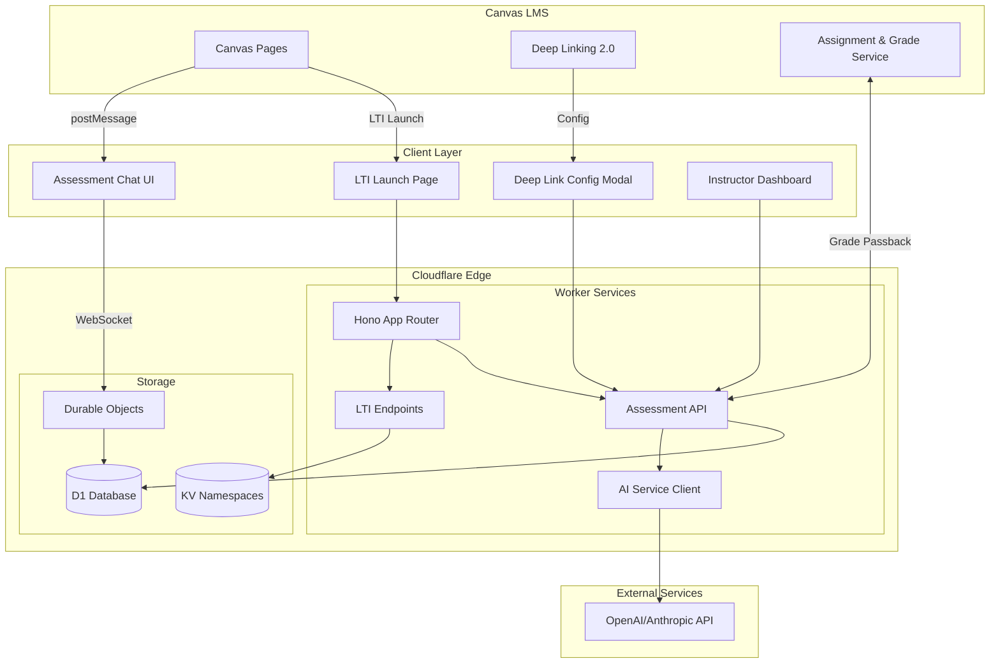
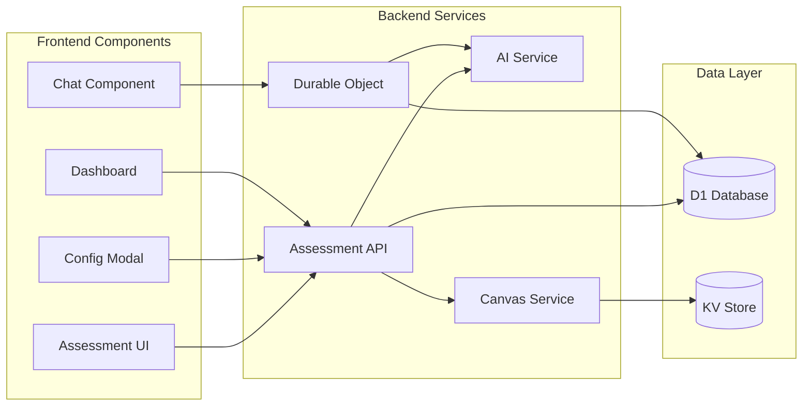
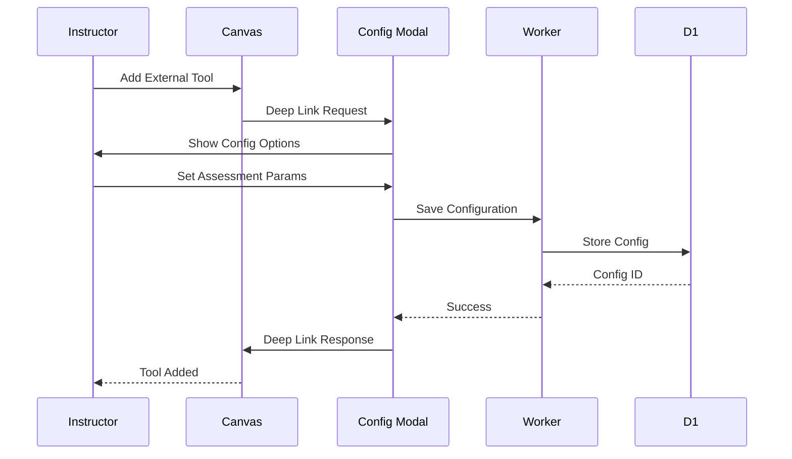
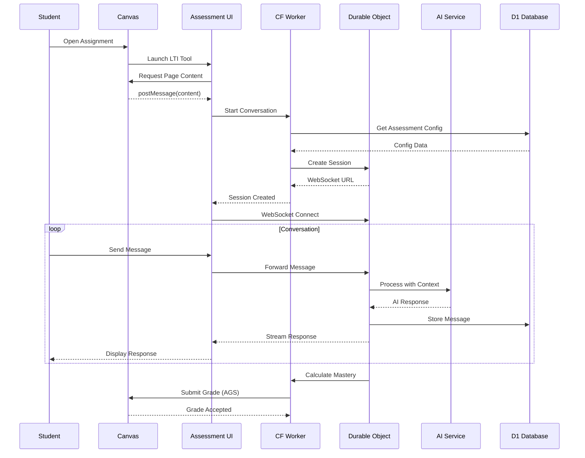
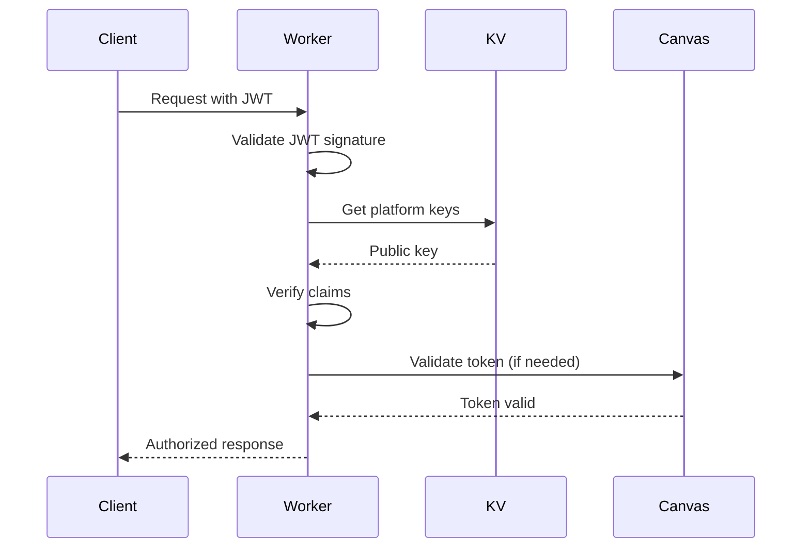
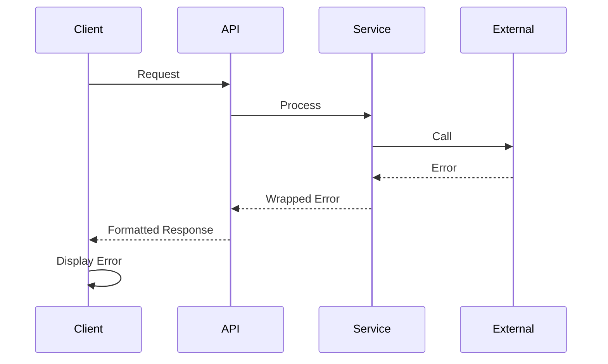

# Atomic Guide Deep Linking Assessment Features Fullstack Architecture Document

**Version:** 1.2
**Date:** 2025-08-22
**Status:** Draft for Review

## 1. Introduction

This document outlines the complete fullstack architecture for Atomic Guide Deep Linking Assessment Features, including backend systems, frontend implementation, and their integration. It serves as the single source of truth for AI-driven development, ensuring consistency across the entire technology stack.

This unified approach combines what would traditionally be separate backend and frontend architecture documents, streamlining the development process for modern fullstack applications where these concerns are increasingly intertwined.

### Starter Template or Existing Project

**Existing Project:** Atomic Guide LTI 1.3 Tool Provider

- **Type:** Brownfield enhancement to production Cloudflare Workers-based LTI tool
- **Repository:** Existing monorepo structure with `/src` for backend and `/client` for frontend
- **Key Constraints:**
  - Must maintain backward compatibility with existing LTI 1.3 authentication flows
  - Preserve current Cloudflare KV namespace structures
  - Extend existing Hono routing patterns
  - Follow established `@atomicjolt/lti-endpoints` integration patterns
  - Build upon current Vite bundling configuration

### Change Log

| Date       | Version | Description                                                                 | Author  |
| ---------- | ------- | --------------------------------------------------------------------------- | ------- |
| 2025-08-22 | 1.0     | Initial architecture for deep linking assessment features based on PRD v1.0 | Winston |
| 2025-08-22 | 1.1     | Added Canvas postMessage integration details and D1 database schema         | Winston |
| 2025-08-22 | 1.2     | Incorporated React migration path for assessment UI components              | Winston |

## 2. High Level Architecture

### Technical Summary

The Atomic Guide Deep Linking Assessment Features extend the existing Cloudflare Workers-based LTI 1.3 tool with AI-powered conversational assessment capabilities delivered through a serverless edge architecture. The frontend leverages a progressive React migration strategy for new assessment components while maintaining vanilla JavaScript for stable existing features, communicating with backend services via WebSocket connections through Durable Objects for real-time chat experiences. Canvas postMessage API integration enables contextual content extraction while deep linking 2.0 provides seamless assessment embedding, all orchestrated through the existing Hono framework extended with new AI service integrations. The architecture achieves the PRD's goals of real-time comprehension feedback and instructor insights while maintaining 99.5% uptime through Cloudflare's global edge network, with Cloudflare D1 providing relational storage for assessment data alongside existing KV namespaces.

### Platform and Infrastructure Choice

**Platform:** Cloudflare Workers + Cloudflare Services
**Key Services:** Workers (compute), KV (config storage), D1 (relational data), Durable Objects (real-time state), R2 (file storage if needed)
**Deployment Host and Regions:** Global edge deployment via Cloudflare's 275+ data centers

### Repository Structure

**Structure:** Existing monorepo with enhancement modules
**Monorepo Tool:** Native npm workspaces (existing)
**Package Organization:**

- `/src` - Backend Worker code with new `/src/assessment` module
- `/client` - Frontend code with new `/client/components/assessment` React components
- `/packages` - Shared types and utilities (to be created for assessment features)

### High Level Architecture Diagram



### Architectural Patterns

- **Serverless Edge Computing:** Cloudflare Workers for global low-latency assessment delivery - _Rationale:_ Maintains existing infrastructure while scaling to handle real-time AI interactions
- **Event-Driven LTI Handlers:** Async processing of LTI events with existing patterns - _Rationale:_ Proven reliability for Canvas integration with minimal changes needed
- **Component-Based UI with Progressive Enhancement:** React for new assessment features, vanilla JS for stable components - _Rationale:_ Allows incremental migration without disrupting existing functionality
- **Repository Pattern for Data Access:** Abstract D1 database operations behind service interfaces - _Rationale:_ Enables testing and potential future database migrations
- **WebSocket via Durable Objects:** Real-time bidirectional communication for chat - _Rationale:_ Cloudflare's native solution for stateful connections at edge
- **Command Query Responsibility Segregation (CQRS):** Separate read/write paths for assessment data - _Rationale:_ Optimizes for high-read instructor dashboards and write-heavy student interactions
- **Backend for Frontend (BFF) Pattern:** Assessment API tailored for UI needs - _Rationale:_ Reduces client complexity and API chattiness for mobile Canvas users

## 3. Tech Stack

| Category             | Technology                          | Version  | Purpose                            | Rationale                                             |
| -------------------- | ----------------------------------- | -------- | ---------------------------------- | ----------------------------------------------------- |
| Frontend Language    | TypeScript                          | 5.3+     | Type-safe frontend development     | Existing codebase standard, prevents runtime errors   |
| Frontend Framework   | React (new) / Vanilla JS (existing) | 18.2+    | UI component development           | Progressive migration path documented in architecture |
| UI Component Library | Custom Atomic Jolt components       | existing | Consistent UI patterns             | Maintains design system consistency                   |
| State Management     | Zustand                             | 4.4+     | Client state for assessment UI     | Lightweight, TypeScript-friendly for chat state       |
| Backend Language     | TypeScript                          | 5.3+     | Type-safe backend development      | Existing Worker codebase standard                     |
| Backend Framework    | Hono                                | 3.11+    | HTTP routing and middleware        | Already integrated with LTI endpoints                 |
| API Style            | REST + WebSocket                    | -        | API communication + real-time chat | REST for CRUD, WebSocket for conversations            |
| Database             | Cloudflare D1 (new) + KV (existing) | latest   | Relational + key-value storage     | D1 for assessment data, KV for LTI config             |
| Cache                | Cloudflare KV + Worker Cache API    | latest   | Response caching                   | Existing caching infrastructure                       |
| File Storage         | Cloudflare R2 (if needed)           | latest   | Assessment media storage           | Cost-effective for generated content                  |
| Authentication       | LTI 1.3 JWT                         | existing | User authentication                | Existing OAuth2/JWT implementation                    |
| Frontend Testing     | Vitest                              | 1.0+     | Unit/integration testing           | Existing test framework                               |
| Backend Testing      | Vitest                              | 1.0+     | Worker testing                     | Consistent with frontend                              |
| E2E Testing          | Playwright                          | 1.40+    | End-to-end testing                 | Canvas iframe testing support                         |
| Build Tool           | Vite                                | 5.0+     | Asset bundling                     | Existing build configuration                          |
| Bundler              | Vite/Rollup                         | 5.0+     | Module bundling                    | Part of Vite toolchain                                |
| IaC Tool             | Wrangler                            | 3.22+    | Cloudflare deployment              | Existing deployment tool                              |
| CI/CD                | GitHub Actions                      | -        | Automated deployment               | Existing CI/CD pipeline                               |
| Monitoring           | Cloudflare Analytics + Tail logs    | latest   | Performance monitoring             | Built-in Worker monitoring                            |
| Logging              | Cloudflare Logpush                  | latest   | Centralized logging                | Production log aggregation                            |
| CSS Framework        | Tailwind CSS (optional)             | 3.3+     | Utility-first styling              | Rapid assessment UI development                       |

## 4. Data Models

### Conversation Model

**Purpose:** Represents an assessment conversation session between student and AI

**Key Attributes:**

- id: string (UUID) - Unique conversation identifier
- assessment_config_id: string - Reference to assessment configuration
- user_id: string - LTI user identifier
- course_id: string - Canvas course identifier
- status: enum - active, completed, abandoned
- started_at: timestamp - Conversation start time
- completed_at: timestamp - Completion time
- mastery_score: number - Current mastery level (0-100)

#### TypeScript Interface

```typescript
interface Conversation {
  id: string;
  assessment_config_id: string;
  user_id: string;
  course_id: string;
  status: 'active' | 'completed' | 'abandoned';
  started_at: Date;
  completed_at?: Date;
  mastery_score: number;
  metadata: {
    page_content_hash?: string;
    canvas_assignment_id?: string;
  };
}
```

#### Relationships

- Has many ConversationMessages
- Belongs to AssessmentConfig
- Has one StudentProgress

### AssessmentConfig Model

**Purpose:** Instructor-defined configuration for deep-linked assessment

**Key Attributes:**

- id: string (UUID) - Configuration identifier
- platform_id: string - LTI platform identifier
- resource_link_id: string - Deep linking resource ID
- assessment_type: enum - chat, flashcards, fill_blank
- mastery_threshold: number - Required score (70-100)
- grading_schema: enum - mastery, percentage, engagement

#### TypeScript Interface

```typescript
interface AssessmentConfig {
  id: string;
  platform_id: string;
  resource_link_id: string;
  assessment_type: 'chat' | 'flashcards' | 'fill_blank';
  mastery_threshold: number;
  grading_schema: 'mastery' | 'percentage' | 'engagement';
  ai_config: {
    temperature: number;
    max_tokens: number;
    system_prompt?: string;
  };
  created_by: string;
  created_at: Date;
  updated_at: Date;
}
```

#### Relationships

- Has many Conversations
- Has many GeneratedContent items
- Belongs to Platform (via KV)

### ConversationMessage Model

**Purpose:** Individual message in assessment conversation

**Key Attributes:**

- id: string - Message identifier
- conversation_id: string - Parent conversation
- role: enum - user, assistant, system
- content: string - Message text
- metadata: object - Context, references

#### TypeScript Interface

```typescript
interface ConversationMessage {
  id: string;
  conversation_id: string;
  role: 'user' | 'assistant' | 'system';
  content: string;
  metadata?: {
    content_references?: string[];
    confidence_score?: number;
    remediation_provided?: boolean;
  };
  created_at: Date;
}
```

#### Relationships

- Belongs to Conversation

### StudentProgress Model

**Purpose:** Tracks individual student progress across assessments

**Key Attributes:**

- id: string - Progress record identifier
- user_id: string - Student LTI identifier
- course_id: string - Canvas course ID
- total_assessments: number - Count of attempted assessments
- average_mastery: number - Average mastery score
- struggle_patterns: object - Identified learning gaps

#### TypeScript Interface

```typescript
interface StudentProgress {
  id: string;
  user_id: string;
  course_id: string;
  total_assessments: number;
  average_mastery: number;
  struggle_patterns: {
    concepts: string[];
    remediation_count: number;
  };
  last_activity: Date;
}
```

## 5. API Specification

### REST API Specification

```yaml
openapi: 3.0.0
info:
  title: Atomic Guide Assessment API
  version: 1.0.0
  description: Deep linking assessment endpoints for Canvas LTI integration
servers:
  - url: https://atomic-guide.atomicjolt.com/api
    description: Production API

paths:
  /assessment/config:
    post:
      summary: Create assessment configuration
      security:
        - ltiJWT: []
      requestBody:
        required: true
        content:
          application/json:
            schema:
              $ref: '#/components/schemas/AssessmentConfig'
      responses:
        201:
          description: Configuration created
          content:
            application/json:
              schema:
                $ref: '#/components/schemas/AssessmentConfig'

  /assessment/config/{id}:
    get:
      summary: Get assessment configuration
      security:
        - ltiJWT: []
      parameters:
        - in: path
          name: id
          required: true
          schema:
            type: string
      responses:
        200:
          description: Configuration retrieved

  /assessment/conversation:
    post:
      summary: Start new conversation
      security:
        - ltiJWT: []
      requestBody:
        required: true
        content:
          application/json:
            schema:
              type: object
              properties:
                assessment_config_id:
                  type: string
                page_content:
                  type: string
      responses:
        201:
          description: Conversation started
          content:
            application/json:
              schema:
                type: object
                properties:
                  conversation_id:
                    type: string
                  websocket_url:
                    type: string

  /assessment/conversation/{id}/message:
    post:
      summary: Send message in conversation
      security:
        - ltiJWT: []
      parameters:
        - in: path
          name: id
          required: true
          schema:
            type: string
      requestBody:
        required: true
        content:
          application/json:
            schema:
              type: object
              properties:
                message:
                  type: string
                context:
                  type: object
      responses:
        200:
          description: Message processed

  /assessment/grade:
    post:
      summary: Submit grade to Canvas AGS
      security:
        - ltiJWT: []
      requestBody:
        required: true
        content:
          application/json:
            schema:
              type: object
              properties:
                conversation_id:
                  type: string
                score:
                  type: number
      responses:
        200:
          description: Grade submitted

  /assessment/analytics:
    get:
      summary: Get instructor analytics
      security:
        - ltiJWT: []
      parameters:
        - in: query
          name: course_id
          schema:
            type: string
        - in: query
          name: assignment_id
          schema:
            type: string
      responses:
        200:
          description: Analytics data
          content:
            application/json:
              schema:
                type: object
                properties:
                  student_progress:
                    type: array
                  common_misconceptions:
                    type: array
                  completion_rates:
                    type: object

components:
  schemas:
    AssessmentConfig:
      type: object
      required:
        - assessment_type
        - mastery_threshold
        - grading_schema
      properties:
        assessment_type:
          type: string
          enum: [chat, flashcards, fill_blank]
        mastery_threshold:
          type: number
          minimum: 70
          maximum: 100
        grading_schema:
          type: string
          enum: [mastery, percentage, engagement]
        ai_config:
          type: object
          properties:
            temperature:
              type: number
            max_tokens:
              type: integer
            system_prompt:
              type: string

  securitySchemes:
    ltiJWT:
      type: http
      scheme: bearer
      bearerFormat: JWT
```

## 6. Components

### AI Assessment Service

**Responsibility:** Manages AI interactions for generating assessment content and processing student responses

**Key Interfaces:**

- `generateAssessmentContent(context: PageContent): Promise<AssessmentActivity>`
- `processStudentResponse(message: string, context: ConversationContext): Promise<AIResponse>`
- `evaluateMastery(conversation: Conversation): MasteryScore`

**Dependencies:** OpenAI/Anthropic API client, D1 database, Content extraction service

**Technology Stack:** TypeScript, Cloudflare Workers, streaming responses via TransformStream

### Canvas Integration Service

**Responsibility:** Handles all Canvas LMS interactions including deep linking, content extraction, and grade passback

**Key Interfaces:**

- `extractPageContent(messageData: PostMessage): PageContent`
- `submitGrade(score: number, assignmentId: string): Promise<void>`
- `getNameAndRoles(contextId: string): Promise<Roster>`

**Dependencies:** LTI service, Canvas API client, OAuth token management

**Technology Stack:** TypeScript, @atomicjolt/lti-endpoints, Canvas REST API

### Conversation Manager (Durable Object)

**Responsibility:** Maintains real-time conversation state and WebSocket connections for chat sessions

**Key Interfaces:**

- `handleWebSocketUpgrade(request: Request): Response`
- `processMessage(message: ChatMessage): Promise<void>`
- `syncToDatabase(): Promise<void>`

**Dependencies:** AI Assessment Service, D1 database, WebSocket API

**Technology Stack:** Cloudflare Durable Objects, WebSocket, TypeScript

### Assessment UI Components

**Responsibility:** React components for chat interface, configuration modal, and instructor dashboard

**Key Interfaces:**

- `<ChatAssessment />` - Main chat interface component
- `<DeepLinkConfig />` - Instructor configuration modal
- `<AnalyticsDashboard />` - Real-time progress visualization

**Dependencies:** WebSocket client, Canvas postMessage API, React hooks

**Technology Stack:** React 18, TypeScript, Zustand for state, Tailwind CSS

### Component Diagrams



## 7. External APIs

### OpenAI API

- **Purpose:** Generate assessment questions and process student responses
- **Documentation:** https://platform.openai.com/docs/api-reference
- **Base URL(s):** https://api.openai.com/v1
- **Authentication:** Bearer token (API key)
- **Rate Limits:** 3,500 RPM for GPT-4, 90,000 TPM

**Key Endpoints Used:**

- `POST /chat/completions` - Generate assessment content and responses

**Integration Notes:** Use streaming responses for real-time chat experience, implement exponential backoff for rate limiting

### Canvas LMS API

- **Purpose:** Grade passback and roster retrieval
- **Documentation:** https://canvas.instructure.com/doc/api/
- **Base URL(s):** https://{institution}.instructure.com/api/v1
- **Authentication:** OAuth2 bearer token via LTI
- **Rate Limits:** Variable by institution (typically 700/hour)

**Key Endpoints Used:**

- `POST /api/lti/courses/{course_id}/line_items` - Create gradebook columns
- `POST /api/lti/courses/{course_id}/line_items/{line_item_id}/scores` - Submit grades
- `GET /api/lti/courses/{course_id}/names_and_roles` - Get course roster

**Integration Notes:** Cache roster data in KV, implement request queuing for rate limit management

## 8. Core Workflows

### Deep Link Configuration Workflow



### Student Assessment Workflow



## 9. Database Schema

### D1 Database Schema (SQL)

```sql
-- Assessment configuration table
CREATE TABLE assessment_configs (
    id TEXT PRIMARY KEY,
    platform_id TEXT NOT NULL,
    resource_link_id TEXT NOT NULL,
    assessment_type TEXT CHECK(assessment_type IN ('chat', 'flashcards', 'fill_blank')),
    mastery_threshold REAL DEFAULT 80,
    grading_schema TEXT CHECK(grading_schema IN ('mastery', 'percentage', 'engagement')),
    ai_config JSON,
    created_by TEXT NOT NULL,
    created_at DATETIME DEFAULT CURRENT_TIMESTAMP,
    updated_at DATETIME DEFAULT CURRENT_TIMESTAMP,
    UNIQUE(platform_id, resource_link_id)
);

-- Conversations table
CREATE TABLE conversations (
    id TEXT PRIMARY KEY,
    assessment_config_id TEXT NOT NULL,
    user_id TEXT NOT NULL,
    course_id TEXT NOT NULL,
    status TEXT CHECK(status IN ('active', 'completed', 'abandoned')),
    started_at DATETIME DEFAULT CURRENT_TIMESTAMP,
    completed_at DATETIME,
    mastery_score REAL DEFAULT 0,
    metadata JSON,
    FOREIGN KEY (assessment_config_id) REFERENCES assessment_configs(id),
    INDEX idx_user_course (user_id, course_id),
    INDEX idx_status (status)
);

-- Conversation messages table
CREATE TABLE conversation_messages (
    id TEXT PRIMARY KEY,
    conversation_id TEXT NOT NULL,
    role TEXT CHECK(role IN ('user', 'assistant', 'system')),
    content TEXT NOT NULL,
    metadata JSON,
    created_at DATETIME DEFAULT CURRENT_TIMESTAMP,
    FOREIGN KEY (conversation_id) REFERENCES conversations(id) ON DELETE CASCADE,
    INDEX idx_conversation (conversation_id)
);

-- Student progress tracking
CREATE TABLE student_progress (
    id TEXT PRIMARY KEY,
    user_id TEXT NOT NULL,
    course_id TEXT NOT NULL,
    total_assessments INTEGER DEFAULT 0,
    average_mastery REAL DEFAULT 0,
    struggle_patterns JSON,
    last_activity DATETIME DEFAULT CURRENT_TIMESTAMP,
    UNIQUE(user_id, course_id),
    INDEX idx_course (course_id)
);

-- Generated content cache
CREATE TABLE generated_content (
    id TEXT PRIMARY KEY,
    assessment_config_id TEXT NOT NULL,
    content_hash TEXT NOT NULL,
    content_type TEXT,
    content JSON NOT NULL,
    approved BOOLEAN DEFAULT FALSE,
    created_at DATETIME DEFAULT CURRENT_TIMESTAMP,
    FOREIGN KEY (assessment_config_id) REFERENCES assessment_configs(id),
    UNIQUE(assessment_config_id, content_hash)
);

-- Analytics aggregation table
CREATE TABLE analytics_snapshots (
    id TEXT PRIMARY KEY,
    course_id TEXT NOT NULL,
    assignment_id TEXT,
    snapshot_data JSON NOT NULL,
    created_at DATETIME DEFAULT CURRENT_TIMESTAMP,
    INDEX idx_course_assignment (course_id, assignment_id)
);
```

## 10. Frontend Architecture

### Component Architecture

#### Component Organization

```
client/
├── components/
│   ├── assessment/
│   │   ├── ChatAssessment/
│   │   │   ├── ChatAssessment.tsx
│   │   │   ├── ChatMessage.tsx
│   │   │   ├── ChatInput.tsx
│   │   │   └── index.ts
│   │   ├── DeepLinkConfig/
│   │   │   ├── DeepLinkConfig.tsx
│   │   │   ├── AssessmentTypeSelector.tsx
│   │   │   ├── GradingSchemaConfig.tsx
│   │   │   └── index.ts
│   │   ├── Dashboard/
│   │   │   ├── AnalyticsDashboard.tsx
│   │   │   ├── ProgressChart.tsx
│   │   │   ├── MisconceptionsList.tsx
│   │   │   └── index.ts
│   │   └── shared/
│   │       ├── LoadingSpinner.tsx
│   │       ├── ErrorBoundary.tsx
│   │       └── Modal.tsx
│   └── legacy/           # Existing vanilla JS components
├── hooks/
│   ├── useWebSocket.ts
│   ├── useCanvasPostMessage.ts
│   ├── useAssessmentConfig.ts
│   └── useLTIContext.ts
├── services/
│   ├── api/
│   │   ├── assessmentApi.ts
│   │   ├── analyticsApi.ts
│   │   └── apiClient.ts
│   └── websocket/
│       └── conversationSocket.ts
├── stores/
│   ├── conversationStore.ts
│   ├── configStore.ts
│   └── analyticsStore.ts
└── utils/
    ├── canvasIntegration.ts
    ├── gradeCalculator.ts
    └── contentExtractor.ts
```

#### Component Template

```typescript
// Example: ChatAssessment component
import React, { useEffect, useState } from 'react';
import { useWebSocket } from '@/hooks/useWebSocket';
import { useConversationStore } from '@/stores/conversationStore';
import { ChatMessage } from './ChatMessage';
import { ChatInput } from './ChatInput';

interface ChatAssessmentProps {
  assessmentConfigId: string;
  pageContent: string;
}

export const ChatAssessment: React.FC<ChatAssessmentProps> = ({
  assessmentConfigId,
  pageContent
}) => {
  const { messages, addMessage, setMastery } = useConversationStore();
  const { sendMessage, isConnected } = useWebSocket();

  const handleSendMessage = async (content: string) => {
    await sendMessage({
      type: 'chat',
      content,
      context: { pageContent }
    });
  };

  return (
    <div className="chat-assessment">
      <div className="chat-messages">
        {messages.map(msg => (
          <ChatMessage key={msg.id} message={msg} />
        ))}
      </div>
      <ChatInput
        onSend={handleSendMessage}
        disabled={!isConnected}
      />
    </div>
  );
};
```

### State Management Architecture

#### State Structure

```typescript
// Zustand store for conversation state
interface ConversationState {
  conversationId: string | null;
  messages: Message[];
  masteryScore: number;
  status: 'idle' | 'active' | 'completed';

  // Actions
  initConversation: (configId: string) => Promise<void>;
  addMessage: (message: Message) => void;
  updateMastery: (score: number) => void;
  completeConversation: () => void;
}

// Zustand store definition
import { create } from 'zustand';

export const useConversationStore = create<ConversationState>((set, get) => ({
  conversationId: null,
  messages: [],
  masteryScore: 0,
  status: 'idle',

  initConversation: async (configId) => {
    const response = await assessmentApi.startConversation(configId);
    set({
      conversationId: response.conversationId,
      status: 'active',
    });
  },

  addMessage: (message) => {
    set((state) => ({
      messages: [...state.messages, message],
    }));
  },

  updateMastery: (score) => {
    set({ masteryScore: score });
  },

  completeConversation: () => {
    set({ status: 'completed' });
  },
}));
```

#### State Management Patterns

- Use Zustand for global state (conversation, config, analytics)
- Local component state for UI-only concerns
- Derive computed values using selectors
- Implement optimistic updates for chat messages
- Persist critical state to sessionStorage for recovery

### Routing Architecture

#### Route Organization

```
/lti/launch                    # Existing LTI launch page
/lti/deep_link                 # Deep link configuration
/assessment/chat/:id           # Chat assessment interface
/assessment/dashboard          # Instructor analytics dashboard
/assessment/config/:id/edit    # Edit assessment configuration
```

#### Protected Route Pattern

```typescript
// Protected route wrapper for instructor-only pages
import { Navigate } from 'react-router-dom';
import { useLTIContext } from '@/hooks/useLTIContext';

interface ProtectedRouteProps {
  children: React.ReactNode;
  requireRole?: 'instructor' | 'student';
}

export const ProtectedRoute: React.FC<ProtectedRouteProps> = ({
  children,
  requireRole
}) => {
  const { user, isLoading } = useLTIContext();

  if (isLoading) return <LoadingSpinner />;

  if (!user) {
    return <Navigate to="/lti/launch" replace />;
  }

  if (requireRole && user.role !== requireRole) {
    return <Navigate to="/unauthorized" replace />;
  }

  return <>{children}</>;
};
```

### Frontend Services Layer

#### API Client Setup

```typescript
// Base API client configuration
import axios from 'axios';

const API_BASE_URL = import.meta.env.VITE_API_URL || '/api';

export const apiClient = axios.create({
  baseURL: API_BASE_URL,
  headers: {
    'Content-Type': 'application/json',
  },
});

// Add LTI JWT token to requests
apiClient.interceptors.request.use((config) => {
  const token = sessionStorage.getItem('lti_token');
  if (token) {
    config.headers.Authorization = `Bearer ${token}`;
  }
  return config;
});

// Handle errors globally
apiClient.interceptors.response.use(
  (response) => response,
  (error) => {
    if (error.response?.status === 401) {
      window.location.href = '/lti/launch';
    }
    return Promise.reject(error);
  },
);
```

#### Service Example

```typescript
// Assessment API service
export const assessmentApi = {
  async createConfig(config: AssessmentConfig) {
    const { data } = await apiClient.post('/assessment/config', config);
    return data;
  },

  async startConversation(configId: string, pageContent: string) {
    const { data } = await apiClient.post('/assessment/conversation', {
      assessment_config_id: configId,
      page_content: pageContent,
    });
    return data;
  },

  async submitGrade(conversationId: string, score: number) {
    const { data } = await apiClient.post('/assessment/grade', {
      conversation_id: conversationId,
      score,
    });
    return data;
  },

  async getAnalytics(courseId: string, assignmentId?: string) {
    const { data } = await apiClient.get('/assessment/analytics', {
      params: { course_id: courseId, assignment_id: assignmentId },
    });
    return data;
  },
};
```

## 11. Backend Architecture

### Service Architecture

#### Function Organization

```
src/
├── assessment/
│   ├── handlers/
│   │   ├── configHandler.ts
│   │   ├── conversationHandler.ts
│   │   ├── gradeHandler.ts
│   │   └── analyticsHandler.ts
│   ├── services/
│   │   ├── aiService.ts
│   │   ├── canvasService.ts
│   │   ├── assessmentService.ts
│   │   └── gradingService.ts
│   ├── repositories/
│   │   ├── conversationRepository.ts
│   │   ├── configRepository.ts
│   │   └── progressRepository.ts
│   ├── durable-objects/
│   │   └── ConversationManager.ts
│   └── routes.ts
├── middleware/
│   ├── ltiAuth.ts          # Existing
│   └── errorHandler.ts     # Existing
└── index.ts                 # Main Hono app
```

#### Function Template

```typescript
// Handler template for assessment endpoints
import { Context } from 'hono';
import { assessmentService } from '../services/assessmentService';
import { validateRequest } from '../utils/validation';

export async function createConfigHandler(c: Context) {
  try {
    // Extract and validate request
    const body = await c.req.json();
    const validation = validateRequest(body, configSchema);
    if (!validation.valid) {
      return c.json({ error: validation.errors }, 400);
    }

    // Get LTI context from middleware
    const ltiContext = c.get('ltiContext');

    // Process request
    const config = await assessmentService.createConfig({
      ...body,
      platform_id: ltiContext.platform_id,
      created_by: ltiContext.user_id,
    });

    // Return response
    return c.json(config, 201);
  } catch (error) {
    console.error('Config creation error:', error);
    return c.json(
      {
        error: 'Failed to create configuration',
      },
      500,
    );
  }
}
```

### Database Architecture

#### Schema Design

```sql
-- Already defined in section 9
-- See D1 Database Schema above
```

#### Data Access Layer

```typescript
// Repository pattern for database access
export class ConversationRepository {
  constructor(private db: D1Database) {}

  async create(conversation: Omit<Conversation, 'id'>): Promise<Conversation> {
    const id = crypto.randomUUID();
    const result = await this.db
      .prepare(
        `
        INSERT INTO conversations
        (id, assessment_config_id, user_id, course_id, status, metadata)
        VALUES (?, ?, ?, ?, ?, ?)
      `,
      )
      .bind(
        id,
        conversation.assessment_config_id,
        conversation.user_id,
        conversation.course_id,
        'active',
        JSON.stringify(conversation.metadata || {}),
      )
      .run();

    return { id, ...conversation, status: 'active' };
  }

  async findById(id: string): Promise<Conversation | null> {
    const result = await this.db.prepare('SELECT * FROM conversations WHERE id = ?').bind(id).first();

    if (!result) return null;

    return {
      ...result,
      metadata: JSON.parse(result.metadata as string),
    } as Conversation;
  }

  async updateMastery(id: string, score: number): Promise<void> {
    await this.db.prepare('UPDATE conversations SET mastery_score = ? WHERE id = ?').bind(score, id).run();
  }
}
```

### Authentication and Authorization

#### Auth Flow



#### Middleware/Guards

```typescript
// LTI authentication middleware (extends existing)
export async function ltiAuthMiddleware(c: Context, next: Next) {
  const authHeader = c.req.header('Authorization');
  if (!authHeader?.startsWith('Bearer ')) {
    return c.json({ error: 'Missing authorization' }, 401);
  }

  const token = authHeader.substring(7);

  try {
    // Verify JWT using existing LTI service
    const claims = await ltiService.verifyJWT(token);

    // Add claims to context
    c.set('ltiContext', {
      user_id: claims.sub,
      platform_id: claims.iss,
      course_id: claims['https://purl.imsglobal.org/spec/lti/claim/context'].id,
      roles: claims['https://purl.imsglobal.org/spec/lti/claim/roles'],
      is_instructor: claims['https://purl.imsglobal.org/spec/lti/claim/roles'].includes(
        'http://purl.imsglobal.org/vocab/lis/v2/membership#Instructor',
      ),
    });

    await next();
  } catch (error) {
    return c.json({ error: 'Invalid token' }, 401);
  }
}
```

## 12. Unified Project Structure

```
atomic-guide/
├── .github/                    # CI/CD workflows
│   └── workflows/
│       ├── ci.yaml
│       └── deploy.yaml
├── src/                        # Backend (Cloudflare Worker)
│   ├── assessment/             # New assessment module
│   │   ├── handlers/
│   │   ├── services/
│   │   ├── repositories/
│   │   ├── durable-objects/
│   │   └── routes.ts
│   ├── middleware/             # Existing + new middleware
│   ├── services/               # Existing services
│   ├── utils/                  # Shared utilities
│   └── index.ts                # Main Hono app
├── client/                     # Frontend
│   ├── components/
│   │   ├── assessment/         # New React components
│   │   └── legacy/             # Existing vanilla JS
│   ├── hooks/                  # React hooks
│   ├── services/               # API clients
│   ├── stores/                 # Zustand stores
│   ├── utils/
│   ├── app.ts                  # Existing entry
│   ├── app-init.ts             # Existing OIDC
│   └── assessment.tsx          # New assessment entry
├── packages/                   # Shared packages (new)
│   └── shared/
│       ├── src/
│       │   ├── types/          # TypeScript interfaces
│       │   │   ├── assessment.ts
│       │   │   ├── conversation.ts
│       │   │   └── index.ts
│       │   └── constants/      # Shared constants
│       └── package.json
├── migrations/                 # D1 migrations (new)
│   ├── 001_initial_schema.sql
│   └── 002_add_analytics.sql
├── tests/
│   ├── unit/
│   ├── integration/
│   └── e2e/
├── docs/
│   ├── prd.md
│   ├── brief.md
│   └── deep-linking-assessment-architecture.md
├── public/                     # Static assets
├── .env.example
├── wrangler.jsonc              # Cloudflare config
├── package.json
├── tsconfig.json
├── vite.config.ts
└── README.md
```

## 13. Development Workflow

### Local Development Setup

#### Prerequisites

```bash
# Required tools
node --version  # v18+ required
npm --version   # v9+ required
wrangler --version  # v3.22+ required
```

#### Initial Setup

```bash
# Clone repository
git clone https://github.com/atomicjolt/atomic-guide.git
cd atomic-guide

# Install dependencies
npm install

# Create D1 database
npx wrangler d1 create atomic-guide-assessment

# Run migrations
npx wrangler d1 execute atomic-guide-assessment --file=./migrations/001_initial_schema.sql

# Copy environment variables
cp .env.example .env.local
# Edit .env.local with your API keys
```

#### Development Commands

```bash
# Start all services
npm run dev

# Start frontend only
npm run dev:client

# Start backend only
npm run dev:worker

# Run tests
npm test                    # All tests
npm run test:unit          # Unit tests only
npm run test:integration   # Integration tests
npm run test:e2e          # E2E tests
```

### Environment Configuration

#### Required Environment Variables

```bash
# Frontend (.env.local)
VITE_API_URL=http://localhost:8787/api
VITE_CANVAS_DOMAIN=your-institution.instructure.com
VITE_WS_URL=ws://localhost:8787

# Backend (.env)
OPENAI_API_KEY=sk-...
D1_DATABASE_ID=your-d1-database-id
ENVIRONMENT=development

# Shared
LTI_KEY=your-lti-key
LTI_SECRET=your-lti-secret
```

## 14. Deployment Architecture

### Deployment Strategy

**Frontend Deployment:**

- **Platform:** Cloudflare Pages (integrated with Workers)
- **Build Command:** `npm run build:client`
- **Output Directory:** `dist/client`
- **CDN/Edge:** Cloudflare's global CDN

**Backend Deployment:**

- **Platform:** Cloudflare Workers
- **Build Command:** `npm run build`
- **Deployment Method:** Wrangler CLI / GitHub Actions

### CI/CD Pipeline

```yaml
# .github/workflows/deploy.yaml
name: Deploy to Cloudflare

on:
  push:
    branches: [main]
  pull_request:
    branches: [main]

jobs:
  test:
    runs-on: ubuntu-latest
    steps:
      - uses: actions/checkout@v3
      - uses: actions/setup-node@v3
        with:
          node-version: '18'
      - run: npm ci
      - run: npm test
      - run: npm run typecheck

  deploy:
    needs: test
    if: github.ref == 'refs/heads/main'
    runs-on: ubuntu-latest
    steps:
      - uses: actions/checkout@v3
      - uses: actions/setup-node@v3
        with:
          node-version: '18'
      - run: npm ci
      - run: npm run build
      - name: Deploy to Cloudflare
        uses: cloudflare/wrangler-action@v3
        with:
          apiToken: ${{ secrets.CLOUDFLARE_API_TOKEN }}
          command: deploy
```

### Environments

| Environment | Frontend URL                           | Backend URL                              | Purpose                |
| ----------- | -------------------------------------- | ---------------------------------------- | ---------------------- |
| Development | http://localhost:5173                  | http://localhost:8787                    | Local development      |
| Staging     | https://staging.atomic-guide.pages.dev | https://staging.atomic-guide.workers.dev | Pre-production testing |
| Production  | https://atomic-guide.atomicjolt.com    | https://api.atomic-guide.atomicjolt.com  | Live environment       |

## 15. Security and Performance

### Security Requirements

**Frontend Security:**

- CSP Headers: `default-src 'self'; script-src 'self' 'unsafe-inline'; connect-src 'self' https://api.openai.com`
- XSS Prevention: React's automatic escaping, sanitize user input with DOMPurify
- Secure Storage: JWT in sessionStorage (not localStorage), sensitive data encrypted

**Backend Security:**

- Input Validation: Zod schemas for all endpoints
- Rate Limiting: 100 requests/minute per user using Cloudflare Rate Limiting
- CORS Policy: Restrict to Canvas domains and localhost for development

**Authentication Security:**

- Token Storage: sessionStorage for JWT, httpOnly cookies for refresh tokens
- Session Management: 24-hour token expiry, automatic refresh
- Password Policy: N/A - using LTI authentication

### Performance Optimization

**Frontend Performance:**

- Bundle Size Target: <200KB gzipped for assessment components
- Loading Strategy: Code splitting by route, lazy load assessment UI
- Caching Strategy: Service Worker for static assets, 1-hour cache for API responses

**Backend Performance:**

- Response Time Target: <100ms for API, <3s for AI responses
- Database Optimization: Indexes on frequently queried columns, connection pooling
- Caching Strategy: KV cache for config data (5 min TTL), Edge cache for static responses

## 16. Testing Strategy

### Testing Pyramid

```
         E2E Tests (10%)
        /              \
    Integration Tests (30%)
   /                      \
Frontend Unit (30%)  Backend Unit (30%)
```

### Test Organization

#### Frontend Tests

```
tests/
├── unit/
│   ├── components/
│   │   └── ChatAssessment.test.tsx
│   ├── hooks/
│   │   └── useWebSocket.test.ts
│   └── services/
│       └── assessmentApi.test.ts
├── integration/
│   └── assessment-flow.test.tsx
```

#### Backend Tests

```
tests/
├── unit/
│   ├── handlers/
│   │   └── configHandler.test.ts
│   ├── services/
│   │   └── aiService.test.ts
│   └── repositories/
│       └── conversationRepository.test.ts
├── integration/
│   └── api-endpoints.test.ts
```

#### E2E Tests

```
tests/
└── e2e/
    ├── deep-linking.spec.ts
    ├── student-assessment.spec.ts
    └── instructor-dashboard.spec.ts
```

### Test Examples

#### Frontend Component Test

```typescript
import { render, screen, fireEvent } from '@testing-library/react';
import { ChatAssessment } from '@/components/assessment/ChatAssessment';

describe('ChatAssessment', () => {
  it('sends message when input submitted', async () => {
    const mockSend = vi.fn();
    vi.mock('@/hooks/useWebSocket', () => ({
      useWebSocket: () => ({ sendMessage: mockSend, isConnected: true })
    }));

    render(<ChatAssessment assessmentConfigId="123" pageContent="test" />);

    const input = screen.getByRole('textbox');
    const button = screen.getByRole('button', { name: /send/i });

    fireEvent.change(input, { target: { value: 'Test message' } });
    fireEvent.click(button);

    expect(mockSend).toHaveBeenCalledWith({
      type: 'chat',
      content: 'Test message',
      context: { pageContent: 'test' }
    });
  });
});
```

#### Backend API Test

```typescript
import { describe, it, expect } from 'vitest';
import { createConfigHandler } from '@/assessment/handlers/configHandler';

describe('Config Handler', () => {
  it('creates assessment configuration', async () => {
    const mockContext = {
      req: {
        json: () =>
          Promise.resolve({
            assessment_type: 'chat',
            mastery_threshold: 80,
            grading_schema: 'mastery',
          }),
      },
      get: () => ({ platform_id: 'test', user_id: 'instructor1' }),
      json: vi.fn(),
    };

    await createConfigHandler(mockContext as any);

    expect(mockContext.json).toHaveBeenCalledWith(
      expect.objectContaining({
        assessment_type: 'chat',
        mastery_threshold: 80,
      }),
      201,
    );
  });
});
```

#### E2E Test

```typescript
import { test, expect } from '@playwright/test';

test('instructor can configure deep link assessment', async ({ page }) => {
  // Launch from Canvas
  await page.goto('/lti/launch?token=test-token');

  // Navigate to deep link config
  await page.click('text=Configure Assessment');

  // Set configuration
  await page.selectOption('#assessment-type', 'chat');
  await page.fill('#mastery-threshold', '75');
  await page.selectOption('#grading-schema', 'mastery');

  // Save configuration
  await page.click('button:has-text("Save")');

  // Verify success
  await expect(page.locator('.success-message')).toBeVisible();
  await expect(page.locator('.success-message')).toContainText('Configuration saved');
});
```

## 17. Coding Standards

### Critical Fullstack Rules

- **Type Sharing:** Always define types in packages/shared and import from there
- **API Calls:** Never make direct HTTP calls - use the service layer
- **Environment Variables:** Access only through config objects, never process.env directly
- **Error Handling:** All API routes must use the standard error handler
- **State Updates:** Never mutate state directly - use proper state management patterns
- **Canvas Integration:** Always use postMessage API for content extraction, never scrape DOM
- **AI Responses:** Always implement streaming for chat responses to maintain UX
- **Database Access:** Use repository pattern, never direct D1 queries in handlers
- **WebSocket State:** Manage through Durable Objects only, not in Worker memory
- **Grade Calculations:** Use shared grading service for consistency across components

### Naming Conventions

| Element               | Frontend             | Backend          | Example                  |
| --------------------- | -------------------- | ---------------- | ------------------------ |
| Components            | PascalCase           | -                | `ChatAssessment.tsx`     |
| Hooks                 | camelCase with 'use' | -                | `useWebSocket.ts`        |
| API Routes            | -                    | kebab-case       | `/api/assessment-config` |
| Database Tables       | -                    | snake_case       | `conversation_messages`  |
| TypeScript Interfaces | PascalCase           | PascalCase       | `AssessmentConfig`       |
| Constants             | UPPER_SNAKE_CASE     | UPPER_SNAKE_CASE | `MAX_RETRY_ATTEMPTS`     |

## 18. Error Handling Strategy

### Error Flow



### Error Response Format

```typescript
interface ApiError {
  error: {
    code: string;
    message: string;
    details?: Record<string, any>;
    timestamp: string;
    requestId: string;
  };
}
```

### Frontend Error Handling

```typescript
// Global error boundary for React components
export class ErrorBoundary extends Component {
  state = { hasError: false, error: null };

  static getDerivedStateFromError(error: Error) {
    return { hasError: true, error };
  }

  componentDidCatch(error: Error, info: ErrorInfo) {
    console.error('Component error:', error, info);
    // Send to monitoring service
  }

  render() {
    if (this.state.hasError) {
      return <ErrorFallback error={this.state.error} />;
    }
    return this.props.children;
  }
}
```

### Backend Error Handling

```typescript
// Centralized error handler middleware
export function errorHandler(err: Error, c: Context) {
  const requestId = crypto.randomUUID();

  console.error(`[${requestId}] Error:`, err);

  const statusCode = err instanceof ValidationError ? 400 : err instanceof AuthError ? 401 : err instanceof NotFoundError ? 404 : 500;

  return c.json(
    {
      error: {
        code: err.constructor.name,
        message: err.message,
        details: err instanceof ValidationError ? err.details : undefined,
        timestamp: new Date().toISOString(),
        requestId,
      },
    },
    statusCode,
  );
}
```

## 19. Monitoring and Observability

### Monitoring Stack

- **Frontend Monitoring:** Cloudflare Web Analytics for core metrics
- **Backend Monitoring:** Cloudflare Analytics Dashboard + Tail logs
- **Error Tracking:** Sentry integration for production errors
- **Performance Monitoring:** Cloudflare Observatory for performance insights

### Key Metrics

**Frontend Metrics:**

- Core Web Vitals (LCP, FID, CLS)
- JavaScript error rate
- API response times
- WebSocket connection stability
- User interaction events (chat messages sent, assessments completed)

**Backend Metrics:**

- Request rate and latency (p50, p95, p99)
- Error rate by endpoint
- AI API response times and token usage
- D1 query performance
- WebSocket connection count
- Grade passback success rate

## 20. Implementation Roadmap

### Phase 1: Foundation (Weeks 1-2)

- Set up D1 database with initial schema
- Create shared types package
- Implement basic assessment configuration API
- Build deep link configuration modal UI

### Phase 2: Core Assessment (Weeks 3-4)

- Integrate AI service (OpenAI/Anthropic)
- Implement Durable Object for conversation management
- Build chat assessment UI component
- Create WebSocket connection handling

### Phase 3: Canvas Integration (Weeks 5-6)

- Implement Canvas postMessage content extraction
- Add LTI AGS grade passback
- Build instructor approval workflow
- Test deep linking flow end-to-end

### Phase 4: Analytics & Polish (Weeks 7-8)

- Create instructor analytics dashboard
- Implement caching and performance optimizations
- Add comprehensive error handling
- Complete test coverage

### Phase 5: Production Readiness (Weeks 9-10)

- Load testing and performance tuning
- Security audit and fixes
- Documentation completion
- Deployment pipeline setup

## 21. Risk Mitigation

### Technical Risks and Mitigations

| Risk                        | Impact | Mitigation                                                           |
| --------------------------- | ------ | -------------------------------------------------------------------- |
| D1 scalability limits       | High   | Implement caching layer, optimize queries, monitor usage             |
| AI API latency              | High   | Stream responses, implement timeout handling, cache common responses |
| Canvas API rate limits      | Medium | Queue requests, implement exponential backoff, cache roster data     |
| WebSocket connection limits | Medium | Use connection pooling, implement reconnection logic                 |
| Worker CPU time limits      | High   | Optimize code paths, use Durable Objects for state management        |

### Operational Risks and Mitigations

| Risk                         | Impact | Mitigation                                                          |
| ---------------------------- | ------ | ------------------------------------------------------------------- |
| AI content quality issues    | High   | Instructor approval workflow, content filtering, feedback loop      |
| Student gaming the system    | Medium | Response analysis, plagiarism detection, varied question generation |
| Integration breaking changes | High   | Version pinning, comprehensive testing, gradual rollout             |
| Cost overruns from AI usage  | Medium | Token usage monitoring, rate limiting, tiered access                |

---

**Document Status:** Complete - Ready for implementation team review

This architecture document provides comprehensive technical guidance for implementing the Atomic Guide Deep Linking Assessment Features. It balances the need to maintain backward compatibility with existing systems while introducing innovative AI-powered assessment capabilities that will differentiate Atomic Guide in the EdTech market.
