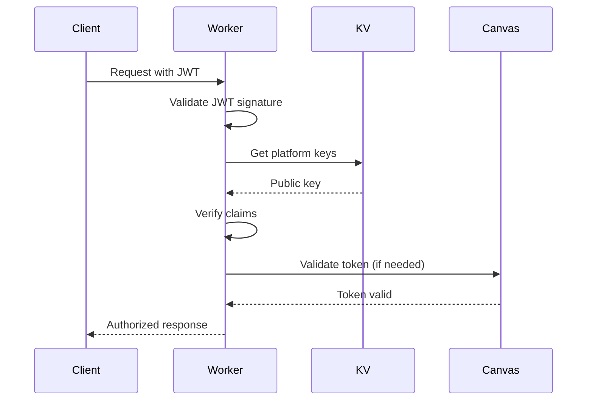

# 11. Backend Architecture

## Service Architecture

### Function Organization

```
src/
├── assessment/
│   ├── handlers/
│   │   ├── configHandler.ts
│   │   ├── conversationHandler.ts
│   │   ├── gradeHandler.ts
│   │   └── analyticsHandler.ts
│   ├── services/
│   │   ├── aiService.ts
│   │   ├── canvasService.ts
│   │   ├── assessmentService.ts
│   │   └── gradingService.ts
│   ├── repositories/
│   │   ├── conversationRepository.ts
│   │   ├── configRepository.ts
│   │   └── progressRepository.ts
│   ├── durable-objects/
│   │   └── ConversationManager.ts
│   └── routes.ts
├── middleware/
│   ├── ltiAuth.ts          # Existing
│   └── errorHandler.ts     # Existing
└── index.ts                 # Main Hono app
```

### Function Template

```typescript
// Handler template for assessment endpoints
import { Context } from 'hono';
import { assessmentService } from '../services/assessmentService';
import { validateRequest } from '../utils/validation';

export async function createConfigHandler(c: Context) {
  try {
    // Extract and validate request
    const body = await c.req.json();
    const validation = validateRequest(body, configSchema);
    if (!validation.valid) {
      return c.json({ error: validation.errors }, 400);
    }

    // Get LTI context from middleware
    const ltiContext = c.get('ltiContext');

    // Process request
    const config = await assessmentService.createConfig({
      ...body,
      platform_id: ltiContext.platform_id,
      created_by: ltiContext.user_id,
    });

    // Return response
    return c.json(config, 201);
  } catch (error) {
    console.error('Config creation error:', error);
    return c.json(
      {
        error: 'Failed to create configuration',
      },
      500,
    );
  }
}
```

## Database Architecture

### Schema Design

```sql
-- Already defined in section 9
-- See D1 Database Schema above
```

### Data Access Layer

```typescript
// Repository pattern for database access
export class ConversationRepository {
  constructor(private db: D1Database) {}

  async create(conversation: Omit<Conversation, 'id'>): Promise<Conversation> {
    const id = crypto.randomUUID();
    const result = await this.db
      .prepare(
        `
        INSERT INTO conversations
        (id, assessment_config_id, user_id, course_id, status, metadata)
        VALUES (?, ?, ?, ?, ?, ?)
      `,
      )
      .bind(
        id,
        conversation.assessment_config_id,
        conversation.user_id,
        conversation.course_id,
        'active',
        JSON.stringify(conversation.metadata || {}),
      )
      .run();

    return { id, ...conversation, status: 'active' };
  }

  async findById(id: string): Promise<Conversation | null> {
    const result = await this.db.prepare('SELECT * FROM conversations WHERE id = ?').bind(id).first();

    if (!result) return null;

    return {
      ...result,
      metadata: JSON.parse(result.metadata as string),
    } as Conversation;
  }

  async updateMastery(id: string, score: number): Promise<void> {
    await this.db.prepare('UPDATE conversations SET mastery_score = ? WHERE id = ?').bind(score, id).run();
  }
}
```

## Authentication and Authorization

### Auth Flow



### Middleware/Guards

```typescript
// LTI authentication middleware (extends existing)
export async function ltiAuthMiddleware(c: Context, next: Next) {
  const authHeader = c.req.header('Authorization');
  if (!authHeader?.startsWith('Bearer ')) {
    return c.json({ error: 'Missing authorization' }, 401);
  }

  const token = authHeader.substring(7);

  try {
    // Verify JWT using existing LTI service
    const claims = await ltiService.verifyJWT(token);

    // Add claims to context
    c.set('ltiContext', {
      user_id: claims.sub,
      platform_id: claims.iss,
      course_id: claims['https://purl.imsglobal.org/spec/lti/claim/context'].id,
      roles: claims['https://purl.imsglobal.org/spec/lti/claim/roles'],
      is_instructor: claims['https://purl.imsglobal.org/spec/lti/claim/roles'].includes(
        'http://purl.imsglobal.org/vocab/lis/v2/membership#Instructor',
      ),
    });

    await next();
  } catch (error) {
    return c.json({ error: 'Invalid token' }, 401);
  }
}
```
