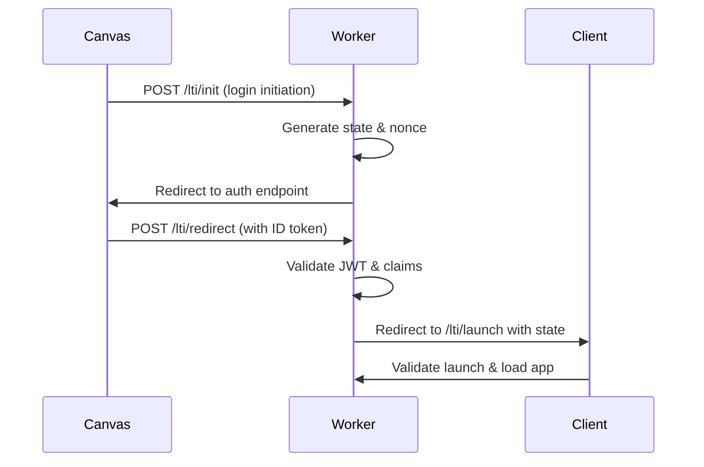
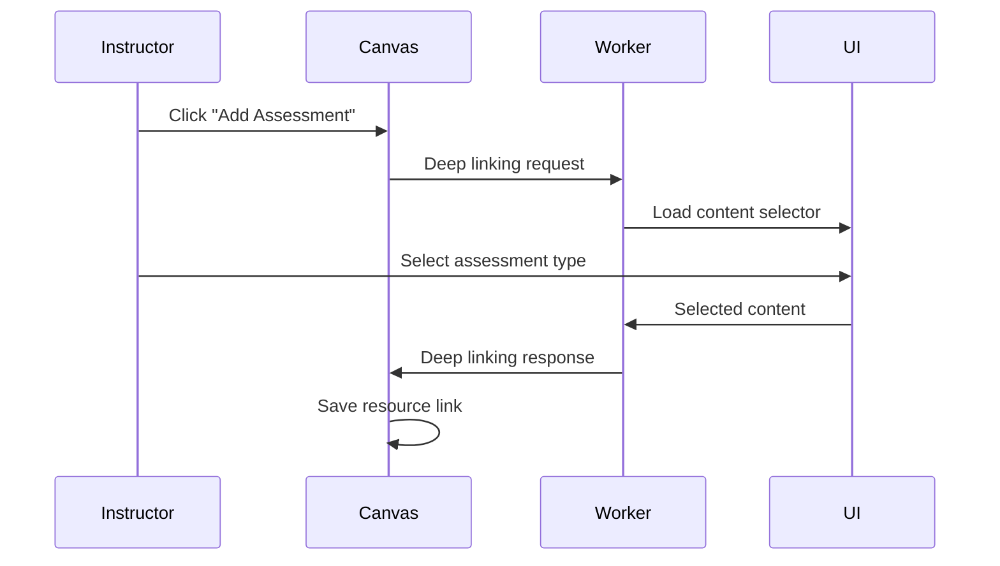

# 11. LTI Architecture

## Overview

This application implements Learning Tools Interoperability (LTI) 1.3 Core and Advantage services using the `@atomicjolt/lti-endpoints` package. All LTI protocol handling is abstracted through this package to ensure standards compliance and code reuse.

**📚 Reference:** For comprehensive LTI 1.3 implementation guidance and detailed documentation of the Atomic Jolt libraries, see [LTI Developer Guide](./lti-developer-guide.md). This guide provides complete technical specifications, implementation patterns, and best practices for AI developers working with LTI integrations.

## LTI Standards Implementation

**CRITICAL:** All LTI functionality MUST use `@atomicjolt/lti-endpoints` to ensure proper interaction with the standards. For detailed implementation guidance and library usage patterns, refer to the [LTI Developer Guide](./lti-developer-guide.md).

### Core LTI 1.3 Support

- **OpenID Connect Authentication:** Third-party initiated login flow with JWT-based security
- **Resource Link Launch:** Primary workflow for launching tool from Canvas/LMS
- **Platform Registration:** Dynamic registration support for automatic platform setup
- **Multi-tenancy:** Deployment IDs for supporting multiple institutions
- **Security:** RSA key pairs, JWT validation, HTTPS-only communication

### LTI Advantage Services

#### Deep Linking 2.0

**Purpose:** Content selection and embedding into Canvas courses
**📚 Reference:** See [LTI Developer Guide - Deep Linking](./lti-developer-guide.md#deep-linking-implementation) for complete implementation patterns and troubleshooting.
**Implementation:**

```typescript
import { DeepLinkingService } from '@atomicjolt/lti-endpoints';

// Deep linking request handler
export async function handleDeepLinkingRequest(c: Context) {
  const service = new DeepLinkingService(c.env);
  const deeplinkRequest = await service.validateRequest(c.req);

  // Present content selection UI
  const selectedContent = await presentContentSelector(deeplinkRequest);

  // Create deep linking response
  const response = await service.createResponse({
    content_items: [
      {
        type: 'ltiResourceLink',
        title: selectedContent.title,
        custom: { assessment_config_id: selectedContent.id },
      },
    ],
  });

  return c.redirect(response.redirect_url);
}
```

#### Assignment and Grade Services (AGS) 2.0

**Purpose:** Gradebook integration and score submission
**📚 Reference:** See [LTI Developer Guide - Assignment and Grade Services](./lti-developer-guide.md#assignment-and-grade-services) for complete AGS implementation patterns, error handling, and line item management.
**Implementation:**

```typescript
import { AssignmentGradeService } from '@atomicjolt/lti-endpoints';

export async function submitGrade(conversation: Conversation) {
  const ags = new AssignmentGradeService(env);

  // Create or update line item
  const lineItem = await ags.createLineItem({
    scoreMaximum: 100,
    label: 'AI Assessment',
    resourceLinkId: conversation.resource_link_id,
  });

  // Submit score
  await ags.submitScore({
    userId: conversation.user_id,
    scoreGiven: conversation.mastery_score,
    scoreMaximum: 100,
    activityProgress: 'Completed',
    gradingProgress: 'FullyGraded',
    timestamp: new Date().toISOString(),
  });
}
```

#### Names and Role Provisioning Services (NRPS) 2.0

**Purpose:** Retrieve course roster and user roles
**📚 Reference:** See [LTI Developer Guide - Names and Roles Provisioning Services](./lti-developer-guide.md#names-and-roles-service) for complete NRPS implementation, pagination handling, and privacy considerations.
**Implementation:**

```typescript
import { NamesRolesService } from '@atomicjolt/lti-endpoints';

export async function getCourseRoster(contextId: string) {
  const nrps = new NamesRolesService(env);

  const membership = await nrps.getMembership({
    contextId,
    role: 'Learner',
    limit: 100,
  });

  return membership.members.map((member) => ({
    id: member.user_id,
    name: member.name,
    email: member.email,
    roles: member.roles,
  }));
}
```

## LTI Message Flow Architecture

### 1. OIDC Authentication Flow



### 2. Deep Linking Flow



## LTI Claims and Context

### Required Claims Processing

```typescript
interface LTIClaims {
  // Core claims
  sub: string; // User ID
  iss: string; // Platform issuer
  aud: string | string[]; // Client ID(s)
  exp: number; // Expiration time
  iat: number; // Issued at time
  nonce: string; // Unique value

  // LTI-specific claims
  'https://purl.imsglobal.org/spec/lti/claim/message_type': string;
  'https://purl.imsglobal.org/spec/lti/claim/version': string;
  'https://purl.imsglobal.org/spec/lti/claim/deployment_id': string;
  'https://purl.imsglobal.org/spec/lti/claim/target_link_uri': string;

  // Context claims
  'https://purl.imsglobal.org/spec/lti/claim/context': {
    id: string;
    label: string;
    title: string;
    type: string[];
  };

  // User claims
  'https://purl.imsglobal.org/spec/lti/claim/roles': string[];
  name?: string;
  given_name?: string;
  family_name?: string;
  email?: string;

  // Resource link
  'https://purl.imsglobal.org/spec/lti/claim/resource_link': {
    id: string;
    title?: string;
    description?: string;
  };

  // LTI Advantage service endpoints
  'https://purl.imsglobal.org/spec/lti-ags/claim/endpoint'?: {
    scope: string[];
    lineitems: string;
    lineitem?: string;
  };

  'https://purl.imsglobal.org/spec/lti-nrps/claim/namesroleservice'?: {
    context_memberships_url: string;
    service_versions: string[];
  };

  'https://purl.imsglobal.org/spec/lti-dl/claim/deep_linking_settings'?: {
    deep_link_return_url: string;
    accept_types: string[];
    accept_presentation_document_targets: string[];
  };
}
```

## Platform Registration and Configuration

### Dynamic Registration Support

```typescript
// Platform registration handler using @atomicjolt/lti-endpoints
import { DynamicRegistration } from '@atomicjolt/lti-endpoints';

export async function registerPlatform(c: Context) {
  const registration = new DynamicRegistration(c.env);

  const config = await registration.register({
    platform_url: c.req.query('platform_url'),
    registration_token: c.req.query('registration_token'),
    tool_config: {
      title: 'Atomic Guide',
      description: 'AI-powered assessment tool',
      oidc_initiation_url: `${TOOL_URL}/lti/init`,
      target_link_uri: `${TOOL_URL}/lti/launch`,
      custom_parameters: {
        tool_mode: 'assessment',
      },
      scopes: [
        'https://purl.imsglobal.org/spec/lti-ags/scope/lineitem',
        'https://purl.imsglobal.org/spec/lti-ags/scope/result.readonly',
        'https://purl.imsglobal.org/spec/lti-ags/scope/score',
        'https://purl.imsglobal.org/spec/lti-nrps/scope/contextmembership.readonly',
      ],
      messages: [
        {
          type: 'LtiResourceLinkRequest',
          target_link_uri: `${TOOL_URL}/lti/launch`,
        },
        {
          type: 'LtiDeepLinkingRequest',
          target_link_uri: `${TOOL_URL}/lti/deep_link`,
        },
      ],
    },
  });

  // Store platform configuration
  await c.env.PLATFORMS.put(config.client_id, JSON.stringify(config));

  return c.json(config);
}
```

## Security Model

### JWT Validation and Key Management

```typescript
// Key rotation and JWKS endpoint using @atomicjolt/lti-endpoints
import { JWKSHandler, KeyManager } from '@atomicjolt/lti-endpoints';

export class LTISecurityService {
  private keyManager: KeyManager;

  constructor(env: Env) {
    this.keyManager = new KeyManager(env.KEY_SETS);
  }

  async validateIDToken(token: string, platform: Platform): Promise<LTIClaims> {
    // Fetch platform public keys
    const platformKeys = await this.fetchPlatformJWKS(platform.jwks_uri);

    // Validate token using @atomicjolt/lti-endpoints
    return await this.keyManager.validateToken(token, platformKeys);
  }

  async rotateKeys(): Promise<void> {
    // Automatic key rotation every 90 days
    await this.keyManager.rotateKeys();
  }
}
```

## Error Handling and Compliance

### LTI Error Responses

```typescript
// Standardized LTI error handling
export class LTIErrorHandler {
  static handleError(error: any, c: Context) {
    if (error.code === 'INVALID_JWT') {
      return c.json(
        {
          error: 'invalid_request',
          error_description: 'JWT validation failed',
        },
        401
      );
    }

    if (error.code === 'MISSING_CLAIM') {
      return c.json(
        {
          error: 'invalid_request',
          error_description: `Missing required claim: ${error.claim}`,
        },
        400
      );
    }

    // Log to monitoring
    console.error('[LTI Error]', error);

    return c.json(
      {
        error: 'server_error',
        error_description: 'An internal error occurred',
      },
      500
    );
  }
}
```
