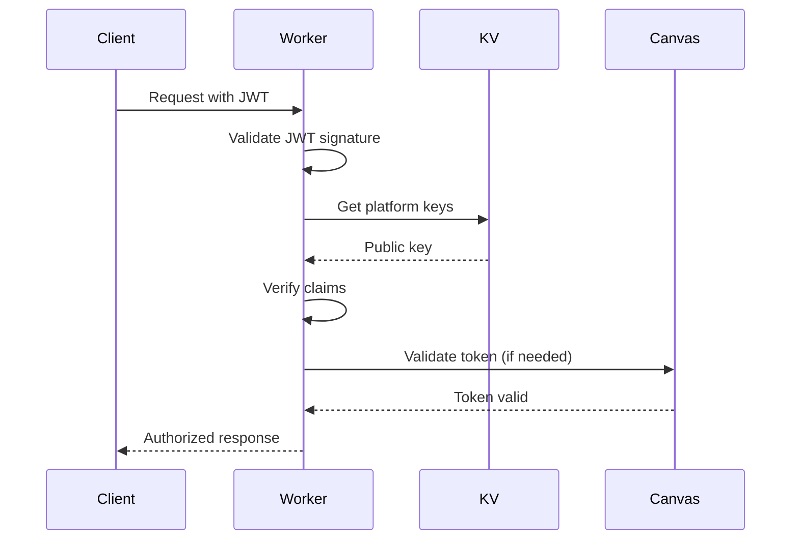

# 12. Backend Architecture

## Service Architecture

### Function Organization

```
src/
├── assessment/
│   ├── handlers/
│   │   ├── configHandler.ts
│   │   ├── conversationHandler.ts
│   │   ├── gradeHandler.ts
│   │   └── analyticsHandler.ts
│   ├── services/
│   │   ├── aiService.ts
│   │   ├── canvasService.ts
│   │   ├── assessmentService.ts
│   │   ├── CognitiveEngine.ts
│   │   ├── StruggleDetector.ts
│   │   ├── InterventionService.ts
│   │   ├── ChatService.ts
│   │   ├── ContentExtractor.ts
│   │   └── FAQKnowledgeBase.ts
│   ├── repositories/
│   │   ├── conversationRepository.ts
│   │   ├── configRepository.ts
│   │   └── progressRepository.ts
│   ├── durable-objects/
│   │   ├── ConversationManager.ts
│   │   ├── StruggleDetectorDO.ts
│   │   └── ChatConversationDO.ts
│   └── routes.ts
├── api/
│   ├── handlers/
│   │   ├── cognitive.ts
│   │   ├── learners.ts
│   │   ├── interventions.ts
│   │   └── chat.ts
│   └── websocket.ts
├── mcp/
│   ├── AtomicGuideMCP.ts
│   ├── tools.ts
│   ├── resources.ts
│   └── prompts.ts
├── middleware/
│   ├── ltiAuth.ts          # Existing
│   └── errorHandler.ts     # Existing
├── models/
│   ├── learner.ts
│   ├── session.ts
│   ├── knowledge.ts
│   └── chat.ts
├── db/
│   ├── schema.sql
│   ├── migrations/
│   └── queries.ts
└── index.ts                 # Main Hono app
```

### Function Template

```typescript
// Handler template for assessment endpoints
import { Context } from 'hono';
import { assessmentService } from '../services/assessmentService';
import { validateRequest } from '../utils/validation';

export async function createConfigHandler(c: Context) {
  try {
    // Extract and validate request
    const body = await c.req.json();
    const validation = validateRequest(body, configSchema);
    if (!validation.valid) {
      return c.json({ error: validation.errors }, 400);
    }

    // Get LTI context from middleware
    const ltiContext = c.get('ltiContext');

    // Process request
    const config = await assessmentService.createConfig({
      ...body,
      platform_id: ltiContext.platform_id,
      created_by: ltiContext.user_id,
    });

    // Return response
    return c.json(config, 201);
  } catch (error) {
    console.error('Config creation error:', error);
    return c.json(
      {
        error: 'Failed to create configuration',
      },
      500
    );
  }
}
```

## Database Architecture

### Data Access Layer

```typescript
// Repository pattern for database access
export class ConversationRepository {
  constructor(private db: D1Database) {}

  async create(conversation: Omit<Conversation, 'id'>): Promise<Conversation> {
    const id = crypto.randomUUID();
    const result = await this.db
      .prepare(
        `
        INSERT INTO conversations
        (id, assessment_config_id, user_id, course_id, status, metadata)
        VALUES (?, ?, ?, ?, ?, ?)
      `
      )
      .bind(
        id,
        conversation.assessment_config_id,
        conversation.user_id,
        conversation.course_id,
        'active',
        JSON.stringify(conversation.metadata || {})
      )
      .run();

    return { id, ...conversation, status: 'active' };
  }

  async findById(id: string): Promise<Conversation | null> {
    const result = await this.db.prepare('SELECT * FROM conversations WHERE id = ?').bind(id).first();

    if (!result) return null;

    return {
      ...result,
      metadata: JSON.parse(result.metadata as string),
    } as Conversation;
  }

  async updateMastery(id: string, score: number): Promise<void> {
    await this.db.prepare('UPDATE conversations SET mastery_score = ? WHERE id = ?').bind(score, id).run();
  }
}
```

## Cloudflare AI Integration

### Edge AI Inference

```typescript
// AI Service leveraging Cloudflare Workers AI
export class EdgeAIService {
  constructor(private env: Env) {}

  // Text generation using Llama or similar models
  async generateResponse(prompt: string, context: AssessmentContext): Promise<string> {
    const response = await this.env.AI.run('@cf/meta/llama-2-7b-chat-int8', {
      messages: [
        { role: 'system', content: context.systemPrompt },
        { role: 'user', content: prompt },
      ],
      temperature: context.temperature || 0.7,
      max_tokens: context.maxTokens || 500,
    });

    return response.response;
  }

  // Embedding generation for semantic search
  async generateEmbedding(text: string): Promise<number[]> {
    const response = await this.env.AI.run('@cf/baai/bge-base-en-v1.5', {
      text: [text],
    });
    return response.data[0];
  }

  // Intent classification for routing
  async classifyIntent(message: string): Promise<IntentClassification> {
    const response = await this.env.AI.run('@cf/huggingface/distilbert-sst-2-int8', {
      text: message,
    });
    return {
      intent: this.mapToIntent(response.label),
      confidence: response.score,
    };
  }
}
```

## Vectorize Integration

### Semantic Search and Content Discovery

```typescript
// Vectorize V2 service for semantic search
export class VectorSearchService {
  private vectorIndex: Vectorize;

  constructor(env: Env) {
    this.vectorIndex = env.VECTORIZE_INDEX; // Bound via wrangler.jsonc
  }

  // Index assessment content with namespace support
  async indexAssessmentContent(assessment: AssessmentConfig, courseId: string): Promise<void> {
    const aiService = new EdgeAIService(this.env);

    // Generate embeddings (768 dimensions for bge-base-en-v1.5)
    const embedding = await aiService.generateEmbedding(
      `${assessment.title} ${assessment.description} ${assessment.learning_objectives?.join(' ') || ''}`
    );

    // Store in Vectorize with namespace
    const result = await this.vectorIndex.insert([
      {
        id: assessment.id,
        values: embedding, // Float32Array or number[]
        metadata: {
          type: 'assessment',
          course_id: courseId,
          title: assessment.title.substring(0, 64), // String metadata indexed up to 64B
          created_at: new Date().toISOString(),
        },
        namespace: courseId, // Segment by course (max 1000 namespaces)
      },
    ]);

    console.log(`Assessment indexed: ${result.mutationId}`);
  }

  // Query with metadata filtering and precision control
  async findSimilarContent(
    query: string,
    options: {
      namespace?: string;
      courseId?: string;
      limit?: number;
      highPrecision?: boolean;
    } = {}
  ): Promise<SearchResult[]> {
    const aiService = new EdgeAIService(this.env);
    const queryEmbedding = await aiService.generateEmbedding(query);

    // Build metadata filter (requires metadata indexes)
    const filter: any = {};
    if (options.courseId) filter.course_id = { $eq: options.courseId };
    filter.type = { $eq: 'assessment' };

    const results = await this.vectorIndex.query(queryEmbedding, {
      topK: options.limit || 10,
      returnValues: options.highPrecision || false, // true = exact scores but higher latency
      returnMetadata: 'all',
      namespace: options.namespace,
      filter,
    });

    return results.matches.map((match) => ({
      id: match.id,
      score: match.score, // Cosine: -1 to 1, Euclidean: 0+, Dot: negative is better
      metadata: match.metadata,
      values: match.values, // Only if returnValues: true
    }));
  }

  // Upsert conversation for knowledge base
  async upsertConversation(conversation: Conversation, messages: ConversationMessage[]): Promise<void> {
    const aiService = new EdgeAIService(this.env);

    // Summarize for semantic search
    const summary = await aiService.generateResponse(
      `Summarize key learning points: ${messages
        .slice(-10)
        .map((m) => m.content)
        .join(' ')}`,
      { systemPrompt: 'Extract main concepts and learning outcomes.' }
    );

    const embedding = await aiService.generateEmbedding(summary);

    // Upsert to update existing or insert new
    await this.vectorIndex.upsert([
      {
        id: conversation.id,
        values: embedding,
        metadata: {
          type: 'conversation',
          user_id: conversation.user_id,
          course_id: conversation.course_id,
          mastery_score: conversation.mastery_score,
          summary: summary.substring(0, 500),
          created_at: conversation.started_at,
        },
        namespace: conversation.course_id,
      },
    ]);
  }
}
```

## Hybrid Storage Architecture

### Combining D1, KV, R2, and Vectorize

```typescript
export class HybridStorageService {
  constructor(
    private d1: D1Database,
    private kv: KVNamespace,
    private r2: R2Bucket,
    private vectorize: VectorizeIndex
  ) {}

  // Store structured data in D1
  async storeStructuredData(table: string, data: any): Promise<void> {
    await this.d1
      .prepare(`INSERT INTO ${table} ...`)
      .bind(...values)
      .run();
  }

  // Cache frequently accessed data in KV
  async cacheData(key: string, data: any, ttl = 3600): Promise<void> {
    await this.kv.put(key, JSON.stringify(data), {
      expirationTtl: ttl,
    });
  }

  // Store media files in R2
  async storeMedia(file: File): Promise<string> {
    const key = `media/${crypto.randomUUID()}/${file.name}`;
    await this.r2.put(key, file.stream());
    return key;
  }

  // Index searchable content in Vectorize
  async indexContent(content: string, metadata: any): Promise<void> {
    const aiService = new EdgeAIService(this.env);
    const embedding = await aiService.generateEmbedding(content);
    await this.vectorize.insert([
      {
        id: crypto.randomUUID(),
        values: embedding,
        metadata,
      },
    ]);
  }
}
```

## Vectorize Performance Best Practices

### Batch Operations for Improved Throughput

```typescript
export class VectorizeOptimizer {
  // Batch inserts for better performance (up to 1000 vectors per request)
  async batchInsert(vectors: VectorizeVector[]): Promise<void> {
    const BATCH_SIZE = 1000; // Vectorize limit

    for (let i = 0; i < vectors.length; i += BATCH_SIZE) {
      const batch = vectors.slice(i, i + BATCH_SIZE);
      await this.vectorIndex.insert(batch);
    }
  }

  // Use upsert for updates to avoid duplicate ID errors
  async updateVectors(updates: VectorizeVector[]): Promise<void> {
    // Upsert overwrites existing vectors with same ID
    await this.vectorIndex.upsert(updates);
  }
}
```

### Query Optimization Strategies

```typescript
interface QueryStrategy {
  // High-precision scoring for accuracy-critical searches
  async preciseSearch(query: number[]): Promise<SearchResult[]> {
    return await this.vectorIndex.query(query, {
      topK: 10,
      returnValues: true, // Enables exact scoring but increases latency
      returnMetadata: 'all'
    });
  }

  // Approximate scoring for faster response times
  async fastSearch(query: number[]): Promise<SearchResult[]> {
    return await this.vectorIndex.query(query, {
      topK: 10,
      returnValues: false, // Default: approximate scoring for speed
      returnMetadata: 'indexed' // Only return indexed metadata
    });
  }

  // Namespace isolation for multi-tenant queries
  async tenantSearch(query: number[], tenantId: string): Promise<SearchResult[]> {
    return await this.vectorIndex.query(query, {
      namespace: tenantId, // Search only within tenant's vectors
      topK: 10
    });
  }
}
```

### Metadata Index Design

```typescript
// Best practices for metadata filtering
export class MetadataDesign {
  // Low cardinality for efficient filtering
  goodMetadata = {
    type: 'assessment', // Few unique values
    status: 'active', // Limited set
    difficulty: 'medium', // Enumerated values
  };

  // Avoid high cardinality in metadata filters
  avoidMetadata = {
    uuid: 'unique-id-per-vector', // Too many unique values
    timestamp_ms: Date.now(), // High cardinality
    random_score: Math.random(), // Continuous values
  };

  // Bucket high-cardinality data for better performance
  optimizedMetadata = {
    created_date: '2024-01-15', // Date without time
    score_bucket: Math.floor(score / 10) * 10, // 0, 10, 20, etc.
    time_window: Math.floor(Date.now() / 300000) * 300000, // 5-min windows
  };
}
```

### Index Configuration Considerations

- **Dimensions**: Cannot be changed after creation, must match embedding model
- **Distance Metrics**:
  - `cosine`: Best for normalized embeddings (most common)
  - `euclidean`: Good for dense embeddings where magnitude matters
  - `dot-product`: Efficient but requires careful normalization
- **Namespaces**: Use for tenant isolation (max 1000 per index)
- **Metadata Indexes**: Create before inserting vectors (max 10 per index)

## Authentication and Authorization

### Auth Flow



### Middleware/Guards

```typescript
// LTI authentication middleware (extends existing)
export async function ltiAuthMiddleware(c: Context, next: Next) {
  const authHeader = c.req.header('Authorization');
  if (!authHeader?.startsWith('Bearer ')) {
    return c.json({ error: 'Missing authorization' }, 401);
  }

  const token = authHeader.substring(7);

  try {
    // Verify JWT using existing LTI service
    const claims = await ltiService.verifyJWT(token);

    // Add claims to context
    c.set('ltiContext', {
      user_id: claims.sub,
      platform_id: claims.iss,
      course_id: claims['https://purl.imsglobal.org/spec/lti/claim/context'].id,
      roles: claims['https://purl.imsglobal.org/spec/lti/claim/roles'],
      is_instructor: claims['https://purl.imsglobal.org/spec/lti/claim/roles'].includes(
        'http://purl.imsglobal.org/vocab/lis/v2/membership#Instructor'
      ),
    });

    await next();
  } catch (error) {
    return c.json({ error: 'Invalid token' }, 401);
  }
}
```
