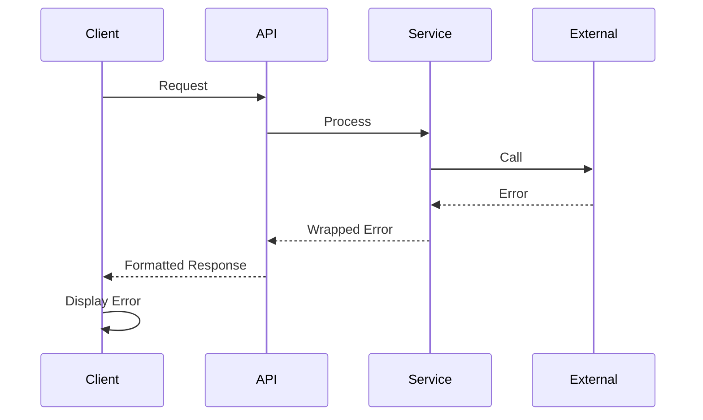

# 18. Error Handling Strategy

## Error Flow



## Error Response Format

```typescript
interface ApiError {
  error: {
    code: string;
    message: string;
    details?: Record<string, any>;
    timestamp: string;
    requestId: string;
  };
}
```

## Frontend Error Handling

```typescript
// Global error boundary for React components
export class ErrorBoundary extends Component {
  state = { hasError: false, error: null };

  static getDerivedStateFromError(error: Error) {
    return { hasError: true, error };
  }

  componentDidCatch(error: Error, info: ErrorInfo) {
    console.error('Component error:', error, info);
    // Send to monitoring service
  }

  render() {
    if (this.state.hasError) {
      return <ErrorFallback error={this.state.error} />;
    }
    return this.props.children;
  }
}
```

## Backend Error Handling

```typescript
// Centralized error handler middleware
export function errorHandler(err: Error, c: Context) {
  const requestId = crypto.randomUUID();

  console.error(`[${requestId}] Error:`, err);

  const statusCode = err instanceof ValidationError ? 400 : err instanceof AuthError ? 401 : err instanceof NotFoundError ? 404 : 500;

  return c.json(
    {
      error: {
        code: err.constructor.name,
        message: err.message,
        details: err instanceof ValidationError ? err.details : undefined,
        timestamp: new Date().toISOString(),
        requestId,
      },
    },
    statusCode,
  );
}
```
