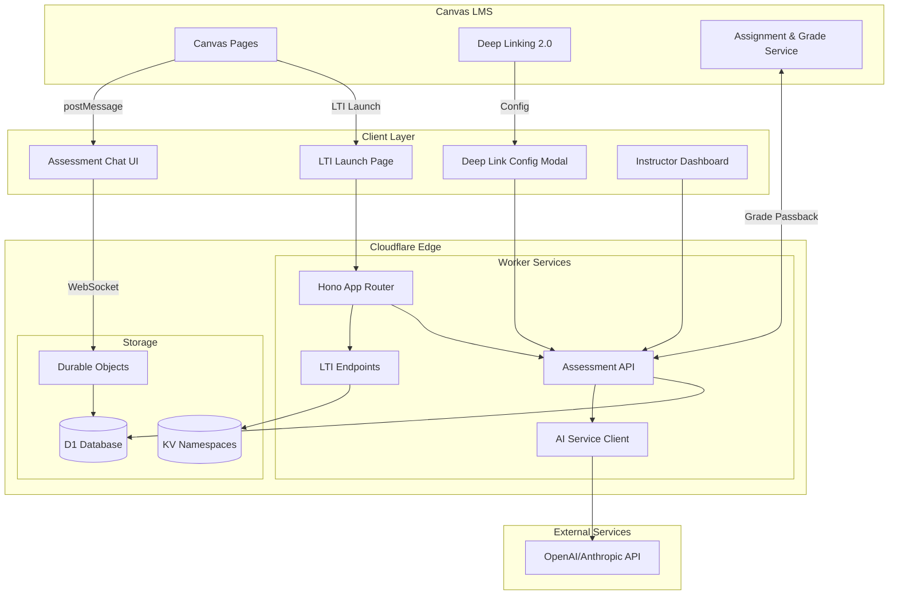

# 2. High Level Architecture

## Technical Summary

The Atomic Guide Deep Linking Assessment Features extend the existing Cloudflare Workers-based LTI 1.3 tool with AI-powered conversational assessment capabilities delivered through a serverless edge architecture. The frontend leverages a progressive React migration strategy for new assessment components while maintaining vanilla JavaScript for stable existing features, communicating with backend services via WebSocket connections through Durable Objects for real-time chat experiences. Canvas postMessage API integration enables contextual content extraction while deep linking 2.0 provides seamless assessment embedding, all orchestrated through the existing Hono framework extended with new AI service integrations. The architecture achieves the PRD's goals of real-time comprehension feedback and instructor insights while maintaining 99.5% uptime through Cloudflare's global edge network, with Cloudflare D1 providing relational storage for assessment data alongside existing KV namespaces.

## Platform and Infrastructure Choice

**Platform:** Cloudflare Workers + Cloudflare Services
**Key Services:** Workers (compute), KV (config storage), D1 (relational data), Durable Objects (real-time state), R2 (file storage if needed)
**Deployment Host and Regions:** Global edge deployment via Cloudflare's 275+ data centers

## Repository Structure

**Structure:** Existing monorepo with enhancement modules
**Monorepo Tool:** Native npm workspaces (existing)
**Package Organization:**

- `/src` - Backend Worker code with new `/src/assessment` module
- `/client` - Frontend code with new `/client/components/assessment` React components
- `/packages` - Shared types and utilities (to be created for assessment features)

## High Level Architecture Diagram

## Architectural Patterns

- **Serverless Edge Computing:** Cloudflare Workers for global low-latency assessment delivery - _Rationale:_ Maintains existing infrastructure while scaling to handle real-time AI interactions
- **Event-Driven LTI Handlers:** Async processing of LTI events with existing patterns - _Rationale:_ Proven reliability for Canvas integration with minimal changes needed
- **Component-Based UI with Progressive Enhancement:** React for new assessment features, vanilla JS for stable components - _Rationale:_ Allows incremental migration without disrupting existing functionality
- **Repository Pattern for Data Access:** Abstract D1 database operations behind service interfaces - _Rationale:_ Enables testing and potential future database migrations
- **WebSocket via Durable Objects:** Real-time bidirectional communication for chat - _Rationale:_ Cloudflare's native solution for stateful connections at edge
- **Command Query Responsibility Segregation (CQRS):** Separate read/write paths for assessment data - _Rationale:_ Optimizes for high-read instructor dashboards and write-heavy student interactions
- **Backend for Frontend (BFF) Pattern:** Assessment API tailored for UI needs - _Rationale:_ Reduces client complexity and API chattiness for mobile Canvas users
