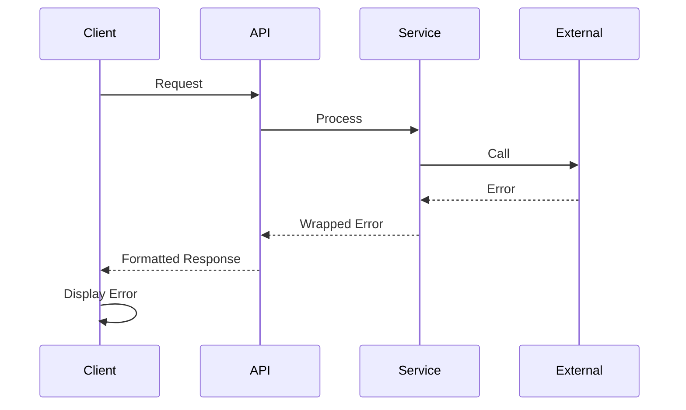

# 23. Error Handling Strategy

## Error Flow



## Error Response Format

```typescript
interface ApiError {
  error: {
    code: string;
    message: string;
    details?: Record<string, any>;
    timestamp: string;
    requestId: string;
  };
}
```

## Frontend Error Handling

```typescript
// Global error boundary for React components
export class ErrorBoundary extends Component {
  state = { hasError: false, error: null };

  static getDerivedStateFromError(error: Error) {
    return { hasError: true, error };
  }

  componentDidCatch(error: Error, info: ErrorInfo) {
    console.error('Component error:', error, info);
    // Send to monitoring service
  }

  render() {
    if (this.state.hasError) {
      return <ErrorFallback error={this.state.error} />;
    }
    return this.props.children;
  }
}

// RTK Query Error Handling
export const assessmentApi = createApi({
  baseQuery: async (args, api, extraOptions) => {
    const result = await baseQuery(args, api, extraOptions);

    // Global error handling for RTK Query
    if (result.error) {
      // Handle specific error codes
      if (result.error.status === 401) {
        // Token expired, refresh
        api.dispatch(refreshAuth());
      } else if (result.error.status === 429) {
        // Rate limited, show notification
        api.dispatch(showRateLimitNotification());
      }

      // Log to monitoring
      console.error('[RTK Query Error]', result.error);
    }

    return result;
  },
  endpoints: (builder) => ({
    createConversation: builder.mutation({
      query: (data) => ({ url: '/conversation', method: 'POST', body: data }),
      // Transform error responses
      transformErrorResponse: (response: { status: string | number }, meta, arg) => {
        return {
          status: response.status,
          message: response.data?.error?.message || 'An error occurred',
          code: response.data?.error?.code
        };
      },
      // Optimistic updates with rollback on error
      async onQueryStarted(arg, { dispatch, queryFulfilled }) {
        const patchResult = dispatch(
          assessmentApi.util.updateQueryData('getConversations', undefined, (draft) => {
            draft.push({ ...arg, id: 'temp-id', status: 'pending' });
          })
        );
        try {
          await queryFulfilled;
        } catch {
          patchResult.undo(); // Rollback on error
        }
      }
    })
  })
});

// Redux Error Middleware
export const errorMiddleware: Middleware = (store) => (next) => (action) => {
  // Catch RTK Query errors
  if (action.type.endsWith('/rejected')) {
    const error = action.payload || action.error;

    // Dispatch error notification
    store.dispatch(showErrorNotification({
      message: error.message || 'Operation failed',
      code: error.code,
      retryAction: action.meta?.arg?.originalAction
    }));

    // Log to Cloudflare Analytics
    if (typeof window !== 'undefined' && window.zaraz) {
      window.zaraz.track('api_error', {
        endpoint: action.meta?.arg?.endpointName,
        error_code: error.code,
        status: error.status
      });
    }
  }

  return next(action);
};
```

## Backend Error Handling

```typescript
// Centralized error handler middleware
export function errorHandler(err: Error, c: Context) {
  const requestId = crypto.randomUUID();

  console.error(`[${requestId}] Error:`, err);

  const statusCode = err instanceof ValidationError ? 400 : err instanceof AuthError ? 401 : err instanceof NotFoundError ? 404 : 500;

  return c.json(
    {
      error: {
        code: err.constructor.name,
        message: err.message,
        details: err instanceof ValidationError ? err.details : undefined,
        timestamp: new Date().toISOString(),
        requestId,
      },
    },
    statusCode
  );
}
```

## Failure Isolation & Recovery

**Component Isolation Strategy:**

- Canvas Monitor failure → Core LTI functionality preserved
- Cognitive Engine failure → Graceful degradation to basic tracking
- MCP OAuth failure → Internal features continue working
- D1 failure → KV cache provides read-only fallback
- AI Chat failure → FAQ fallback and cached responses

**Circuit Breaker Patterns:**

- D1 connection pool exhaustion → Temporary KV cache
- AI inference timeout → Rule-based algorithm fallback
- WebSocket disconnection → Exponential backoff retry
- Redux store overflow → Selective state pruning
- AI API failure → FAQ knowledge base + cached responses
- Chat rate limit exceeded → Graceful throttling with user notification
