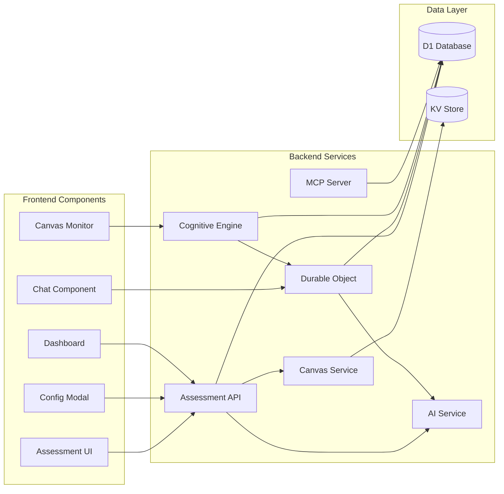

# 6. Components

## AI Assessment Service

**Responsibility:** Manages AI interactions for generating assessment content and processing student responses

**Key Interfaces:**

- `generateAssessmentContent(context: PageContent): Promise<AssessmentActivity>`
- `processStudentResponse(message: string, context: ConversationContext): Promise<AIResponse>`
- `evaluateMastery(conversation: Conversation): MasteryScore`

**Dependencies:** OpenAI/Anthropic API client, D1 database, Content extraction service

**Technology Stack:** TypeScript, Cloudflare Workers, streaming responses via TransformStream

## Cognitive Engine Service

**Responsibility:** Process behavioral signals, update learner profiles, trigger interventions
**Integration Points:** Receives data from Canvas Monitor, updates D1, triggers Intervention Service

**Key Interfaces:**

- `POST /api/cognitive/signals` - Receive behavioral data
- `GET /api/cognitive/profile/:learner_id` - Retrieve learner DNA
- WebSocket connection via Durable Objects for real-time processing

**Algorithm Implementation:**

```typescript
export class CognitiveEngine {
  // Spaced repetition scheduling
  private calculateNextReview(performance: number, previousInterval: number): number {
    const multiplier = performance >= 0.8 ? 1.3 : 0.6;
    const newInterval = previousInterval * multiplier;
    return Math.min(newInterval, 90); // Cap at 90 days
  }

  // Forgetting curve prediction
  private predictRetention(lastReview: Date, stability: number): number {
    const daysSince = (Date.now() - lastReview.getTime()) / (1000 * 60 * 60 * 24);
    return Math.exp(-daysSince / stability);
  }

  // Adaptive difficulty using fuzzy logic
  private adjustDifficulty(current: number, metrics: PerformanceMetrics): number {
    const { accuracy, responseTime, hintUsage } = metrics;
    const targetSuccess = 0.75; // 75% target

    if (accuracy < targetSuccess - 0.05) {
      return Math.max(current - 0.05, 0); // Decrease 5%
    } else if (accuracy > targetSuccess + 0.05) {
      return Math.min(current + 0.05, 1); // Increase 5%
    }
    return current;
  }

  // Early warning detection
  private detectAtRisk(engagement: number, success: number, weekNumber: number): boolean {
    if (weekNumber <= 6) {
      return engagement < 0.6 || success < 0.7;
    }
    return engagement < 0.5 || success < 0.65;
  }

  // Anti-Cramming Learning Companion
  private scheduleOptimalLearning(content: LearningContent, learnerProfile: LearnerProfile, deadline: Date): LearningSchedule {
    const now = new Date();
    const daysUntilDeadline = (deadline.getTime() - now.getTime()) / (1000 * 60 * 60 * 24);

    // Calculate optimal session distribution
    const sessionCount = Math.ceil(content.estimatedHours / learnerProfile.optimalSessionLength);
    const spacing = this.calculateOptimalSpacing(daysUntilDeadline, sessionCount);

    // Schedule micro-learning sessions
    const sessions: LearningSession[] = [];
    for (let i = 0; i < sessionCount; i++) {
      sessions.push({
        scheduledTime: this.findOptimalTimeSlot(learnerProfile, spacing[i]),
        duration: Math.min(learnerProfile.optimalSessionLength, 25), // Max 25 minutes per session
        content: this.chunkContent(content, i, sessionCount),
        reminderType: this.selectReminderStrategy(learnerProfile),
      });
    }

    return { sessions, adaptiveTriggers: this.createAdaptiveTriggers(learnerProfile) };
  }

  // Cognitive Load Optimization Engine
  private optimizeCognitiveLoad(learningTasks: Task[], learnerState: LearnerState, context: LearningContext): OptimizedPlan {
    // Measure current cognitive load
    const currentLoad = this.assessCognitiveLoad(learnerState);

    // Prioritize tasks based on importance and cognitive demand
    const prioritizedTasks = learningTasks
      .map((task) => ({
        ...task,
        cognitiveWeight: this.calculateCognitiveWeight(task, learnerState),
        importance: this.calculateImportance(task, context),
        enjoymentScore: this.predictEnjoyment(task, learnerState.preferences),
      }))
      .sort((a, b) => {
        // Balance importance with cognitive efficiency
        const scoreA = a.importance * 0.5 + a.enjoymentScore * 0.3 - a.cognitiveWeight * 0.2;
        const scoreB = b.importance * 0.5 + b.enjoymentScore * 0.3 - b.cognitiveWeight * 0.2;
        return scoreB - scoreA;
      });

    // Remove decision fatigue
    const streamlinedPlan = {
      primaryFocus: prioritizedTasks[0],
      secondaryTasks: prioritizedTasks.slice(1, 3),
      deferredTasks: prioritizedTasks.slice(3),
      breaks: this.scheduleOptimalBreaks(currentLoad),
      modeSwitches: this.planModalitySwitches(learnerState.preferences),
    };

    // Create frictionless learning flow
    return {
      ...streamlinedPlan,
      transitions: this.createSmoothTransitions(streamlinedPlan),
      adaptiveTriggers: this.createLoadBalancingTriggers(currentLoad),
    };
  }

  // Helper: Calculate optimal spacing for anti-cramming
  private calculateOptimalSpacing(days: number, sessions: number): number[] {
    const spacing: number[] = [];
    const optimalInterval = days / sessions;

    for (let i = 0; i < sessions; i++) {
      // Use expanding intervals (closer together at start, further apart later)
      const expandFactor = Math.pow(1.15, i);
      spacing.push(Math.min(optimalInterval * expandFactor, days - 1));
    }

    return spacing;
  }

  // Helper: Assess cognitive load in real-time
  private assessCognitiveLoad(state: LearnerState): CognitiveLoad {
    return {
      workingMemory: this.calculateWorkingMemoryLoad(state),
      attention: this.measureAttentionalResources(state),
      fatigue: this.estimateMentalFatigue(state),
      stress: this.detectStressIndicators(state),
      overall: this.computeOverallLoad(state),
    };
  }
}
```

## Canvas Integration Service

**Responsibility:** Handles all Canvas LMS interactions including deep linking, content extraction, and grade passback

**Key Interfaces:**

- `extractPageContent(messageData: PostMessage): PageContent`
- `submitGrade(score: number, assignmentId: string): Promise<void>`
- `getNameAndRoles(contextId: string): Promise<Roster>`

**Dependencies:** LTI service, Canvas API client, OAuth token management

**Technology Stack:** TypeScript, @atomicjolt/lti-endpoints, Canvas REST API (see [LTI Developer Guide](./lti-developer-guide.md) for implementation details)

## Canvas Monitor Client

**Responsibility:** Inject monitoring script, capture Canvas interactions via postMessage API, detect struggle patterns
**Integration Points:** Loaded after LTI launch, bidirectional postMessage communication with Canvas

**Key Interfaces:**

- Canvas postMessage API for bidirectional communication
- WebSocket to Cognitive Engine for real-time data
- Redux actions for local state updates
- DOM content extraction for chat context via `lti.getPageContent`
- Secure message validation with PostMessageToken

## Conversation Manager (Durable Object)

**Responsibility:** Maintains real-time conversation state and WebSocket connections for chat sessions

**Key Interfaces:**

- `handleWebSocketUpgrade(request: Request): Response`
- `processMessage(message: ChatMessage): Promise<void>`
- `syncToDatabase(): Promise<void>`

**Dependencies:** AI Assessment Service, D1 database, WebSocket API

**Technology Stack:** Cloudflare Durable Objects, WebSocket, TypeScript

## AI Guide Chat Service

**Responsibility:** Provide conversational AI interface for personalized learning assistance (FR4)
**Integration Points:** Canvas content extractor, Learner DNA profiles, external AI APIs

**Key Interfaces:**

- `POST /api/chat/message` - Send chat message with context
- `GET /api/chat/history/:session_id` - Retrieve conversation history (FR4.2)
- `POST /api/chat/suggestion` - Generate proactive suggestions (FR15)
- WebSocket at `/ws/chat` for real-time messaging

**Conversation Personas Implementation:**

The AI Guide Chat Service supports configurable conversation personas that adapt the AI's communication style to match different pedagogical approaches and student needs:

```typescript
interface ConversationPersona {
  type: 'encouraging' | 'socratic' | 'practical' | 'adaptive';
  systemPrompt: string;
  toneAdjustments: ToneSettings;
  responsePatterns: ResponsePattern[];
  adaptationRules?: AdaptationRule[];
}

class PersonaManager {
  private personas: Map<string, ConversationPersona> = new Map([
    ['encouraging', {
      type: 'encouraging',
      systemPrompt: `You are a supportive and encouraging tutor. Celebrate small victories,
                     provide positive reinforcement, and help build student confidence.
                     Use phrases like "Great progress!", "You're getting closer!",
                     "Let's work through this together."`,
      toneAdjustments: {
        formality: 0.3, // Casual and friendly
        encouragement: 0.9, // High encouragement
        detail_level: 0.6 // Moderate detail
      },
      responsePatterns: [
        { trigger: 'struggle_detected', response: 'I see you're working hard on this. Let me help break it down...' },
        { trigger: 'correct_answer', response: 'Excellent work! You've got it!' },
        { trigger: 'partial_understanding', response: 'You're on the right track! Let's refine that a bit...' }
      ]
    }],
    ['socratic', {
      type: 'socratic',
      systemPrompt: `You are a Socratic tutor who guides through questioning.
                     Rather than providing direct answers, ask thought-provoking questions
                     that lead students to discover solutions themselves.`,
      toneAdjustments: {
        formality: 0.7, // More formal
        encouragement: 0.5, // Moderate encouragement
        detail_level: 0.4 // Less detail, more questions
      },
      responsePatterns: [
        { trigger: 'question_asked', response: 'Interesting question. What do you think would happen if...?' },
        { trigger: 'assumption_made', response: 'Why do you think that's the case?' },
        { trigger: 'conclusion_reached', response: 'How did you arrive at that conclusion?' }
      ]
    }],
    ['practical', {
      type: 'practical',
      systemPrompt: `You are a practical, results-oriented tutor. Focus on real-world applications,
                     provide concrete examples, and emphasize practical skills and immediate utility.`,
      toneAdjustments: {
        formality: 0.5, // Balanced formality
        encouragement: 0.6, // Moderate encouragement
        detail_level: 0.8 // High detail with examples
      },
      responsePatterns: [
        { trigger: 'concept_introduction', response: 'Let me show you how this applies in practice...' },
        { trigger: 'theory_question', response: 'Here's a real-world example of this concept...' },
        { trigger: 'skill_practice', response: 'Let's try this with a practical scenario...' }
      ]
    }],
    ['adaptive', {
      type: 'adaptive',
      systemPrompt: `You are an adaptive tutor that adjusts your approach based on student responses.
                     Monitor engagement and comprehension to dynamically adjust your teaching style.`,
      toneAdjustments: {
        formality: 0.5, // Starts balanced
        encouragement: 0.6, // Starts moderate
        detail_level: 0.6 // Starts moderate
      },
      adaptationRules: [
        {
          condition: 'low_confidence_detected',
          adjustment: { encouragement: '+0.2', detail_level: '+0.1' }
        },
        {
          condition: 'high_performance',
          adjustment: { formality: '+0.1', detail_level: '-0.1' }
        },
        {
          condition: 'frustration_detected',
          adjustment: { encouragement: '+0.3', formality: '-0.2' }
        }
      ]
    }]
  ]);

  // Select and apply persona to conversation
  applyPersona(
    conversationId: string,
    personaType: string,
    studentProfile?: LearnerProfile
  ): ConversationContext {
    const persona = this.personas.get(personaType) || this.personas.get('adaptive');

    // Adapt based on student profile if available
    if (studentProfile && persona.type === 'adaptive') {
      return this.createAdaptiveContext(persona, studentProfile);
    }

    return {
      systemPrompt: persona.systemPrompt,
      toneSettings: persona.toneAdjustments,
      responsePatterns: persona.responsePatterns
    };
  }

  // Dynamic persona adaptation based on real-time signals
  private createAdaptiveContext(
    persona: ConversationPersona,
    profile: LearnerProfile
  ): ConversationContext {
    const adjustedTone = { ...persona.toneAdjustments };

    // Apply learning style preferences
    if (profile.cognitive_profile.engagement_patterns.includes('visual_learner')) {
      adjustedTone.detail_level = Math.min(adjustedTone.detail_level + 0.2, 1.0);
    }

    // Apply historical performance adjustments
    if (profile.average_confidence < 0.5) {
      adjustedTone.encouragement = Math.min(adjustedTone.encouragement + 0.3, 1.0);
    }

    return {
      systemPrompt: this.personalizePrompt(persona.systemPrompt, profile),
      toneSettings: adjustedTone,
      responsePatterns: persona.responsePatterns,
      adaptationEnabled: true
    };
  }
}
```

## Chat UI Components

**Responsibility:** Render floating action button and expandable chat interface per front-end spec (FR4)
**Integration Points:** Redux state, WebSocket connection, Canvas DOM

**Key Interfaces:**

- **Floating Action Button (FAB):**
  - Circular icon (48x48px desktop, 40x40px mobile) with Atomic Jolt Yellow (#FFDD00) accent
  - State indicators: Static (60% opacity), Active (100% opacity), Pulsing (scale 1.0-1.1 animation)
  - Badge: Red (#B42318) notification dot for urgent items
  - ARIA label: "Atomic Guide Assistant - Click for help"

- **Expandable Chat Panel:**
  - Header (56px): Context badge, title "Atomic Guide", minimize/expand/close actions
  - Chat area (max 480px height): User messages (right, #F5F5F5), AI messages (left, white with yellow border)
  - Input area (72px): Text field, send button (#FFDD00 when active), voice input
  - Typography: Rubik font family (14px regular, 16px medium for headers)
  - Draggable on desktop, fixed bottom-right on mobile (16px margin)

- **Rich Media Rendering:**
  - LaTeX math with KaTeX
  - Code snippets with syntax highlighting
  - Diagrams and charts support
  - Flash cards with swipe gestures
  - Quiz questions with radio/checkbox inputs

## Assessment UI Components

**Responsibility:** React components for chat interface, configuration modal, and instructor dashboard

**Key Interfaces:**

- `<ChatAssessment />` - Main chat interface component
- `<DeepLinkConfig />` - Instructor configuration modal
- `<AnalyticsDashboard />` - Real-time progress visualization

**Dependencies:** WebSocket client, Canvas postMessage API, React hooks

**Technology Stack:** React 18, TypeScript, Redux Toolkit for state, Custom CSS

## Cloudflare AI Service

**Responsibility:** Manages edge AI inference using Cloudflare Workers AI
**Key Interfaces:**

- `generateEmbedding(text: string): Promise<number[]>` - Create vector embeddings for semantic search
- `classifyIntent(message: string): Promise<IntentClassification>` - Determine student query intent
- `summarizeContent(text: string, maxTokens: number): Promise<string>` - Generate concise summaries
- `detectLanguage(text: string): Promise<LanguageCode>` - Identify language for i18n support

**Implementation:**

```typescript
interface CloudflareAIService {
  // Text embeddings for Vectorize
  async generateEmbedding(text: string): Promise<number[]> {
    const response = await env.AI.run('@cf/baai/bge-base-en-v1.5', {
      text: [text]
    });
    return response.data[0];
  }

  // Intent classification for chat routing
  async classifyIntent(message: string): Promise<IntentClassification> {
    const response = await env.AI.run('@cf/huggingface/distilbert-sst-2-int8', {
      text: message
    });
    return {
      intent: response.label,
      confidence: response.score
    };
  }

  // Content summarization
  async summarizeContent(text: string): Promise<string> {
    const response = await env.AI.run('@cf/facebook/bart-large-cnn', {
      input_text: text,
      max_length: 150
    });
    return response.summary;
  }
}
```

## Vectorize Search Service

**Responsibility:** Semantic search and content discovery using Cloudflare Vectorize V2
**Key Interfaces:**

- `indexContent(content: string, metadata: any): Promise<void>` - Add content to vector index (fails if ID exists)
- `upsertContent(id: string, content: string, metadata: any): Promise<void>` - Update or insert vectors
- `searchSimilar(query: string, options: QueryOptions): Promise<SearchResult[]>` - Find semantically similar content
- `searchByNamespace(query: string, namespace: string): Promise<SearchResult[]>` - Search within namespaces
- `queryById(vectorId: string, options?: QueryOptions): Promise<SearchResult[]>` - Find similar to existing vector

**Implementation:**

```typescript
interface VectorizeService {
  private vectorIndex: Vectorize;

  // Insert new vectors (fails if ID already exists)
  async indexContent(content: string, metadata: DocumentMetadata): Promise<void> {
    const embedding = await aiService.generateEmbedding(content);
    const result = await this.vectorIndex.insert([{
      id: crypto.randomUUID(),
      values: embedding, // Must match index dimensions (e.g., 768 for bge-base-en-v1.5)
      metadata: {
        url: metadata.url,
        course_id: metadata.course_id,
        created_at: new Date().toISOString()
        // Max 10KiB total metadata per vector
      },
      namespace: metadata.namespace // Optional: segment by course/user (max 1000 namespaces)
    }]);

    // Track mutation ID for async processing
    console.log(`Indexed with mutation: ${result.mutationId}`);
  }

  // Upsert vectors (overwrites if ID exists)
  async upsertContent(id: string, content: string, metadata: any): Promise<void> {
    const embedding = await aiService.generateEmbedding(content);
    await this.vectorIndex.upsert([{
      id,
      values: embedding,
      metadata
    }]);
  }

  // Query with high precision or approximate scoring
  async searchSimilar(query: string, options: QueryOptions = {}): Promise<SearchResult[]> {
    const queryEmbedding = await aiService.generateEmbedding(query);

    const results = await this.vectorIndex.query(queryEmbedding, {
      topK: options.limit || 10,
      returnValues: options.highPrecision || false, // true = exact scores, higher latency
      returnMetadata: 'all',
      namespace: options.namespace,
      filter: options.metadataFilter // Requires metadata indexes created before insert
    });

    return results.matches.map(match => ({
      id: match.id,
      score: match.score, // Interpretation depends on metric (cosine/euclidean/dot-product)
      metadata: match.metadata,
      values: match.values // Only if returnValues: true
    }));
  }

  // Query by existing vector ID (combines getById + query)
  async findSimilarById(vectorId: string, topK = 10): Promise<SearchResult[]> {
    const results = await this.vectorIndex.queryById(vectorId, {
      topK,
      returnMetadata: 'all'
    });
    return results.matches;
  }
}
```

## Video Micro-Learning Service

**Responsibility:** Extract and serve targeted video segments based on student struggle points and learning context

**Key Interfaces:**

- `extractTimestamps(videoUrl: string): Promise<TimestampMap>` - Analyze video content and map concepts to timestamps
- `findRelevantSegment(concept: string, videoId: string): Promise<VideoSegment>` - Locate specific learning moment
- `generateClip(start: number, end: number, videoId: string): Promise<string>` - Create shareable micro-learning clip
- `analyzeTranscript(videoUrl: string): Promise<ConceptMap>` - Extract concepts from video transcripts
- `correlateWithStruggle(struggleContext: any, availableVideos: Video[]): VideoRecommendation[]` - Match struggles to video content

**Dependencies:** AI Assessment Service, Canvas Integration Service, D1 database for timestamp caching

**Technology Stack:** TypeScript, Cloudflare Stream API (if available), FFmpeg WASM for client-side processing

**Implementation Details:**

```typescript
interface VideoService {
  // Core video analysis
  extractTimestamps(videoUrl: string): Promise<TimestampMap>;
  findRelevantSegment(concept: string, videoId: string): Promise<VideoSegment>;
  generateClip(start: number, end: number, videoId: string): Promise<string>;

  // AI-powered analysis
  analyzeTranscript(videoUrl: string): Promise<ConceptMap>;
  correlateWithStruggle(struggleContext: StruggleContext, availableVideos: Video[]): VideoRecommendation[];

  // Caching and optimization
  cacheTimestamps(videoId: string, timestamps: TimestampMap): Promise<void>;
  getVideoMetadata(videoUrl: string): Promise<VideoMetadata>;
}

interface VideoSegment {
  videoId: string;
  startTime: number;
  endTime: number;
  concept: string;
  relevanceScore: number;
  transcript?: string;
}

interface VideoRecommendation {
  video: VideoSegment;
  reason: string;
  confidenceScore: number;
  alternativeSegments?: VideoSegment[];
}
```

## Instructor Activity Approval Service

**Responsibility:** Manage the review and approval workflow for AI-generated assessment activities

**Key Interfaces:**

- `submitForApproval(activity: GeneratedActivity): Promise<ApprovalRequest>` - Queue activity for instructor review
- `reviewActivity(requestId: string, decision: ApprovalDecision): Promise<void>` - Process instructor decision
- `getApprovalQueue(instructorId: string): Promise<ApprovalRequest[]>` - Retrieve pending approvals
- `bulkApprove(requestIds: string[], template?: ApprovalTemplate): Promise<void>` - Batch approval with templates
- `createApprovalTemplate(template: ApprovalTemplate): Promise<void>` - Save approval patterns for reuse

**Dependencies:** D1 database, AI Assessment Service, Notification Service

**Technology Stack:** TypeScript, Cloudflare Queues for async processing

**Workflow Implementation:**

```typescript
interface ApprovalService {
  // Submission and review
  submitForApproval(activity: GeneratedActivity, metadata: ApprovalMetadata): Promise<ApprovalRequest>;
  reviewActivity(requestId: string, decision: ApprovalDecision): Promise<void>;

  // Queue management
  getApprovalQueue(instructorId: string, filters?: QueueFilters): Promise<ApprovalRequest[]>;
  getPendingCount(instructorId: string): Promise<number>;

  // Batch operations
  bulkApprove(requestIds: string[], template?: ApprovalTemplate): Promise<BatchResult>;
  bulkReject(requestIds: string[], reason: string): Promise<BatchResult>;

  // Templates and patterns
  createApprovalTemplate(template: ApprovalTemplate): Promise<void>;
  applyTemplate(templateId: string, activityIds: string[]): Promise<void>;

  // Auto-approval rules
  setAutoApprovalRules(rules: AutoApprovalRule[]): Promise<void>;
  processAutoApprovals(): Promise<AutoApprovalResult>;
}

interface ApprovalRequest {
  id: string;
  activity: GeneratedActivity;
  status: 'pending' | 'approved' | 'rejected' | 'auto_approved';
  submitted_at: Date;
  reviewed_at?: Date;
  reviewer_id?: string;
  review_notes?: string;
  auto_approval_rule?: string;
}
```

## Component Interaction Diagram



## Site Embedding Service

**Responsibility:** Enable embedding of Atomic Guide in external websites and manage embedded sessions

**Key Interfaces:**

- `GET /embed` - Serve embeddable interface HTML
- `POST /api/embed/initialize` - Initialize embedded session with configuration
- `GET /api/embed/config` - Retrieve embedding configuration
- `POST /api/embed/validate-origin` - Validate embedding origin permissions

**Dependencies:** Origin validation service, Session management, PostMessage handler

**Technology Stack:** TypeScript, iframe sandboxing, Content Security Policy

**Implementation Details:**

```typescript
interface EmbeddingService {
  // Embedding configuration
  generateEmbedCode(config: EmbedConfig): string;
  validateOrigin(origin: string): boolean;

  // Session management
  initializeEmbeddedSession(config: EmbedConfig): Promise<EmbedSession>;
  validateEmbedToken(token: string): Promise<boolean>;

  // Communication
  handlePostMessage(message: MessageEvent): Promise<void>;
  sendToParent(data: any): void;

  // Security
  generateCSPHeaders(origin: string): Headers;
  validateFrameAncestors(origin: string): boolean;
}
```

**Embedding Usage:**

```html
<!-- Embed Atomic Guide in any webpage -->
<iframe src="https://guide.atomicjolt.xyz/embed" width="100%" height="600px" sandbox="allow-scripts allow-same-origin"> </iframe>
```

**Security Considerations:**

- Strict origin validation against whitelist
- Content Security Policy with frame-ancestors directive
- Sandboxed iframe attributes
- Rate limiting per origin
- Token-based session validation
- PostMessage origin verification
