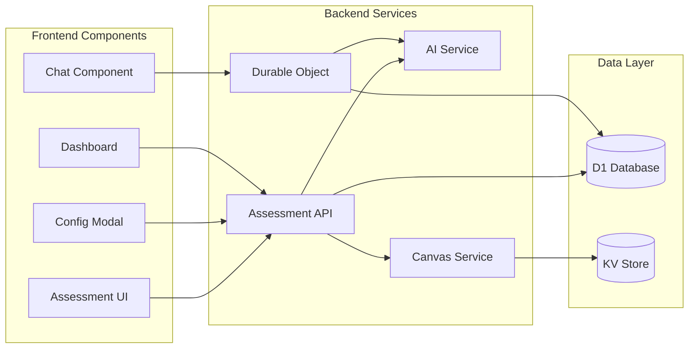

# 6. Components

## AI Assessment Service

**Responsibility:** Manages AI interactions for generating assessment content and processing student responses

**Key Interfaces:**

- `generateAssessmentContent(context: PageContent): Promise<AssessmentActivity>`
- `processStudentResponse(message: string, context: ConversationContext): Promise<AIResponse>`
- `evaluateMastery(conversation: Conversation): MasteryScore`

**Dependencies:** OpenAI/Anthropic API client, D1 database, Content extraction service

**Technology Stack:** TypeScript, Cloudflare Workers, streaming responses via TransformStream

## Canvas Integration Service

**Responsibility:** Handles all Canvas LMS interactions including deep linking, content extraction, and grade passback

**Key Interfaces:**

- `extractPageContent(messageData: PostMessage): PageContent`
- `submitGrade(score: number, assignmentId: string): Promise<void>`
- `getNameAndRoles(contextId: string): Promise<Roster>`

**Dependencies:** LTI service, Canvas API client, OAuth token management

**Technology Stack:** TypeScript, @atomicjolt/lti-endpoints, Canvas REST API

## Conversation Manager (Durable Object)

**Responsibility:** Maintains real-time conversation state and WebSocket connections for chat sessions

**Key Interfaces:**

- `handleWebSocketUpgrade(request: Request): Response`
- `processMessage(message: ChatMessage): Promise<void>`
- `syncToDatabase(): Promise<void>`

**Dependencies:** AI Assessment Service, D1 database, WebSocket API

**Technology Stack:** Cloudflare Durable Objects, WebSocket, TypeScript

## Assessment UI Components

**Responsibility:** React components for chat interface, configuration modal, and instructor dashboard

**Key Interfaces:**

- `<ChatAssessment />` - Main chat interface component
- `<DeepLinkConfig />` - Instructor configuration modal
- `<AnalyticsDashboard />` - Real-time progress visualization

**Dependencies:** WebSocket client, Canvas postMessage API, React hooks

**Technology Stack:** React 18, TypeScript, Zustand for state, Tailwind CSS

## Component Diagrams

