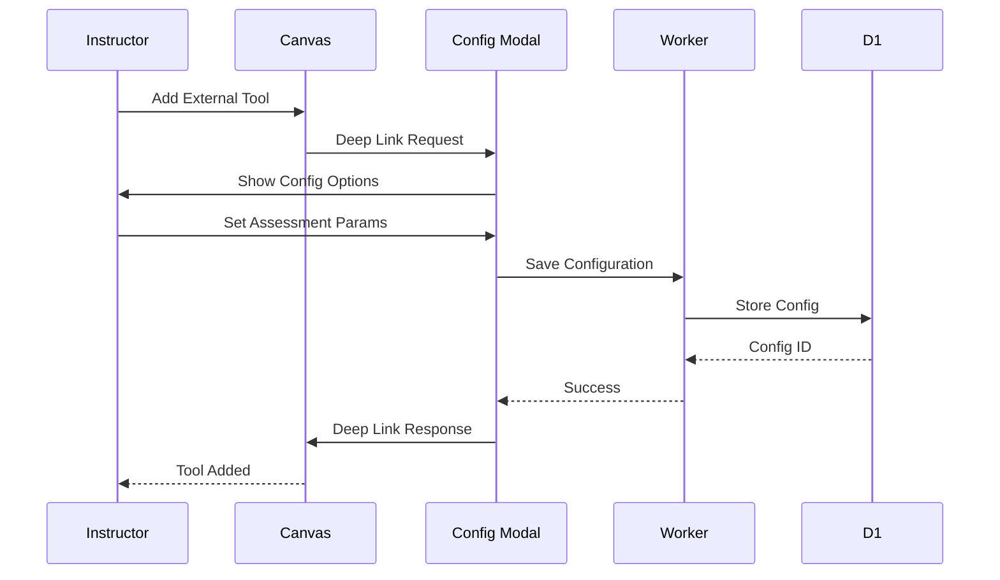
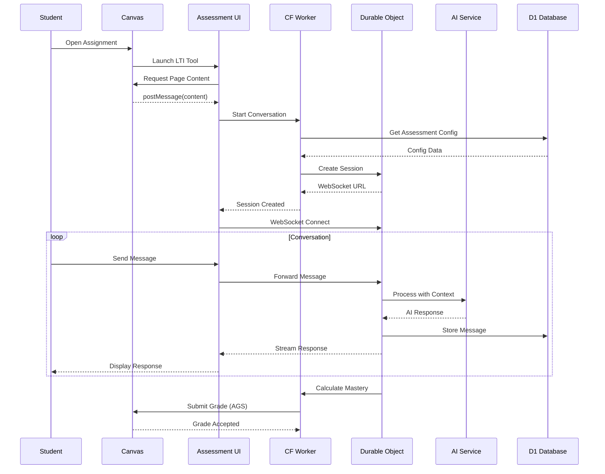

# 8. Core Workflows

## Deep Link Configuration Workflow

```mermaid
sequenceDiagram
    participant Instructor
    participant Canvas
    participant ConfigUI as Config Modal
    participant Worker
    participant D1

    Instructor->>Canvas: Add External Tool
    Canvas->>ConfigUI: Deep Link Request
    ConfigUI->>Instructor: Show Config Options
    Instructor->>ConfigUI: Set Assessment Params
    ConfigUI->>Worker: Save Configuration
    Worker->>D1: Store Config
    D1-->>Worker: Config ID
    Worker-->>ConfigUI: Success
    ConfigUI->>Canvas: Deep Link Response
    Canvas-->>Instructor: Tool Added
```

## Student Assessment Workflow

```mermaid
sequenceDiagram
    participant Student
    participant Canvas
    participant AssessUI as Assessment UI
    participant Worker as CF Worker
    participant DO as Durable Object
    participant AI as AI Service
    participant D1 as D1 Database

    Student->>Canvas: Open Assignment
    Canvas->>AssessUI: Launch LTI Tool
    AssessUI->>Canvas: Request Page Content
    Canvas-->>AssessUI: postMessage(content)

    AssessUI->>Worker: Start Conversation
    Worker->>D1: Get Assessment Config
    D1-->>Worker: Config Data
    Worker->>DO: Create Session
    DO-->>Worker: WebSocket URL
    Worker-->>AssessUI: Session Created

    AssessUI->>DO: WebSocket Connect

    loop Conversation
        Student->>AssessUI: Send Message
        AssessUI->>DO: Forward Message
        DO->>AI: Process with Context
        AI-->>DO: AI Response
        DO->>D1: Store Message
        DO-->>AssessUI: Stream Response
        AssessUI-->>Student: Display Response
    end

    DO->>Worker: Calculate Mastery
    Worker->>Canvas: Submit Grade (AGS)
    Canvas-->>Worker: Grade Accepted
```
