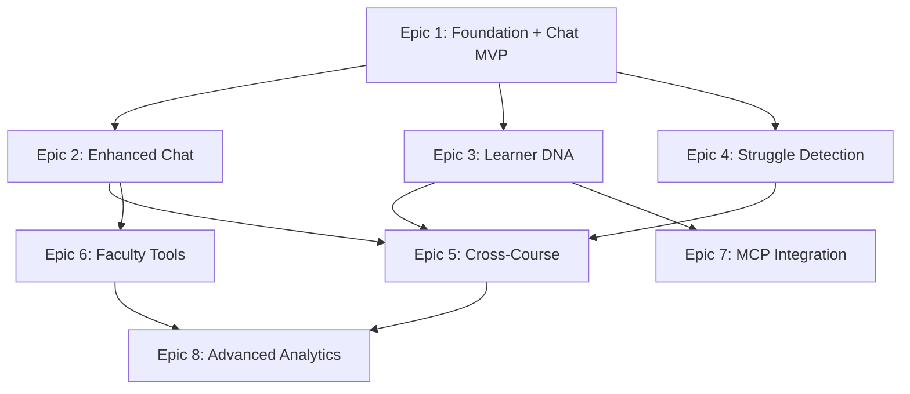

# Epic Dependency Analysis & Risk Assessment

## Executive Summary

The epic sequencing for Atomic Guide shows generally good progression with **logical value delivery**, but contains several **critical dependency risks** that could cause delays or rework if not properly managed.

**Overall Risk Level: MEDIUM-HIGH**
- 3 Critical dependency risks identified
- 5 Medium risks requiring careful coordination
- 2 Low risks with minimal impact

## Epic Dependency Map



## Critical Dependency Risks 🔴

### 1. **D1 Database Performance Unknown (Epic 1)**
**Risk**: Epic 1 establishes D1 as the foundation, but if D1 performance fails to meet acceptable query performance requirements with proper indexing, ALL subsequent epics are blocked.

**Impact**: 
- Epic 3 (Learner DNA) requires high-performance reads/writes
- Epic 4 (Struggle Detection) needs real-time event storage
- Epic 5 (Cross-Course) demands complex queries

**Mitigation**:
- Add "D1 Performance Validation" as Epic 0.5 (1-week spike)
- Build KV fallback layer in Epic 1
- Define clear go/no-go performance gates

### 2. **Chat Architecture Decisions Cascade (Epic 1-2)**
**Risk**: Chat implementation in Epic 1 locks in architectural patterns that may not scale for Epic 2's enhanced features.

**Specific Concerns**:
- WebSocket via Durable Objects chosen before understanding conversation memory needs
- Basic chat UI may require complete rebuild for rich media (Epic 2)
- LMS content extraction approach may not support proactive interventions (Epic 4)

**Mitigation**:
- Design Epic 2 features BEFORE implementing Epic 1 chat
- Build abstraction layer for chat transport (WebSocket/polling)
- Create extensible message format from start

### 3. **Learner DNA Without Usage Data (Epic 3)**
**Risk**: Building cognitive profiling algorithms (Epic 3) before having real usage data from Epics 1-2 may result in incorrect models.

**Impact**:
- Algorithms may not reflect actual learning patterns
- Privacy controls may be over/under-engineered
- Epic 5 predictions based on flawed profiles

**Mitigation**:
- Implement basic telemetry in Epic 1
- Delay complex algorithms to Epic 3.5
- Use Epic 2 data to validate Epic 3 assumptions

## Medium Dependency Risks 🟡

### 4. **Struggle Detection Requires DOM Access (Epic 4)**
**Risk**: postMessage monitoring depends on Canvas cooperation/configuration which isn't validated until Epic 4.

**Mitigation**: 
- Add Canvas integration POC to Epic 1
- Have fallback struggle detection via chat patterns

### 5. **Faculty Tools Before Student Adoption (Epic 6)**
**Risk**: Building faculty dashboard without proven student engagement metrics from Epics 1-5.

**Mitigation**:
- Make Epic 6 dashboard configurable
- Focus on chat analytics first

### 6. **Cross-Course Intelligence Data Volume (Epic 5)**
**Risk**: Knowledge graphs across courses may exceed D1 storage/query limits.

**Mitigation**:
- Prototype with single course first
- Consider graph database alternatives

### 7. **MCP Integration Security (Epic 7)**
**Risk**: OAuth implementation for external AI clients may conflict with LTI security model.

**Mitigation**:
- Design security model in Epic 1
- Validate with one AI client first

### 8. **React Migration Path (Epics 1-2)**
**Risk**: Gradual React integration may create technical debt and inconsistent UX.

**Mitigation**:
- Implement full React in Epic 1
- Avoid hybrid vanilla/React approach

## Low Dependency Risks 🟢

### 9. **Analytics Without Baseline (Epic 8)**
Position is appropriate as final epic, minimal risk.

### 10. **Privacy Controls Timing (Epic 3)**
Well-positioned after basic features but before advanced profiling.

## Recommended Sequencing Adjustments

### Option A: Risk-Mitigated Sequence (Recommended)
```
Epic 0.5: Technical Validation (1 week)
  - D1 performance testing
  - Canvas postMessage POC
  - React integration spike

Epic 1: Foundation + Telemetry (3 weeks)
  - Multi-tenant D1 with KV fallback
  - Basic chat with extensible architecture
  - Comprehensive event telemetry

Epic 2: Chat MVP + Student Dashboard (2 weeks)
  - Enhanced chat using telemetry insights
  - Student dashboard
  - A/B testing framework

Epic 3: Validated Learner DNA (3 weeks)
  - Cognitive profiling based on Epic 1-2 data
  - Privacy controls
  - Initial predictions

Epic 4: Struggle Detection (2 weeks)
  - Implement with validated Canvas integration
  - Proactive interventions

Epic 5: Cross-Course (2 weeks)
  - Scale proven algorithms
  - Knowledge graphs

Epic 6: Faculty Tools (2 weeks)
  - Dashboard with real metrics
  - Chat customization

Epic 7: MCP Integration (1 week)
  - External AI access
  - OAuth implementation

Epic 8: Optimization (2 weeks)
  - Advanced analytics
  - Algorithm refinement
```

### Option B: Fast-Track MVP (Higher Risk)
Keep current sequence but:
1. Add 1-week "Technical Spike" before Epic 1
2. Build Epic 1 with "replaceable" components
3. Plan for potential Epic 3 rework
4. Delay Epic 7 (MCP) until after validation

## Technical Dependencies Matrix

| Epic | Depends On | Provides | Critical Path |
|------|------------|----------|---------------|
| 1 | None | D1, Chat UI, WebSocket | ✅ Yes |
| 2 | 1 (Chat base) | Enhanced chat, telemetry | ✅ Yes |
| 3 | 1 (D1) | Learner profiles, algorithms | ❌ No |
| 4 | 1 (Chat), 3 (Profiles) | Struggle events | ❌ No |
| 5 | 3 (Profiles), 2 (Data) | Predictions | ✅ Yes |
| 6 | 2 (Chat data) | Faculty dashboard | ❌ No |
| 7 | 3 (Profiles) | External AI access | ❌ No |
| 8 | 5, 6 | Analytics, optimization | ❌ No |

## Go/No-Go Gates

### After Epic 0.5 (Technical Validation)
- **Gate**: D1 query performance acceptable with proper indexing?
- **Yes**: Proceed with D1
- **No**: Implement KV-only solution

### After Epic 1 (Foundation)
- **Gate**: Chat engagement >20% of users?
- **Yes**: Continue current path
- **No**: Pivot to faculty-first approach

### After Epic 3 (Learner DNA)
- **Gate**: Prediction accuracy >60%?
- **Yes**: Proceed to Epic 5
- **No**: Refine algorithms first

### After Epic 5 (Cross-Course)
- **Gate**: Cross-course predictions valuable?
- **Yes**: Continue to advanced features
- **No**: Focus on single-course optimization

## Risk Mitigation Summary

### Immediate Actions Required
1. **Create Epic 0.5** for technical validation (1 week)
2. **Design Epic 2 features** before implementing Epic 1
3. **Add telemetry** to Epic 1 for data collection
4. **Build abstraction layers** for replaceable components
5. **Define performance gates** with clear criteria

### Architecture Decisions Needed Now
1. **Chat transport**: WebSocket vs polling vs hybrid
2. **Message format**: Extensible schema for future features
3. **Storage strategy**: D1 + KV hybrid approach
4. **React integration**: Full migration vs progressive enhancement
5. **Security model**: LTI + OAuth integration pattern

### Contingency Plans
1. **If D1 fails**: Fall back to KV + external database
2. **If Canvas blocks**: Chat-only struggle detection
3. **If adoption low**: Pivot to faculty analytics first
4. **If React too heavy**: Optimize or use Preact
5. **If predictions inaccurate**: Focus on engagement metrics

## Conclusion

The epic sequence is **fundamentally sound** but requires:
1. **Technical validation sprint** before Epic 1
2. **Stronger telemetry** in early epics
3. **Abstraction layers** for replaceability
4. **Clear go/no-go gates** between phases

**Recommendation**: Adopt **Option A (Risk-Mitigated Sequence)** with Epic 0.5 technical validation. This adds 1 week upfront but significantly reduces risk of major rework later.

The current sequencing delivers value progressively:
- Epic 1-2: Immediate chat value
- Epic 3-4: Differentiated learning features  
- Epic 5-6: Institutional value
- Epic 7-8: Platform expansion

With proper risk mitigation, this sequence can successfully deliver the Atomic Guide vision while maintaining flexibility to pivot based on real-world feedback.