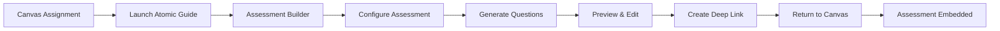

# Assessment Generation & Deep Linking

AI-powered assessment creation with seamless LMS integration through LTI Deep Linking 2.0.

## Overview

The assessment system enables instructors to create AI-generated quizzes, assignments, and interactive assessments that integrate directly into their LMS through deep linking. Students access these assessments without leaving their course environment, with automatic grade synchronization.

## Key Features

### AI-Powered Generation

- **Intelligent Question Creation**: Generate questions based on course content
- **Multiple Question Types**: MCQ, essay, fill-in-blank, matching, coding
- **Adaptive Difficulty**: Questions adjust based on learning objectives
- **Context-Aware**: Uses extracted course materials for relevance

### Deep Linking Integration

- **LTI 1.3 Deep Linking 2.0**: Full protocol implementation
- **Seamless Embedding**: Direct integration into LMS assignments
- **Automatic Authentication**: Single sign-on from LMS
- **Mobile Compatible**: Works on all devices

### Assessment Types

#### Formative Assessments

- Practice quizzes with immediate feedback
- Self-paced learning checks
- Unlimited attempts
- Detailed explanations

#### Summative Assessments

- Graded assignments and exams
- Time limits and attempt restrictions
- Academic integrity features
- Rubric-based evaluation

## Assessment Builder

### User Interface

```typescript
interface AssessmentConfig {
  title: string;
  description: string;
  type: 'formative' | 'summative';
  questions: Question[];
  settings: {
    timeLimit?: number;
    attempts: number;
    shuffleQuestions: boolean;
    showFeedback: 'immediate' | 'after_submission' | 'never';
    passingScore?: number;
  };
  rubric?: RubricCriteria[];
}
```

### Question Generation Flow

1. **Content Analysis**: System analyzes course materials
2. **Learning Objectives**: Identifies key concepts to assess
3. **Question Generation**: AI creates appropriate questions
4. **Review & Edit**: Instructor customizes generated questions
5. **Preview & Test**: Try assessment before publishing

### Supported Question Types

| Type            | Description                     | AI Generation | Auto-Grade |
| --------------- | ------------------------------- | ------------- | ---------- |
| Multiple Choice | Single/multiple correct answers | ✅            | ✅         |
| True/False      | Binary choice questions         | ✅            | ✅         |
| Essay           | Long-form text responses        | ✅            | Partial    |
| Fill in Blank   | Complete missing text           | ✅            | ✅         |
| Matching        | Connect related items           | ✅            | ✅         |
| Code            | Programming exercises           | ✅            | ✅         |
| Calculation     | Mathematical problems           | ✅            | ✅         |

## Deep Linking Workflow

### Instructor Flow



### Technical Implementation

```typescript
// Deep link content item structure
{
  "@context": "http://purl.imsglobal.org/ctx/lti/v1/ContentItem",
  "@graph": [{
    "@type": "LtiLinkItem",
    "mediaType": "application/vnd.ims.lti.v1.ltilink",
    "title": "AI-Generated Quiz: Chapter 5",
    "text": "Automated assessment on machine learning concepts",
    "url": "https://guide.atomicjolt.xyz/assessment/launch",
    "custom": {
      "assessment_id": "asmt_123",
      "course_id": "cs101",
      "type": "formative"
    },
    "lineItem": {
      "scoreMaximum": 100,
      "label": "Chapter 5 Quiz",
      "resourceId": "quiz_ch5"
    }
  }]
}
```

### API Endpoints

#### Create Assessment

```typescript
POST /api/assessments/create
Authorization: Bearer <jwt>
Content-Type: application/json

{
  "title": "Midterm Exam",
  "courseId": "math101",
  "topics": ["algebra", "calculus"],
  "questionCount": 20,
  "difficulty": "medium",
  "generateQuestions": true
}

Response:
{
  "assessmentId": "asmt_456",
  "questions": [...],
  "estimatedTime": 45,
  "deepLinkUrl": "https://..."
}
```

#### Launch Assessment

```typescript
POST /lti/assessment/launch
Content-Type: application/x-www-form-urlencoded

id_token=<lti_jwt>&state=<state>

Response: HTML page with assessment interface
```

## Grade Management

### Automatic Grade Sync

```typescript
// LTI Assignment and Grade Services (AGS)
POST https://canvas.instructure.com/api/lti/courses/:course_id/line_items/:line_item_id/scores
Authorization: Bearer <oauth_token>
Content-Type: application/vnd.ims.lis.v1.score+json

{
  "userId": "student_123",
  "scoreGiven": 85,
  "scoreMaximum": 100,
  "gradingProgress": "FullyGraded",
  "activityProgress": "Completed",
  "timestamp": "2024-01-15T10:00:00Z"
}
```

### Rubric-Based Evaluation

```typescript
interface RubricCriteria {
  id: string;
  name: string;
  description: string;
  points: number;
  levels: {
    excellent: { points: number; description: string };
    good: { points: number; description: string };
    needs_improvement: { points: number; description: string };
  };
}
```

## Student Experience

### Assessment Interface

1. **Launch**: Click assessment link in LMS
2. **Instructions**: View requirements and time limits
3. **Questions**: Navigate through assessment
4. **Save Progress**: Auto-save every 30 seconds
5. **Submit**: Review and submit answers
6. **Feedback**: Receive immediate or delayed feedback
7. **Review**: Access detailed explanations

### Accessibility Features

- **Screen Reader**: Full ARIA support
- **Keyboard Navigation**: Complete keyboard access
- **Time Extensions**: Configurable accommodations
- **High Contrast**: Visual accessibility modes
- **Text-to-Speech**: Audio question reading

## Analytics & Insights

### Instructor Dashboard

```typescript
interface AssessmentAnalytics {
  assessmentId: string;
  submissions: number;
  averageScore: number;
  medianScore: number;
  completionRate: number;
  averageTime: number;
  questionAnalysis: {
    questionId: string;
    correctRate: number;
    averageTime: number;
    commonMistakes: string[];
  }[];
  strugglePoints: {
    concept: string;
    affectedStudents: number;
    suggestedRemediation: string;
  }[];
}
```

### Student Performance Tracking

- Individual progress over time
- Concept mastery indicators
- Learning path recommendations
- Peer comparison (optional)

## Security & Integrity

### Academic Integrity Features

1. **Question Shuffling**: Random order per student
2. **Answer Randomization**: Different answer positions
3. **Time Stamps**: Track submission patterns
4. **Copy Prevention**: Disable text selection
5. **Browser Lockdown**: Optional full-screen mode

### Data Security

- **Encryption**: AES-256 for data at rest
- **TLS 1.3**: Secure data transmission
- **Token Validation**: JWT verification for all requests
- **Tenant Isolation**: Separate data per institution

## Configuration

### Environment Settings

```bash
# Assessment configuration
MAX_QUESTIONS_PER_ASSESSMENT=100
DEFAULT_TIME_LIMIT=3600  # seconds
MAX_FILE_UPLOAD_SIZE=10485760  # 10MB
ENABLE_PROCTORING=false

# AI generation settings
QUESTION_GENERATION_MODEL="@cf/meta/llama-3-8b-instruct"
MAX_GENERATION_ATTEMPTS=3
GENERATION_TEMPERATURE=0.7
```

### Per-Institution Settings

```typescript
{
  "institutionId": "uni_789",
  "assessmentSettings": {
    "allowedTypes": ["formative", "summative"],
    "maxQuestionsPerAssessment": 50,
    "requireRubric": true,
    "gradePassback": true,
    "features": {
      "aiGeneration": true,
      "peerReview": false,
      "proctoring": false
    }
  }
}
```

## Development Guide

### Creating Custom Question Types

```typescript
interface CustomQuestionType {
  type: string;
  component: React.ComponentType<QuestionProps>;
  validator: (response: any) => boolean;
  scorer: (response: any, answer: any) => number;
  generator?: (context: any) => Promise<Question>;
}

// Register custom type
AssessmentEngine.registerQuestionType({
  type: 'diagram',
  component: DiagramQuestion,
  validator: validateDiagram,
  scorer: scoreDiagram,
  generator: generateDiagramQuestion,
});
```

### Testing Assessments

```bash
# Generate test assessment
npm run test:assessment -- --generate

# Validate deep links
npm run test:deeplink -- --platform=canvas

# Load test grade sync
npm run test:grades -- --concurrent=100
```

## Troubleshooting

### Common Issues

| Issue                    | Cause                  | Solution                     |
| ------------------------ | ---------------------- | ---------------------------- |
| Deep link fails          | Invalid JWT            | Check platform configuration |
| Grades not syncing       | Missing AGS scope      | Update LTI registration      |
| Questions not generating | AI service error       | Check model availability     |
| Preview not loading      | Browser blocking popup | Allow popups for domain      |

## Future Enhancements

- **Adaptive Testing**: Questions adjust to student ability
- **Group Assessments**: Collaborative problem-solving
- **Audio/Video Questions**: Multimedia assessment types
- **Peer Review**: Student evaluation workflows
- **Competency Mapping**: Align with learning standards
