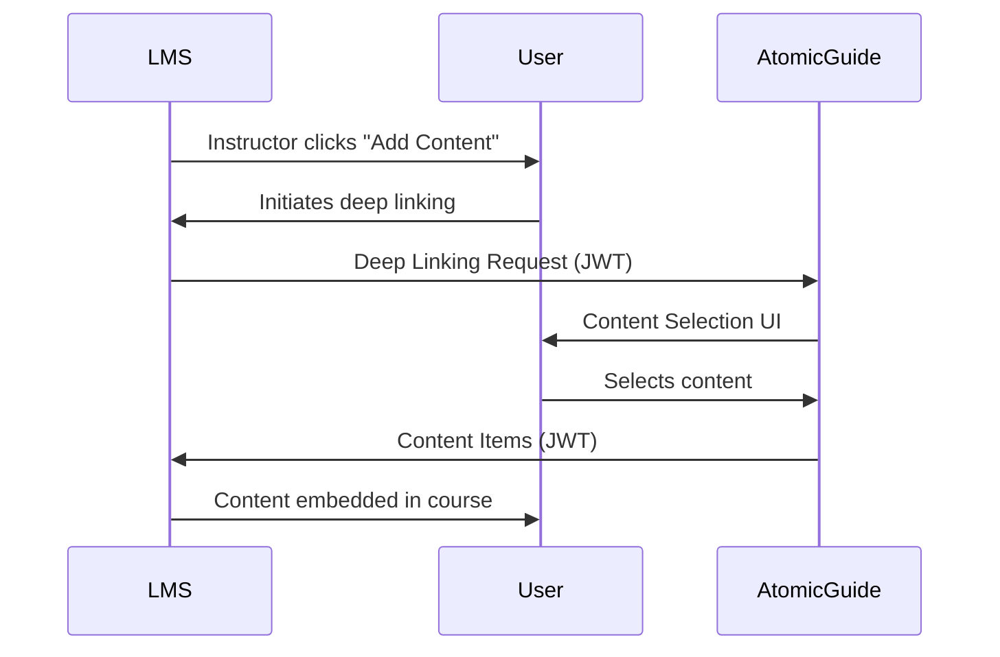

# LTI Deep Linking

Complete implementation of LTI 1.3 Deep Linking 2.0 for seamless content integration with Learning Management Systems.

## Overview

Deep Linking allows instructors to browse, select, and embed Atomic Guide content directly into their LMS courses. This includes assessments, chat widgets, analytics dashboards, and custom learning modules.

## Deep Linking Flow

### Standard Flow Diagram



## Content Types

### Available Content Items

```typescript
enum ContentType {
  ASSESSMENT = 'assessment',        // Quizzes and exams
  CHAT_WIDGET = 'chat',            // AI chat assistant
  ANALYTICS = 'analytics',         // Dashboard views
  RESOURCE = 'resource',           // Learning materials
  ACTIVITY = 'activity',           // Interactive exercises
  MODULE = 'module'                // Complete learning modules
}
```

### Content Item Structure

```typescript
interface DeepLinkContentItem {
  '@context': 'http://purl.imsglobal.org/ctx/lti/v1/ContentItem';
  '@graph': [{
    '@type': 'LtiLinkItem';
    mediaType: 'application/vnd.ims.lti.v1.ltilink';
    title: string;
    text?: string;
    url: string;
    icon?: {
      '@id': string;
      width?: number;
      height?: number;
    };
    thumbnail?: {
      '@id': string;
      width?: number;
      height?: number;
    };
    lineItem?: {
      scoreMaximum: number;
      label: string;
      resourceId: string;
    };
    custom?: Record<string, any>;
    iframe?: {
      width?: number;
      height?: number;
    };
  }];
}
```

## Implementation

### Server-Side Handler

```typescript
// src/api/handlers/deepLinking.ts
export class DeepLinkingHandler {
  async handleDeepLinkingRequest(request: Request): Promise<Response> {
    // 1. Validate incoming JWT
    const token = await this.validatePlatformJWT(request);
    
    // 2. Extract deep linking claim
    const deepLinkingSettings = token[
      'https://purl.imsglobal.org/spec/lti-dl/claim/deep_linking_settings'
    ];
    
    // 3. Store state for return
    await this.storeDeepLinkingState({
      deploymentId: token.deployment_id,
      returnUrl: deepLinkingSettings.deep_link_return_url,
      acceptTypes: deepLinkingSettings.accept_types,
      acceptPresentationTargets: deepLinkingSettings.accept_presentation_document_targets
    });
    
    // 4. Redirect to content selection UI
    return Response.redirect('/deeplink/select');
  }

  async createContentItemResponse(
    selections: ContentSelection[]
  ): Promise<string> {
    const contentItems = selections.map(this.createContentItem);
    
    const message = {
      'https://purl.imsglobal.org/spec/lti-dl/claim/content_items': contentItems,
      'https://purl.imsglobal.org/spec/lti-dl/claim/msg': 'Content successfully added'
    };
    
    return this.signJWT(message);
  }
}
```

### Client-Side Selection UI

```typescript
// client/components/DeepLinkSelector.tsx
export function DeepLinkSelector() {
  const [selectedItems, setSelectedItems] = useState<ContentItem[]>([]);
  const [contentType, setContentType] = useState<ContentType>('assessment');

  const availableContent = {
    assessment: useAssessments(),
    chat: useChatWidgets(),
    analytics: useAnalyticsDashboards(),
    resource: useResources()
  };

  const handleSelection = (item: ContentItem) => {
    setSelectedItems([...selectedItems, item]);
  };

  const handleSubmit = async () => {
    const response = await createDeepLinks(selectedItems);
    window.location.href = response.returnUrl;
  };

  return (
    <div className="deep-link-selector">
      <ContentTypeTabs 
        value={contentType}
        onChange={setContentType}
      />
      
      <ContentGrid
        items={availableContent[contentType]}
        onSelect={handleSelection}
        selected={selectedItems}
      />
      
      <SelectionSummary items={selectedItems} />
      
      <button onClick={handleSubmit}>
        Add to Course
      </button>
    </div>
  );
}
```

## Content Configuration

### Assessment Deep Links

```typescript
interface AssessmentDeepLink {
  type: 'assessment';
  config: {
    assessmentId: string;
    title: string;
    description: string;
    points: number;
    dueDate?: Date;
    attempts: number;
    timeLimit?: number;
    settings: {
      shuffleQuestions: boolean;
      showFeedback: boolean;
      lockAfterSubmission: boolean;
    };
  };
  grading: {
    type: 'auto' | 'manual' | 'hybrid';
    rubricId?: string;
    latePolicy?: LatePolicy;
  };
}
```

### Chat Widget Deep Links

```typescript
interface ChatDeepLink {
  type: 'chat';
  config: {
    widgetId: string;
    title: string;
    placement: 'embedded' | 'floating' | 'sidebar';
    context: {
      courseId: string;
      moduleId?: string;
      topicRestrictions?: string[];
    };
    appearance: {
      theme: 'light' | 'dark' | 'auto';
      position?: 'bottom-right' | 'bottom-left';
      size?: 'compact' | 'regular' | 'large';
    };
  };
}
```

## Platform-Specific Features

### Canvas Integration

```typescript
// Canvas-specific extensions
interface CanvasDeepLink extends DeepLinkContentItem {
  'https://canvas.instructure.com/lti/submission_type'?: {
    external_tool_url: string;
    submission_types: string[];
  };
  'https://canvas.instructure.com/lti/assignment'?: {
    points_possible: number;
    grading_type: string;
    submission_types: string[];
  };
}
```

### Moodle Integration

```typescript
// Moodle-specific handling
class MoodleDeepLinkAdapter {
  adaptContentItem(item: ContentItem): MoodleContentItem {
    return {
      ...item,
      // Moodle-specific properties
      module_type: this.mapToMoodleType(item.type),
      section: item.custom?.section || 0,
      visible: item.custom?.visible ?? true
    };
  }
}
```

## Security

### JWT Validation

```typescript
class DeepLinkingSecurity {
  async validateDeepLinkingJWT(token: string): Promise<DeepLinkingClaim> {
    // 1. Verify signature with platform public key
    const publicKey = await this.getPlatformPublicKey();
    const verified = await this.verifyJWT(token, publicKey);
    
    // 2. Validate required claims
    this.validateRequiredClaims(verified, [
      'iss',
      'aud',
      'exp',
      'iat',
      'nonce',
      'https://purl.imsglobal.org/spec/lti/claim/deployment_id',
      'https://purl.imsglobal.org/spec/lti-dl/claim/deep_linking_settings'
    ]);
    
    // 3. Check message type
    if (verified['https://purl.imsglobal.org/spec/lti/claim/message_type'] 
        !== 'LtiDeepLinkingRequest') {
      throw new Error('Invalid message type');
    }
    
    return verified;
  }
}
```

### Content Item Signing

```typescript
async signContentItems(items: ContentItem[]): Promise<string> {
  const payload = {
    iss: 'https://guide.atomicjolt.xyz',
    aud: this.platformClientId,
    exp: Math.floor(Date.now() / 1000) + 600,
    iat: Math.floor(Date.now() / 1000),
    nonce: crypto.randomUUID(),
    'https://purl.imsglobal.org/spec/lti/claim/deployment_id': this.deploymentId,
    'https://purl.imsglobal.org/spec/lti/claim/message_type': 'LtiDeepLinkingResponse',
    'https://purl.imsglobal.org/spec/lti/claim/version': '1.3.0',
    'https://purl.imsglobal.org/spec/lti-dl/claim/content_items': items
  };
  
  return await this.signJWT(payload, this.privateKey);
}
```

## Error Handling

### Common Errors

```typescript
enum DeepLinkingError {
  INVALID_JWT = 'Invalid or expired JWT token',
  MISSING_CLAIM = 'Required claim missing from token',
  INVALID_CONTENT_TYPE = 'Content type not accepted by platform',
  AUTHORIZATION_FAILED = 'User not authorized for deep linking',
  PLATFORM_ERROR = 'Platform returned an error',
  TIMEOUT = 'Deep linking session timeout'
}

class DeepLinkingErrorHandler {
  handle(error: DeepLinkingError): Response {
    const errorResponse = {
      error: error,
      timestamp: new Date().toISOString(),
      suggestion: this.getSuggestion(error)
    };
    
    // Return to platform with error
    return this.createErrorResponse(errorResponse);
  }
}
```

## Configuration

### Platform Registration

```typescript
interface DeepLinkingConfig {
  enabled: boolean;
  acceptedTypes: ContentType[];
  maxSelections: number;
  defaultPresentation: 'iframe' | 'window' | 'embed';
  customParameters: {
    allowGrading: boolean;
    allowScheduling: boolean;
    requireDescription: boolean;
  };
  platformOverrides: {
    canvas?: Partial<DeepLinkingConfig>;
    moodle?: Partial<DeepLinkingConfig>;
    blackboard?: Partial<DeepLinkingConfig>;
  };
}
```

### Environment Variables

```bash
# Deep Linking Configuration
DEEP_LINKING_ENABLED=true
MAX_CONTENT_SELECTIONS=10
DEFAULT_IFRAME_WIDTH=800
DEFAULT_IFRAME_HEIGHT=600
CONTENT_ITEM_TIMEOUT=600  # seconds
```

## Testing

### Manual Testing

```bash
# Test deep linking flow
npm run test:deeplink -- --platform=canvas

# Validate content items
npm run validate:deeplink -- --file=content-items.json
```

### Automated Tests

```typescript
describe('Deep Linking', () => {
  it('should handle deep linking request', async () => {
    const jwt = createMockDeepLinkingJWT();
    const response = await handleDeepLinkingRequest(jwt);
    
    expect(response.status).toBe(302);
    expect(response.headers.get('Location')).toContain('/deeplink/select');
  });
  
  it('should create valid content items', async () => {
    const selections = [
      { type: 'assessment', id: 'quiz-1' },
      { type: 'chat', id: 'widget-1' }
    ];
    
    const jwt = await createContentItemResponse(selections);
    const decoded = decodeJWT(jwt);
    
    expect(decoded['https://purl.imsglobal.org/spec/lti-dl/claim/content_items'])
      .toHaveLength(2);
  });
});
```

## Best Practices

### Do's
- ✅ Always validate JWT signatures
- ✅ Check accept_types before showing content
- ✅ Provide clear content descriptions
- ✅ Include thumbnails for visual selection
- ✅ Handle errors gracefully

### Don'ts
- ❌ Don't store sensitive data in custom parameters
- ❌ Don't exceed platform selection limits
- ❌ Don't assume platform capabilities
- ❌ Don't skip JWT validation
- ❌ Don't ignore presentation targets

## Troubleshooting

| Issue | Solution |
|-------|----------|
| Content not appearing | Check accept_types match |
| JWT validation fails | Verify platform public key |
| Return URL error | Validate deep_link_return_url |
| Grade sync not working | Ensure lineItem included |
| Wrong presentation | Check accept_presentation_document_targets |

## Platform Compatibility

| Platform | Version | Deep Linking | Grade Passback | Notes |
|----------|---------|--------------|----------------|-------|
| Canvas | Latest | ✅ | ✅ | Full support |
| Moodle | 3.9+ | ✅ | ✅ | Full support |
| Blackboard | Learn 3.0+ | ✅ | ✅ | Full support |
| D2L Brightspace | 20.20+ | ✅ | ✅ | Full support |
| Schoology | Latest | ✅ | ⚠️ | Limited AGS |

## Future Enhancements

- **Bulk Import**: Select multiple items at once
- **Templates**: Pre-configured content packages
- **Preview Mode**: Try before embedding
- **Analytics Integration**: Track content effectiveness
- **Collaborative Selection**: Multiple instructors choosing content