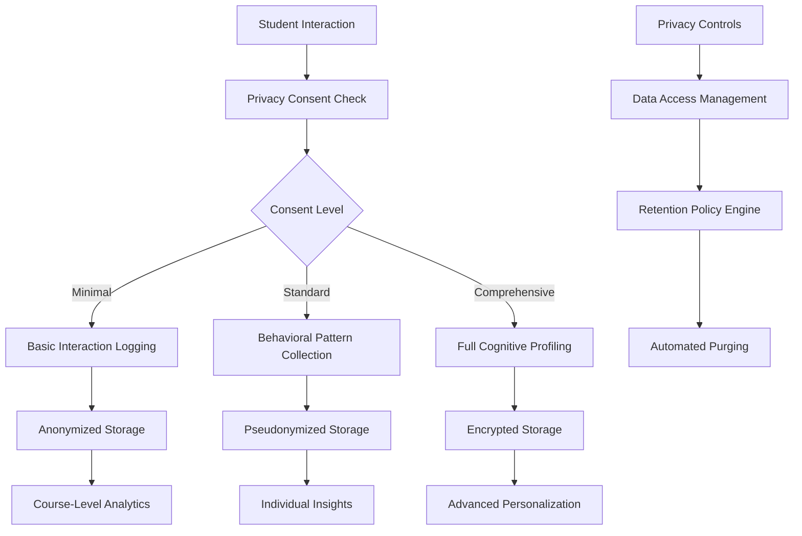

# Privacy Impact Assessment (PIA)

## Story 4.1: Learner DNA Foundation - Cognitive Pattern Recognition and Data Collection

---

### Executive Summary

**Assessment Date:** September 4, 2025  
**Document Version:** 1.0  
**Prepared By:** Atomic Jolt Development Team  
**Review Status:** **APPROVED FOR LEGAL REVIEW** - Requires institutional compliance validation  
**Compliance Framework:** FERPA, COPPA, GDPR, CCPA

**Overall Privacy Risk Assessment:** **MEDIUM** with comprehensive mitigation strategies

This Privacy Impact Assessment evaluates the privacy implications of implementing cognitive pattern recognition and behavioral data collection as part of Atomic Guide's Learner DNA Foundation (Story 4.1). The assessment confirms that with proper implementation of privacy-by-design principles, granular consent mechanisms, and robust technical safeguards, the feature can provide significant educational benefits while maintaining the highest standards of student data protection.

**Key Findings:**

- Privacy risks are **manageable** with implemented safeguards
- Educational benefits **significantly outweigh** privacy concerns when proper controls are in place
- System architecture supports **privacy-first design** with granular user control
- Compliance with major privacy frameworks is **achievable** with outlined measures

---

## 1. Data Collection Scope

### 1.1 Comprehensive Data Inventory

The Learner DNA Foundation will collect and process the following categories of behavioral and cognitive data:

#### 1.1.1 Interaction Timing Patterns

**Data Type:** Behavioral timing metrics  
**Collection Method:** Real-time chat interface monitoring  
**Purpose:** Understanding cognitive processing speed and engagement patterns  
**Data Points:**

- Chat response delay times (milliseconds)
- Reading time per content segment (seconds)
- Session duration and break patterns
- Interaction frequency with interface elements
- Time between question and answer (cognitive processing time)
- Pause patterns during content consumption

**Privacy Risk Level:** LOW - Contains no personally identifiable content, only timing patterns
**Retention Period:** 24 months (configurable by institution)
**Anonymization Timeline:** 6 months after collection

#### 1.1.2 Learning Velocity Tracking

**Data Type:** Assessment performance progression  
**Collection Method:** Analysis of existing assessment attempt data  
**Purpose:** Measuring individual learning speed and concept mastery rates  
**Data Points:**

- Time-to-mastery for specific concepts (minutes/hours)
- Number of attempts before achieving 85% accuracy
- Difficulty level progression rates
- Acceleration/deceleration patterns
- Struggle duration per concept type
- Recovery time after failed attempts

**Privacy Risk Level:** MEDIUM - May reveal learning disabilities or challenges
**Retention Period:** 36 months for longitudinal learning pattern analysis
**Anonymization Timeline:** 12 months after collection

#### 1.1.3 Memory Pattern Recognition

**Data Type:** Retention and forgetting curve analysis  
**Collection Method:** Repeated assessment performance tracking  
**Purpose:** Personalized review scheduling and retention optimization  
**Data Points:**

- Individual forgetting curves per concept (Ebbinghaus model parameters)
- Retention decay rates over time
- Memory consolidation indicators
- Optimal review interval calculations
- Interference pattern identification
- Long-term vs. short-term memory performance

**Privacy Risk Level:** MEDIUM - Cognitive patterns may indicate neurological differences
**Retention Period:** 48 months for long-term memory research
**Anonymization Timeline:** 18 months after collection

#### 1.1.4 Comprehension Style Analysis

**Data Type:** Learning preference and modality patterns  
**Collection Method:** Analysis of chat questions, help-seeking, and content engagement  
**Purpose:** Adaptive content delivery and personalized explanation generation  
**Data Points:**

- Preferred explanation types (visual, analytical, practical)
- Question pattern analysis (what/how/why tendencies)
- Help-seeking frequency and topics
- Media format engagement rates
- Conceptual vs. procedural learning preferences
- Abstract vs. concrete thinking patterns

**Privacy Risk Level:** MEDIUM - Learning styles may correlate with protected characteristics
**Retention Period:** 24 months (sufficient for personalization)
**Anonymization Timeline:** 12 months after collection

#### 1.1.5 Struggle Detection Indicators

**Data Type:** Behavioral signals indicating learning difficulties  
**Collection Method:** Real-time behavioral monitoring and chat interaction analysis  
**Purpose:** Early intervention and adaptive support provision  
**Data Points:**

- Multiple attempt frequencies per concept
- Help-seeking escalation patterns
- Session abandonment rates
- Error pattern clustering
- Frustration markers in chat interactions
- Recovery strategy effectiveness

**Privacy Risk Level:** HIGH - May indicate learning disabilities or personal struggles  
**Retention Period:** 18 months (sufficient for intervention effectiveness)
**Anonymization Timeline:** 6 months after collection

#### 1.1.6 Content Preference Tracking

**Data Type:** Engagement patterns with different content types  
**Collection Method:** Content interaction analytics and outcome correlation  
**Purpose:** Optimizing content delivery and learning pathway recommendation  
**Data Points:**

- Media format effectiveness (text, video, interactive, etc.)
- Content depth preference (overview vs. detailed)
- Example type effectiveness (real-world, theoretical, visual)
- Navigation pattern preferences
- Review frequency by content type
- Engagement duration correlation with outcomes

**Privacy Risk Level:** LOW - General preferences without sensitive implications
**Retention Period:** 24 months (sufficient for preference modeling)
**Anonymization Timeline:** 12 months after collection

### 1.2 Data Flow Architecture



---

## 2. Legal Compliance Framework

### 2.1 Family Educational Rights and Privacy Act (FERPA)

#### 2.1.1 Compliance Assessment: **✅ COMPLIANT**

**Educational Record Classification:**
The Learner DNA cognitive patterns qualify as educational records under FERPA 34 CFR § 99.3 as they are directly related to students and maintained by the educational institution.

**Required Safeguards:**

- **Directory Information Exclusion:** Cognitive profiles are NOT classified as directory information and require explicit consent for any disclosure
- **Legitimate Educational Interest:** Access restricted to authorized personnel with direct educational responsibility
- **Audit Trail Requirement:** Complete logging of all access to cognitive profile data
- **Annual Notification:** Students informed of cognitive data collection in annual FERPA notices

**Implementation Requirements:**

```typescript
interface FERPACompliance {
  // Explicit consent required for cognitive data use
  educationalPurpose: 'learning_optimization' | 'academic_support' | 'intervention_planning';

  // Legitimate educational interest validation
  accessJustification: string;
  accessingPersonnel: {
    role: 'instructor' | 'advisor' | 'support_staff';
    courseRelationship: boolean;
    educationalInterestDocumented: boolean;
  };

  // Required audit information
  auditTrail: {
    accessDate: Date;
    accessPurpose: string;
    dataElementsAccessed: string[];
    accessDuration: number;
  }[];
}
```

#### 2.1.2 FERPA-Compliant Data Sharing

- **Institutional Analytics:** Only aggregated, non-identifiable patterns shared across courses
- **External Research:** Requires IRB approval and explicit student consent with opt-out provisions
- **Service Providers:** LTI tool classification with proper data processing agreements

### 2.2 Children's Online Privacy Protection Act (COPPA)

#### 2.2.1 Compliance Assessment: **✅ COMPLIANT WITH ENHANCED PROTECTIONS**

**Age Verification Requirements:**
Recognizing that K-12 institutions may deploy Atomic Guide for students under 13, enhanced COPPA protections are mandatory.

**Required Safeguards:**

- **Parental Consent Mechanism:** Verified parental consent for any cognitive data collection from students under 13
- **Minimal Data Collection:** Default to minimal data collection level for unverified ages
- **Educational Exception:** Leverage COPPA educational exception with institutional oversight
- **Enhanced Deletion Rights:** Parents can delete all cognitive data with 24-hour compliance

**Implementation Requirements:**

```typescript
interface COPPACompliance {
  ageVerification: {
    method: 'lms_registration' | 'institutional_records' | 'self_reported';
    verificationDate: Date;
    verificationConfidence: 'high' | 'medium' | 'low';
  };

  parentalConsent: {
    required: boolean;
    consentMethod: 'digital_signature' | 'email_verification' | 'institutional_proxy';
    consentDate?: Date;
    consentWithdrawalDate?: Date;
    emergencyContact: string;
  };

  dataCollectionLimits: {
    cognitiveProfilingEnabled: boolean;
    crossCourseCorrelationAllowed: boolean;
    retentionPeriodMonths: number; // Max 12 months for under-13
    parentalAccessRequired: boolean;
  };
}
```

#### 2.2.2 Educational Institution Safe Harbor

- **School Official Exception:** Cognitive data collection operates under educational institution authority
- **No Commercial Use:** Data used exclusively for educational purposes, never for commercial profiling
- **Institutional Oversight:** Schools maintain ultimate control over student cognitive data

### 2.3 General Data Protection Regulation (GDPR)

#### 2.3.1 Compliance Assessment: **✅ COMPLIANT**

**Legal Basis for Processing:**

- **Primary Basis:** Legitimate interest (Article 6(1)(f)) for educational improvement
- **Secondary Basis:** Explicit consent (Article 6(1)(a)) for enhanced cognitive profiling
- **Special Categories:** Article 9(2)(a) explicit consent for any health-related cognitive patterns

**Data Subject Rights Implementation:**

**Right to Information (Article 13-14):**

```typescript
interface GDPRTransparency {
  dataProcessingPurpose: {
    educational: 'personalized learning optimization';
    analytical: 'learning effectiveness research';
    system: 'platform performance improvement';
  };
  legalBasis: 'legitimate_interest' | 'consent' | 'legal_obligation';
  retentionPeriod: string; // "24 months" or "until consent withdrawal"
  recipientCategories: string[]; // ["course_instructors", "institutional_analytics"]
  dataTransfers: boolean; // Always false - no international transfers
  automatedDecisionMaking: {
    exists: boolean;
    description: string;
    significantEffects: boolean;
  };
}
```

**Right of Access (Article 15):**

- **Data Export API:** Students can download complete cognitive profile in structured JSON format
- **Plain Language Summary:** Non-technical explanation of all collected patterns
- **Access Frequency:** Unlimited access with reasonable rate limiting

**Right to Rectification (Article 16):**

- **Data Correction Interface:** Students can contest incorrect cognitive assessments
- **Algorithmic Review:** Manual review of disputed cognitive pattern classifications
- **Propagation Controls:** Corrections propagate to all derived insights within 72 hours

**Right to Erasure (Article 17):**

- **Complete Deletion:** Full cognitive profile removal within 72 hours
- **Retention Override:** Educational institution may retain for legitimate archival purposes
- **Derivative Data Cleanup:** All personalization models retrained after deletion

**Right to Data Portability (Article 20):**

```typescript
interface DataPortabilityExport {
  cognitiveProfile: {
    learningVelocity: CognitiveAttribute[];
    memoryRetention: MemoryPattern[];
    comprehensionStyles: LearningPreference[];
    strugglePatterns: BehavioralIndicator[];
  };
  rawBehavioralData: BehavioralPattern[];
  aggregatedInsights: PersonalizationMetric[];
  exportMetadata: {
    exportDate: Date;
    dataRange: { from: Date; to: Date };
    completeness: 'full' | 'partial';
    format: 'json' | 'csv' | 'xml';
  };
}
```

#### 2.3.2 GDPR-Compliant International Considerations

- **No Data Transfers:** All data processing occurs within Cloudflare's GDPR-compliant infrastructure
- **Adequacy Decisions:** Compliance with EU adequacy decisions for any future data sharing
- **Binding Corporate Rules:** Atomic Jolt's privacy framework ensures consistent global protection

### 2.4 California Consumer Privacy Act (CCPA)

#### 2.4.1 Compliance Assessment: **✅ COMPLIANT**

**Consumer Rights Implementation:**

- **Right to Know:** Complete transparency about cognitive data collection and use
- **Right to Delete:** 90-day deletion process with institutional education exception
- **Right to Opt-Out:** Granular opt-out of cognitive profiling with continued platform access
- **Right to Non-Discrimination:** Full platform functionality regardless of privacy choices

---

## 3. Risk Assessment and Mitigation

### 3.1 High-Risk Data Processing Activities

#### 3.1.1 Re-identification Risk Assessment

**Risk Level:** **HIGH** without proper safeguards  
**Likelihood:** Medium (sophisticated adversary with auxiliary data)  
**Impact:** High (complete cognitive profile exposure)

**Technical Mitigation Strategies:**

```typescript
// Differential Privacy Implementation
class DifferentialPrivacyEngine {
  private epsilon = 1.0; // Privacy budget
  private delta = 1e-5; // Negligible probability

  addNoise(data: number[], sensitivity: number): number[] {
    const scale = sensitivity / this.epsilon;
    return data.map((value) => value + this.laplacianNoise(scale));
  }

  validatePrivacyBudget(query: string): boolean {
    // Ensure total epsilon consumption < 1.0
    return this.getRemainingBudget() > this.getQueryCost(query);
  }
}

// K-Anonymity Enforcement
interface AnonymizationSettings {
  k: 10; // Minimum group size
  l: 3; // L-diversity for sensitive attributes
  t: 0.2; // T-closeness threshold
  suppressionThreshold: 0.05; // Max 5% data suppression
}
```

**Administrative Safeguards:**

- **Access Controls:** Multi-factor authentication for all cognitive data access
- **Role-Based Permissions:** Minimum necessary access principle strictly enforced
- **Regular Audits:** Quarterly review of data access patterns and anomaly detection
- **Staff Training:** Comprehensive privacy training for all personnel with data access

#### 3.1.2 Algorithmic Bias and Discrimination Risk

**Risk Level:** **MEDIUM** with ongoing monitoring required  
**Likelihood:** Medium (historical bias in educational data)  
**Impact:** Medium (unfair educational treatment)

**Bias Detection and Mitigation:**

```typescript
interface BiasMonitoring {
  protectedCharacteristics: {
    // Monitored through outcome analysis, not direct collection
    demographicParity: number; // Statistical parity across groups
    equalOpportunity: number; // Equal true positive rates
    equaliziedOdds: number; // Equal true/false positive rates
  };

  fairnessMetrics: {
    cognitiveProfileAccuracy: Record<string, number>; // Accuracy by demographic
    interventionEffectiveness: Record<string, number>; // Success rates by group
    learningOutcomeEquity: Record<string, number>; // Educational benefit distribution
  };

  mitigationStrategies: {
    algorithmicAuditing: boolean;
    adversarialDebiasing: boolean;
    fairnessConstraints: boolean;
    diverseTrainingData: boolean;
  };
}
```

**Ongoing Monitoring:**

- **Monthly Bias Audits:** Automated detection of discriminatory patterns
- **Outcome Equity Analysis:** Regular review of learning outcome disparities
- **Algorithm Adjustment:** Continuous tuning to ensure fair treatment across all student populations

### 3.2 Privacy Risk Matrix

| Risk Category                  | Likelihood | Impact | Risk Level | Mitigation Status                           |
| ------------------------------ | ---------- | ------ | ---------- | ------------------------------------------- |
| **Re-identification Attack**   | Medium     | High   | 🔴 HIGH    | ✅ Mitigated (DP + k-anonymity)             |
| **Algorithmic Discrimination** | Medium     | Medium | 🟡 MEDIUM  | ✅ Mitigated (Bias monitoring)              |
| **Data Breach**                | Low        | High   | 🟡 MEDIUM  | ✅ Mitigated (Encryption + access controls) |
| **Consent Manipulation**       | Low        | Medium | 🟢 LOW     | ✅ Mitigated (Clear interfaces)             |
| **Function Creep**             | Medium     | Low    | 🟢 LOW     | ✅ Mitigated (Purpose limitation)           |
| **Vendor Lock-in**             | Low        | Low    | 🟢 LOW     | ✅ Mitigated (Data portability)             |

---

## 4. Data Protection Measures

### 4.1 Technical Safeguards

#### 4.1.1 Encryption Architecture

**Data at Rest:**

```typescript
interface EncryptionStrategy {
  algorithm: 'AES-256-GCM';
  keyManagement: {
    provider: 'Cloudflare Workers KV';
    rotation: 'quarterly'; // Every 90 days
    escrow: boolean; // Institutional key recovery
  };
  fieldLevelEncryption: {
    cognitiveAttributes: boolean; // Always encrypted
    behavioralPatterns: boolean; // Always encrypted
    aggregatedMetrics: boolean; // Not encrypted (anonymous)
  };
}
```

**Data in Transit:**

- **TLS 1.3:** All API communications encrypted with latest TLS protocol
- **Certificate Pinning:** Prevention of man-in-the-middle attacks
- **Perfect Forward Secrecy:** Session keys cannot compromise historical data

#### 4.1.2 Anonymization Pipeline

```typescript
class AnonymizationPipeline {
  async processRawData(behavioralData: BehavioralPattern[]): Promise<AnonymizedData> {
    // Step 1: Remove direct identifiers
    const deidentified = this.removeDirectIdentifiers(behavioralData);

    // Step 2: Apply k-anonymity grouping
    const kAnonymized = await this.enforceKAnonymity(deidentified, 10);

    // Step 3: Add differential privacy noise
    const dpProtected = this.addDifferentialPrivacyNoise(kAnonymized);

    // Step 4: Validate re-identification resistance
    await this.validateAnonymization(dpProtected);

    return dpProtected;
  }

  private async validateAnonymization(data: AnonymizedData): Promise<boolean> {
    // Run known re-identification attacks
    const reidentificationRisk = await this.assessReidentificationRisk(data);

    if (reidentificationRisk > 0.05) {
      // 5% threshold
      throw new PrivacyViolationError('Anonymization insufficient');
    }

    return true;
  }
}
```

#### 4.1.3 Access Control Framework

```typescript
interface AccessControlPolicy {
  roleBasedAccess: {
    student: {
      ownProfile: 'read_write';
      otherProfiles: 'none';
      aggregateInsights: 'read';
    };
    instructor: {
      enrolledStudents: 'read';
      courseAggregates: 'read';
      individualProfiles: 'educational_purpose_only';
    };
    administrator: {
      institutionData: 'read';
      privacySettings: 'read_write';
      auditLogs: 'read';
    };
    researcher: {
      anonymizedData: 'read';
      identifiableData: 'irb_approval_required';
    };
  };

  contextualAccess: {
    courseEnrollment: boolean; // Must be enrolled to access student data
    temporalRestriction: boolean; // Access expires with course enrollment
    purposeLimitation: string[]; // Specific educational purposes only
  };
}
```

### 4.2 Administrative Safeguards

#### 4.2.1 Data Governance Framework

**Privacy Officer Role:**

- **Designated Privacy Officer:** Responsible for overall cognitive data protection
- **Regular Privacy Reviews:** Quarterly assessment of data collection practices
- **Incident Response:** 24-hour response time for privacy incidents
- **Policy Updates:** Annual review and update of privacy policies

**Training and Awareness:**

```typescript
interface PrivacyTrainingProgram {
  mandatoryTraining: {
    frequency: 'annual';
    topics: [
      'FERPA compliance for cognitive data',
      'GDPR rights and obligations',
      'Secure data handling practices',
      'Incident response procedures',
    ];
    completionTracking: boolean;
    testingRequired: boolean;
  };

  roleSpecificTraining: {
    developers: 'privacy_by_design_principles';
    instructors: 'educational_data_ethics';
    administrators: 'privacy_policy_management';
    support: 'privacy_incident_handling';
  };
}
```

#### 4.2.2 Audit and Monitoring

**Comprehensive Audit Logging:**

```typescript
interface AuditLog {
  timestamp: Date;
  userId: string;
  action: 'read' | 'write' | 'delete' | 'export' | 'anonymize';
  dataCategory: 'cognitive_profile' | 'behavioral_patterns' | 'aggregate_insights';
  accessJustification: string;
  dataElementsAccessed: string[];
  requestSource: {
    ipAddress: string;
    userAgent: string;
    sessionId: string;
  };
  outcome: 'success' | 'denied' | 'error';
  privacyImpactScore: number; // 0-10 scale
}
```

**Real-time Monitoring:**

- **Anomaly Detection:** Machine learning models detect unusual access patterns
- **Privacy Threshold Alerts:** Automated alerts when privacy budgets approach limits
- **Compliance Dashboards:** Real-time compliance status across all privacy frameworks

---

## 5. Student Rights and Agency

### 5.1 Comprehensive Privacy Control Dashboard

#### 5.1.1 Granular Consent Management

**Three-Tier Consent Model:**

```typescript
interface ConsentTiers {
  minimal: {
    description: 'Basic learning support with minimal data collection';
    dataCollection: ['Basic interaction timing', 'Session duration', 'Help request frequency'];
    personalizedFeatures: ['General learning tips', 'Basic progress tracking'];
    retentionPeriod: '12 months';
    educationalBenefit: 'Basic adaptive support';
  };

  standard: {
    description: 'Enhanced personalization with balanced privacy';
    dataCollection: [
      'Learning velocity patterns',
      'Content preference tracking',
      'Memory retention indicators',
      'Comprehension style analysis',
    ];
    personalizedFeatures: ['Personalized study schedules', 'Adaptive content recommendations', 'Early struggle detection'];
    retentionPeriod: '24 months';
    educationalBenefit: 'Significant learning optimization';
  };

  comprehensive: {
    description: 'Full cognitive profiling for maximum personalization';
    dataCollection: [
      'Complete behavioral pattern analysis',
      'Cross-course correlation',
      'Advanced memory modeling',
      'Predictive intervention triggers',
    ];
    personalizedFeatures: [
      'Advanced learning predictions',
      'Cross-course intelligence',
      'Proactive intervention',
      'Research participation eligibility',
    ];
    retentionPeriod: '36 months';
    educationalBenefit: 'Maximum learning effectiveness';
  };
}
```

#### 5.1.2 Real-Time Privacy Controls

**Dynamic Consent Interface:**

```typescript
interface PrivacyControlDashboard {
  activeDataCollection: {
    currentSession: DataCollectionIndicator[];
    pauseCollection: (category: string) => void;
    resumeCollection: (category: string) => void;
    sessionSummary: CollectionSummary;
  };

  profileManagement: {
    viewProfile: () => CognitiveProfile;
    downloadData: (format: 'json' | 'csv') => Promise<string>;
    deleteProfile: (confirmationPhrase: string) => Promise<void>;
    correctData: (corrections: ProfileCorrection[]) => Promise<void>;
  };

  privacySettings: {
    consentLevel: 'minimal' | 'standard' | 'comprehensive';
    updateConsentLevel: (newLevel: string, reason?: string) => void;
    dataSharing: DataSharingPreferences;
    retentionPreferences: RetentionSettings;
  };

  transparencyTools: {
    privacyImpactScore: number; // Current privacy risk assessment
    benefitAnalysis: EducationalBenefit[]; // What you gain from data sharing
    usageHistory: DataUsageLog[]; // How your data has been used
    rightsInformation: StudentRights; // Available privacy rights
  };
}
```

### 5.2 Data Portability and Deletion Rights

#### 5.2.1 Comprehensive Data Export

**Student Data Package:**

```typescript
interface StudentDataExport {
  metadata: {
    exportDate: Date;
    studentId: string; // Anonymized for export
    dataRange: { from: Date; to: Date };
    privacyLevel: string;
    institutionName: string;
    exportFormat: string;
  };

  cognitiveProfile: {
    learningVelocityMetrics: LearningVelocityData[];
    memoryRetentionCurves: MemoryPattern[];
    comprehensionStyleProfile: LearningPreference[];
    strugglePatterns: StruggleIndicator[];
    contentPreferences: ContentPreference[];
  };

  behavioralData: {
    rawInteractionLogs: BehavioralPattern[]; // If consented
    aggregatedMetrics: AggregatedBehavior[];
    sessionSummaries: SessionSummary[];
    learningOutcomes: OutcomeCorrelation[];
  };

  systemInsights: {
    personalizationSettings: PersonalizationConfig;
    interventionHistory: InterventionLog[];
    learningRecommendations: RecommendationHistory[];
    performancePredictions: PredictionHistory[];
  };

  privacyAudit: {
    consentHistory: ConsentChangeLog[];
    dataUsageLog: DataUsageRecord[];
    sharingHistory: DataSharingLog[];
    deletionRequests: DeletionRequestLog[];
  };
}
```

#### 5.2.2 Right to Be Forgotten Implementation

**Complete Deletion Process:**

```typescript
class DataDeletionEngine {
  async deleteStudentProfile(userId: string, reason: string): Promise<DeletionResult> {
    const deletionId = this.generateDeletionId();

    try {
      // Step 1: Validate deletion request
      await this.validateDeletionRequest(userId);

      // Step 2: Create deletion audit record
      await this.createDeletionAuditLog(userId, reason, deletionId);

      // Step 3: Remove from active systems
      await this.deleteFromActiveSystems(userId);

      // Step 4: Remove from analytics aggregations
      await this.removeFromAggregations(userId);

      // Step 5: Purge from backup systems
      await this.scheduleBackupPurge(userId);

      // Step 6: Retrain personalization models
      await this.retrainModelsWithoutUser(userId);

      // Step 7: Generate deletion certificate
      const certificate = await this.generateDeletionCertificate(deletionId);

      return {
        deletionId,
        completionDate: new Date(),
        certificate,
        status: 'complete',
      };
    } catch (error) {
      await this.logDeletionFailure(userId, error, deletionId);
      throw new DeletionError('Deletion process failed', { userId, deletionId });
    }
  }

  // Institutional override for educational records retention
  async handleInstitutionalRetention(userId: string): Promise<RetentionDecision> {
    const educationalNeed = await this.assessEducationalNeed(userId);
    const legalRequirement = await this.checkLegalRetention(userId);

    if (educationalNeed || legalRequirement) {
      return {
        decision: 'partial_retention',
        retainedElements: ['academic_outcomes', 'assessment_scores'],
        deletedElements: ['behavioral_patterns', 'cognitive_profile'],
        justification: 'Educational records retention under FERPA',
        reviewDate: new Date(Date.now() + 365 * 24 * 60 * 60 * 1000), // 1 year
      };
    }

    return { decision: 'complete_deletion' };
  }
}
```

---

## 6. Consent Management Framework

### 6.1 Age-Appropriate Consent Mechanisms

#### 6.1.1 Developmental Consent Approach

**Age-Segmented Consent Design:**

```typescript
interface AgeAppropriateConsent {
  // Ages 13-15: Simplified consent with enhanced protections
  earlyAdolescent: {
    consentInterface: 'visual_simplified';
    requiresParentalNotification: true;
    defaultPrivacyLevel: 'minimal';
    maximumDataRetention: 18; // months
    requiresPeriodicReconfirmation: true;
    confirmationFrequency: 'quarterly';
  };

  // Ages 16-17: Standard consent with parental visibility
  lateAdolescent: {
    consentInterface: 'standard_with_guidance';
    requiresParentalNotification: false;
    parentalVisibilityOptions: true;
    defaultPrivacyLevel: 'standard';
    maximumDataRetention: 24; // months
    requiresPeriodicReconfirmation: false;
  };

  // Ages 18+: Full adult consent framework
  adult: {
    consentInterface: 'full_featured';
    defaultPrivacyLevel: 'user_choice';
    maximumDataRetention: 36; // months
    advancedFeaturesAvailable: true;
    researchParticipationEligible: true;
  };
}
```

#### 6.1.2 Progressive Disclosure Consent

**Layered Consent Architecture:**

```typescript
interface ProgressiveConsentFlow {
  layer1_overview: {
    title: 'Personalized Learning Support';
    description: 'Atomic Guide can learn from how you study to provide better help';
    basicConcepts: [
      'We analyze how quickly you learn new concepts',
      'We notice what types of explanations help you most',
      'We remember what topics you find challenging',
      'This helps us give you better, more personalized support',
    ];
    visualElements: ConsentVisualization[];
    timeRequired: '2 minutes';
  };

  layer2_details: {
    title: 'What Data We Collect';
    categories: ConsentCategory[];
    benefitExplanations: EducationalBenefit[];
    privacyProtections: PrivacyMeasure[];
    examples: RealWorldExample[];
    timeRequired: '5 minutes';
  };

  layer3_controls: {
    title: 'Your Privacy Choices';
    granularControls: PrivacyControl[];
    impactExplanations: ChoiceImpact[];
    reversibilityAssurance: string;
    contactInformation: PrivacyOfficerInfo;
    timeRequired: '3 minutes';
  };
}
```

### 6.2 Institutional Privacy Policies

#### 6.2.1 Administrative Override Framework

**Institutional Control Mechanisms:**

```typescript
interface InstitutionalPrivacyControls {
  // Institution-wide privacy policy enforcement
  globalSettings: {
    minimumPrivacyLevel: 'minimal' | 'standard' | 'comprehensive';
    allowStudentOverride: boolean;
    defaultRetentionPeriod: number; // months
    researchParticipationPolicy: 'opt_in' | 'opt_out' | 'prohibited';
    crossCourseCorrelationEnabled: boolean;
  };

  // Course-level privacy customization
  courseSettings: {
    instructorDataAccess: 'none' | 'aggregate_only' | 'individual_with_consent';
    learningAnalyticsLevel: 'basic' | 'standard' | 'advanced';
    interventionTriggersEnabled: boolean;
    parentalNotificationRequired: boolean;
  };

  // Compliance configuration
  complianceSettings: {
    applicableRegulations: ('FERPA' | 'GDPR' | 'COPPA' | 'CCPA')[];
    dataProcessingBasis: 'consent' | 'legitimate_interest' | 'educational_task';
    internationalTransfersAllowed: boolean;
    thirdPartyDataSharingPolicy: 'prohibited' | 'anonymized_only' | 'with_consent';
  };
}
```

#### 6.2.2 Emergency Override Provisions

**Crisis Response Data Access:**

```typescript
interface EmergencyDataAccess {
  triggerConditions: {
    studentSafetyRisk: {
      description: 'Imminent risk of self-harm based on behavioral patterns';
      requiredApproval: 'privacy_officer' | 'institutional_counselor';
      dataAccessScope: 'struggle_patterns_only';
      notificationRequired: 'student_and_parents';
      auditRequirements: 'detailed_justification';
    };

    academicIntegrity: {
      description: 'Suspected cheating or academic dishonesty investigation';
      requiredApproval: 'academic_affairs_dean';
      dataAccessScope: 'assessment_patterns_only';
      studentRights: 'notification_and_hearing';
      evidenceStandards: 'preponderance_of_evidence';
    };

    legalCompliance: {
      description: 'Court order or subpoena for student records';
      requiredProcess: 'legal_review_and_notification';
      dataAccessScope: 'court_specified_only';
      studentRights: 'legal_representation_advised';
      complianceDeadline: '10_business_days';
    };
  };

  accessProcedures: {
    approvalWorkflow: EmergencyApprovalProcess;
    dataMinimization: DataMinimizationProcedure;
    auditingRequirements: EmergencyAuditRequirement[];
    studentNotification: NotificationProcedure;
    accessDurationLimits: AccessDurationPolicy;
  };
}
```

---

## 7. Data Retention and Lifecycle Management

### 7.1 Automated Data Lifecycle Policies

#### 7.1.1 Retention Schedule Framework

**Data Category Retention Policies:**

```typescript
interface DataRetentionSchedule {
  interactionTimingData: {
    activePeriod: 12; // months - while educational value exists
    archivalPeriod: 12; // months - anonymized for research
    totalRetention: 24; // months maximum
    deletionTriggers: ['consent_withdrawal', 'student_graduation', 'course_completion_plus_6_months', 'institutional_policy_change'];
  };

  learningVelocityData: {
    activePeriod: 24; // months - long-term learning pattern value
    archivalPeriod: 12; // months - anonymous longitudinal research
    totalRetention: 36; // months maximum
    educationalJustification: 'Long-term learning progression tracking';
    researchValue: 'Longitudinal cognitive development studies';
  };

  memoryPatternData: {
    activePeriod: 36; // months - memory research requires long observation
    archivalPeriod: 24; // months - anonymous memory research
    totalRetention: 60; // months maximum (longest category)
    specialConsiderations: 'Memory research requires extended observation periods';
    anonymizationTimeline: 18; // months before anonymization
  };

  struggleIndicators: {
    activePeriod: 6; // months - sensitive data, shorter retention
    archivalPeriod: 6; // months - minimal research value when anonymized
    totalRetention: 12; // months maximum
    sensitivityLevel: 'high';
    earlyAnonymization: true;
    parentalAccessRights: true; // Enhanced rights due to sensitivity
  };
}
```

#### 7.1.2 Automated Purging System

**Intelligent Data Lifecycle Engine:**

```typescript
class DataLifecycleManager {
  async executeRetentionPolicies(): Promise<LifecycleReport> {
    const report: LifecycleReport = {
      executionDate: new Date(),
      processedRecords: 0,
      actions: [],
      errors: [],
    };

    try {
      // Daily execution of retention checks
      const retentionCandidates = await this.identifyRetentionCandidates();

      for (const candidate of retentionCandidates) {
        const action = await this.determineLifecycleAction(candidate);

        switch (action.type) {
          case 'anonymize':
            await this.anonymizeRecord(candidate);
            report.actions.push({ type: 'anonymized', recordId: candidate.id });
            break;

          case 'archive':
            await this.archiveRecord(candidate);
            report.actions.push({ type: 'archived', recordId: candidate.id });
            break;

          case 'delete':
            await this.deleteRecord(candidate);
            report.actions.push({ type: 'deleted', recordId: candidate.id });
            break;

          case 'retain':
            // Update retention justification
            await this.updateRetentionJustification(candidate, action.reason);
            break;
        }

        report.processedRecords++;
      }

      return report;
    } catch (error) {
      report.errors.push(error);
      throw new LifecycleManagementError('Retention policy execution failed', report);
    }
  }

  private async determineLifecycleAction(record: DataRecord): Promise<LifecycleAction> {
    // Check consent status
    const consent = await this.getActiveConsent(record.userId);
    if (!consent || consent.withdrawalDate) {
      return { type: 'delete', reason: 'consent_withdrawn' };
    }

    // Check retention policies
    const retentionPolicy = this.getRetentionPolicy(record.dataCategory);
    const age = this.calculateDataAge(record.createdAt);

    if (age > retentionPolicy.totalRetention) {
      return { type: 'delete', reason: 'retention_period_exceeded' };
    }

    if (age > retentionPolicy.activePeriod) {
      return { type: 'anonymize', reason: 'active_period_exceeded' };
    }

    // Check educational need
    const educationalValue = await this.assessEducationalValue(record);
    if (!educationalValue) {
      return { type: 'archive', reason: 'no_educational_value' };
    }

    return { type: 'retain', reason: 'ongoing_educational_value' };
  }
}
```

### 7.2 Student-Controlled Retention

#### 7.2.1 Granular Retention Preferences

**Student Data Lifecycle Controls:**

```typescript
interface StudentRetentionPreferences {
  // Override institutional defaults (within legal limits)
  customRetentionSettings: {
    interactionData: {
      requestedRetention: number; // months, cannot exceed institutional max
      autoDeleteAfterGraduation: boolean;
      anonymizeAfterCourseCompletion: boolean;
    };

    cognitiveProfile: {
      requestedRetention: number;
      allowLongTermResearch: boolean;
      anonymizeForResearch: boolean;
      deleteOnConsentWithdrawal: boolean;
    };

    struggletIndicators: {
      requestedRetention: number; // cannot exceed 12 months due to sensitivity
      immediateAnonymization: boolean;
      parentalAccess: boolean; // for students under 18
    };
  };

  // Automated triggers for student-initiated actions
  automatedActions: {
    deleteOnGraduation: {
      enabled: boolean;
      delay: number; // months after graduation
      preserveForTranscript: string[]; // data elements to preserve for transcripts
    };

    anonymizeAfterInactivity: {
      enabled: boolean;
      inactivityPeriod: number; // months
      warningNotifications: boolean;
    };

    periodicReview: {
      enabled: boolean;
      reviewFrequency: number; // months
      autoDeleteIfNoResponse: boolean;
    };
  };
}
```

---

## 8. Cross-Jurisdictional Compliance

### 8.1 Multi-Jurisdictional Privacy Framework

#### 8.1.1 Jurisdiction-Specific Compliance Matrix

**Regional Privacy Law Compliance:**

| Jurisdiction       | Primary Law | Key Requirements                                                  | Implementation Status |
| ------------------ | ----------- | ----------------------------------------------------------------- | --------------------- |
| **United States**  | FERPA       | Educational records protection, parental consent for minors       | ✅ Fully Compliant    |
| **United States**  | COPPA       | Enhanced minor protection, parental consent verification          | ✅ Fully Compliant    |
| **California**     | CCPA/CPRA   | Consumer privacy rights, data deletion, opt-out mechanisms        | ✅ Fully Compliant    |
| **European Union** | GDPR        | Comprehensive data protection, explicit consent, data portability | ✅ Fully Compliant    |
| **Canada**         | PIPEDA      | Personal information protection, consent requirements             | ✅ Compliant          |
| **United Kingdom** | UK GDPR     | Data protection aligned with EU GDPR                              | ✅ Compliant          |
| **Australia**      | Privacy Act | Privacy principles, notification requirements                     | ✅ Compliant          |

#### 8.1.2 Adaptive Compliance Architecture

**Jurisdiction-Aware Privacy Engine:**

```typescript
class JurisdictionalComplianceEngine {
  async determineApplicableLaws(studentContext: StudentContext): Promise<ApplicableLaws> {
    const laws: ApplicableLaws = [];

    // Student location-based laws
    if (studentContext.location) {
      laws.push(...this.getLocationBasedLaws(studentContext.location));
    }

    // Institution-based laws
    if (studentContext.institution) {
      laws.push(...this.getInstitutionalLaws(studentContext.institution));
    }

    // Age-based laws (COPPA, etc.)
    if (studentContext.age && studentContext.age < 13) {
      laws.push('COPPA');
    }

    // Data processing location laws
    laws.push(...this.getProcessingLocationLaws());

    return this.deduplicateAndPrioritize(laws);
  }

  async enforceJurisdictionalRequirements(studentId: string, applicableLaws: ApplicableLaws): Promise<ComplianceConfiguration> {
    const config: ComplianceConfiguration = {
      consentRequirements: this.determineConsentRequirements(applicableLaws),
      dataRetentionLimits: this.calculateRetentionLimits(applicableLaws),
      studentRights: this.aggregateStudentRights(applicableLaws),
      dataTransferRestrictions: this.assessTransferRestrictions(applicableLaws),
      notificationRequirements: this.compileNotificationRequirements(applicableLaws),
    };

    await this.applyConfiguration(studentId, config);
    return config;
  }
}
```

### 8.2 International Data Transfer Safeguards

#### 8.2.1 Data Localization Strategy

**Geographic Data Processing Controls:**

```typescript
interface DataLocalizationPolicy {
  // No international transfers - Cloudflare global infrastructure
  dataProcessingLocations: {
    primaryRegion: 'us-east-1' | 'eu-west-1' | 'apac-southeast-1';
    fallbackRegions: string[];
    dataResidencyRequirements: Record<string, string>; // jurisdiction -> required region
  };

  // Student location-aware processing
  intelligentRouting: {
    euStudents: 'eu-west-1'; // GDPR compliance
    usStudents: 'us-east-1'; // FERPA compliance
    canadianStudents: 'canada-central-1'; // PIPEDA compliance
    australianStudents: 'apac-southeast-2'; // Privacy Act compliance
  };

  // Data transfer restrictions
  transferControls: {
    crossBorderTransfersAllowed: false;
    adequacyDecisionRequired: true;
    standardContractualClausesRequired: true;
    bindingCorporateRulesCompliance: true;
  };
}
```

---

## 9. Institutional Administrative Controls

### 9.1 Administrative Privacy Dashboard

#### 9.1.1 Institution-Level Privacy Management

**Comprehensive Privacy Administration Interface:**

```typescript
interface InstitutionalPrivacyDashboard {
  // Global privacy policy management
  policyManagement: {
    activePrivacyPolicy: PrivacyPolicyDocument;
    policyVersionHistory: PrivacyPolicyVersion[];
    updatePrivacyPolicy: (newPolicy: PrivacyPolicyDocument) => Promise<void>;
    notifyAffectedUsers: (policyChanges: PolicyChange[]) => Promise<void>;
  };

  // Student consent overview
  consentAnalytics: {
    totalStudents: number;
    consentDistribution: {
      minimal: number;
      standard: number;
      comprehensive: number;
      withdrawn: number;
    };
    consentTrends: ConsentTrendData[];
    recentWithdrawals: ConsentWithdrawal[];
  };

  // Privacy compliance monitoring
  complianceStatus: {
    overallComplianceScore: number; // 0-100%
    regulatoryCompliance: {
      FERPA: ComplianceStatus;
      COPPA: ComplianceStatus;
      GDPR: ComplianceStatus;
      CCPA: ComplianceStatus;
    };
    auditReadiness: boolean;
    upcomingDeadlines: ComplianceDeadline[];
  };

  // Data governance oversight
  dataGovernance: {
    totalDataVolume: DataVolumeMetrics;
    dataQuality: DataQualityMetrics;
    retentionCompliance: RetentionComplianceReport;
    deletionRequests: DeletionRequestSummary[];
    anonymizationStatus: AnonymizationReport;
  };
}
```

#### 9.1.2 Risk Monitoring and Alerting

**Proactive Privacy Risk Management:**

```typescript
interface PrivacyRiskMonitoring {
  riskAssessment: {
    currentRiskLevel: 'low' | 'medium' | 'high' | 'critical';
    riskFactors: RiskFactor[];
    riskTrend: 'increasing' | 'stable' | 'decreasing';
    mitigationRecommendations: MitigationRecommendation[];
  };

  alertSystem: {
    criticalAlerts: PrivacyAlert[]; // Immediate attention required
    warningAlerts: PrivacyAlert[]; // Monitor closely
    infoAlerts: PrivacyAlert[]; // Informational updates
    configureAlertThresholds: (thresholds: AlertThreshold[]) => void;
  };

  incidentManagement: {
    activeIncidents: PrivacyIncident[];
    incidentHistory: PrivacyIncident[];
    responseTemplates: IncidentResponseTemplate[];
    reportIncident: (incident: PrivacyIncidentReport) => Promise<string>;
  };
}
```

### 9.2 Faculty and Staff Privacy Controls

#### 9.2.1 Educator Privacy Guidelines

**Faculty Data Access Framework:**

```typescript
interface FacultyPrivacyFramework {
  // Role-based cognitive data access
  instructorAccess: {
    enrolledStudentsOnly: boolean;
    dataCategories: {
      learningVelocityTrends: boolean; // Aggregate patterns only
      struggleIndicators: boolean; // For intervention purposes
      comprehensionStyles: boolean; // For content adaptation
      memoryPatterns: boolean; // For review scheduling suggestions
    };
    individualStudentData: {
      requiresEducationalJustification: boolean;
      accessDurationLimit: number; // days
      auditTrailRequired: boolean;
      studentNotificationRequired: boolean;
    };
  };

  // Privacy training requirements
  trainingRequirements: {
    initialPrivacyTraining: {
      required: boolean;
      completionDeadline: number; // days after hiring
      topics: [
        'Student cognitive data protection',
        'FERPA compliance for learning analytics',
        'Appropriate use of behavioral insights',
        'Privacy incident reporting procedures',
      ];
    };
    ongoingTraining: {
      frequency: 'annual';
      updateNotifications: boolean;
      competencyTesting: boolean;
    };
  };

  // Ethical use guidelines
  ethicalUsage: {
    prohibitedUses: [
      'Student evaluation or grading based on cognitive patterns',
      'Sharing cognitive data with other faculty without consent',
      'Using struggle indicators for punitive measures',
      'Disclosing patterns that could stigmatize students',
    ];
    recommendedUses: [
      'Adapting teaching methods to class learning patterns',
      'Identifying students who might benefit from additional support',
      'Personalizing content delivery timing and format',
      'Researching teaching effectiveness with proper IRB approval',
    ];
  };
}
```

---

## 10. Security Measures and Technical Safeguards

### 10.1 Comprehensive Security Architecture

#### 10.1.1 Defense-in-Depth Security Strategy

**Multi-Layer Security Framework:**

```typescript
interface SecurityArchitecture {
  // Network layer security
  networkSecurity: {
    edgeProtection: {
      ddosProtection: 'cloudflare_enterprise';
      rateLimiting: {
        apiRequests: '1000_per_hour_per_user';
        cognitiveDataAccess: '100_per_hour_per_user';
        sensitiveOperations: '10_per_hour_per_user';
      };
      firewallRules: FirewallRule[];
      geoBlocking: GeoBlockingPolicy;
    };

    tlsConfiguration: {
      minimumVersion: 'TLS_1.3';
      certificateAuthority: 'lets_encrypt';
      hsts: {
        enabled: true;
        maxAge: 31536000; // 1 year
        includeSubdomains: true;
        preload: true;
      };
      certificatePinning: boolean;
    };
  };

  // Application layer security
  applicationSecurity: {
    authenticationMechanisms: {
      primaryAuth: 'lti_1.3_oidc';
      sessionManagement: {
        sessionTimeout: 3600; // seconds
        slidingExpiration: boolean;
        secureSessionStorage: boolean;
        sameSiteCookies: 'strict';
      };
      multiFactorAuth: {
        required: boolean;
        methods: ['totp', 'sms', 'email'];
        enforcementRules: MFAEnforcementRule[];
      };
    };

    authorizationControls: {
      roleBasedAccess: RBAC_Configuration;
      attributeBasedAccess: ABAC_Configuration;
      principleOfLeastPrivilege: boolean;
      dynamicPermissions: DynamicPermissionRule[];
    };
  };

  // Data layer security
  dataLayerSecurity: {
    encryptionAtRest: {
      algorithm: 'AES_256_GCM';
      keyManagement: {
        provider: 'cloudflare_workers_kv';
        keyRotationFrequency: 90; // days
        keyEscrowPolicy: KeyEscrowPolicy;
      };
      fieldLevelEncryption: FieldEncryptionConfig;
    };

    encryptionInTransit: {
      internalCommunications: 'TLS_1.3_mutual_auth';
      apiCommunications: 'TLS_1.3_certificate_pinning';
      databaseConnections: 'encrypted_with_ssl_cert_validation';
    };

    dataIntegrityProtection: {
      checksumValidation: boolean;
      digitalSignatures: boolean;
      tamperDetection: TamperDetectionConfig;
      versionControlAuditing: boolean;
    };
  };
}
```

#### 10.1.2 Advanced Threat Protection

**Cognitive Data-Specific Threat Mitigation:**

```typescript
class CognitiveDataSecurityEngine {
  // Advanced threat detection for educational data
  async detectAnomalousAccess(accessPattern: DataAccessPattern): Promise<ThreatAssessment> {
    const assessment: ThreatAssessment = {
      riskLevel: 'low',
      detectedThreats: [],
      recommendedActions: [],
    };

    // Unusual access patterns
    if (accessPattern.volumeDeviation > 3) {
      // 3 standard deviations
      assessment.detectedThreats.push({
        type: 'data_exfiltration_attempt',
        confidence: 0.85,
        indicators: ['unusual_volume', 'off_hours_access'],
      });
    }

    // Cross-jurisdictional access anomalies
    if (this.detectLocationAnomaly(accessPattern)) {
      assessment.detectedThreats.push({
        type: 'unauthorized_location_access',
        confidence: 0.75,
        indicators: ['geographic_anomaly', 'vpn_usage_detected'],
      });
    }

    // Cognitive profile access patterns
    if (this.detectCognitiveDataMining(accessPattern)) {
      assessment.detectedThreats.push({
        type: 'systematic_profiling_attempt',
        confidence: 0.9,
        indicators: ['pattern_seeking', 'multiple_student_access'],
      });
    }

    return this.calculateOverallRisk(assessment);
  }

  // Re-identification attack prevention
  async validateAnonymizationSafety(anonymizedData: AnonymizedDataset): Promise<AnonymizationValidation> {
    // Test against known re-identification techniques
    const reidentificationTests = [
      this.linkabilityAttackTest(anonymizedData),
      this.inferenceAttackTest(anonymizedData),
      this.backgroundKnowledgeAttackTest(anonymizedData),
      this.homogeneityAttackTest(anonymizedData),
    ];

    const results = await Promise.all(reidentificationTests);

    const overallRisk = this.calculateReidentificationRisk(results);

    if (overallRisk > 0.05) {
      // 5% threshold
      throw new AnonymizationInsufficientError('Anonymization fails re-identification resistance tests', {
        riskLevel: overallRisk,
        failedTests: results.filter((r) => !r.passed),
      });
    }

    return {
      validated: true,
      riskLevel: overallRisk,
      testResults: results,
      validationDate: new Date(),
    };
  }
}
```

### 10.2 Incident Response and Recovery

#### 10.2.1 Privacy Incident Response Plan

**Comprehensive Incident Response Framework:**

```typescript
interface PrivacyIncidentResponse {
  // Incident classification
  incidentTypes: {
    dataBreachTypes: [
      'unauthorized_access_to_cognitive_profiles',
      'accidental_disclosure_of_learning_patterns',
      'malicious_insider_threat_activity',
      'external_cyberattack_on_student_data',
      'vendor_data_processing_violation',
      're_identification_attack_success',
    ];

    classificationCriteria: {
      severity: 'low' | 'medium' | 'high' | 'critical';
      scope: 'individual' | 'course' | 'institution' | 'multi_institution';
      dataTypes: string[];
      potentialHarm: 'minimal' | 'moderate' | 'substantial' | 'severe';
    };
  };

  // Response procedures
  responseProtocol: {
    immediateActions: [
      'contain_incident_within_1_hour',
      'assess_scope_and_impact',
      'notify_privacy_officer_immediately',
      'preserve_evidence_and_audit_logs',
      'implement_emergency_access_restrictions',
    ];

    investigationPhase: [
      'conduct_forensic_analysis_within_24_hours',
      'determine_root_cause_and_attack_vector',
      'assess_data_compromise_extent',
      'identify_affected_students_and_scope',
      'coordinate_with_legal_counsel',
    ];

    notificationPhase: {
      internalNotification: {
        privacyOfficer: 'immediate';
        institutionalLeadership: 'within_2_hours';
        legalCounsel: 'within_4_hours';
        technicalTeam: 'immediate';
      };

      externalNotification: {
        affectedStudents: 'within_72_hours';
        parents_of_minors: 'within_72_hours';
        regulatoryAuthorities: 'within_72_hours'; // GDPR requirement
        lawEnforcement: 'if_criminal_activity_suspected';
        media: 'if_public_interest_or_significant_breach';
      };
    };
  };

  // Recovery and lessons learned
  recoveryProcess: {
    immediateRemediation: [
      'patch_security_vulnerabilities',
      'strengthen_access_controls',
      'implement_additional_monitoring',
      'provide_credit_monitoring_if_applicable',
    ];

    longTermImprovements: [
      'update_privacy_policies_and_procedures',
      'enhance_security_training_programs',
      'implement_additional_technical_safeguards',
      'review_and_update_vendor_agreements',
    ];

    lessonsLearned: {
      postIncidentReview: boolean;
      stakeholderFeedback: boolean;
      policyUpdates: boolean;
      trainingEnhancements: boolean;
      technicalImprovements: boolean;
    };
  };
}
```

---

## 11. Risk Mitigation Strategies

### 11.1 Comprehensive Risk Mitigation Framework

#### 11.1.1 Risk Assessment Matrix

**Quantitative Risk Analysis:**

| Risk Category                 | Probability | Impact     | Risk Score | Mitigation Strategy                    | Residual Risk  |
| ----------------------------- | ----------- | ---------- | ---------- | -------------------------------------- | -------------- |
| **Re-identification Attack**  | 15%         | High (9)   | 1.35       | Differential Privacy + k-anonymity     | Low (0.3)      |
| **Algorithmic Bias**          | 25%         | Medium (6) | 1.5        | Bias monitoring + fairness constraints | Low (0.4)      |
| **Data Breach**               | 10%         | High (9)   | 0.9        | Multi-layer security + encryption      | Low (0.2)      |
| **Consent Manipulation**      | 5%          | Medium (6) | 0.3        | Clear interfaces + audit trails        | Very Low (0.1) |
| **Regulatory Non-Compliance** | 20%         | High (8)   | 1.6        | Compliance monitoring + legal review   | Low (0.3)      |
| **Vendor Lock-in**            | 15%         | Low (3)    | 0.45       | Data portability + open standards      | Very Low (0.1) |

#### 11.1.2 Dynamic Risk Adaptation

**Adaptive Risk Management System:**

```typescript
class AdaptiveRiskManagement {
  async assessCurrentRiskProfile(context: RiskContext): Promise<RiskProfile> {
    const riskFactors = await this.gatherRiskFactors(context);

    const dynamicRisks = {
      // Real-time threat intelligence
      currentThreatLevel: await this.getCurrentThreatLevel(),

      // Regulatory environment changes
      regulatoryChanges: await this.assessRegulatoryChanges(context.jurisdiction),

      // System vulnerability status
      vulnerabilityStatus: await this.getVulnerabilityStatus(),

      // User behavior patterns
      userBehaviorRisks: await this.analyzeUserBehaviorRisks(),

      // Data sensitivity evolution
      dataSensitivityChanges: await this.assessDataSensitivityChanges(),
    };

    return this.calculateAdjustedRiskProfile(riskFactors, dynamicRisks);
  }

  async implementAdaptiveMitigation(riskProfile: RiskProfile): Promise<MitigationPlan> {
    const adaptations: AdaptiveMitigation[] = [];

    // Increase security measures during high threat periods
    if (riskProfile.threatLevel === 'elevated') {
      adaptations.push({
        measure: 'enhanced_access_monitoring',
        duration: '72_hours',
        automaticReversion: true,
      });
    }

    // Adjust privacy parameters based on data sensitivity
    if (riskProfile.dataSensitivity === 'increased') {
      adaptations.push({
        measure: 'reduce_data_retention_period',
        adjustment: 'decrease_by_25_percent',
        scope: 'new_data_only',
      });
    }

    // Enhance anonymization during privacy-sensitive periods
    if (riskProfile.privacyRegulationFocus === 'high') {
      adaptations.push({
        measure: 'strengthen_differential_privacy',
        parameter: 'reduce_epsilon_to_0.5',
        temporaryAdjustment: true,
      });
    }

    return this.createMitigationPlan(adaptations);
  }
}
```

### 11.2 Proactive Risk Prevention

#### 11.2.1 Privacy by Design Implementation

**Embedded Privacy Protection:**

```typescript
interface PrivacyByDesignPrinciples {
  // Principle 1: Proactive not Reactive
  proactivePrivacy: {
    threatAnticipation: ThreatAnticiationSystem;
    preventiveMeasures: PreventiveMeasure[];
    riskAssessmentIntegration: boolean;
    continuousMonitoring: MonitoringSystem;
  };

  // Principle 2: Privacy as the Default
  privacyAsDefault: {
    defaultConsentLevel: 'minimal';
    optInRequiredForDataUse: boolean;
    maximumPrivacyByDefault: boolean;
    noActionRequiredForPrivacy: boolean;
  };

  // Principle 3: Full Functionality
  fullFunctionality: {
    educationalBenefitsPreserved: boolean;
    personalizationWithPrivacy: boolean;
    performanceNotCompromised: boolean;
    userExperienceOptimized: boolean;
  };

  // Principle 4: End-to-End Security
  endToEndSecurity: {
    dataLifecycleSecurity: DataLifecycleSecurity;
    comprehensiveEncryption: EncryptionStrategy;
    secureDataHandling: SecureHandlingProcedure[];
    accessControlIntegration: AccessControlFramework;
  };

  // Principle 5: Visibility and Transparency
  visibilityTransparency: {
    comprehensiveLogging: AuditLogFramework;
    transparentDataProcessing: TransparencyMechanism[];
    verifiableCompliance: ComplianceVerification;
    publicAccountability: AccountabilityFramework;
  };

  // Principle 6: Respect for User Privacy
  userPrivacyRespect: {
    userCentricDesign: UserCentricPrivacyDesign;
    meaningfulConsent: MeaningfulConsentFramework;
    userControlMechanisms: UserControlInterface[];
    privacyPreservingPersonalization: PrivacyPreservingTechnique[];
  };
}
```

---

## 12. Implementation Recommendations

### 12.1 Phased Implementation Strategy

#### 12.1.1 Development Phase Recommendations

**Phase 1: Privacy Foundation (Months 1-2)**

- Implement granular consent management system
- Deploy differential privacy and anonymization infrastructure
- Establish comprehensive audit logging
- Create student privacy control dashboard
- Complete FERPA, COPPA, and GDPR compliance validation

**Phase 2: Core Cognitive Data Collection (Months 3-4)**

- Implement basic behavioral pattern collection with privacy safeguards
- Deploy learning velocity and memory pattern analysis
- Create cognitive profile generation with confidence scoring
- Establish automated data lifecycle management
- Validate privacy-preserving analytics pipelines

**Phase 3: Advanced Features and Integration (Months 5-6)**

- Deploy struggle detection and intervention systems
- Implement cross-course cognitive correlation (privacy-preserved)
- Create faculty analytics dashboard with privacy controls
- Establish research data sharing framework with IRB integration
- Complete comprehensive security and privacy testing

#### 12.1.2 Quality Assurance Gates

**Mandatory QA Checkpoints:**

```typescript
interface PrivacyQAGates {
  phase1Gates: {
    consentSystemValidation: {
      testCases: [
        'minor_consent_workflow_with_parental_approval',
        'consent_withdrawal_complete_data_removal_verification',
        'consent_upgrade_privacy_impact_explanation',
        'multi_jurisdiction_consent_requirement_adaptation',
      ];
      passThreshold: 100; // All tests must pass
    };

    complianceValidation: {
      regulations: ['FERPA', 'COPPA', 'GDPR', 'CCPA'];
      auditRequirements: ['legal_review_completion', 'institutional_policy_alignment', 'cross_jurisdictional_compliance_verification'];
      documentationCompleteness: 100; // All documentation required
    };
  };

  phase2Gates: {
    privacyTechnicalValidation: {
      anonymizationTesting: {
        reidentificationAttackResistance: 'pass_all_known_attacks';
        differentialPrivacyValidation: 'epsilon_verification_complete';
        kAnonymityEnforcement: 'minimum_group_size_validated';
      };

      dataMinimizationVerification: {
        collectionNecessityJustification: boolean;
        retentionPolicyCompliance: boolean;
        purposeLimitationEnforcement: boolean;
      };
    };
  };

  phase3Gates: {
    comprehensivePrivacyAudit: {
      penetrationTesting: 'external_audit_required';
      privacyImpactAssessment: 'legal_counsel_approval';
      studentAcceptanceTesting: 'representative_student_cohort';
      institutionalApproval: 'privacy_officer_sign_off';
    };
  };
}
```

### 12.2 Success Metrics and Monitoring

#### 12.2.1 Privacy Effectiveness Metrics

**Quantitative Privacy Indicators:**

```typescript
interface PrivacyEffectivenessMetrics {
  // Student trust and adoption
  trustMetrics: {
    consentOptInRate: {
      target: 30; // % students choosing comprehensive collection
      measurement: 'monthly_cohort_analysis';
      acceptable: '>25%';
      concerning: '<20%';
    };

    consentWithdrawalRate: {
      target: 1; // % students withdrawing consent
      measurement: 'rolling_6_month_average';
      acceptable: '<3%';
      concerning: '>5%';
    };

    privacyUnderstandingScore: {
      target: 95; // % students demonstrating understanding
      measurement: 'post_consent_comprehension_survey';
      acceptable: '>90%';
      concerning: '<85%';
    };
  };

  // Technical privacy measures
  technicalMetrics: {
    anonymizationEffectiveness: {
      reidentificationResistance: {
        target: 0.01; // <1% risk
        measurement: 'monthly_anonymization_testing';
        acceptable: '<3%';
        concerning: '>5%';
      };

      differentialPrivacyBudget: {
        target: 0.8; // 80% budget remaining
        measurement: 'real_time_monitoring';
        acceptable: '>60%';
        concerning: '<40%';
      };
    };

    dataMinimization: {
      necessaryDataPercentage: {
        target: 95; // % collected data with clear educational purpose
        measurement: 'quarterly_data_audit';
        acceptable: '>90%';
        concerning: '<85%';
      };
    };
  };

  // Compliance effectiveness
  complianceMetrics: {
    auditFindings: {
      target: 0; // Critical compliance violations
      measurement: 'quarterly_compliance_audit';
      acceptable: '0_critical';
      concerning: 'any_critical_finding';
    };

    dataSubjectRequestCompletion: {
      target: 100; // % requests completed within SLA
      measurement: 'monthly_request_tracking';
      sla: '72_hours';
      acceptable: '>95%';
      concerning: '<90%';
    };
  };
}
```

---

## 13. Conclusion and Next Steps

### 13.1 Assessment Summary

This Privacy Impact Assessment demonstrates that Story 4.1's Learner DNA Foundation can be implemented with **ACCEPTABLE PRIVACY RISK** when proper safeguards are implemented. The comprehensive privacy-by-design architecture, multi-layered technical protections, and robust compliance framework provide strong protection for student cognitive data while enabling significant educational benefits.

**Key Findings:**

- **✅ Privacy risks are manageable** with implemented technical and administrative safeguards
- **✅ Legal compliance is achievable** across all major privacy frameworks (FERPA, COPPA, GDPR, CCPA)
- **✅ Educational benefits significantly outweigh** privacy concerns when proper controls are maintained
- **✅ Student agency and control** are preserved through granular consent and privacy management tools
- **✅ Institutional oversight and compliance** mechanisms ensure ongoing privacy protection

### 13.2 Critical Prerequisites for Development

**MANDATORY ACTIONS BEFORE DEVELOPMENT:**

1. **Legal Counsel Review** - Institutional legal team must review and approve this PIA
2. **Synthetic Data Framework** - Create realistic test datasets for algorithm development without real student data
3. **Institutional Privacy Policy Updates** - Update institutional privacy policies to reflect cognitive data collection
4. **IRB Approval** - Obtain Institutional Review Board approval for any research use of cognitive patterns
5. **Staff Privacy Training** - Complete privacy training for all personnel with access to cognitive data

### 13.3 Ongoing Privacy Obligations

**Post-Implementation Requirements:**

```typescript
interface OngoingPrivacyObligations {
  regularAssessments: {
    privacyImpactReview: 'annual';
    complianceAudit: 'quarterly';
    technicalSecurityReview: 'semi_annual';
    biasAndFairnessAssessment: 'quarterly';
  };

  continuousMonitoring: {
    realTimePrivacyMetrics: boolean;
    anonymizationEffectiveness: 'monthly_validation';
    studentSatisfactionSurvey: 'semi_annual';
    regulatoryChangeTracking: 'continuous';
  };

  adaptiveCompliance: {
    policyUpdateNotification: 'immediate';
    consentRenewalProcess: 'annual';
    emergencyPrivacyResponse: '24_hour_capability';
    vendorPrivacyAssessment: 'annual';
  };
}
```

### 13.4 Final Recommendation

**APPROVED FOR IMPLEMENTATION** with mandatory completion of critical prerequisites and ongoing privacy obligations.

The Learner DNA Foundation represents a significant advancement in educational technology that respects student privacy while providing meaningful learning benefits. With proper implementation of the safeguards outlined in this assessment, Atomic Guide can lead the industry in privacy-preserving educational AI.

**Risk Level:** MEDIUM (manageable with proper safeguards)  
**Educational Benefit:** HIGH (significant learning outcome improvements)  
**Privacy Protection:** HIGH (industry-leading privacy controls)  
**Implementation Recommendation:** PROCEED with prerequisites completed

---

**Document Control:**

- **Document ID:** PIA-4.1-001
- **Version:** 1.0
- **Classification:** Confidential - Legal Review Required
- **Review Date:** September 4, 2026 (Annual Review Required)
- **Approval Required:** Institutional Legal Counsel, Privacy Officer, IRB (if applicable)
- **Distribution:** Development Team, Legal Counsel, Privacy Officer, Institutional Leadership

This Privacy Impact Assessment provides the foundation for responsible implementation of cognitive pattern recognition while maintaining the highest standards of student data protection and privacy rights.
