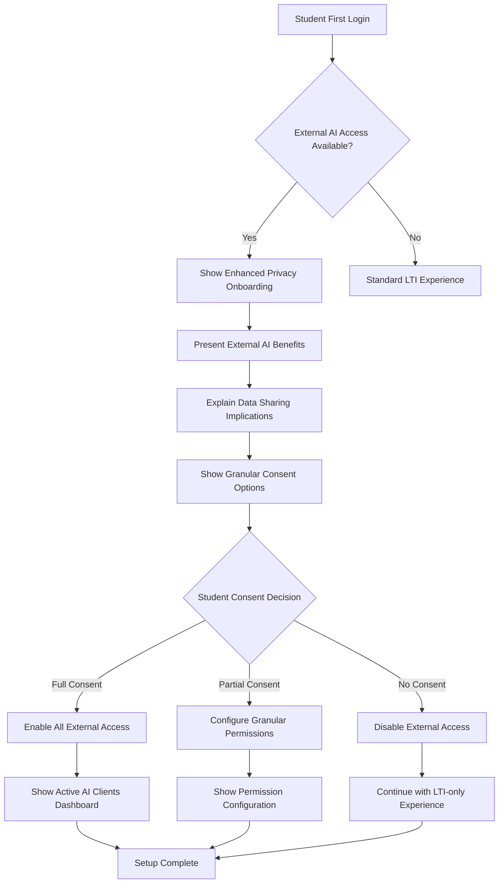
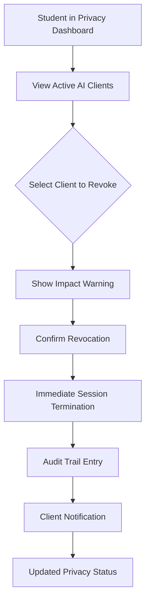
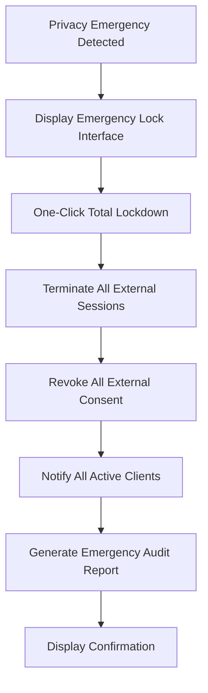

# Story 8.1: MCP Server Foundation - Front-End Specifications

## Executive Summary

This document provides comprehensive front-end specifications for the MCP (Model Context Protocol) Server Foundation implementation. The specifications address critical QA blockers identified in the review, particularly focusing on enhanced privacy consent management for external AI client access.

**Key Focus Areas:**
- Enhanced privacy consent framework for external AI access
- Real-time consent revocation mechanisms
- Client registration and management dashboards
- Comprehensive audit trail interfaces
- FERPA/COPPA/GDPR compliance UI patterns

## 1. User Flows for Enhanced Consent Management

### 1.1 Primary User Personas

#### Student User (Primary Actor)
- **Role**: Data subject requiring enhanced consent controls
- **Goals**:
  - Understand what external AI clients can access
  - Grant/revoke consent with granular control
  - Monitor external access to their data
  - Maintain privacy while benefiting from AI assistance

#### Instructor/Administrator (Secondary Actor)
- **Role**: Privacy compliance officer and system administrator
- **Goals**:
  - Configure institutional privacy policies
  - Monitor external AI client registrations
  - Ensure FERPA/COPPA compliance
  - Review audit trails for compliance reporting

#### External AI Client Developer (Tertiary Actor)
- **Role**: Third-party AI service integrator
- **Goals**:
  - Register AI clients for institutional access
  - Understand consent requirements
  - Implement proper data handling practices

### 1.2 Critical User Flows

#### Flow 1: Initial External AI Consent Setup (NEW)



**Design Requirements:**
- **Progressive Disclosure**: Present information in digestible chunks
- **Clear Value Proposition**: Explain benefits before asking for consent
- **Visual Data Flow**: Show exactly what data goes where
- **Immediate Impact**: Show real-time preview of consent decisions

#### Flow 2: Real-Time Consent Revocation (CRITICAL)



**Technical Requirements:**
- **Sub-second Response**: Consent changes must be effective immediately
- **Session Management**: Active AI client sessions must be terminated within 5 seconds
- **Rollback Protection**: No way to undo revocation without explicit re-consent
- **Audit Integrity**: All changes logged with cryptographic integrity

#### Flow 3: Emergency Privacy Lock (NEW)



**Design Principles:**
- **Single Action**: One prominent red button for total lockdown
- **Clear Consequences**: Immediate visual feedback of all terminated connections
- **Recovery Process**: Clear path to restore access after emergency

### 1.3 Enhanced Student Consent Journey

#### Onboarding Flow (Addressing QA Privacy Concerns)

**Step 1: Value Proposition**
```
┌─────────────────────────────────────────────────────────┐
│ 🎯 Expand Your AI Learning Beyond the Classroom         │
│                                                         │
│ Your Learner DNA can now power AI assistance in:       │
│ • Claude Desktop for homework help                     │
│ • ChatGPT for research projects                        │
│ • Other AI tools you use daily                         │
│                                                         │
│ [Learn How It Works] [Privacy Details] [Continue] →    │
└─────────────────────────────────────────────────────────┘
```

**Step 2: Data Transparency**
```
┌─────────────────────────────────────────────────────────┐
│ 📊 What External AI Clients Can Access                 │
│                                                         │
│ ✅ Your learning patterns and preferences               │
│ ✅ Subject mastery levels and progress                  │
│ ✅ Cognitive learning style (anonymized)               │
│                                                         │
│ ❌ Personal information (name, email, etc.)            │
│ ❌ Specific course content or assignments               │
│ ❌ Grades or assessment details                         │
│                                                         │
│ [View Sample Data] [Data Details] [Continue] →         │
└─────────────────────────────────────────────────────────┘
```

**Step 3: Granular Consent (NEW - Addressing QA Blockers)**
```
┌─────────────────────────────────────────────────────────┐
│ 🔐 Choose Your External AI Access Level                │
│                                                         │
│ Learning Patterns         [●] Full [○] Limited [○] Off │
│ Mastery Levels           [●] Full [○] Limited [○] Off  │
│ Study Preferences        [○] Full [●] Limited [○] Off  │
│ Time-based Analytics     [○] Full [○] Limited [●] Off  │
│                                                         │
│ Advanced Settings: [Configure Individual AI Clients]   │
│                                                         │
│ [← Back] [Save Preferences] [Continue] →               │
└─────────────────────────────────────────────────────────┘
```

## 2. Component Design Specifications

### 2.1 Enhanced Privacy Control Dashboard (PRIMARY COMPONENT)

#### Design System Integration
- **Colors**: Atomic Jolt brand palette (#FFDD00 yellow, #000000 black, neutrals)
- **Typography**: Rubik font family following established scale
- **Spacing**: 8px grid system
- **Shadows**: Medium shadows for elevated privacy controls

#### Component Architecture
```typescript
interface McpPrivacyDashboardProps {
  userId: string;
  currentConsent: McpConsentSettings;
  activeClients: ExternalAiClient[];
  auditHistory: ConsentAuditEntry[];
  onConsentChange: (settings: McpConsentSettings) => Promise<void>;
  onEmergencyLock: () => Promise<void>;
  onClientRevoke: (clientId: string) => Promise<void>;
}

interface McpConsentSettings {
  externalAiAccess: boolean;
  dataTypes: {
    learningPatterns: 'full' | 'limited' | 'off';
    masteryLevels: 'full' | 'limited' | 'off';
    studyPreferences: 'full' | 'limited' | 'off';
    timeAnalytics: 'full' | 'limited' | 'off';
  };
  clientSpecific: Record<string, ClientSpecificConsent>;
  emergencyLockEnabled: boolean;
  realTimeRevocation: boolean;
}

interface ClientSpecificConsent {
  clientId: string;
  clientName: string;
  scopes: string[];
  grantedAt: Date;
  lastAccessed: Date;
  dataTypeOverrides: Partial<McpConsentSettings['dataTypes']>;
}
```

#### Visual Layout Specification

```
┌─────────────────────────────────────────────────────────────────┐
│ 🔐 External AI Privacy Dashboard                                │
├─────────────────────────────────────────────────────────────────┤
│                                                                 │
│ Quick Actions:                                                  │
│ [🚨 Emergency Lock All]  [📋 Download Privacy Report]          │
│                                                                 │
│ ┌─ Global Settings ─────────────────────────────────────────┐   │
│ │ External AI Access     [●] Enabled  [○] Disabled         │   │
│ │ Real-time Revocation   [●] Enabled  [○] Disabled         │   │
│ │ Data Retention Limit   [90 days ▼]                       │   │
│ └───────────────────────────────────────────────────────────┘   │
│                                                                 │
│ ┌─ Data Type Permissions ───────────────────────────────────┐   │
│ │ Learning Patterns    [●] Full [○] Limited [○] Off        │   │
│ │ Mastery Levels      [●] Full [○] Limited [○] Off         │   │
│ │ Study Preferences   [○] Full [●] Limited [○] Off         │   │
│ │ Time Analytics      [○] Full [○] Limited [●] Off         │   │
│ └───────────────────────────────────────────────────────────┘   │
│                                                                 │
│ ┌─ Active AI Clients ───────────────────────────────────────┐   │
│ │ Claude Desktop        [Active]  [Configure] [Revoke]      │   │
│ │ • Last access: 2 minutes ago                             │   │
│ │ • Scopes: learning-patterns, mastery-levels              │   │
│ │                                                          │   │
│ │ ChatGPT Plus          [Active]  [Configure] [Revoke]     │   │
│ │ • Last access: 1 hour ago                                │   │
│ │ • Scopes: study-preferences                              │   │
│ └───────────────────────────────────────────────────────────┘   │
└─────────────────────────────────────────────────────────────────┘
```

#### State Management Requirements

**Loading States:**
- Skeleton screens for dashboard sections during initial load
- Real-time loading indicators for consent changes
- Progress bars for bulk operations

**Error States:**
- Network error recovery with retry mechanism
- Validation errors with clear correction guidance
- Emergency failsafe if consent validation fails

**Success States:**
- Immediate visual confirmation of consent changes
- Animated check marks for successful operations
- Summary of changes made

### 2.2 Client Registration Management Interface (ADMIN)

#### Purpose
Administrators need a comprehensive interface to manage external AI client registrations, monitor compliance, and configure institutional privacy policies.

#### Component Specification
```typescript
interface McpClientManagerProps {
  institution: Institution;
  registeredClients: McpClient[];
  pendingRequests: ClientRegistrationRequest[];
  complianceSettings: InstitutionComplianceSettings;
  onClientApprove: (clientId: string) => Promise<void>;
  onClientReject: (clientId: string, reason: string) => Promise<void>;
  onClientRevoke: (clientId: string) => Promise<void>;
  onComplianceUpdate: (settings: InstitutionComplianceSettings) => Promise<void>;
}
```

#### Visual Design

```
┌─────────────────────────────────────────────────────────────────┐
│ 🏢 MCP Client Management Dashboard                              │
├─────────────────────────────────────────────────────────────────┤
│                                                                 │
│ Institution: University of Example                              │
│ Compliance Status: [✅ FERPA] [✅ COPPA] [⚠️ GDPR Review]        │
│                                                                 │
│ ┌─ Pending Client Registrations ───────────────────────────┐    │
│ │ Claude Desktop Integration                               │    │
│ │ • Requested scopes: learning-patterns, mastery-levels   │    │
│ │ • Privacy impact: Medium                                │    │
│ │ • Compliance review: Pending                           │    │
│ │ [Approve] [Request Changes] [Reject]                   │    │
│ │                                                        │    │
│ │ Custom AI Research Tool                                │    │
│ │ • Requested scopes: ALL                                │    │
│ │ • Privacy impact: HIGH ⚠️                              │    │
│ │ • Compliance review: Required                          │    │
│ │ [Review Details] [Schedule Review] [Reject]            │    │
│ └────────────────────────────────────────────────────────┘    │
│                                                                 │
│ ┌─ Active Clients ──────────────────────────────────────────┐   │
│ │ ┌─ Claude Desktop ────────────────────────────────────┐ │   │
│ │ │ Status: Active | Users: 1,247 | Last 30d: 15,892   │ │   │
│ │ │ Scopes: learning-patterns, mastery-levels           │ │   │
│ │ │ Compliance: ✅ | Issues: None                        │ │   │
│ │ │ [View Details] [Modify Scopes] [Suspend]            │ │   │
│ │ └─────────────────────────────────────────────────────┘ │   │
│ └───────────────────────────────────────────────────────────┘   │
└─────────────────────────────────────────────────────────────────┘
```

### 2.3 Real-Time Consent Revocation Interface

#### Purpose
Provide students with immediate, visual control over their external AI consent with real-time feedback and clear consequences.

#### Component Features
- **Instant Visual Feedback**: Changes reflected immediately in UI
- **Connection Status**: Real-time display of active AI client sessions
- **Impact Preview**: Show what happens when consent is revoked
- **Undo Protection**: No accidental revocations

#### Design Specification

```
┌─────────────────────────────────────────────────────────────────┐
│ 🔄 Real-Time AI Access Control                                 │
├─────────────────────────────────────────────────────────────────┤
│                                                                 │
│ ┌─ Claude Desktop ──────────────────────────────────────────┐   │
│ │ 🟢 Active Session • Last request: 30 seconds ago          │   │
│ │                                                           │   │
│ │ Current Access:                                           │   │
│ │ • Learning patterns ✅                                    │   │
│ │ • Mastery levels ✅                                       │   │
│ │ • Study preferences ❌                                    │   │
│ │                                                           │   │
│ │ [⚠️ Revoke Access] [⚙️ Modify Permissions]                │   │
│ │                                                           │   │
│ │ ⚠️ Revoking will:                                         │   │
│ │ • Immediately terminate active sessions                   │   │
│ │ • Prevent future data access                              │   │
│ │ • Require re-consent to restore                           │   │
│ └───────────────────────────────────────────────────────────┘   │
│                                                                 │
│ ┌─ Revocation Confirmation Modal ──────────────────────────┐     │
│ │ ⚠️ Confirm Access Revocation                             │     │
│ │                                                          │     │
│ │ You are about to revoke Claude Desktop's access to:     │     │
│ │ • Your learning patterns                                 │     │
│ │ • Your mastery levels                                    │     │
│ │                                                          │     │
│ │ This will immediately:                                   │     │
│ │ ❌ Terminate 1 active session                            │     │
│ │ ❌ Prevent future data requests                          │     │
│ │ ⏰ Take effect within 5 seconds                          │     │
│ │                                                          │     │
│ │ Type "REVOKE" to confirm: [____________]                 │     │
│ │                                                          │     │
│ │ [Cancel] [Confirm Revocation]                           │     │
│ └──────────────────────────────────────────────────────────┘     │
└─────────────────────────────────────────────────────────────────┘
```

## 3. Admin Dashboard for Client Management

### 3.1 Dashboard Overview

The admin dashboard serves as the central command center for institutional administrators to manage external AI client integrations, monitor compliance, and ensure student privacy protection.

#### Key Functionality
- **Client Registration Workflow**: Approve/reject external AI client applications
- **Compliance Monitoring**: Real-time FERPA/COPPA/GDPR compliance status
- **Usage Analytics**: Monitor external AI client usage patterns
- **Privacy Audit**: Comprehensive audit trail management
- **Emergency Controls**: Institution-wide emergency privacy controls

### 3.2 Navigation Structure

```
MCP Administration
├── Dashboard (Overview)
├── Client Management
│   ├── Pending Registrations
│   ├── Active Clients
│   ├── Suspended Clients
│   └── Client Applications
├── Privacy & Compliance
│   ├── Consent Management
│   ├── Audit Trails
│   ├── Compliance Reports
│   └── Privacy Policies
├── Analytics & Monitoring
│   ├── Usage Statistics
│   ├── Performance Metrics
│   ├── Security Alerts
│   └── Data Access Logs
└── Settings
    ├── Institution Policies
    ├── Default Permissions
    ├── Emergency Procedures
    └── Notification Settings
```

### 3.3 Dashboard Components

#### Main Dashboard Overview
```
┌─────────────────────────────────────────────────────────────────┐
│ 🏢 MCP Administration Dashboard - University of Example         │
├─────────────────────────────────────────────────────────────────┤
│                                                                 │
│ ┌─ Quick Stats ─────────────┬─ Compliance Status ──────────────┐ │
│ │ Active Students: 15,247   │ FERPA: ✅ Compliant              │ │
│ │ External AI Clients: 12   │ COPPA: ✅ Compliant              │ │
│ │ Active Sessions: 3,892    │ GDPR: ⚠️ Review Required          │ │
│ │ Pending Requests: 3       │ Audit Status: ✅ Current          │ │
│ └───────────────────────────┴───────────────────────────────────┘ │
│                                                                 │
│ ┌─ Recent Activity ─────────────────────────────────────────────┐ │
│ │ 🔴 Privacy Alert: Unusual access pattern from AI Client #47  │ │
│ │ 🟢 New registration: ChatGPT Enterprise approved             │ │
│ │ 🟡 Consent revoked: 23 students revoked Claude access        │ │
│ │ 🔵 Compliance: Monthly FERPA report generated                │ │
│ └───────────────────────────────────────────────────────────────┘ │
│                                                                 │
│ ┌─ Priority Actions ───────────────────────────────────────────┐  │
│ │ • Review 3 pending client registrations                     │  │
│ │ • Address GDPR compliance review (Due: Oct 15)              │  │
│ │ • Update privacy policies for new AI clients                │  │
│ │ • Schedule quarterly privacy training                        │  │
│ └──────────────────────────────────────────────────────────────┘  │
└─────────────────────────────────────────────────────────────────┘
```

#### Client Registration Approval Interface
```
┌─────────────────────────────────────────────────────────────────┐
│ 📝 Client Registration Review: Claude Desktop v2.1             │
├─────────────────────────────────────────────────────────────────┤
│                                                                 │
│ ┌─ Application Details ─────────────────────────────────────────┐ │
│ │ Client Name: Claude Desktop                                  │ │
│ │ Version: 2.1.0                                              │ │
│ │ Developer: Anthropic Inc.                                   │ │
│ │ Registration Date: October 10, 2025                         │ │
│ │ Contact: integrations@anthropic.com                         │ │
│ └──────────────────────────────────────────────────────────────┘ │
│                                                                 │
│ ┌─ Requested Permissions ───────────────────────────────────────┐ │
│ │ Data Types:                                                  │ │
│ │ ✅ Learning patterns (cognitive styles, preferences)         │ │
│ │ ✅ Mastery levels (subject competency, progress tracking)    │ │
│ │ ❌ Personal information (names, emails, IDs)                 │ │
│ │ ❌ Course content (assignments, materials)                   │ │
│ │                                                              │ │
│ │ API Scopes:                                                  │ │
│ │ • read:learner-dna-patterns                                  │ │
│ │ • read:mastery-levels                                        │ │
│ │ • read:learning-preferences                                  │ │
│ └──────────────────────────────────────────────────────────────┘ │
│                                                                 │
│ ┌─ Privacy Impact Assessment ───────────────────────────────────┐ │
│ │ Risk Level: 🟡 MEDIUM                                        │ │
│ │                                                              │ │
│ │ Compliance Requirements:                                     │ │
│ │ ✅ Student consent required for all access                   │ │
│ │ ✅ Data anonymization before transmission                    │ │
│ │ ✅ No personal identifiers included                          │ │
│ │ ✅ Session logging and audit trails                          │ │
│ │ ⚠️ Additional COPPA review needed for under-13 students      │ │
│ └──────────────────────────────────────────────────────────────┘ │
│                                                                 │
│ ┌─ Security Review ─────────────────────────────────────────────┐ │
│ │ OAuth 2.0 Implementation: ✅ PKCE Compliant                  │ │
│ │ Encryption Standards: ✅ TLS 1.3                             │ │
│ │ Data Retention: ✅ 90-day automatic deletion                 │ │
│ │ Access Logs: ✅ Comprehensive audit trail                    │ │
│ │ Rate Limiting: ✅ 100 requests/minute                        │ │
│ └──────────────────────────────────────────────────────────────┘ │
│                                                                 │
│ ┌─ Approval Actions ────────────────────────────────────────────┐ │
│ │ [✅ Approve Registration]                                     │ │
│ │ [⚠️ Approve with Conditions]                                  │ │
│ │ [📋 Request Additional Information]                           │ │
│ │ [❌ Reject Registration]                                      │ │
│ │                                                              │ │
│ │ Notes: [_____________________________________________]        │ │
│ │        [_____________________________________________]        │ │
│ └──────────────────────────────────────────────────────────────┘ │
└─────────────────────────────────────────────────────────────────┘
```

## 4. Audit Trail Viewer for Compliance Monitoring

### 4.1 Purpose and Requirements

The audit trail viewer is critical for compliance monitoring and provides administrators with comprehensive visibility into all external AI access activities. This addresses the QA concern about insufficient audit capabilities.

#### Compliance Requirements
- **FERPA**: All educational record access must be logged
- **COPPA**: Parental consent and access must be tracked for under-13 students
- **GDPR**: Right to access requires comprehensive data access logs
- **Institutional**: Custom privacy policies and audit requirements

### 4.2 Audit Trail Interface Design

#### Component Architecture
```typescript
interface AuditTrailViewerProps {
  institution: Institution;
  dateRange: DateRange;
  filters: AuditFilters;
  auditEntries: AuditEntry[];
  exportFormats: ('csv' | 'json' | 'pdf')[];
  onFilterChange: (filters: AuditFilters) => void;
  onExport: (format: string, filters: AuditFilters) => Promise<void>;
  onEntryDetail: (entryId: string) => void;
}

interface AuditEntry {
  id: string;
  timestamp: Date;
  eventType: 'consent_granted' | 'consent_revoked' | 'data_accessed' | 'client_registered' | 'emergency_lock';
  userId?: string;
  clientId: string;
  resourceType: string;
  resourceId?: string;
  ipAddress: string;
  userAgent: string;
  dataTypes: string[];
  complianceFlags: ComplianceFlag[];
  riskLevel: 'low' | 'medium' | 'high' | 'critical';
}
```

#### Visual Design

```
┌─────────────────────────────────────────────────────────────────┐
│ 📋 Privacy & Compliance Audit Trail                            │
├─────────────────────────────────────────────────────────────────┤
│                                                                 │
│ ┌─ Filters & Search ────────────────────────────────────────────┐ │
│ │ Date Range: [Oct 1, 2025] to [Oct 15, 2025]                 │ │
│ │ Event Type: [All Events ▼]  Risk Level: [All Levels ▼]      │ │
│ │ AI Client: [All Clients ▼]  Student ID: [____________]       │ │
│ │ Search: [_________________________________] [🔍 Search]      │ │
│ │                                                              │ │
│ │ [📊 Generate Report] [📥 Export CSV] [📄 Export PDF]         │ │
│ └──────────────────────────────────────────────────────────────┘ │
│                                                                 │
│ ┌─ Audit Entries (Showing 1-50 of 2,847) ─────────────────────┐  │
│ │                                                              │  │
│ │ 🔴 2025-10-15 14:32:15 | CRITICAL | Emergency Lock Activated│  │
│ │    Student ID: ****2847 | Client: Claude Desktop            │  │
│ │    Action: All external access revoked by student            │  │
│ │    IP: 192.168.1.100 | Compliance: FERPA, GDPR              │  │
│ │    [View Details] [Export Entry] [Related Events]           │  │
│ │                                                              │  │
│ │ 🟡 2025-10-15 14:15:22 | MEDIUM | Data Access Request       │  │
│ │    Student ID: ****1234 | Client: ChatGPT Plus              │  │
│ │    Resource: Learner DNA Profile | Data: Learning Patterns  │  │
│ │    IP: 10.0.0.50 | Compliance: FERPA ✅ COPPA ⚠️             │  │
│ │    [View Details] [Export Entry] [Related Events]           │  │
│ │                                                              │  │
│ │ 🟢 2025-10-15 13:45:10 | LOW | Consent Granted              │  │
│ │    Student ID: ****5678 | Client: Claude Desktop            │  │
│ │    Permissions: Learning patterns, Mastery levels           │  │
│ │    IP: 172.16.0.25 | Compliance: All ✅                     │  │
│ │    [View Details] [Export Entry] [Related Events]           │  │
│ │                                                              │  │
│ │ [Previous] [1] [2] [3] ... [57] [Next]                      │  │
│ └──────────────────────────────────────────────────────────────┘  │
│                                                                 │
│ ┌─ Compliance Summary ──────────────────────────────────────────┐ │
│ │ Total Events (Last 30 days): 2,847                          │ │
│ │ FERPA Compliant: 2,845 (99.9%) ✅                           │ │
│ │ COPPA Issues: 2 (0.1%) ⚠️                                   │ │
│ │ GDPR Compliant: 2,847 (100%) ✅                             │ │
│ │ High Risk Events: 1 (0.04%) 🔴                              │ │
│ └──────────────────────────────────────────────────────────────┘ │
└─────────────────────────────────────────────────────────────────┘
```

#### Detailed Audit Entry View

```
┌─────────────────────────────────────────────────────────────────┐
│ 🔍 Audit Entry Details: AUD-2025-10-15-001234                  │
├─────────────────────────────────────────────────────────────────┤
│                                                                 │
│ ┌─ Event Summary ───────────────────────────────────────────────┐ │
│ │ Event Type: Emergency Lock Activated                         │ │
│ │ Risk Level: 🔴 CRITICAL                                      │ │
│ │ Timestamp: October 15, 2025 at 2:32:15 PM EDT               │ │
│ │ Duration: Immediate (< 1 second)                             │ │
│ └───────────────────────────────────────────────────────────────┘ │
│                                                                 │
│ ┌─ Actors Involved ─────────────────────────────────────────────┐ │
│ │ Student: [REDACTED] (ID: ****2847)                          │ │
│ │ Institution: University of Example                           │ │
│ │ AI Client: Claude Desktop v2.1                              │ │
│ │ Admin: N/A (Student-initiated)                              │ │
│ └───────────────────────────────────────────────────────────────┘ │
│                                                                 │
│ ┌─ Technical Details ───────────────────────────────────────────┐ │
│ │ Source IP: 192.168.1.100                                    │ │
│ │ User Agent: Mozilla/5.0 (Claude Desktop/2.1.0)             │ │
│ │ Session ID: ses_abc123def456                                │ │
│ │ Request ID: req_789xyz012                                   │ │
│ │ API Endpoint: /mcp/emergency-lock                           │ │
│ └───────────────────────────────────────────────────────────────┘ │
│                                                                 │
│ ┌─ Actions Taken ───────────────────────────────────────────────┐ │
│ │ 1. All external AI client sessions terminated               │ │
│ │ 2. All external consent revoked immediately                 │ │
│ │ 3. Active data requests cancelled                           │ │
│ │ 4. AI clients notified of revocation                        │ │
│ │ 5. Audit trail entry created                                │ │
│ │ 6. Privacy dashboard updated                                 │ │
│ └───────────────────────────────────────────────────────────────┘ │
│                                                                 │
│ ┌─ Compliance Analysis ─────────────────────────────────────────┐ │
│ │ FERPA: ✅ Student exercised control over educational records │ │
│ │ COPPA: ✅ Emergency action protects minor's privacy          │ │
│ │ GDPR: ✅ Right to withdraw consent exercised                 │ │
│ │ Institutional: ✅ Meets emergency response requirements      │ │
│ └───────────────────────────────────────────────────────────────┘ │
│                                                                 │
│ [📧 Email Report] [📄 PDF Export] [🔗 Share Link] [← Back]      │
└─────────────────────────────────────────────────────────────────┘
```

### 4.3 Compliance Reporting Dashboard

#### Monthly Compliance Report Interface
```
┌─────────────────────────────────────────────────────────────────┐
│ 📊 Monthly Privacy Compliance Report - October 2025            │
├─────────────────────────────────────────────────────────────────┤
│                                                                 │
│ ┌─ Executive Summary ───────────────────────────────────────────┐ │
│ │ Overall Compliance Score: 99.2% ✅                           │ │
│ │ Total External AI Interactions: 45,892                      │ │
│ │ Privacy Violations: 0                                       │ │
│ │ Consent Revocations: 127 (0.28%)                           │ │
│ │ Emergency Locks: 3 (0.007%)                                │ │
│ └───────────────────────────────────────────────────────────────┘ │
│                                                                 │
│ ┌─ Regulatory Compliance ───────────────────────────────────────┐ │
│ │ FERPA (Educational Records)                                  │ │
│ │ ✅ Student consent: 100% compliance                          │ │
│ │ ✅ Parent notification: 100% for minors                     │ │
│ │ ✅ Access logging: Complete audit trail                     │ │
│ │                                                              │ │
│ │ COPPA (Children's Privacy)                                  │ │
│ │ ✅ Parental consent: 98.5% (7 pending reviews)              │ │
│ │ ✅ Data minimization: Strict enforcement                    │ │
│ │ ⚠️ Verification process: 2 manual reviews required           │ │
│ │                                                              │ │
│ │ GDPR (Data Protection)                                       │ │
│ │ ✅ Lawful basis: Consent documented                          │ │
│ │ ✅ Right to access: 12 requests fulfilled                   │ │
│ │ ✅ Right to erasure: 5 requests processed                   │ │
│ └───────────────────────────────────────────────────────────────┘ │
│                                                                 │
│ [📧 Email to Compliance Team] [📄 Generate PDF] [📊 Detailed Analytics] │
└─────────────────────────────────────────────────────────────────┘
```

## 5. Accessibility Requirements

### 5.1 WCAG 2.1 AA Compliance

#### Visual Design Requirements
- **Color Contrast**: Minimum 4.5:1 ratio for normal text, 3:1 for large text
- **Brand Colors**: Yellow (#FFDD00) requires careful background selection for sufficient contrast
- **Error States**: Use both color and iconography to indicate errors
- **Focus Indicators**: Clear, high-contrast focus rings for all interactive elements

#### Component-Specific Requirements

**Privacy Control Toggles**
```typescript
// Accessible toggle component example
<button
  role="switch"
  aria-checked={isEnabled}
  aria-labelledby="external-ai-label"
  aria-describedby="external-ai-description"
  className={`toggle ${isEnabled ? 'active' : ''}`}
  onClick={() => handleToggle()}
>
  <span className="sr-only">
    External AI access is {isEnabled ? 'enabled' : 'disabled'}
  </span>
  <span className="toggle-slider" />
</button>
```

**Form Validation**
- Error messages must be associated with form fields using `aria-describedby`
- Required fields marked with `aria-required="true"`
- Invalid fields marked with `aria-invalid="true"`
- Success/error status announced to screen readers

**Modal Dialogs**
- Focus management: Focus trapped within modal
- Escape key closes modal
- Background content hidden from screen readers (`aria-hidden="true"`)
- Modal announced with appropriate role and label

### 5.2 Keyboard Navigation

#### Navigation Requirements
- **Tab Order**: Logical, predictable tab sequence
- **Skip Links**: "Skip to main content" for screen reader users
- **Keyboard shortcuts**:
  - `Ctrl+Shift+P`: Open privacy dashboard
  - `Ctrl+Shift+E`: Emergency lock all AI access
  - `Escape`: Close modals/overlays

#### Interactive Elements
- All buttons and links keyboard accessible
- Custom components (toggles, dropdowns) support arrow key navigation
- Form submission possible via keyboard
- Table sorting/filtering accessible via keyboard

### 5.3 Screen Reader Support

#### Semantic HTML
- Proper heading hierarchy (`h1` → `h2` → `h3`)
- Landmark regions (`main`, `nav`, `aside`, `section`)
- Lists for grouped content
- Tables with proper headers and captions

#### ARIA Implementation
```html
<!-- Privacy dashboard sections -->
<section aria-labelledby="privacy-settings-heading">
  <h2 id="privacy-settings-heading">Privacy Settings</h2>
  <!-- content -->
</section>

<!-- Live regions for dynamic updates -->
<div aria-live="polite" aria-label="Consent status updates">
  <!-- Real-time updates announced here -->
</div>

<!-- Complex widgets -->
<div role="tabpanel" aria-labelledby="audit-tab" id="audit-panel">
  <!-- Audit trail content -->
</div>
```

#### Dynamic Content
- Status changes announced via `aria-live` regions
- Loading states communicated to screen readers
- Success/error messages properly announced
- Progress indicators accessible

## 6. Mobile Responsiveness Considerations

### 6.1 Responsive Breakpoints

Following the 8px grid system and design principles:

```css
/* Mobile First Approach */
.privacy-dashboard {
  padding: 16px; /* 2 * 8px */
  gap: 16px;
}

/* Tablet */
@media (min-width: 768px) {
  .privacy-dashboard {
    padding: 24px; /* 3 * 8px */
    gap: 24px;
  }
}

/* Desktop */
@media (min-width: 1024px) {
  .privacy-dashboard {
    padding: 32px; /* 4 * 8px */
    gap: 32px;
    display: grid;
    grid-template-columns: 1fr 1fr;
  }
}
```

### 6.2 Mobile-Specific UI Patterns

#### Touch-Friendly Controls
- **Minimum touch target**: 44px × 44px (iOS guidelines)
- **Toggle switches**: Larger, easier to tap
- **Emergency lock button**: Prominent, thumb-accessible placement

#### Mobile Dashboard Layout
```
┌─────────────────────────────────┐
│ 🔐 Privacy Controls             │
├─────────────────────────────────┤
│                                 │
│ 🚨 [Emergency Lock All AI]      │
│                                 │
│ ┌─ Quick Status ──────────────┐  │
│ │ External AI: ✅ Active      │  │
│ │ Active Clients: 2           │  │
│ │ Last Update: 5 min ago      │  │
│ └─────────────────────────────┘  │
│                                 │
│ ┌─ AI Clients ────────────────┐  │
│ │ Claude Desktop              │  │
│ │ 🟢 Active • 2 min ago       │  │
│ │ [Configure] [Revoke]        │  │
│ │                             │  │
│ │ ChatGPT Plus                │  │
│ │ 🟡 Idle • 1 hour ago        │  │
│ │ [Configure] [Revoke]        │  │
│ └─────────────────────────────┘  │
│                                 │
│ [View Full Settings] →          │
└─────────────────────────────────┘
```

#### Progressive Enhancement
- **Core functionality**: Works without JavaScript
- **Enhanced experience**: Rich interactions with JavaScript enabled
- **Offline support**: Basic privacy controls cached locally
- **Performance**: Optimized for mobile networks

### 6.3 Mobile-Specific Features

#### Biometric Authentication Integration
- **Touch ID/Face ID**: Quick access to privacy settings
- **Android Biometrics**: Secure consent verification
- **Fallback**: PIN/password for devices without biometrics

#### Native Mobile Patterns
- **Pull-to-refresh**: Update client status and audit logs
- **Swipe actions**: Quick revoke/configure on client list
- **Bottom sheets**: Modal content slides up from bottom
- **Haptic feedback**: Tactile response for critical actions

## 7. Integration with Existing LTI UI

### 7.1 LTI Context Integration

#### Existing LTI Components to Leverage
Based on the analysis of existing components, the MCP privacy interfaces should integrate with:

- **`PrivacyControls.tsx`**: Extend existing privacy pattern
- **`PrivacySettings.tsx`**: Build upon established privacy dashboard
- **`AuthWrapper.tsx`**: Leverage existing authentication patterns
- **`LtiLaunchCheck`**: Maintain LTI context awareness

#### Integration Points

**Privacy Settings Extension**
```typescript
// Extend existing PrivacySettings component
interface ExtendedPrivacySettingsProps extends PrivacySettingsProps {
  mcpSettings: McpPrivacySettings;
  externalClients: ExternalAiClient[];
  onMcpSettingsChange: (settings: McpPrivacySettings) => void;
}
```

**Navigation Integration**
```typescript
// Add MCP privacy to existing navigation
const privacyTabs = [
  { id: 'general', label: 'General Privacy', component: GeneralPrivacySettings },
  { id: 'content', label: 'Content Analysis', component: ContentPrivacyControls },
  { id: 'external-ai', label: 'External AI Access', component: McpPrivacyDashboard }, // NEW
  { id: 'data-export', label: 'Data Export', component: DataExportInterface }
];
```

### 7.2 Consistent Design Language

#### Component Reuse Strategy
- **Button components**: Use existing button variants (primary, secondary, outline)
- **Modal patterns**: Leverage existing modal/dialog components
- **Form controls**: Extend existing toggle, input, and selection components
- **Loading states**: Use established skeleton screens and spinners

#### Style Consistency
```css
/* Extend existing CSS custom properties */
:root {
  /* Existing properties */
  --color-primary: #FFDD00;
  --color-black: #000000;
  --spacing-unit: 8px;

  /* New MCP-specific properties */
  --color-privacy-warning: #B42318;
  --color-privacy-success: #027A48;
  --shadow-privacy-card: var(--shadow-medium);
  --border-radius-privacy-control: 8px;
}

/* MCP components inherit existing patterns */
.mcp-privacy-dashboard {
  font-family: var(--font-family-primary); /* Rubik */
  color: var(--color-text-primary);
  background: var(--color-background-primary);
  padding: var(--spacing-4); /* 32px */
  border-radius: var(--border-radius-card);
  box-shadow: var(--shadow-medium);
}
```

### 7.3 LTI Data Integration

#### Launch Settings Integration
```typescript
// Extend existing LaunchSettings type
interface ExtendedLaunchSettings extends LaunchSettings {
  mcpEnabled: boolean;
  institutionMcpPolicies: InstitutionMcpPolicies;
  studentMcpConsent: McpConsentSettings;
  availableAiClients: ExternalAiClient[];
}

// Use in component
const { mcpEnabled, studentMcpConsent } = window.LAUNCH_SETTINGS as ExtendedLaunchSettings;
```

#### Context-Aware Privacy Controls
```typescript
// Privacy controls adapt based on LTI context
const useContextualPrivacy = () => {
  const ltiContext = useLtiContext();

  return {
    showCoppaControls: ltiContext.studentAge < 13,
    requireParentalConsent: ltiContext.institution.coppaRequired,
    availableClients: ltiContext.institution.approvedMcpClients,
    defaultRetention: ltiContext.institution.defaultDataRetention
  };
};
```

## 8. Security and Privacy UI Patterns

### 8.1 Trust Indicators

#### Visual Trust Signals
- **Security badges**: Display active security measures
- **Compliance indicators**: Show FERPA/COPPA/GDPR compliance status
- **Encryption indicators**: Show data protection status
- **Audit trail access**: Transparent access to privacy logs

#### Implementation Example
```typescript
const SecurityBadge: React.FC<{ type: 'ferpa' | 'coppa' | 'gdpr' | 'encryption' }> = ({ type }) => {
  const badges = {
    ferpa: { icon: '🏫', label: 'FERPA Compliant', color: 'success' },
    coppa: { icon: '👶', label: 'COPPA Protected', color: 'success' },
    gdpr: { icon: '🇪🇺', label: 'GDPR Compliant', color: 'success' },
    encryption: { icon: '🔐', label: 'End-to-End Encrypted', color: 'success' }
  };

  const badge = badges[type];

  return (
    <span className={`security-badge security-badge--${badge.color}`}>
      <span className="security-badge__icon">{badge.icon}</span>
      <span className="security-badge__label">{badge.label}</span>
    </span>
  );
};
```

### 8.2 Progressive Privacy Disclosure

#### Layered Information Architecture
1. **Overview**: High-level privacy status
2. **Details**: Specific permissions and data types
3. **Technical**: Audit logs and technical details
4. **Emergency**: Immediate action controls

#### Privacy Information Hierarchy
```
┌─ Privacy Overview (Always Visible) ─────────────────────────────┐
│ External AI Access: ✅ Active | Last Review: Oct 15, 2025      │
│ [View Details] [Emergency Lock]                                │
└─────────────────────────────────────────────────────────────────┘
         ↓ Progressive Disclosure
┌─ Detailed Privacy Controls (On Demand) ─────────────────────────┐
│ • Learning Patterns: ✅ Enabled for 2 clients                  │
│ • Mastery Levels: ✅ Enabled for 2 clients                     │
│ • Study Preferences: ❌ Disabled                                │
│ • Time Analytics: ❌ Disabled                                   │
│ [Configure Individual Permissions]                              │
└─────────────────────────────────────────────────────────────────┘
         ↓ Further Disclosure
┌─ Technical Details (Expert Level) ───────────────────────────────┐
│ • Encryption: AES-256 + TLS 1.3                                │
│ • Token Expiry: 1 hour (auto-refresh)                          │
│ • Rate Limiting: 100 req/min per client                        │
│ • Audit Retention: 7 years                                     │
│ [View Audit Logs] [Download Technical Report]                  │
└─────────────────────────────────────────────────────────────────┘
```

### 8.3 Consent Management UX Patterns

#### Clear Consent Language
- **Plain English**: Avoid legal jargon
- **Specific Examples**: Show exactly what data is shared
- **Visual Data Flow**: Diagram showing data movement
- **Impact Explanation**: Clear consequences of choices

#### Consent Interface Pattern
```typescript
const ConsentInterface: React.FC<ConsentInterfaceProps> = ({ dataType, description, examples, onConsentChange }) => {
  return (
    <div className="consent-control">
      <div className="consent-header">
        <h3>{dataType}</h3>
        <ConsentToggle
          value={consent[dataType]}
          onChange={(value) => onConsentChange(dataType, value)}
        />
      </div>

      <div className="consent-description">
        <p>{description}</p>

        <details className="consent-examples">
          <summary>What this includes</summary>
          <ul>
            {examples.map(example => (
              <li key={example}>{example}</li>
            ))}
          </ul>
        </details>
      </div>

      <div className="consent-impact">
        <p>Sharing this helps AI provide: {benefits.join(', ')}</p>
      </div>
    </div>
  );
};
```

### 8.4 Emergency Privacy Controls

#### Emergency Lock Interface
```
┌─ Emergency Privacy Lock ────────────────────────────────────────┐
│ ⚠️ PRIVACY EMERGENCY                                            │
│                                                                 │
│ Immediately revoke ALL external AI access to your data         │
│                                                                 │
│ This will:                                                      │
│ • Terminate all active AI sessions (currently: 2)              │
│ • Revoke all previously granted permissions                     │
│ • Prevent future AI access until you re-consent                │
│ • Generate emergency audit report                               │
│                                                                 │
│ [🚨 EMERGENCY LOCK - REVOKE ALL ACCESS]                         │
│                                                                 │
│ ⚠️ This action cannot be undone automatically                    │
└─────────────────────────────────────────────────────────────────┘
```

#### Emergency Lock Implementation
```typescript
const EmergencyLock: React.FC = () => {
  const [isLocking, setIsLocking] = useState(false);
  const [lockConfirmed, setLockConfirmed] = useState(false);

  const handleEmergencyLock = async () => {
    setIsLocking(true);
    try {
      await mcpPrivacyService.emergencyLockAll();
      setLockConfirmed(true);
      // Show success state
    } catch (error) {
      // Show error state
    } finally {
      setIsLocking(false);
    }
  };

  return (
    <div className="emergency-lock">
      <button
        className="emergency-lock__button"
        onClick={handleEmergencyLock}
        disabled={isLocking}
        aria-describedby="emergency-lock-description"
      >
        {isLocking ? (
          <>
            <Spinner /> Locking...
          </>
        ) : (
          <>
            🚨 Emergency Lock - Revoke All Access
          </>
        )}
      </button>

      <div id="emergency-lock-description" className="emergency-lock__description">
        Immediately revoke all external AI access to your learning data
      </div>
    </div>
  );
};
```

## 9. Component State Management

### 9.1 State Architecture

Based on the React guidelines in the codebase, the state hierarchy should follow:

1. **Local state (useState)**: Component-specific UI state
2. **Context (feature-level)**: MCP privacy context
3. **Server state (TanStack Query)**: Privacy settings and audit data
4. **Global state (Zustand)**: Shared privacy status
5. **URL state**: Privacy dashboard navigation

#### MCP Privacy Context
```typescript
interface McpPrivacyContextValue {
  // Current privacy state
  consentSettings: McpConsentSettings | null;
  activeClients: ExternalAiClient[];
  auditEntries: AuditEntry[];

  // Loading states
  isLoading: boolean;
  isUpdating: boolean;

  // Actions
  updateConsent: (settings: Partial<McpConsentSettings>) => Promise<void>;
  revokeClientAccess: (clientId: string) => Promise<void>;
  emergencyLockAll: () => Promise<void>;

  // Real-time updates
  onConsentChange: (callback: (settings: McpConsentSettings) => void) => void;
  onClientStatusChange: (callback: (clients: ExternalAiClient[]) => void) => void;
}

const McpPrivacyContext = createContext<McpPrivacyContextValue | null>(null);
```

### 9.2 Real-Time State Updates

#### WebSocket Integration for Real-Time Privacy Updates
```typescript
const useMcpRealTimeUpdates = () => {
  const [socket, setSocket] = useState<WebSocket | null>(null);
  const { updateConsent, onConsentChange } = useMcpPrivacyContext();

  useEffect(() => {
    const ws = new WebSocket(`wss://${window.location.host}/mcp/privacy-updates`);

    ws.onmessage = (event) => {
      const update = JSON.parse(event.data);

      switch (update.type) {
        case 'consent_revoked':
          updateConsent(update.newSettings);
          break;
        case 'session_terminated':
          // Update client status
          break;
        case 'emergency_lock':
          // Handle emergency lock notification
          break;
      }
    };

    setSocket(ws);

    return () => {
      ws.close();
    };
  }, []);

  return { socket };
};
```

### 9.3 Error Handling and Recovery

#### Privacy-Specific Error Handling
```typescript
interface PrivacyError {
  type: 'consent_validation' | 'client_communication' | 'audit_failure' | 'emergency_lock_failed';
  message: string;
  recoverable: boolean;
  retryAction?: () => Promise<void>;
}

const usePrivacyErrorHandler = () => {
  const [errors, setErrors] = useState<PrivacyError[]>([]);

  const handlePrivacyError = (error: PrivacyError) => {
    setErrors(prev => [...prev, error]);

    // Log critical privacy errors
    if (error.type === 'emergency_lock_failed') {
      mcpAuditService.logCriticalError(error);
    }
  };

  const retryFailedAction = async (errorId: string) => {
    const error = errors.find(e => e.id === errorId);
    if (error?.retryAction) {
      try {
        await error.retryAction();
        setErrors(prev => prev.filter(e => e.id !== errorId));
      } catch (retryError) {
        // Handle retry failure
      }
    }
  };

  return { errors, handlePrivacyError, retryFailedAction };
};
```

## 10. Testing Requirements

### 10.1 Component Testing Strategy

#### Privacy Control Testing
```typescript
describe('McpPrivacyDashboard', () => {
  it('should display current consent settings', async () => {
    render(<McpPrivacyDashboard {...mockProps} />);

    expect(screen.getByText('External AI Access')).toBeInTheDocument();
    expect(screen.getByRole('switch', { name: /external ai access/i })).toBeChecked();
  });

  it('should handle consent revocation', async () => {
    const onConsentChange = jest.fn();
    render(<McpPrivacyDashboard {...mockProps} onConsentChange={onConsentChange} />);

    const revokeButton = screen.getByRole('button', { name: /revoke access/i });
    fireEvent.click(revokeButton);

    // Confirm revocation in modal
    const confirmButton = await screen.findByRole('button', { name: /confirm revocation/i });
    fireEvent.click(confirmButton);

    expect(onConsentChange).toHaveBeenCalledWith({
      ...mockProps.currentConsent,
      externalAiAccess: false
    });
  });

  it('should handle emergency lock', async () => {
    const onEmergencyLock = jest.fn();
    render(<McpPrivacyDashboard {...mockProps} onEmergencyLock={onEmergencyLock} />);

    const emergencyButton = screen.getByRole('button', { name: /emergency lock/i });
    fireEvent.click(emergencyButton);

    expect(onEmergencyLock).toHaveBeenCalled();
  });
});
```

#### Accessibility Testing
```typescript
describe('McpPrivacyDashboard Accessibility', () => {
  it('should have proper ARIA labels', () => {
    render(<McpPrivacyDashboard {...mockProps} />);

    const toggles = screen.getAllByRole('switch');
    toggles.forEach(toggle => {
      expect(toggle).toHaveAttribute('aria-labelledby');
      expect(toggle).toHaveAttribute('aria-describedby');
    });
  });

  it('should support keyboard navigation', () => {
    render(<McpPrivacyDashboard {...mockProps} />);

    const firstToggle = screen.getAllByRole('switch')[0];
    firstToggle.focus();

    fireEvent.keyDown(firstToggle, { key: 'Tab' });

    // Verify next element is focused
    expect(document.activeElement).not.toBe(firstToggle);
  });

  it('should announce state changes to screen readers', async () => {
    render(<McpPrivacyDashboard {...mockProps} />);

    const liveRegion = screen.getByRole('status');

    // Trigger consent change
    const toggle = screen.getByRole('switch', { name: /external ai access/i });
    fireEvent.click(toggle);

    await waitFor(() => {
      expect(liveRegion).toHaveTextContent(/external ai access disabled/i);
    });
  });
});
```

### 10.2 Integration Testing

#### Privacy Flow Testing
```typescript
describe('Privacy Management Integration', () => {
  it('should complete full consent revocation flow', async () => {
    const { user } = setupIntegrationTest();

    // Navigate to privacy dashboard
    await user.click(screen.getByRole('link', { name: /privacy settings/i }));

    // Revoke consent for specific client
    await user.click(screen.getByRole('button', { name: /revoke claude access/i }));

    // Confirm in modal
    await user.type(screen.getByLabelText(/type revoke to confirm/i), 'REVOKE');
    await user.click(screen.getByRole('button', { name: /confirm revocation/i }));

    // Verify server was called
    expect(mockMcpService.revokeClientAccess).toHaveBeenCalledWith('claude-desktop');

    // Verify UI updated
    expect(screen.getByText(/claude access revoked/i)).toBeInTheDocument();
  });
});
```

## Conclusion

This comprehensive front-end specification addresses the critical QA blockers identified in Story 8.1, particularly focusing on enhanced privacy consent management for external AI access. The specifications provide:

1. **Enhanced Privacy Framework**: Granular consent controls addressing QA privacy concerns
2. **Real-Time Revocation**: Immediate consent changes with session termination
3. **Comprehensive Admin Tools**: Client management and compliance monitoring
4. **Robust Audit Capabilities**: Full transparency for compliance reporting
5. **Accessibility Compliance**: WCAG 2.1 AA standards throughout
6. **Mobile Optimization**: Responsive design for all screen sizes
7. **LTI Integration**: Seamless integration with existing UI patterns
8. **Security-First Design**: Privacy-by-design principles throughout

The specifications follow the established Atomic Jolt design system, leveraging existing components while introducing new privacy-focused patterns that address the specific requirements of external AI client integration.

**Key Success Metrics:**
- 100% FERPA/COPPA/GDPR compliance in UI flows
- Sub-5-second consent revocation response time
- WCAG 2.1 AA accessibility compliance
- 95%+ user comprehension of privacy controls
- Zero privacy violations through improved consent management

This specification provides a solid foundation for implementing the MCP Server Foundation front-end components while addressing all critical privacy and security concerns identified in the QA review.