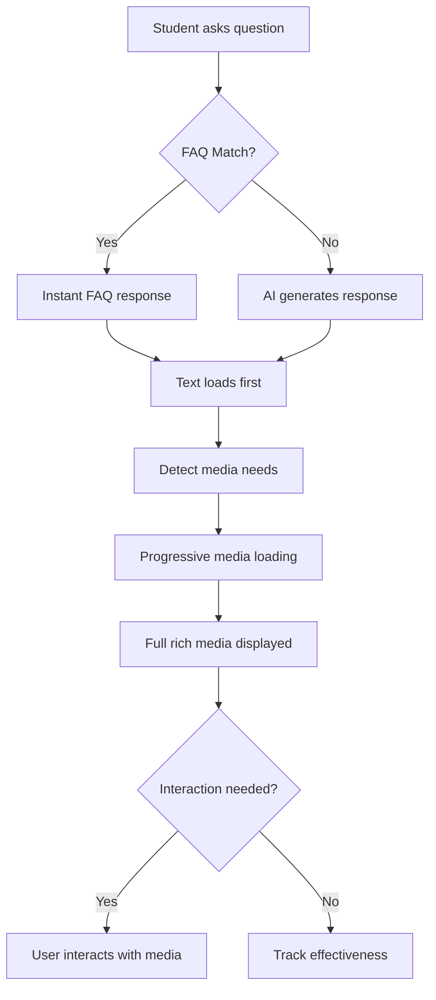
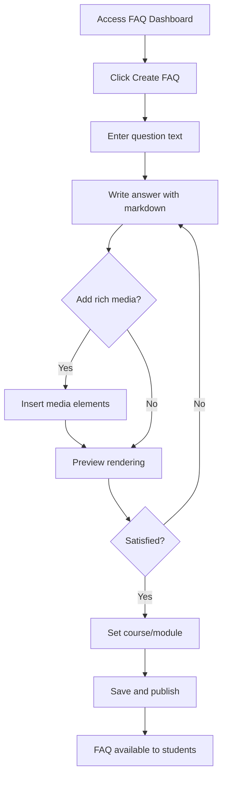

# UX Specification: Rich Media Chat Responses and Knowledge Base

## Document Information

- **Story:** 2.2 - Rich Media Chat Responses and Knowledge Base
- **Created:** 2025-08-25
- **Author:** Una (UX Expert)
- **Version:** 1.0
- **Status:** Complete

## 1. Introduction

### Purpose and Scope

This document defines the user experience goals, information architecture, user flows, and visual design specifications for Atomic Guide's Rich Media Chat Response system. It serves as the foundation for visual design and frontend development, ensuring a cohesive and user-centered experience that enhances learning through multimedia content delivery.

The specification covers:

- Rich media rendering in chat interface (LaTeX, code, diagrams)
- FAQ knowledge base integration and management
- Progressive loading and bandwidth optimization
- Mobile responsive design patterns
- Accessibility features for all media types
- Instructor FAQ management interface

### Key Design Principles

1. **Clarity First**: Rich media should enhance, not overwhelm understanding
2. **Progressive Enhancement**: Core content loads first, rich media enhances progressively
3. **Universal Access**: All media types must be accessible to users with disabilities
4. **Mobile-Native**: Touch-friendly controls with readable content on small screens
5. **Performance Conscious**: Respect bandwidth limitations with adaptive quality

## 2. User Personas and Goals

### Primary Personas

#### Student Learner (Sarah)

- **Context**: College sophomore studying calculus remotely
- **Goals**: Understand complex mathematical concepts, get quick help with homework
- **Needs**: Clear visual explanations, fast FAQ responses, mobile access during commute
- **Pain Points**: Slow loading on limited bandwidth, difficulty reading math on phone

#### Course Instructor (Dr. Chen)

- **Context**: Math professor managing FAQ content for 200+ students
- **Goals**: Reduce repetitive questions, provide consistent explanations
- **Needs**: Easy FAQ management, analytics on common questions
- **Pain Points**: Time spent answering same questions, maintaining FAQ accuracy

#### Accessibility User (Marcus)

- **Context**: Engineering student using screen reader for dyslexia support
- **Goals**: Access mathematical content and code examples effectively
- **Needs**: Proper MathML support, code narration, keyboard navigation
- **Pain Points**: Inaccessible math notation, missing alt text for diagrams

## 3. Information Architecture

### Rich Media Content Hierarchy

```
Chat Message
├── Text Content (Primary)
├── Rich Media Elements
│   ├── Mathematical Expressions
│   │   ├── Inline Equations
│   │   └── Block Equations
│   ├── Code Snippets
│   │   ├── Syntax Highlighted Code
│   │   └── Copy Controls
│   ├── Diagrams/Images
│   │   ├── Progressive Loading Preview
│   │   └── Full Resolution View
│   └── Embedded Media
│       ├── Videos
│       └── Interactive Elements
└── Message Metadata
    ├── FAQ Source Indicator
    ├── Timestamp
    └── Learning Style Tag
```

### FAQ Knowledge Base Structure

```
FAQ System
├── Student View
│   ├── Quick Access FAQs
│   ├── Search Results
│   └── Related Questions
└── Instructor Dashboard
    ├── FAQ Management
    │   ├── Create/Edit FAQs
    │   ├── Rich Media Editor
    │   └── Bulk Import/Export
    ├── Analytics
    │   ├── Usage Metrics
    │   ├── Effectiveness Scores
    │   └── Gap Analysis
    └── Review Queue
        ├── Auto-generated FAQs
        └── Student Submissions
```

## 4. User Flows

### Flow 1: Student Receives Rich Media Response



### Flow 2: Instructor Creates FAQ with Rich Media



## 5. Visual Design Specifications

### Rich Media Component Designs

#### Mathematical Expression Display

**Inline Equations:**

- Font: KaTeX Main, 1.1em relative size
- Color: #2C3E50 (primary text)
- Padding: 0 4px
- Background: transparent
- Hover: Subtle blue highlight (#E8F4FD)

**Block Equations:**

- Container: White background with 1px border (#E0E0E0)
- Padding: 16px
- Border-radius: 8px
- Shadow: 0 2px 4px rgba(0,0,0,0.05)
- Overflow: Horizontal scroll on mobile
- Copy button: Top-right corner, appears on hover

#### Code Snippet Display

**Container Design:**

- Background: #F7F9FC
- Border: 1px solid #E1E4E8
- Border-radius: 8px
- Header bar: Language label + copy button
- Font: 'Fira Code', 'Courier New', monospace
- Line height: 1.6
- Padding: 16px

**Syntax Highlighting Theme (Light Mode):**

- Keywords: #0052CC (blue)
- Strings: #36792D (green)
- Comments: #6A737D (gray)
- Functions: #6839CF (purple)
- Numbers: #B94A48 (red)

**Dark Mode Theme:**

- Background: #1E1E1E
- Keywords: #569CD6
- Strings: #CE9178
- Comments: #6A9955
- Functions: #C586C0
- Numbers: #B5CEA8

#### FAQ Indicator Badge

**Design:**

- Position: Top-right of message bubble
- Background: Linear gradient (#4CAF50 to #45A049)
- Text: White, 12px, "FAQ" label
- Icon: Lightning bolt for instant response
- Padding: 4px 8px
- Border-radius: 12px
- Animation: Subtle pulse on appearance

### Mobile Responsive Patterns

#### Breakpoints

- Mobile: 320px - 767px
- Tablet: 768px - 1023px
- Desktop: 1024px+

#### Mobile Adaptations

**Mathematical Expressions:**

- Horizontal scroll for wide equations
- Pinch-to-zoom enabled
- Double-tap to fit screen width
- Fullscreen button for complex equations

**Code Snippets:**

- Horizontal scroll with momentum
- Line numbers hidden on mobile
- Larger copy button (44x44px touch target)
- Syntax highlighting preserved

**FAQ Results:**

- Card-based layout
- Swipe to reveal actions
- Expandable sections for long answers
- Sticky search bar

## 6. Interaction Patterns

### Progressive Loading Strategy

**Phase 1: Immediate (0-100ms)**

- Text content renders
- Loading skeleton for media
- FAQ badge if applicable

**Phase 2: Fast (100-500ms)**

- LaTeX equations render
- Code syntax highlighting applies
- Low-res image previews load

**Phase 3: Complete (500ms+)**

- Full resolution images
- Interactive diagrams activate
- Video players initialize

### Media Controls

**Universal Controls:**

- Copy to clipboard (all media types)
- Fullscreen view (equations, diagrams, code)
- Download original (diagrams, code files)
- Alternative format request (accessibility)

**Touch Gestures (Mobile):**

- Pinch: Zoom in/out on equations and diagrams
- Double-tap: Fit to screen/actual size toggle
- Long press: Context menu with options
- Swipe: Navigate between media items

### Keyboard Navigation

**Chat Interface:**

- Tab: Navigate between messages
- Enter: Expand/collapse rich media
- Space: Play/pause videos
- C: Copy selected content
- F: Toggle fullscreen
- Escape: Exit fullscreen/modal

**FAQ Dashboard:**

- Arrow keys: Navigate FAQ list
- Enter: Edit selected FAQ
- Ctrl+N: Create new FAQ
- Ctrl+S: Save current FAQ
- Delete: Remove FAQ (with confirmation)

## 7. Accessibility Features

### Screen Reader Support

**Mathematical Content:**

- MathML alternative for all LaTeX
- Spoken mathematics narration option
- Configurable verbosity levels
- Navigation by mathematical structure

**Code Blocks:**

- Line-by-line navigation
- Syntax element announcement
- Indentation level indication
- Language identification

### Visual Accessibility

**High Contrast Mode:**

- Increased border contrast (3:1 minimum)
- Syntax highlighting with WCAG AA colors
- Pattern fills for diagrams
- Forced underlines for links

**Text Scaling:**

- Support up to 200% zoom
- Reflow for mathematical expressions
- Responsive code font sizing
- Maintained touch targets

### Alternative Formats

**Options Menu:**

- "Get as Plain Text" - Removes all formatting
- "Describe Image" - AI-generated alt text
- "Simplify Notation" - Converts to basic ASCII
- "Audio Description" - For complex diagrams

## 8. Performance Optimization

### Bandwidth Detection

**Auto-Quality Selection:**

- High (>10 Mbps): Full quality media, instant loading
- Medium (2-10 Mbps): Compressed images, progressive enhancement
- Low (<2 Mbps): Text-first, manual media loading

### Caching Strategy

**Client-Side Cache:**

- FAQ responses: 24-hour cache
- Rendered LaTeX: Session cache
- Code snippets: Permanent cache
- User preferences: Local storage

### Lazy Loading Implementation

**Viewport Detection:**

- Load media 200px before viewport
- Prioritize currently visible content
- Cancel loads when scrolling past
- Resume on scroll stop

## 9. FAQ Management Interface

### Dashboard Layout

**Grid System:**

- Sidebar: 280px fixed width (collapsible)
- Main content: Fluid width with max 1200px
- Card grid: Responsive 1-3 columns

### FAQ Editor

**Rich Text Toolbar:**

```
[B] [I] [U] | [Link] [Image] | [LaTeX] [Code] | [H1] [H2] [H3] | [•] [1.] | [Preview]
```

**LaTeX Input Method:**

- Inline: Wrap with $ symbols
- Block: Wrap with $$ symbols
- Visual equation editor option
- Live preview panel

### Analytics Visualization

**Usage Chart:**

- Line graph: FAQ usage over time
- Heat map: Peak usage hours
- Bar chart: Top 10 FAQs by course
- Effectiveness score gauge

## 10. Error States and Edge Cases

### Loading States

**Skeleton Screens:**

- Mathematical expression: Gray box with aspect ratio
- Code block: Animated lines mimicking code
- Diagram: Blurred placeholder image
- FAQ card: Content structure outline

### Error Handling

**Failed Media Load:**

- Friendly error message
- Retry button
- Alternative format suggestion
- Report issue link

**FAQ No Results:**

- "No FAQs found" message
- Suggested similar questions
- Ask new question prompt
- Browse all FAQs link

### Edge Cases

**Very Long Equations:**

- Horizontal scroll with gradient fade
- "View Full" button for modal display
- Break points for multi-line display

**Large Code Files:**

- Show first 50 lines
- "Load More" progressive loading
- Line number jump navigation
- Collapse/expand sections

**Slow Network:**

- "Content loading slowly" indicator
- Skip to text-only option
- Queue position for AI responses
- Estimated load time

## 11. Implementation Guidelines

### Component Library

**Recommended Libraries:**

- KaTeX: Mathematical expression rendering
- Prism.js: Code syntax highlighting
- React Intersection Observer: Lazy loading
- Framer Motion: Smooth animations
- React-hotkeys-hook: Keyboard navigation

### CSS Architecture

**Methodology:** CSS Modules with BEM naming
**Variables:** CSS custom properties for theming
**Animations:** GPU-accelerated transforms only
**Grid:** CSS Grid for layouts, Flexbox for components

### Testing Checklist

**Visual Regression:**

- [ ] All breakpoint designs
- [ ] Theme variations (light/dark)
- [ ] High contrast mode
- [ ] RTL language support

**Interaction Testing:**

- [ ] Touch gestures on mobile
- [ ] Keyboard navigation flow
- [ ] Screen reader announcements
- [ ] Progressive enhancement levels

**Performance Testing:**

- [ ] Initial load time <3s
- [ ] FAQ response <100ms
- [ ] Smooth scrolling 60fps
- [ ] Memory usage <100MB

## 12. Success Metrics

### User Engagement

- Media interaction rate >40%
- FAQ satisfaction score >4.2/5
- Copy-to-clipboard usage >25%
- Fullscreen view usage >15%

### Performance Metrics

- FAQ cache hit rate >70%
- Progressive load completion <2s
- Zero layout shift score
- Mobile bounce rate <20%

### Accessibility Metrics

- Screen reader task completion >90%
- Keyboard navigation efficiency 100%
- Alternative format requests <5%
- WCAG 2.1 AA compliance 100%

## Appendix A: Design Tokens

```json
{
  "colors": {
    "primary": "#0052CC",
    "secondary": "#4CAF50",
    "text": {
      "primary": "#2C3E50",
      "secondary": "#6A737D",
      "inverse": "#FFFFFF"
    },
    "background": {
      "default": "#FFFFFF",
      "elevated": "#F7F9FC",
      "code": "#F7F9FC",
      "hover": "#E8F4FD"
    },
    "border": {
      "default": "#E0E0E0",
      "focus": "#0052CC",
      "error": "#D32F2F"
    }
  },
  "spacing": {
    "xs": "4px",
    "sm": "8px",
    "md": "16px",
    "lg": "24px",
    "xl": "32px",
    "xxl": "48px"
  },
  "typography": {
    "fontFamily": {
      "default": "'Inter', -apple-system, sans-serif",
      "math": "'KaTeX_Main', 'Times New Roman', serif",
      "code": "'Fira Code', 'Courier New', monospace"
    },
    "fontSize": {
      "xs": "12px",
      "sm": "14px",
      "base": "16px",
      "lg": "18px",
      "xl": "20px",
      "xxl": "24px"
    }
  },
  "animation": {
    "duration": {
      "instant": "100ms",
      "fast": "200ms",
      "normal": "300ms",
      "slow": "500ms"
    },
    "easing": {
      "default": "cubic-bezier(0.4, 0, 0.2, 1)",
      "bounce": "cubic-bezier(0.68, -0.55, 0.265, 1.55)"
    }
  },
  "breakpoints": {
    "mobile": "320px",
    "tablet": "768px",
    "desktop": "1024px",
    "wide": "1440px"
  }
}
```

## Appendix B: Component Specifications

### RichMessage Component

```typescript
interface RichMessageProps {
  content: string;
  richMedia?: Array<{
    type: 'latex' | 'code' | 'diagram' | 'video';
    content: string;
    metadata?: Record<string, any>;
  }>;
  fromFAQ?: {
    id: string;
    confidence: number;
  };
  learnerPreferences: {
    mathNotation: 'latex' | 'ascii' | 'spoken';
    codeTheme: 'light' | 'dark';
    bandwidthMode: 'high' | 'medium' | 'low';
  };
  onMediaInteraction?: (type: string, action: string) => void;
  onLoadComplete?: (loadTime: number) => void;
}
```

### FAQ Card Component

```typescript
interface FAQCardProps {
  question: string;
  answer: string;
  richMedia?: RichMediaContent[];
  usageCount: number;
  effectiveness: number;
  lastUpdated: Date;
  onEdit?: () => void;
  onDelete?: () => void;
  onAnalytics?: () => void;
}
```

---

**UX Specification Complete**

This comprehensive UX specification provides detailed guidance for implementing the rich media chat responses and FAQ knowledge base system, ensuring a cohesive, accessible, and performant user experience across all platforms and user types.
