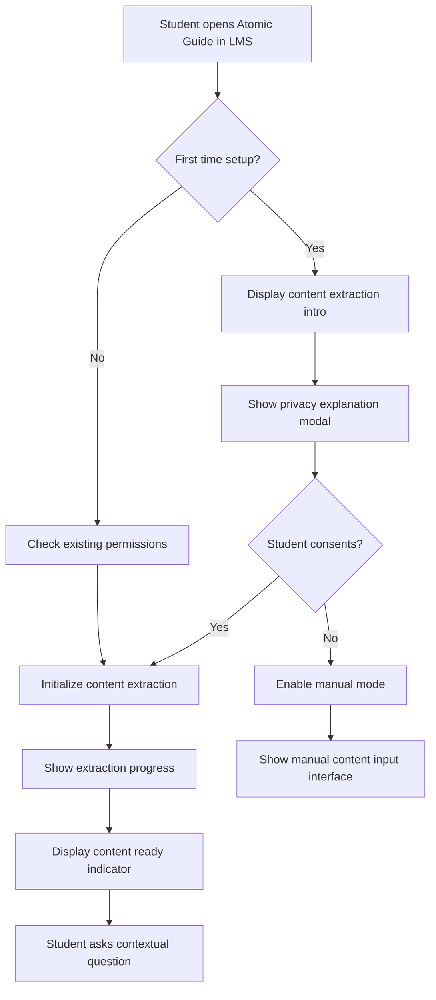
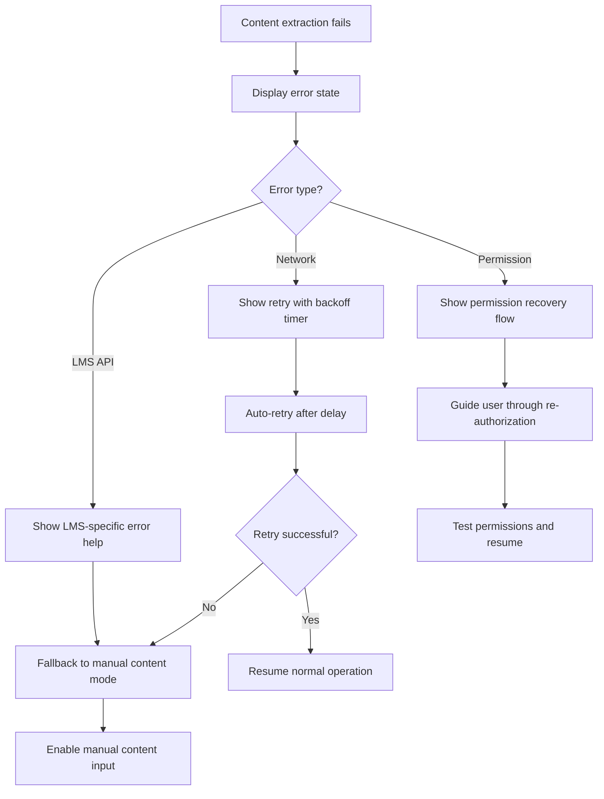
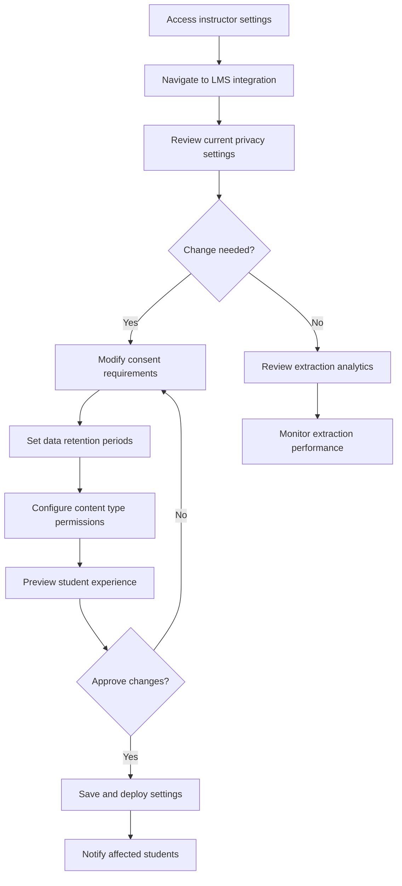

# UX Specification: LMS PostMessage Integration for Content-Aware Assessment

## Document Information

- **Story:** 3.1 - LMS PostMessage Integration for Content-Aware Assessment
- **Created:** 2025-08-26
- **Author:** Claude (UX Expert)
- **Version:** 1.0
- **Status:** Complete

## 1. Introduction

### Purpose and Scope

This document defines the user experience design for Atomic Guide's LMS PostMessage integration, enabling content-aware AI assessments through real-time LMS page content extraction. It serves as the comprehensive blueprint for all UI components, interactions, and visual states related to the LMS integration feature.

The specification covers:

- LMS content extraction status indicators and loading states
- Content sync and permission management interfaces
- Error handling and fallback manual content input
- Instructor configuration and privacy consent UI
- Mobile-responsive LMS integration patterns
- Accessibility features for LMS-aware functionality

### Key Design Principles

1. **Transparency First**: Users always know when and what content is being accessed
2. **Non-Intrusive Integration**: LMS content extraction feels natural and unobtrusive
3. **Graceful Degradation**: Full functionality maintained when LMS API is unavailable
4. **Privacy-Centric**: Clear, prominent privacy controls and consent management
5. **Mobile-First LMS**: Touch-optimized controls for mobile LMS usage
6. **Performance Awareness**: Visual feedback for content processing states

## 2. User Personas and Goals

### Primary Personas

#### Student Learner (Emma)

- **Context**: Pre-med student using Atomic Guide during LMS reading assignments
- **Goals**: Get contextual help while reading, understand complex topics quickly
- **Needs**: Seamless content awareness, fast response times, mobile LMS support
- **Pain Points**: Confusing when AI lacks context, slow loading on mobile

#### Course Instructor (Prof. Martinez)

- **Context**: Biology professor configuring content-aware assessments
- **Goals**: Enable contextual AI support, maintain student privacy, reduce setup complexity
- **Needs**: Simple configuration, clear privacy controls, content extraction visibility
- **Pain Points**: Complex privacy settings, unclear data usage, manual content management

#### Privacy-Conscious Student (Alex)

- **Context**: Student concerned about data privacy in educational tools
- **Goals**: Understand what content is accessed, control data sharing preferences
- **Needs**: Transparent privacy controls, opt-out options, data usage clarity
- **Pain Points**: Hidden data collection, unclear consent processes, no privacy controls

## 3. Information Architecture

### LMS Integration Content Hierarchy

```
LMS-Aware Chat Interface
├── Content Extraction Status
│   ├── Loading/Processing States
│   ├── Success/Ready Indicators
│   └── Error/Fallback States
├── Content Sync Controls
│   ├── Permission Management
│   ├── Manual Refresh Trigger
│   └── Extraction Settings
├── Privacy & Consent
│   ├── Data Usage Transparency
│   ├── Consent Toggles
│   └── Privacy Dashboard Link
└── Fallback Interface
    ├── Manual Content Input
    ├── File Upload Options
    └── Context Recovery Tools
```

### Instructor Configuration Structure

```
Instructor LMS Settings
├── Content Extraction Setup
│   ├── Permission Configuration
│   ├── Content Type Selection
│   └── Auto-sync Settings
├── Privacy Management
│   ├── Student Consent Requirements
│   ├── Data Retention Controls
│   └── FERPA Compliance Settings
├── Performance Controls
│   ├── Extraction Frequency
│   ├── Content Processing Limits
│   └── Bandwidth Optimization
└── Analytics Dashboard
    ├── Content Extraction Metrics
    ├── Student Engagement Data
    └── System Performance Stats
```

## 4. User Flows

### Flow 1: First-Time LMS Content Extraction



### Flow 2: LMS Content Sync Error Recovery



### Flow 3: Instructor Privacy Configuration



## 5. Visual Design Specifications

### LMS Loading State UI

#### Content Extraction Progress Indicator

**Design:**

- Position: Top of chat interface, subtle banner
- Background: Linear gradient from `#FFEB66` to `#FFDD00` (brand yellow)
- Height: 48px with smooth expand/collapse animation
- Typography: Rubik Regular, 14px, `#000000`
- Icon: Animated extraction symbol (document with arrow)

**States:**

1. **Initializing** (0-2s)
   - Text: "Connecting to LMS content..."
   - Animation: Gentle pulse on yellow background
   - Progress bar: Indeterminate, 2px height
2. **Extracting** (2-10s)
   - Text: "Reading page content..."
   - Animation: Document icons flowing from left to right
   - Progress bar: Determinate based on content size
3. **Processing** (1-5s)
   - Text: "Analyzing content for context..."
   - Animation: Subtle sparkle effect
   - Progress bar: Final processing segment

**Mobile Adaptation:**

- Height: 40px
- Typography: 12px
- Simplified animation (performance)
- Collapsible on scroll

### Content Sync Status Indicator

#### Ready State Indicator

**Design:**

- Position: Chat input area, left side
- Shape: 24x24px circular badge
- Background: Success green `#027A48`
- Icon: White checkmark or synced symbol
- Animation: Subtle scale bounce on status change

**Badge States:**

- **Synced**: Green background, checkmark icon
- **Syncing**: Yellow background, rotating sync icon
- **Error**: Error red background, warning icon
- **Manual**: Neutral background, manual input icon

#### Content Context Display

**Design:**

- Position: Expandable panel below chat input
- Background: `#FFFDF0` (off-white)
- Border: 1px solid `#D0D0D0`
- Border-radius: 8px
- Padding: 16px
- Shadow: xxsmall shadow level

**Content Preview:**

```
LMS Content Context                           [collapse]
━━━━━━━━━━━━━━━━━━━━━━━━━━━━━━━━━━━━━━━━━━━━━━━━━━━━
📄 Page: "Chapter 5: Cellular Respiration"
🏷️ Type: Assignment Page
⏰ Extracted: 2 minutes ago
🔗 Key concepts: 7 identified

[Manual refresh] [Privacy settings] [View details]
```

### Content Extraction Permission Dialog

#### First-Time Consent Modal

**Layout:**

- Modal: 480px wide (desktop), full-width (mobile)
- Background: White with large shadow
- Header: Brand yellow accent bar (4px)
- Close button: Top-right, accessible 44x44px

**Visual Hierarchy:**

1. **Title**: Rubik Medium, 24px, `#000000`
   "Enable Content-Aware Learning"
2. **Icon**: 64x64px illustration of LMS + Atomic Guide connection
3. **Explanation**: Rubik Regular, 16px, `#333333`
   "Atomic Guide can read your current LMS page to provide relevant, contextual assistance while you study."
4. **Benefits List**: Bullet points with green checkmarks
   - ✅ Get help specific to what you're reading
   - ✅ AI understands your course content
   - ✅ Faster, more relevant responses
5. **Privacy Assurance**: Rubik Regular, 14px, `#666666`
   "Your content is processed securely and never stored permanently. You can disable this anytime in settings."

**Action Buttons:**

- Primary: "Enable Content Awareness" (Yellow button, full width)
- Secondary: "Use Manual Mode Instead" (Ghost button, below)
- Tertiary: "Learn More About Privacy" (Link)

#### Permission Recovery Interface

**Compact Version (when re-authorization needed):**

```
⚠️ LMS Connection Lost                    [×]
━━━━━━━━━━━━━━━━━━━━━━━━━━━━━━━━━━━━━━━━━━━━━━━
Content awareness is currently disabled.

[Reconnect to LMS] [Continue without context]
```

### Error States and Fallback UI

#### LMS API Error Display

**Error Banner Design:**

- Background: Error red light `#FEF3F2`
- Border-left: 4px solid `#B42318`
- Padding: 16px
- Typography: Rubik Regular, 14px
- Icon: Alert triangle in error red

**Error Messages:**

1. **Network Error**:
   "LMS connection temporarily unavailable. Retrying in 30s..."
   Actions: [Retry now] [Switch to manual mode]
2. **Permission Error**:
   "LMS content access was denied. Re-enable in LMS settings."
   Actions: [Fix permissions] [Continue without context]
3. **Rate Limit Error**:
   "LMS API limit reached. Content extraction paused for 5 minutes."
   Actions: [Use cached content] [Manual mode]

#### Graceful Degradation Interface

**Manual Mode Indicator:**

- Position: Where sync status normally appears
- Design: Orange/amber theme to indicate different mode
- Text: "Manual content mode active"
- Icon: Hand/manual symbol

### Manual Content Input Interface

#### Fallback Content Input Panel

**Layout Design:**

- Position: Expandable panel in chat interface
- State: Collapsed by default, expands with smooth animation
- Background: `#F7F9FC` with subtle pattern
- Border: 2px dashed `#D0D0D0` when empty
- Border-radius: 8px
- Minimum height: 120px

**Input Components:**

1. **Text Input Area**
   - Placeholder: "Paste or type the content you're studying..."
   - Typography: Rubik Regular, 16px
   - Auto-resize: Yes, max-height 300px
   - Character count: Bottom-right, 14px gray
2. **File Upload Zone**
   - Drag-and-drop area with dotted border
   - Supported formats: PDF, DOC, TXT, MD
   - Upload icon: Cloud with arrow
   - Text: "Drop files here or click to browse"
3. **URL Input**
   - Input field with URL validation
   - Placeholder: "Or enter a webpage URL..."
   - Auto-fetch preview when valid URL entered

**Action Buttons (Sticky bottom bar):**

- Primary: "Use This Content" (Yellow, 44px height)
- Secondary: "Clear" (Ghost button)
- Tertiary: "Save for Later" (Link)

#### Content Processing Feedback

**Processing States:**

1. **Analyzing**: Spinner with "Analyzing your content..."
2. **Ready**: Green checkmark with "Content ready for AI assistance"
3. **Error**: Red warning with specific error message

### Instructor Configuration Interface

#### LMS Integration Settings Panel

**Navigation Structure:**

- Sidebar item: "LMS Integration" with sync status dot
- Badge: "NEW" for first-time setup

**Main Configuration Layout:**
Grid system with cards for different setting groups:

1. **Content Extraction Settings Card**
   - Toggle: "Enable automatic content extraction"
   - Dropdown: Content types (Assignments, Discussions, Pages, Quizzes)
   - Slider: Extraction frequency (Real-time, Every 5min, Manual only)
2. **Student Privacy Controls Card**
   - Toggle: "Require student consent for content access"
   - Dropdown: "Consent reminder frequency"
   - Text area: "Custom privacy message for students"
3. **Performance Settings Card**
   - Slider: "Maximum content size to extract"
   - Toggle: "Enable content caching"
   - Dropdown: "Cache retention period"

**Visual Design:**

- Card background: White
- Card border: 1px `#E0E0E0`
- Card shadow: small shadow level
- Card padding: 24px
- Grid gap: 24px

#### Privacy Dashboard

**Privacy Transparency Panel:**

- **Data Usage Summary**: Visual chart showing content extraction volume
- **Retention Timeline**: Calendar view of content lifecycle
- **Student Consent Status**: List of students with consent status badges
- **Export Controls**: Buttons for data download/deletion

### Privacy Consent UI Elements

#### Student Privacy Control Center

**Accessible via gear icon in chat interface**

**Layout:**

- Modal overlay with privacy-focused design
- Header: "Your Data & Privacy" with shield icon
- Sections: Expandable accordions for different privacy aspects

**Content Sections:**

1. **What We Access**
   - List of content types with on/off toggles
   - Real-time preview of what's currently extracted
   - Last accessed timestamp
2. **How It's Used**
   - Plain language explanation
   - Data flow diagram (simple icons)
   - Processing location (edge/cloud)
3. **Your Controls**
   - Master toggle: "Enable content awareness"
   - Granular controls: By content type
   - Data deletion: "Clear my data" button
4. **Contact & Questions**
   - Privacy policy link
   - Support contact
   - Report concerns form

#### Consent Reminder System

**Non-intrusive Reminder (appears monthly):**

- Small slide-up notification from bottom
- Message: "Your content awareness settings"
- Actions: [Review settings] [Dismiss]
- Auto-dismiss after 10 seconds

**Visual Design:**

- Background: `#FFFDF0` with yellow left border
- Typography: 14px regular
- Height: 60px
- Shadow: medium level
- Animation: Smooth slide-up from bottom

## 6. Mobile Responsive Considerations

### LMS Mobile App Integration

#### Touch-Optimized Controls

**Minimum Touch Targets:**

- All buttons: 44x44px minimum
- Toggle switches: 60x32px
- Input fields: 48px height
- Modal close buttons: 48x48px

**Mobile-Specific Adaptations:**

1. **Content Status Indicator**
   - Moves to top of screen as sticky banner
   - Collapsible on scroll down, reappears on scroll up
   - Tap to expand for full status details
2. **Permission Dialogs**
   - Full-screen modals on phones
   - Bottom sheet design for tablets
   - Swipe-to-dismiss gesture support
3. **Manual Content Input**
   - Fullscreen overlay mode
   - Native file picker integration
   - Voice-to-text support for content input
4. **Error States**
   - Toast notifications instead of banners
   - Swipe-to-dismiss error messages
   - Quick action shortcuts in notifications

#### Responsive Breakpoints

**Mobile Specific (320-767px):**

- Single column layouts
- Stacked form elements
- Expanded touch targets
- Simplified navigation

**Tablet LMS (768-1023px):**

- Two-column settings layouts
- Side-by-side permission dialogs
- Preserved desktop interactions

**LMS Mobile App Considerations:**

- Native app context detection
- iOS/Android specific modal patterns
- Native sharing integration
- Platform-specific error messages

### Performance Optimizations

#### Mobile-First Loading Strategy

**Progressive Enhancement:**

1. **Core UI** (0-100ms): Basic chat interface loads
2. **LMS Detection** (100-300ms): Detect LMS environment
3. **Permission Check** (300-500ms): Verify existing permissions
4. **Content Extraction** (500ms+): Begin content analysis

**Bandwidth Considerations:**

- Low bandwidth mode: Text-only extraction
- High bandwidth: Full media extraction
- Auto-detect connection quality
- User override controls

## 7. Accessibility Requirements

### Screen Reader Support

#### Content Extraction Announcements

**Live Region Updates:**

```html
<div aria-live="polite" aria-label="Content extraction status">
  <!-- Status announcements appear here -->
</div>
```

**Status Messages:**

- "LMS content extraction starting"
- "Page content successfully loaded for AI context"
- "Content extraction failed, manual mode available"
- "New content detected and processed"

#### Keyboard Navigation Flow

**Tab Order:**

1. Chat input field
2. Content status indicator (if visible)
3. Manual content toggle (if needed)
4. Settings/privacy controls
5. Send message button

**Keyboard Shortcuts:**

- `Ctrl/Cmd + R`: Refresh content extraction
- `Ctrl/Cmd + M`: Toggle manual content mode
- `Ctrl/Cmd + P`: Open privacy settings
- `Escape`: Close modals/panels

### Visual Accessibility

#### High Contrast Mode Support

**Enhanced Contrast Elements:**

- Content status indicators: 4.5:1 minimum contrast
- Error messages: Bold text with high contrast colors
- Permission dialogs: Enhanced border contrast
- Loading states: Pattern-based progress indicators

#### Color Independence

**Non-color Status Indicators:**

- Success: Green + checkmark icon
- Error: Red + warning icon
- Processing: Yellow + spinner animation
- Manual: Gray + hand icon

**Pattern-Based Feedback:**

- Success states: Solid fill patterns
- Warning states: Diagonal line patterns
- Error states: Cross-hatch patterns
- Loading states: Animated dot patterns

### Alternative Interaction Methods

#### Voice Control Support

**Voice Commands:**

- "Refresh LMS content"
- "Switch to manual mode"
- "Open privacy settings"
- "Clear extracted content"

#### Motor Accessibility

**Reduced Motion Support:**

- Disable extraction animations
- Static progress indicators
- Instant state transitions
- Simplified visual feedback

## 8. Animation and Transition Specifications

### Content Extraction Animations

#### Loading State Transitions

**Extraction Progress Animation:**

```css
.extraction-progress {
  animation: extractionFlow 2s ease-in-out infinite;
}

@keyframes extractionFlow {
  0% {
    transform: translateX(-100%);
    opacity: 0;
  }
  50% {
    transform: translateX(0%);
    opacity: 1;
  }
  100% {
    transform: translateX(100%);
    opacity: 0;
  }
}
```

**Status Indicator Transitions:**

- State changes: 300ms ease-out
- Success pulse: 150ms scale(1.1) then back
- Error shake: 200ms horizontal vibration
- Loading spin: 1s linear infinite rotation

#### Modal and Panel Animations

**Permission Dialog Entrance:**

- Fade in: 200ms ease-out
- Scale up: From 0.95 to 1.0
- Backdrop: 150ms fade to semi-transparent

**Content Panel Expansion:**

- Height transition: 300ms ease-out
- Content fade in: 200ms delay, 150ms duration
- Border color shift: 200ms ease-out

**Mobile Animations:**

- Slide up from bottom: 250ms ease-out
- Bounce entrance: Slight overshoot then settle
- Swipe dismissal: Follow finger then snap

### Micro-Interactions

#### Hover States

- Button hover: 150ms color transition
- Status indicator hover: Gentle lift (2px shadow increase)
- Input focus: 200ms border color shift + subtle glow

#### Success Feedback

- Content ready: Green checkmark with 300ms scale animation
- Permission granted: Success color sweep across button
- Settings saved: Subtle confirmation bounce

#### Error Feedback

- Failed extraction: Red error color with shake animation
- Permission denied: Button color shift to error state
- Network error: Subtle pulsing red indicator

## 9. Performance Optimization

### Loading Strategy Optimization

#### Lazy Loading Implementation

**Content Extraction Components:**

- Load LMS integration scripts only when needed
- Defer permission dialogs until user interaction
- Progressive enhancement for manual fallback
- Background preloading of privacy settings

#### Caching Strategy

**Client-Side Cache Management:**

- LMS content: 24-hour cache with version checking
- Permission status: Session-based storage
- User preferences: Local storage with sync
- Error recovery: Temporary cache for retry logic

### Network Optimization

#### Bandwidth Adaptation

**Connection Quality Detection:**

```javascript
// Detect connection speed and adapt extraction behavior
if (navigator.connection?.effectiveType === 'slow-2g') {
  // Minimal extraction, text-only mode
} else if (navigator.connection?.effectiveType === '4g') {
  // Full content extraction with media
}
```

**Progressive Content Loading:**

1. **Essential Text** (Priority 1): Load immediately
2. **Structured Content** (Priority 2): Load after 500ms
3. **Media Elements** (Priority 3): Load on demand
4. **Metadata** (Priority 4): Background loading

## 10. Error Recovery and Edge Cases

### LMS API Failure Scenarios

#### Network Connectivity Issues

**Offline State Handling:**

- Display offline indicator in content status area
- Cache last successful content extraction
- Enable full manual mode functionality
- Queue content requests for when online

**Poor Connection Recovery:**

- Progressive timeout increases (1s, 3s, 10s, 30s)
- Automatic retry with exponential backoff
- Option to switch to manual mode immediately
- Status updates on retry attempts

#### LMS Platform Changes

**API Deprecation Handling:**

- Graceful fallback to older API versions
- Clear messaging about reduced functionality
- Automatic migration path when available
- Manual override options for power users

#### Cross-Domain Security Issues

**PostMessage Security Failures:**

- Origin validation error handling
- Fallback to manual content input
- Security warning messages for users
- Administrative alerts for instructors

### Edge Case Scenarios

#### Very Large LMS Pages

**Content Size Limits:**

- 10MB maximum content extraction
- Progressive content truncation with user notification
- Option to process in chunks
- Summary extraction for oversized content

#### Mixed Permission States

**Partial Access Scenarios:**

- Some content types allowed, others restricted
- Clear indication of what's accessible
- Granular fallback options
- User education about limitations

#### Multiple LMS Instances

**Multi-Tenant LMS Handling:**

- Per-instance permission management
- Context switching indicators
- Institution-specific privacy policies
- Isolated content caching

## 11. Implementation Guidelines

### Component Architecture

#### LMS Integration Components

**Primary Components:**

- `LMSContentExtractor`: Core extraction logic
- `ContentStatusIndicator`: Status display and controls
- `PermissionManager`: Consent and privacy controls
- `ManualContentInput`: Fallback input interface
- `PrivacyDashboard`: Privacy control center

**Component Props Interface:**

```typescript
interface LMSIntegrationProps {
  tenantId: string;
  userId: string;
  lmsEnvironment: {
    courseId: string;
    pageType: string;
    pageUrl: string;
    permissions: string[];
  };
  onContentExtracted: (content: ExtractedContent) => void;
  onPermissionRequired: (reason: string) => void;
  onError: (error: ExtractionError) => void;
  fallbackMode?: boolean;
}
```

### CSS Architecture Implementation

#### Design System Integration

**CSS Custom Properties:**

```css
:root {
  /* LMS Integration Theme */
  --canvas-primary: #ffdd00;
  --canvas-secondary: #027a48;
  --canvas-error: #b42318;
  --canvas-warning: #f59e0b;

  /* Spacing Scale */
  --canvas-space-xs: 4px;
  --canvas-space-sm: 8px;
  --canvas-space-md: 16px;
  --canvas-space-lg: 24px;

  /* Animation Timing */
  --canvas-transition-fast: 150ms;
  --canvas-transition-normal: 300ms;
  --canvas-transition-slow: 500ms;
}
```

#### Component-Specific Styling

**BEM Methodology Application:**

```css
.canvas-status-indicator {
  /* Base component styles */
}

.canvas-status-indicator__icon {
  /* Icon element styles */
}

.canvas-status-indicator--synced {
  /* Success state modifier */
}

.canvas-status-indicator--error {
  /* Error state modifier */
}
```

### Testing Requirements

#### Visual Regression Testing

**Critical Visual States:**

- [ ] All content extraction loading states
- [ ] Permission dialog in all viewport sizes
- [ ] Error states with appropriate color contrast
- [ ] Manual content input interface layouts
- [ ] Privacy dashboard responsive behavior

#### Interaction Testing

**User Flow Validation:**

- [ ] First-time permission flow completion
- [ ] Error recovery and retry mechanisms
- [ ] Manual mode fallback functionality
- [ ] Privacy settings modification flow
- [ ] Mobile touch interaction accuracy

#### Accessibility Testing

**WCAG 2.1 AA Compliance:**

- [ ] Screen reader announcement accuracy
- [ ] Keyboard navigation completeness
- [ ] Color contrast ratio verification
- [ ] Focus management in modals/dialogs
- [ ] Alternative text for all visual indicators

## 12. Success Metrics

### User Experience Metrics

**Content Extraction Success:**

- First extraction success rate: >85%
- Average extraction completion time: <5 seconds
- User retention after initial setup: >70%
- Error recovery success rate: >60%

**User Engagement:**

- Permission grant rate on first ask: >60%
- Manual mode usage: <30% of sessions
- Privacy settings engagement: >40% of users
- Content refresh usage: >25% of active sessions

### Performance Metrics

**Technical Performance:**

- Initial load time with LMS integration: <2 seconds
- Content extraction latency: <3 seconds 90th percentile
- Permission dialog response time: <500ms
- Mobile performance score: >85 (Lighthouse)

### Accessibility Metrics

**Inclusive Design Success:**

- Screen reader task completion: >90%
- Keyboard-only navigation success: 100%
- High contrast mode usability: >85%
- Voice control command recognition: >80%

## Appendix A: LMS PostMessage API Integration

### Security Implementation

```typescript
// Secure origin validation for LMS postMessage
const TRUSTED_CANVAS_ORIGINS = [
  /^https:\/\/[^.]+\.instructure\.com$/,
  /^https:\/\/canvas\.[^.]+\.edu$/,
  /^https:\/\/[^.]+\.canvaslms\.com$/,
];

function validateLMSOrigin(origin: string): boolean {
  return TRUSTED_CANVAS_ORIGINS.some((pattern) => pattern.test(origin));
}
```

### Content Extraction Types

```typescript
interface ExtractedLMSContent {
  pageInfo: {
    url: string;
    title: string;
    type: 'assignment' | 'discussion' | 'page' | 'quiz';
    lastModified: Date;
  };
  content: {
    text: string;
    html: string;
    headings: Array<{ level: number; text: string }>;
    links: Array<{ url: string; text: string }>;
    media: Array<{ type: string; src: string; alt?: string }>;
  };
  metadata: {
    wordCount: number;
    readingTime: number;
    complexity: number;
    keyTerms: string[];
  };
}
```

## Appendix B: Privacy Compliance Framework

### FERPA Compliance Elements

**Required UI Components:**

- Clear data usage disclosure
- Granular consent controls
- Data retention timeline display
- Student data export/deletion tools
- Institutional privacy policy integration

**Consent Management:**

```typescript
interface PrivacyConsent {
  userId: string;
  consentType: 'content_extraction' | 'analytics' | 'retention';
  granted: boolean;
  timestamp: Date;
  expiresAt?: Date;
  ipAddress: string;
  userAgent: string;
}
```

---

**UX Specification Complete**

This comprehensive UX specification provides detailed guidance for implementing LMS PostMessage integration with a focus on user transparency, privacy protection, and seamless content-aware functionality. The design ensures accessibility, mobile optimization, and graceful degradation while maintaining the Atomic Jolt brand standards and user experience excellence.
